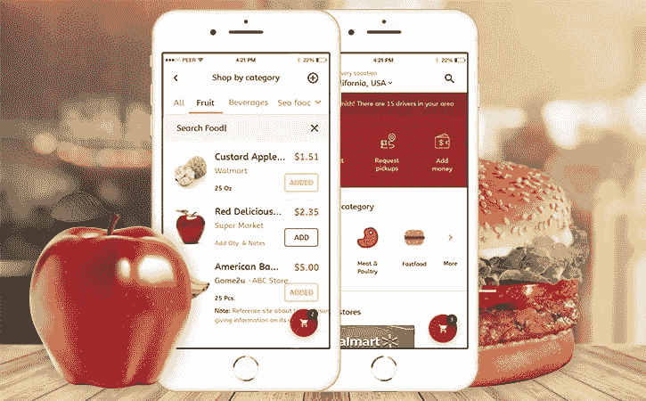

# 开发一个 Instacart 这样的杂货配送 App 要多少钱？

> 原文：<https://medium.datadriveninvestor.com/how-much-does-it-cost-to-develop-grocery-delivery-app-like-instacart-fd409b725f3d?source=collection_archive---------7----------------------->

持续的冠状病毒爆发正在严重打击全球经济。然而，随着人们留在室内保护自己免受感染，对在线食品交付和杂货交付的需求大幅增加。

病毒最初爆发的中国在 1 月份对食品杂货的需求增加了 20%。JD.com 的新鲜食品销售额从 2 月份的 215%跃升。对于数千万被锁在家里的中国人来说，这些快递已经成为他们日常生活中必不可少的一部分。

随着非接触式送货成为必然，杂货送货应用程序正成为全球趋势。杂货供应商正在通过杂货交付应用程序将他们的业务提升到一个新的水平。

这是关于如何构建像 Instacart 这样的杂货递送应用程序的全面指南。

 [## 2019 年移动应用开发之路|数据驱动的投资者

### 任何在移动应用程序开发行业工作的人，无论他们是专注于在伦敦开发 iOS 应用程序还是…

www.datadriveninvestor.com](https://www.datadriveninvestor.com/2019/01/15/the-path-of-mobile-app-development-in-2019/) 

什么是按需杂货交付应用程序，它是如何工作的？

杂货递送应用程序让顾客可以将杂货送到家门口。服务不是什么新鲜事；然而，向移动应用的转变使它变得可以负担得起，并因此而广泛传播。有了 Instacart 这样的移动应用，人们不再需要派一个家政人员去买杂货；他们只需轻敲几下就能订购。

简而言之，杂货开发应用程序与提供按需服务的应用程序非常相似。一个在线交付应用程序通常包含两个应用程序，一个是面向客户的应用程序，另一个是面向交付人员的本地应用程序。

也可以在同一个应用程序中结合客户和交付应用程序所需的功能，但这也可能使您的应用程序变得繁琐。因此，这几乎不是一个有效的方法。

**构建杂货 App 之前要记住什么？**

**下面是杂货店应用程序的两个按需交付模型:**

*   送货服务公司的商店里有他们送的食品杂货。
*   送货服务与几家不同的商店合作，为它们送货。

沃尔玛有它的应用程序，该公司还提供送货服务。另一方面，像好市多这样的商店与 Instacart 这样的服务合作，为顾客提供送货服务。有几种方法可以实现这种技术。

**杂货应用 MVP 中包含的功能**

杂货递送应用程序没有太多创新，然而在没有市场研究和准备的情况下花费大量资金推出完整版本将是浪费。在投入开发之前，评估你的想法，找到一个独特的价值主张，然后计划最小可行的产品。

**以下是客户应用和交付应用 MVP 中包含的功能:**

**客户 App:**

*   用户配置文件
*   库存菜单/项目
*   商店列表
*   支付网关
*   购物车/订单页面
*   订单状态
*   订单历史
*   通知

**发货 App:**

*   轮廓
*   导航地图
*   订单列表(显示项目和交货地址)

**管理面板:**

*   客户数据
*   收入
*   库存菜单/项目
*   商店列表

自然，为了让客户和交付应用程序正常工作，他们需要实时通信，以便在规定的时间内完成交付。任何杂货购物应用程序的卖点是服务应该按时交付。为了实现有效的应用程序到应用程序的通信，您需要在后端使用 WebSocket APIs。

同样，在像 Instacart 这样的杂货交付应用程序中，显示带有最新价格的商品列表也很重要。

**杂货店移动应用中包含的扩展功能**

除了最基本的必需品之外，你的应用还会有一个标志性的功能，让它脱颖而出。以下是杂货店移动应用程序中一些扩展功能的一些建议:

*   **登录社交网络:**

允许您的客户通过社交渠道注册，而不必经历冗长的注册过程。这将使客户更容易注册。

*   **添加替代选项:**

使用替代字段，客户可以在任何特定商品不可用时选择替代商品。这将改善用户体验，并减少部分完成订单的情况。

*   **添加聊天机器人:**

有许多方法可以实现聊天机器人。聊天机器人向顾客和送货人员展示关于产品的有价值的信息。

*   **通话和聊天支持:**

呼叫和聊天支持也是一个很好的选择，这将使用户喜欢你的应用程序。这将使他们能够获得技术团队的支持或对订单进行最后的修改。

*   **语音识别:**

语音识别将让您的客户在旅途中下订单，而不必停下来键入产品名称，这将再次得到忙碌的客户的赞赏。

*   **评分和评论:**

允许您的客户为每次交付添加评分和评论。这将有助于您跟踪交付人员的表现以及您的应用程序的表现。您也可以向您的送货工人提供此功能。

**按需配送服务如何赚钱？**

当你想到杂货配送 app 时，首先想到的问题是如何盈利。

以下是按需杂货配送服务的业主可以选择的一些盈利方式:

1.  你可以把每件商品的价格定得比商品的实际价格高一点。对此你可以坦诚透明。创建一个在客户开始下订单时第一次弹出的通知。您也可以在您的策略中包含提醒。
2.  第二种选择是收取送货费。这是最常见的货币化模式，根据实际价格向客户收取产品费用，但他们需要支付送货费。
3.  在你的应用中加入广告。这是最常用的货币化模式。许多应用程序包括广告，广告覆盖费用，从而使公司向客户收取更少的费用。
4.  一旦你的应用程序流行起来，你可以向商店收取月租费，与你合作，让他们的产品在你的平台上展示。作为回报，商店将获得曝光率和更多的客户。

你可以使用单一的盈利模式，也可以根据你的应用程序的受欢迎程度组合几种模式。

**构建 Instacart 这样的应用程序的成本**

开发像 Instacart 这样的杂货应用程序的确切价格取决于多个因素，如应用程序的复杂性和开发者的选择，但我们可以给你一个基本功能的大致数字。

如果你计划与一家离岸开发公司合作，并计划同时使用 iOS 和 Android 平台，那么你需要雇佣这样的团队:

1.  1 名项目经理
2.  1-2 名 iOS 开发人员
3.  1-2 名 Android 开发人员
4.  1-2 名用户界面/UX 设计师
5.  1 后端开发人员
6.  2 名质量保证专家

有两个独立的应用程序要构建，每个都有自己的设计和功能集，构建一个杂货应用程序需要多长时间取决于您团队的成员数量？下面是构建一个杂货交付应用程序所需的估计时间。

平均每小时 35 美元左右，Instacart 这样的应用程序的成本大约为 62，000 美元。这将取决于您想要包含的特性和技术。

不过，你对如何创建像 Instacart 这样的应用程序有疑问，或者想知道更精确的成本估算？请随时与我们联系，我们准备好为您提供您的应用程序应该包括的功能和开发杂货开发应用程序的成本。

*原载于 2020 年 5 月 5 日*[*【https://graffersid.com】*](https://graffersid.com/cost-to-develop-grocery-delivery-app-like-instacart/)*。*