# 一条人命值多少钱？

> 原文：<https://medium.datadriveninvestor.com/how-much-is-a-human-life-worth-744ded9a2640?source=collection_archive---------2----------------------->

## 因果关系

## 对于政策制定者目前正在努力解决的问题，这是一个经济学和生物化学的答案

Source: [Murto Hilali](https://medium.com/@hilali.murto)

# 6.4 万亿美元

> **社交距离是一种让自己与他人保持至少两米距离的做法，多年来一直被用作对抗病毒传播的一种方式。**

*这也是中学女生每当我走过时都会做的事——我真的很佩服她们的远见。*

*摩根士丹利预测，减少新冠肺炎利差的社会距离措施将导致美国 GDP 下降 30%，相当于 6.4 万亿美元。那只是美国**想象一下全世界。***

*唐纳德·特朗普总统最近表达了(并收回了)在复活节前重新开放美国市场的观点。[许多模型表明](https://www.nytimes.com/interactive/2020/03/25/opinion/coronavirus-trump-reopen-america.html?action=click&module=Top%20Stories&pgtype=Homepage)这可能导致**数十万人丧生**，因此决策者面临一个不可能的决定:*

> *拯救人民还是拯救经济？*

*这个问题有个问题——**不是非此即彼的选择，**也不是不可能**。**一个经济体是由*人*组成的；救人产生经济效益。*

*但是有多大的好处呢？政策制定者必须能够从数量上证明公共卫生相关决策的合理性——要做到这一点，他们必须确定一个人生命的美元价值。*

*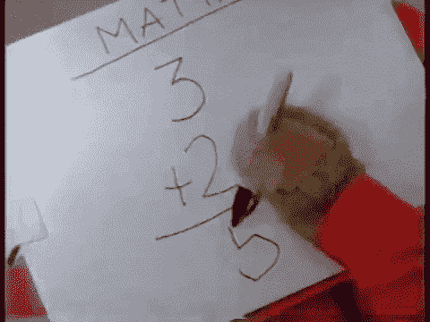*

*这听起来是不是冷酷无情、一团糟？可能吧——但这是我的系列*因果关系*的第三版，所以我想加点料。毕竟…*

* [## 现金为王，比我们想象的更强大|数据驱动的投资者

### 2020 年 3 月 12 日，在川普总统宣布新冠肺炎进入国家紧急状态的前夕，纽约时报报道…

www.datadriveninvestor.com](https://www.datadriveninvestor.com/2020/03/26/cash-is-king-more-potent-than-we-think/) 

## “我们需要一点争议”——阿姆，2002

当然，真正量化一个生命的价值是不可能的——但这从未阻止我们。我关注的是如何赋予一个人的生命一美元的价值，所以哲学争论暂时靠边站了(抱歉，亚里士多德)。

有几种不同的方法来回答这个问题…

*   “如果你想活命，就付钱给我。”——*经济学(还有终结者，我觉得？)*
*   **“一只胳膊和一条腿。另一条腿。另一只手臂。和你身体的其他部分。”**——*生物学(也许还有器官黑市？)*
*   **《我的化学金融》**——*化学* ( *还是这是 2000 年代的那个朋克乐队？)*

# 你是田纳西人吗？因为你是我唯一看到的 1000 万美元…

## 当然是从经济角度来说。😉。

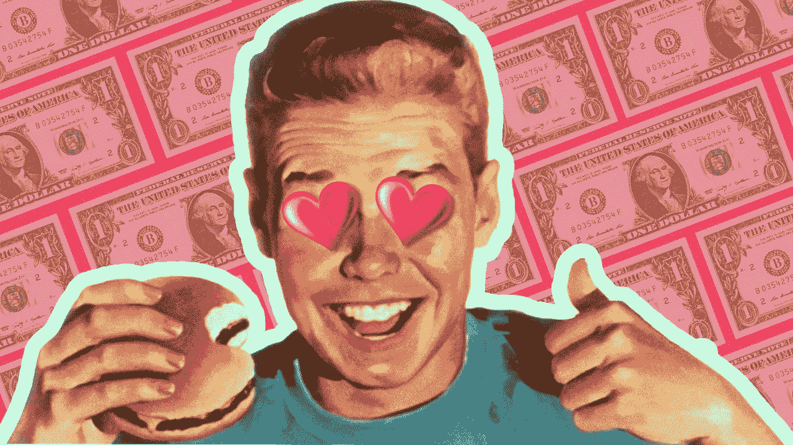

Source: [Murto Hilali](https://medium.com/@hilali.murto)

经济学家用价格来量化商品和服务的价值。

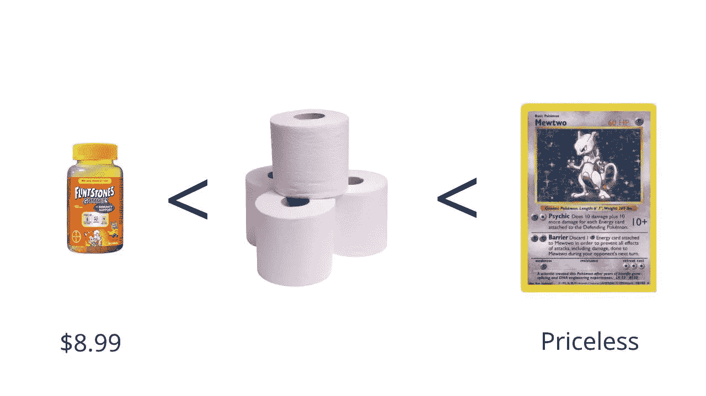

If you value [toilet paper](https://medium.com/datadriveninvestor/why-is-everyone-buying-toilet-paper-1d5e2f9fd916) more than you do a pack of FLINTSTONES™ Gummies (Plus Immunity Support), but not as much as your Holographic Shadowless First Edition Mewtwo, its price will be somewhere between the price of those two things.

价格也可以用来决定你对自己生命的重视程度:

> 一个统计寿命的 [**值**](https://papers.ssrn.com/sol3/papers.cfm?abstract_id=3379967) (VSL)是当地死亡风险与金钱的权衡率。*基本上，* ***为了降低死亡几率，你愿意付出多少？***

最简单的方法之一是查看某样东西(通常是一种安全产品或服务)的 ***价格*** ，然后用它除以***它将降低你的死亡风险*** (有效性)的概率:

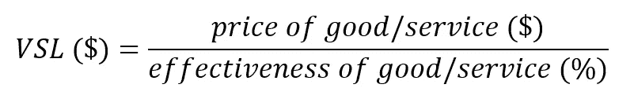

This is a simplified formula that’s just meant to get the idea across.

让我们闪回到不久的将来，在那里你无与伦比的成功和美貌让你成为经常被暗杀的目标。你决定雇一个保镖。

她的服务是每年 150，000 美元，但她是这个行业中最好的——她会把你的死亡概率降低 1/100/年。让我们把这些代入我们的公式:

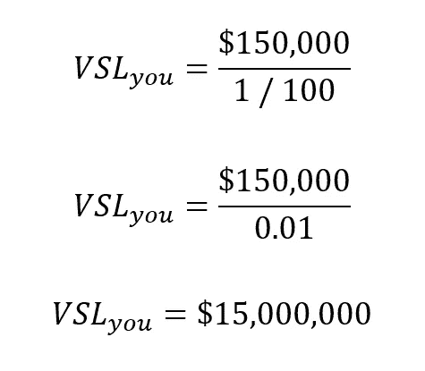

恭喜你，**你身价 1500 万美元！然而，这并不是了解 VSL 的唯一途径。**

> 另一种方法是衡量工资和工作场所安全之间的权衡。*基本上，* ***为了让你接受一个风险更大的工作场所，我还要付你多少钱？***

将工人要求的*工资增长*除以相应的死亡风险*增长:*

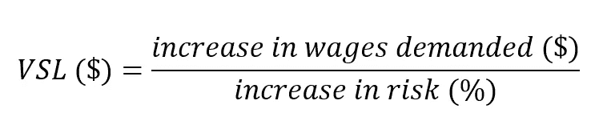

比方说，你不知何故变得比现在更成功、更英俊——我们都认为这是不可能的，然而不知何故，你做到了。你的敌人变得更加危险。

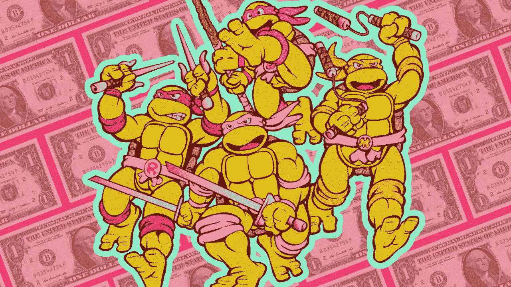

Rumour has it they’ve hired the most dangerous assassins on the planet. | Source: [Murto Hilali](https://medium.com/@hilali.murto)

你的保镖面临的死亡风险**增加千分之一。因此，她要求加薪 5000 美元。你很乐意帮忙——那么现在，她的*VSL 是什么？***

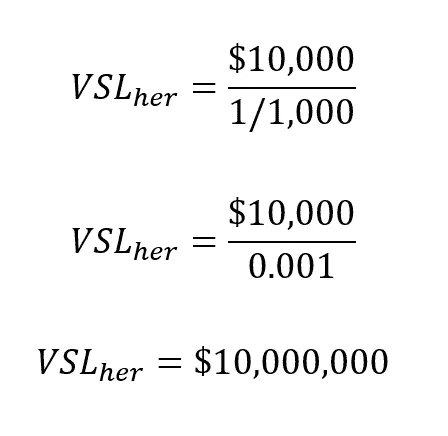

她价值一千万美元！但是为什么比你的低？

## VSL 的收入具有正弹性。

让我们用一个不同的例子——烟雾探测器。如果你的收入水平很高，买一个 25 美元的烟雾探测器是没有问题的。如果你的收入较低，你可能会等到它降价 15 美元的时候。(让我们假设它将你的死亡风险降低了十万分之一):

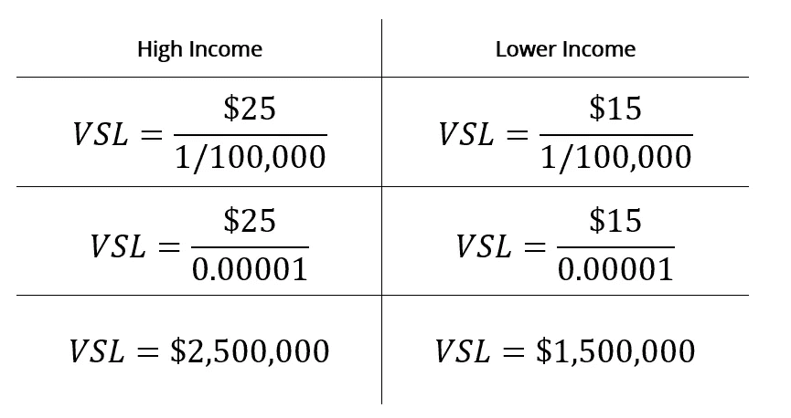

**收入较低的个人对他们生命的价值少了 100 万美元**(至少对于这个特定的产品来说)——但是，看，那是**不一定准确。**他们就是无法*负担*在降低风险上花费那么多。

关于这种情况如何在不同国家出现，还有一些更细微的差别，但是很明显，这种模式有一些关键的限制。

## 尽管如此，VSL 仍然非常有用。

*   它帮助我们量化风险厌恶。
*   这使得决定公共卫生政策变得更加容易。

经济学家从不同的安全产品/服务和工资率中平均出多个 VSLsViscusi (2018)确定美国 VSL 在[**【1000 万美元**](https://papers.ssrn.com/sol3/papers.cfm?abstract_id=3379967) **左右。**考虑到 2004 年的通货膨胀，加拿大的 VSL 似乎在**800 万美元左右。**

所以，如果有人告诉你，你看起来像百万富翁，他们在撒谎——你应该把他们从你的生活中剔除。你知道什么是你最不应该剪掉的吗？

# 一只胳膊和一条腿。可能还有你的肾脏。

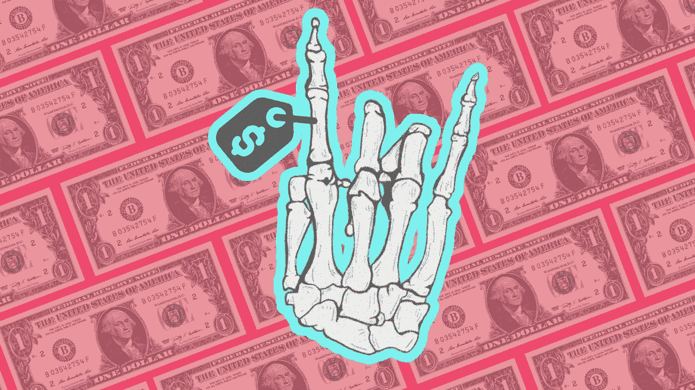

Source: [Murto Hilali](https://medium.com/@hilali.murto)

## 研究文章的这一部分无疑让我上了几个联邦犯罪观察名单。

给人体定价所固有的挑战是…嗯，这不是我们所定义的“合法”。世界上大多数地方不允许人们出售他们的器官，所以这些数字有相当大的不确定性。

也就是说，根据《连线》杂志的调查，这里有一些关于身体不同部位的大概数字:

*   **心脏——80 万美元:**这是**向你的身体输送血液的器官**，它需要非常复杂的移植程序。这可能就是为什么美国心脏移植的平均费用接近[140 万美元](https://content.fortune.com/wp-content/uploads/2017/09/ana_organs.png)——如果有人偷了你的心脏，告诉他们马上归还。
*   **肝脏——50 万美元:**肝脏为你的身体解毒，所以它暴露在各种化学物质中——幸运的是，**它真的很擅长再生自己**，即使只有原器官的 25%！虽然我们不知道这到底是如何发生的(一些证据表明端粒酶水平[增加](http://www.frontlinegenomics.com/news/21342/how-liver-regenerates-itself/))，但这意味着你可以只出售你肝脏的[*部分*](https://www.mayoclinic.org/tests-procedures/living-donor-transplant/about/pac-20384787)*。*
*   ***肾脏——26 万美元:**我肯定你听说过有人把卖肾当笑话——它们有助于过滤血液和制造尿液。(你已经有两个了。)*

*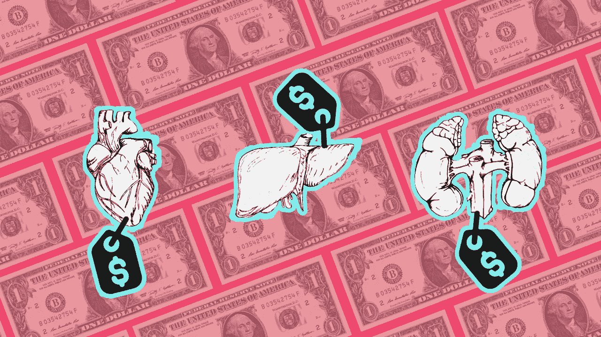*

*Source: [Murto Hilali](https://medium.com/@hilali.murto)*

*血液的价值约为每品脱 337 美元，美国女性出租子宫的价格为 8-15 万美元(T21)，一副完整的人类骨骼可能超过 4000 美元。*

*这些价格在世界范围内变化，并且取决于交易的合法性。当你把身体所有有价格的部分加起来，估价从 25 万美元到 4500 万美元不等。*

*如果这个数字看起来很疯狂，深呼吸。*

*说到呼吸…*

# *你喜欢氧气吗？那你会喜欢 65%的我😉*

## *我的化学化妆品大约值 24 美元。*

*在最简化的层面上，我们可以看看构成人体的元素:*

*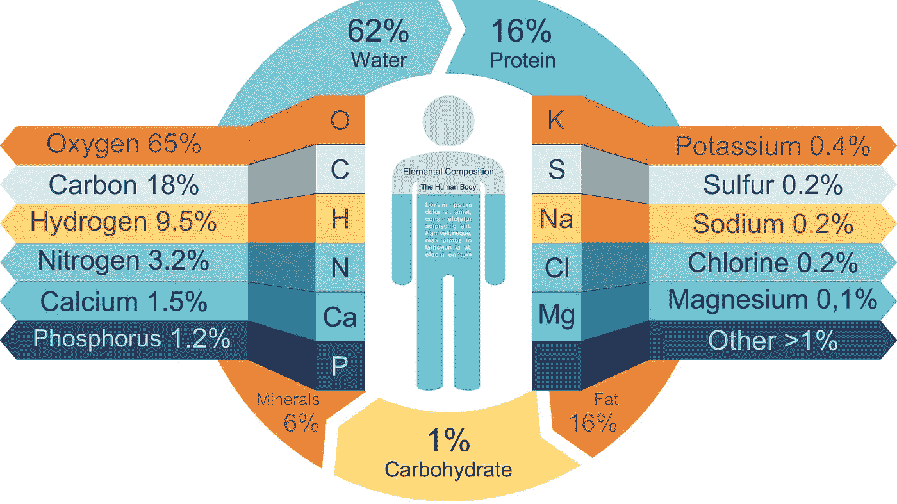*

*Source: [ThoughtCo](https://www.thoughtco.com/chemical-composition-of-the-human-body-603995)*

> *氧、碳、氢、氮、钙和磷约占我们质量的 99%。*

*如果你把我的原子拆开卖了，你可能会得到一些钱。在查看了多个来源后，我最终选定了 [ThoughCo 的化学分解](https://www.thoughtco.com/worth-of-your-elements-3976054)和平均元素价格[来构建这个图表:](https://en.wikipedia.org/wiki/Prices_of_chemical_elements)*

*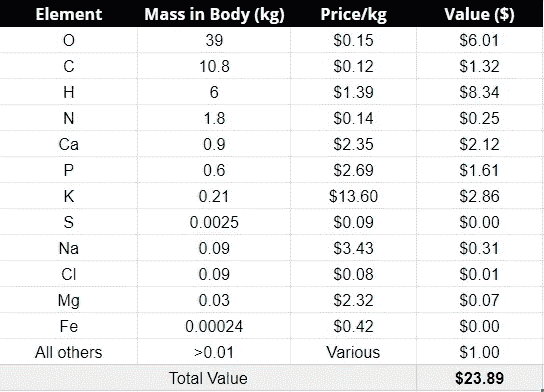*

*This is based on my approximate mass of 60 kg.*

*我尝试了一些不同的权重，以便在 Excel 上映射这个函数:*

*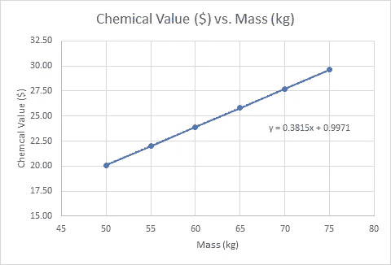*

*This is by no means a proper scientific graph, but you can extrapolate*

> *y=0.3815x + 0.9971*

*将上面等式中你自己的质量(千克)换成 *x* ，那么 *y* 将等于你的近似元素值——如你所见，我的是 23.89 美元。那是*至少* 3 或 4 个巨无霸。*

*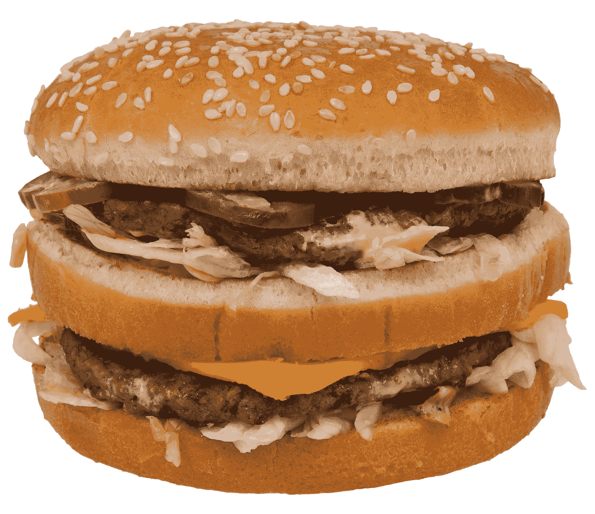*

> *是啊，真令人失望。** 

# **那么一条人命值多少钱呢？**

*   **从经济角度来说(取决于你住在哪里/你挣多少),大概 1000 万美元左右。**
*   **组成你身体的器官、骨骼和各种糊状物的总价值超过 4500 万美元。**
*   **从原子中撕开原子，你的元素值是你质量的函数: ***以$* 为单位的值=0.3815 *(以千克为单位的质量)* + 0.9971** 。(我大概是 **$24** )。**

## **为什么这对我很重要？**

*   **打算挟持某人做人质？在谈判赎金数量时使用他们的 VSL。我不宽恕绑架——但如果你必须这么做，请用经济学的理由。(开玩笑的)。**
*   **如果你真的在努力偿还那些学生贷款，记住你不需要 100%的肝来享受快乐时光。**
*   **当你不可避免地击败你的敌人和他们派来追杀你的刺客时，不要把他们雾化——这似乎不是财政上负责任的做法。**

> **这是我的系列因果关系*的一部分，我试图通过不同科学+学科的视角来回答我们现在都在问自己的一个问题。查看下面的其他版本:***

** [## 你为什么这么喜欢抖音？

### 经济学、人工智能和神经化学可以解释该平台的流行

medium.com](https://medium.com/swlh/why-are-you-so-into-tiktok-6b5d5f296ab8)  [## 为什么大家都在买卫生纸？

### 经济学和心理学解释了新冠肺炎的恐慌性购买

medium.com](https://medium.com/datadriveninvestor/why-is-everyone-buying-toilet-paper-1d5e2f9fd916) 

*大家好，我是 Murto，是一名 17 岁的企业家，也是加拿大多伦多的学生。如果你对这篇文章有任何反馈给我，或者你只是想聊天，请通过*[*LinkedIn*](https://www.linkedin.com/in/murto-hilali-7a6068136/)*联系我！下一步:*

*   战胜你的敌人
*   *踢某些人的屁股*
*   *祝你今天愉快*

*谢谢！***