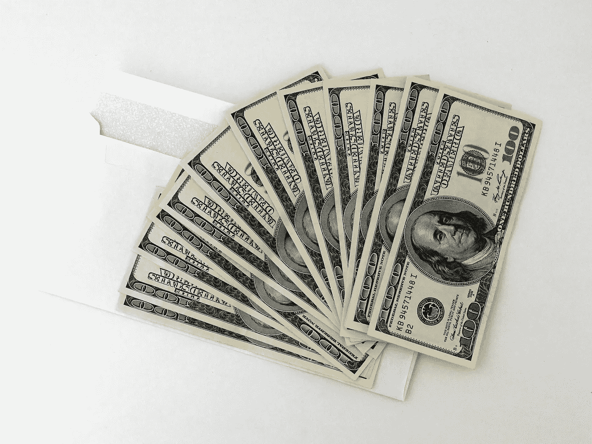

# 多少才够？

> 原文：<https://medium.datadriveninvestor.com/how-much-is-enough-a50b47332eec?source=collection_archive---------3----------------------->

时间？钱？地位？野心？实现？Joy？

[Pixabay](https://www.pexels.com/photo/abundance-achievement-bank-banknotes-534229/) / [Pexels](https://www.pexels.com)

我们什么时候停止奋斗，开始茁壮成长？我们什么时候停止为明天存钱？

我们什么时候有足够的钱？

如果你让情绪左右你的财务决策，那么答案是永远不会。你到死都不会觉得自己已经受够了——任何东西。满意、满足和成就感将远离你。

这篇文章不是关于退休规划。

我不会告诉你放弃你所珍视的每日拿铁咖啡或者制定一个预算。

我不会提供投资建议。

相反，根据我自己的经验，我会提供一些建议，告诉你什么时候该称你拥有的东西——尤其是你有多少钱——足够了。

此外，我将提供一些建议，如果你不这样做，你将会错过生活中的什么——我错过了几十年的生活，因为我努力拯救 T2，而不是关注我生活中每天发生的事情。

我的觉醒是分阶段发生的——但是非常晚，而且相当突然。

首先，我从 25 年的军旅生涯中退役了。

接下来，我立即投入了一份高薪的私营部门工作，这份工作又一次充满了消耗。唯利是图的举动。

然后，我妻子在我面前挥舞着她的电子表格——证据。事实。我们有足够的钱来满足我们的基本需求，还有更多的钱来过上好日子。

我忽略了事实，让自我和情感说服我，我们仍然没有足够的*。*

*后来我老婆离开了我。我们离婚了。*

*那一刻，我意识到我失去了多少(我不是指钱)。*

*我意识到在那一刻之前我错过了多少生活。*

*我在一家酒厂找了一份低薪但不错的工作——入门级别的——然后花了三年时间证明我现在的前妻是正确的。我能够满足自己的基本需求，甚至更多。我可以过上好日子。*

*在酒厂工作 3 年后，我买了一辆 Airstream 拖车，成了一名全职流浪者。这就是我现在的生活。*

*是的，我做一些咨询，但我的收入是一年前的零头，是四年前的零头。我很好。*

*我已经够了。我受够了。*

*电子表格不仅正确，而且保守。*

***球门柱会不停移动，直到你用完时间***

*以我为例，一个 50 多岁的男人，对他来说，理性(职业生涯早期)和非理性(职业生涯晚期和中年)的财务不安全感充斥着我大脑中的每一个神经元。*

*尽管我在政府部门工作，薪水不高，而且我从来都不是一个受预算驱动的人，但我确实总是量入为出，遵循(在早期一些愚蠢的举动之后)保守(无聊)的财务建议，并且喜欢存钱，我可以带着它(你不能。真的，不能)。*

*我的前妻和我是超级储蓄者。我比她多。她有基于数字的理性目标——显示我们何时有“足够”实现合理退休目标的电子表格。*

*另一方面，虽然我表面上同意这些目标，但我忽略了它们。我觉得我们需要继续工作，继续储蓄，继续增加我们储蓄的收入比例——我这样做损害了我的婚姻。*

*我们离婚了，部分原因是因为我一直把目标推得更远。即使我们拥有了，我也从不觉得我们拥有了足够的。*

*具有讽刺意味的是，我无法意识到什么时候我们已经拥有了足够的财富，这让我失去了我的妻子(不可替代)和我们职业生涯积累的一半积蓄(可替代)——就在一瞬间。*

*如果你在这条路上，下车或者至少:*

**牢牢树立目标标杆——努力确定将它们树立在哪里**

**仅在情况变化需要调整时调整**

**将你的数字建立在理性假设的基础上——现实一点**

*相信你的计算，坚持到底*

***抛开情感***

*你以前听过。你会再次听到它。不要凭情绪做出投资决定。坚持事实。*

*把你的储蓄策略放在自动驾驶仪上，关注更有成就感的事情——你的家庭、你的朋友、你的事业(假设你喜欢你的工作，并从中获得满足感)。*

*通过自动设定策略，消除情绪作为决策因素，你*

***1)不会犯愚蠢的错误；***

***2)你会更有当下感；***

***3)等*够了*** 你就知道了。*

*你的目标，当数据驱动时，当基于合理的假设和良好的数学计算时，是可以实现的。*

*因此，你肯定会有足够的资源来度过你的一生。*

*如果你的目标是由情感驱动的，而不是好的假设和数据，你会欺骗自己，你永远不会拥有足够的有价值的东西。*

***某一天就是今天***

*最重要的是，不要让你的生命溜走。*

*记住莎士比亚在《麦克白》中的话:*

> *“熄灭，熄灭，短暂的蜡烛！生活只是一个行走的影子，一个可怜的演员，在舞台上趾高气扬，焦躁不安，再也听不到他的声音。”*

*我身后的生活比前方的多。不知道怎么过的这么快。我之前五十年的大部分时间都在为某一天做准备/担心/纠结。*

*我错过了太多。我失去了太多。我没有意识到我早就有了足够的*。**

**然而，我很幸运，在我的蜡烛熄灭之前，我意识到总有一天会到来，我拥有的一切已经足够。**

**我有足够的钱**

****我有足够的地位****

****我有足够的名气****

****我有足够的遗产。****

**更令我吃惊的是，当我根据合理的假设和良好的数学计算实现了适度(是的，适度)的财务目标，并对它们进行了几个月的测试后，我不再有任何没有足够钱的感觉。**

*****我不再感到或感到经济上的不安全。*****

**当我失去了那种对自己的经济状况持续不满的感觉时，我惊讶地发现，我也很快失去了对地位、肯定和自我驱动的想法的痴迷，即我应该成为什么样的人。**

**我变得对自己很满意。**

**我认为这是不可能的。早期我觉得如果我能达到某个任意的财务数字，我就能停下来并感到满足。我通过了几个任意的里程碑，并没有感到轻松。**

**我不是靠严格的预算生活的。我不是一个苦行僧。我很满意。我可以买我的日常拿铁！**

**消除情绪很管用。消除自我很有效。试试看。**

****金钱是一种可再生资源。时间不是。****

**时间是有限的资源。作为人类，你会无情地耗尽时间。你拿不回来了。**

***另一方面，金钱可以被获得、保存、丢失或花掉并再次获得。***

**钱可能会花光，尽管压力很大，但还是可以收回的。**

**时间用完了，就无法挽回了。**

***哪个更有价值？***

**在我们的社会中，金钱是确保你满足基本需求和家庭需求的关键。食物、住所、衣服、安全、教育等。当你满足了这些需求，你就足够了。**

**也许你的策略还包括一些可自由支配的开支(拿铁！)…好主意。但是要讲道理。**

**这些天来，我倾向于用我可自由支配的储蓄来买回时间。我花钱把我不愿意花在剩余有限时间上的任务外包出去。**

****我在旅途中学到的重要经验:****

***1。* *时间远比金钱更宝贵。别浪费了。***

***2。你可以从金钱的损失中恢复过来，但你无法追回失去的时间。***

***3。自我和情绪驱动的财务决策永远不会产生好结果。***

***4。数据驱动的财务决策总是会产生好的结果。***

***5。* *你不能带走你的金钱、地位或东西。***