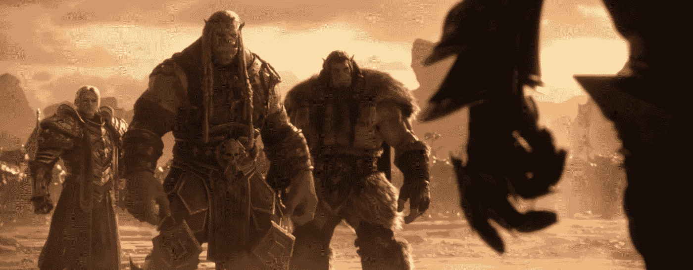
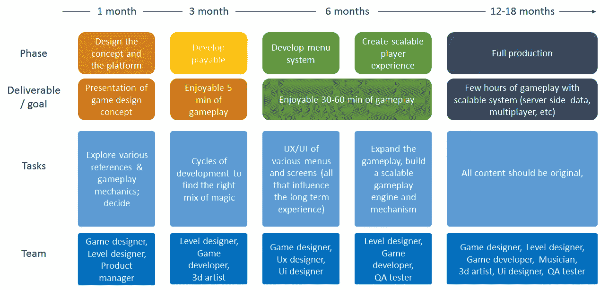
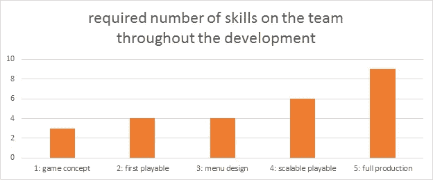
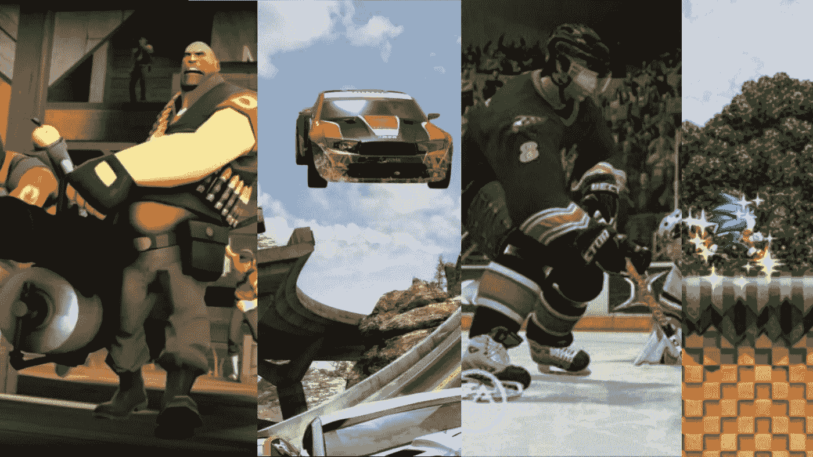
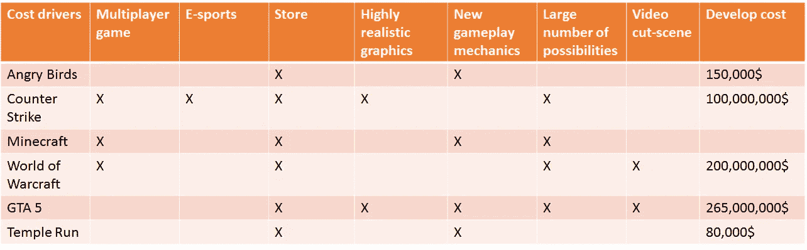
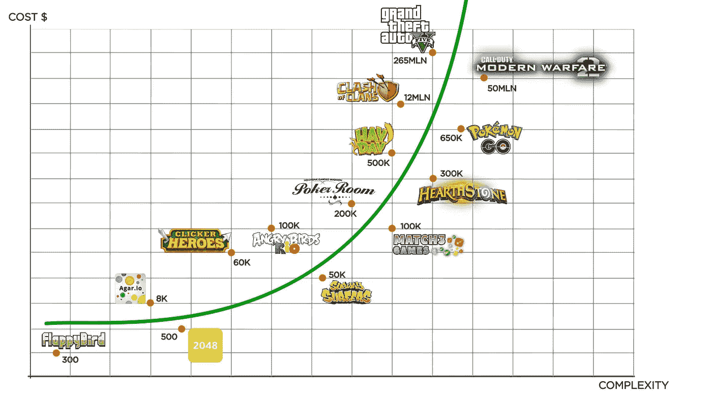

# 做一个游戏要多少钱？

> 原文：<https://medium.datadriveninvestor.com/how-much-it-costs-to-build-a-game-aa92d62f8e69?source=collection_archive---------3----------------------->

from World of Warcraft by Blizzard (of course…). One the most successful MMOs ever.

如今，在这个商业世界不能再忽视电子游戏和电子竞技行业的时代，越来越多的人来到我的门口，询问电子游戏开发的成本，因为它有明显的财务潜力。附:如果你不知道这种潜力，请加紧你的研究，无论你在哪个行业(仅举几个 2019 年的例子:[电竞股](https://digitalyse.io/should-you-invest-into-the-gaming-industry/)，[手游行业](https://techcrunch.com/2019/08/22/mobile-gaming-mints-money/)，[领先游戏标题的收入](https://en.wikipedia.org/wiki/List_of_highest-grossing_video_game_franchises)，[愤怒的小鸟如何成为赢家](https://www.wired.co.uk/article/how-rovio-made-angry-birds-a-winner))。

> **“你好。我想让你为我开发一个游戏。像《堡垒之夜》或者《英雄联盟》之类的，会赚很多钱的。啊，我有 5000 美元的预算来做这件事！”**

# 第一课:与标准应用程序开发相比，游戏开发需要更多的时间，也更复杂

游戏开发与开发一个标准应用程序(如 Instagram 或 WhatsApp)，甚至是一个电子商务网站(如亚马逊或在线商店)有很大不同。相似的原理，但更复杂，因为游戏的本质在于享受和挑战之间的平衡。愤怒的玩家、无聊的玩家和被挑战的玩家之间只有一线之隔。您想要后者，而达到这种完美程度需要大量的测试迭代，与标准应用程序相比要多得多。

 [## 人工智能和虚拟现实的融合-你能期待什么|数据驱动的投资者

### 在技术领域，融合是合乎逻辑的一步。就在几十年前，你可能需要一个专门的…

www.datadriveninvestor.com](https://www.datadriveninvestor.com/2018/08/30/the-convergence-of-ai-rv-what-you-can-expect/) 

> **游戏是一个价值十亿美元的产业。进入高层，并不容易。**

所以对于那些决定进入游戏行业的人来说，你应该意识到这意味着更高的早期投资和更高的风险(因为达到那个结果是不确定的，也是不容易的)。但是！它还有**巨大的潜在回报。**

正如你从图中看到的，只有在 7-9 个月的工作(绿色阶段)之后，你才会有一些风险投资或投资者可以理解的东西。

从第二张图中，你会意识到每个阶段都需要不同的技能，但当然你至少应该有一个人跟踪整个产品，一个产品经理或游戏设计师。

相比之下，一个标准的应用程序(web 或移动)需要 3 个主要角色:前端开发人员、后端开发人员和 Ui 设计人员。尽管它也需要用户体验设计师、项目经理、质量保证测试员和产品经理——这些角色并不像在游戏开发中那样参与到这个过程中。因此解释了较高的成本。

# 第二课:把你的游戏当成一条产品线

你发布的每个平台，比如:iOS/ Android/ PC/ VR/ Console 等等，都是一个不同的子产品或“衍生”产品。意思是，如果你想让你的产品出现在所有的手机商店，这就意味着不是一个小的开发团队。

在这种情况下，你有两个选择。在这两种情况下，你需要完成第一个可玩的。然后，要么你参与并行开发过程，每个平台有一个专门的团队，这意味着更高的成本，但更快地发布到所有平台的市场。第二种选择是一次开发一个平台，并稳步扩展。上市速度较慢，但早期投资更实惠。

> 由于最终每个玩家通常更喜欢一个平台，所以明智的做法是计算出你最赚钱的平台，并首先发布给他们。

请记住，在大多数情况下，游戏开发并没有结束。只要平台被维护，长期游戏就需要一个专门的团队。因此，最终每个平台的投资都应该是自我可持续的。

你应该知道像 Unity3D 和 Unreal 这样的框架确实对管理多平台产品有很大的帮助。但它仍然需要相当的管理。

# 第三课:使用引用向开发者描述你的游戏

如果你还在读这篇文章，这意味着你可能已经足够认真了！关于游戏开发定价，你需要理解的一个关键点是，开发者无法评估成本，除非他们对游戏性有非常清晰的理解。《愤怒的小鸟》游戏与《反恐精英》有着天壤之别，《反恐精英》也不同于《Mincraft》。

找一个和你的概念相似的游戏，作为参考向开发者描述。如果你能提供视频和截图来解释你提到的要点，那将是最好的。强烈建议您也添加一些绘图，即使您不知道如何添加。

概念描述示例:

> **“这是一款 f1 风格的现场多人赛车游戏，每两名玩家控制一艘船。在比赛之前，两个玩家会从 10 个可用选项中选择一个化身，就像街头战士一样，每个化身都有特殊的能力。这些玩家将使用他们的遥控器来控制车辆的不同部分。这场比赛将是一场类似马里奥赛车的比赛，但是是在海里。评分系统将像一级方程式赛车一样工作，我们将在世界各地的 12 个地点进行真实的展示。每场比赛都将从一个简短的环境视频剪辑开始。”**

# 第 4 课:了解预算和成本动因

以下是一些可能增加成本的驱动因素:

*   **多人游戏**:玩家同时一起玩的时候。像堡垒之夜，《我的世界》，甚至像扑克这样的纸牌游戏。
*   **电子竞技和竞赛机制**:玩家之间任何类型的持续竞赛，都需要更高水平的社区管理和游戏平衡。
*   **商店**:玩家可以用硬币或真钱购买装备、服装或技能。
*   风格独特或高度逼真的图形:高水平的图形或独特的风格可能需要额外的技能或时间投入。
*   新型游戏机制:使用新的硬件设备或新的游戏元素组合需要更多的测试阶段和平衡乐趣。
*   **玩家的大量可能性**:提供大量的角色选择来玩，受用户动作影响的复杂故事，等等。
*   **视频过场动画**:高端 AAA 视频游戏通常包含高质量过场动画。玩家期待他们。他们帮助讲述游戏故事或强调游戏事件。

包含上述所有要素的游戏至少需要 1000 万美元的投资。如果你正在读我的文章，你可能没有朝那个方向看。我的建议是把目标定得低一些。至少在第一阶段，减少这些元素。

以 2009 年开发的《愤怒的小鸟》为例，这款游戏的成本在 10 万到 15 万美元之间。这里有几个比较。

我想给你看一篇由 VironIt 写的非常好的类似文章，关于视频游戏的成本。但最重要的是，去看看那篇文章底部的**成本计算器** **。它描述了我在这里提到的完全相同的驱动程序。**

# 我的定价和我能提供什么帮助

我的重点是从**早期设计阶段到第一个可玩的**。我在构建前 5-20 分钟的游戏性方面经验丰富，确保了愉快的体验。只有在核心部分运行良好后，你才能添加游戏商店、更多角色、多人游戏功能等。这个阶段需要很多循环，会有几个来回。这需要时间，但请记住，这将为您节省大量潜在费用。用更少的人来做寻路循环总是比让一个 5-8 人的团队一起做要好。

以下是一些普通游戏的平均定价范围:

*   图形(2D 或 3D): 2，000-10，000 美元
*   关卡设计:2000-9000 美元
*   编程:5000-15000 美元
*   音乐:500-1500 美元
*   项目管理:500-3000 美元
*   详细设计文件:1500-6000 美元

祝你好运！

# 了解游戏开发团队

作为一个游戏创意的拥有者，知道谁是你将要与之互动的关键人物是非常重要的。谁是你的开发团队。一部名为《神话探索》的新喜剧电视连续剧以一种有趣但相当现实的方式展示了这一点。我真的建议你在开始与一个游戏开发工作室合作之前观看那个节目。