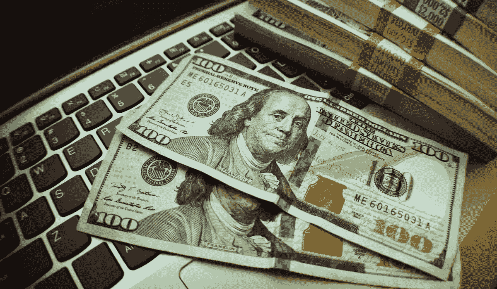

# 你到底需要多少钱才能“成功”

> 原文：<https://medium.datadriveninvestor.com/how-much-money-do-you-really-need-to-make-it-e95e7a26de60?source=collection_archive---------2----------------------->

## 没有大多数人想的那么多

大多数人认为他们必须赢得彩票才能退休，或者觉得他们有足够的钱。

虽然赢得彩票会有很大帮助，但许多人高估了他们需要多少钱才能“赚到”

“成功”只不过是一些基本的算术，当你以这种方式分解它时，你可以更具体地了解你需要什么才能成功。

制定计划的第一步是确定你所有的花费。如果你每个月花$10K，比你每个月只花$ 5000，你需要更多的钱。越少越好……而且每个月花掉 10K 美元需要真正的努力……尤其是如果这些花费很少或根本没有与生意相关的话。

仔细检查你所有的开销，这样你就能找到削减开支的方法。如果你在娱乐上花了很多钱，寻找免费的替代品。我不在体育场看棒球比赛，而是在 MLB.com 或电视上看。疫情在我的时间表中创造了这种转变，即使一切恢复正常，我也会坚持下去。

与其去看戏，不如看电视，去公园散步，或者和家人一起玩游戏。对于最昂贵的习惯，有很多不太昂贵但同样有趣的选择。

削减开支是明智理财和不剥夺自己的平衡之举。我仍然会跑马拉松，尤其是当更多的比赛开始时，但如果马拉松比赛在时间表上紧挨着，我会选择 60 美元的本地马拉松而不是 180 美元的本地马拉松。额外的 120 美元用于投资。

尽管如此，相对而言，纽约市马拉松是一场昂贵的马拉松比赛(我的注册费为 295 美元)，但我不会为了节省几美元而放弃这种体验。

一旦你算出你的开销，你就知道怎样才能收支平衡。在这个例子中，我们假设你每月的平均支出为 5000 美元。

为了达到收支平衡，你需要每个月赚 5000 美元，但是谁想达到收支平衡呢？

处于盈亏平衡点会带来难以置信的风险。如果你下个月表现不佳怎么办？你的销售额没有你想象的那么多，或者你不能继续长时间工作？

你应该努力争取足够的安全边际，而不是努力每月赚 5000 美元。每月至少要 6000 美元。你应该努力提高你的收入，或者减少你的开支。

你越是入不敷出，你需要的钱就越少。购买较小的房子，或者理想情况下购买一个你居住的多户型房子(这被称为房子黑客)。与其买新的，不如用旧的。

当我购买实体书时，我用易贝和旧书以每本 2-3 美元的价格购买，而不是为每本新版本支付 20 美元。与其买新车，不如买二手车。这样你会节省很多钱。

这同样适用于技术。不要买新 iPhone。新款 iPhone 下面的型号实际上是一样的，只是增加或减少了几英寸，这取决于苹果公司决定在下一款 iPhone 发布时采用什么尺寸。在新型号之前购买 2-3 种型号，您将轻松节省 100 美元。一些人称这些储蓄为“最低限度红利”

扣除费用后你赚的任何额外的钱都将投入投资。比方说，你每个月投资 1000 美元到一个股票组合中，这个组合能给你带来轻松实现的 3%的收益率。

每个月你投资 1000 美元，你的年收入就会增加 30 美元。一年下来，你的年收入增加了 360 美元。比方说，再投资让你达到 400 美元。这意味着每月要多花 33.33 美元。

这不会改变生活，但随着时间的推移，它会复利…特别是当你再投资并赚到额外的钱时。

投资产生现金流的资产会扩大你的利润。当这个差额足够大时，你可以减少工作时间，甚至考虑提前退休。达到那个阶段需要时间，我不认为任何人应该真正退休。

即使我通过分红获得了 6 位数的收入，我仍然会做我正在做的大部分工作。我想工作的时候就去工作，并且只从事我想做的工作。

“成功”从分析你的数据开始。你算出你的开销，赚的比花的多。下一步是在过理想生活的同时赚取收入。

股息支付增加，可以帮助你的一些开支，因为他们的规模增长。但是要弄清楚你想如何赚钱。如果你想在家工作赚钱，那就开始追求能让你在家工作的副业吧。

当你建立起这些收入流时，你可以从你的生活中去除那些不符合你想要的生活方式的收入流。

如果你把你的花费计算在内，每个月都有个人利润，并将差额投资到产生现金流的资产中，你已经做到了。时间会让你最初的成功更加明显。

[***想学习如何投资股市赚钱？确保你订阅了我的 YouTube 频道***](http://bit.ly/2W4ag01)