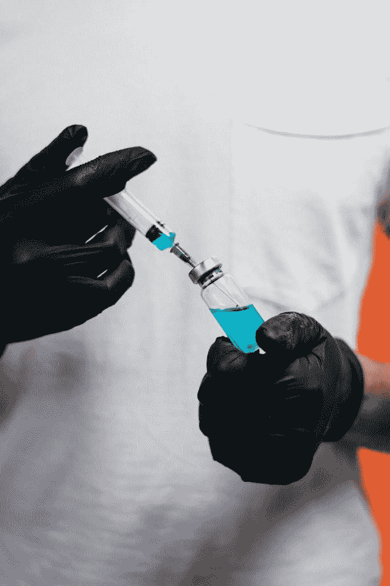
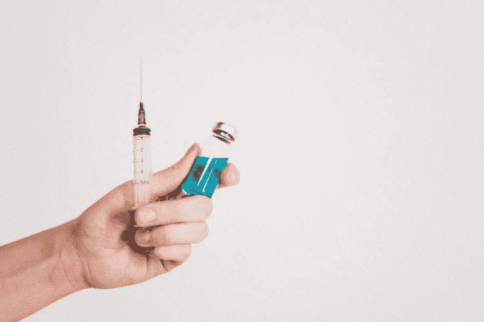
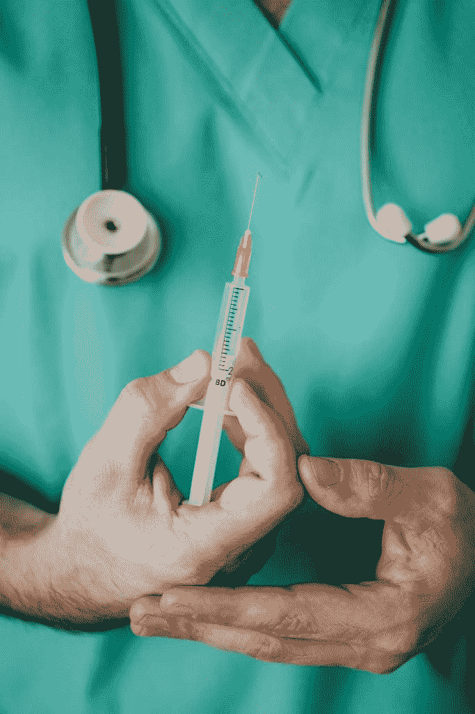
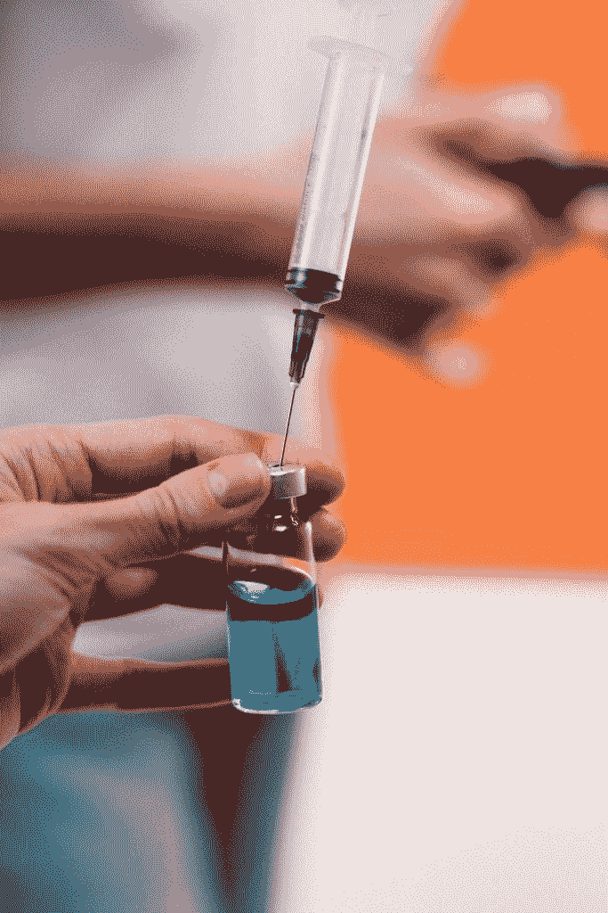
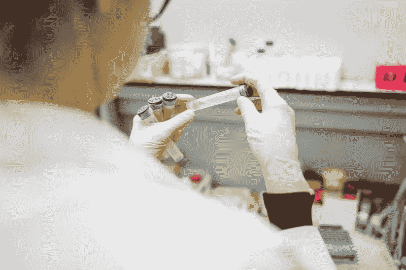
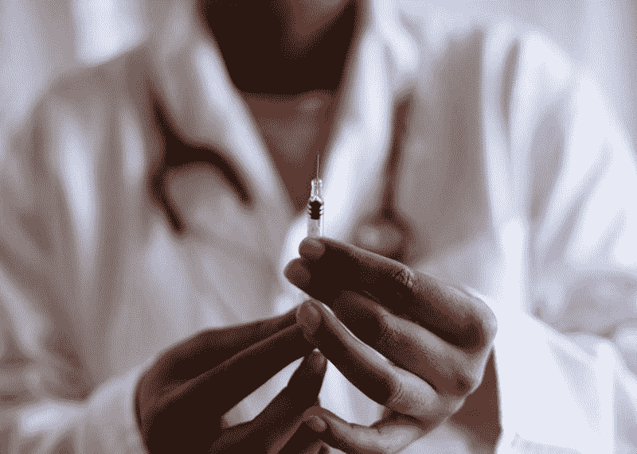

# Moderna 赚了多少钱？—市场疯人院

> 原文：<https://medium.datadriveninvestor.com/how-much-money-is-moderna-making-market-mad-house-1e5f62447044?source=collection_archive---------10----------------------->

投资者正在关注现代公司的疫苗研究。

Moderna 是第一家在美国进行冠状病毒疫苗人体试验的公司。详细来说，[哥伦比亚广播公司声称](https://www.cbsnews.com/news/coronavirus-vaccine-moderna-charging-more-rival-treatments/)两剂 Moderna 的疫苗可以使人对新冠肺炎免疫。为了详细说明，Moderna 在 7 月开始了其疫苗的第三阶段试验。

值得注意的是，美国联邦政府支付了开发 Moderna 疫苗的 10 亿美元费用。然而，哥伦比亚广播公司声称 Moderna 计划对两剂疫苗收费 74 美元。

 [## 股票捐赠:知道什么|数据驱动的投资者

### 有很多交易者和投资者也分别试图找出捐赠他们的…

www.datadriveninvestor.com](https://www.datadriveninvestor.com/2020/08/03/stock-donations-what-to-know/) 

# 现代面临政治压力

我认为 Moderna 可以从疫苗中赚钱，因为政府或健康保险将为疫苗买单。Moderna 可能会因疫苗而面临批评，因为它将向政府收取两倍的疫苗费用。

为了解释这一点，联邦政府在 2020 年为 1.427 亿美国人支付了医疗费用。详细来说， [Statista 估计 2020 年有 7500 万美国人](https://marketmadhouse.com/how-much-money-is-moderna-making/#:~:text=According%20to%20estimates%20of%20the,,%20disabled,%20and%20aging%20people.)接受医疗补助。与此同时，凯撒家庭基金会估计，2020 年将有 6770 万美国人享受医疗保险。

我预测 Moderna 会因为向政府收取两次疫苗费用而面临强烈的政治批评。值得注意的是, [Public Citizens 声称纳税人将承担疫苗开发的 100%](https://www.citizen.org/news/paying-twice-for-a-vaccine-moderna-is-taking-taxpayers-for-a-ride/) 。解释一下，纳税人支付了 Moderna 的研发费用，可以支付 3.31 亿美国人的疫苗接种费用。

# Moderna 进行三期疫苗测试

因此，我认为政治和公众情绪将迫使 Moderna 降低冠状病毒疫苗的价格。然而，疫苗需要首先发挥作用。

哥伦比亚广播公司称，Moderna 声称，截至 2020 年 7 月 31 日，超过 1290 人报名参加了该疫苗的第三阶段测试。Moderna 希望在美国招募 30，000 人参加这项测试。

在阶段测试中，每个参与者将间隔 28 天接受两剂疫苗。因此，我认为可能需要几个月或更长时间来测试疫苗。因此，我认为测试结果要到 2021 年才能出来。

# Moderna 正在亏损

尽管在“曲速行动”下努力开发疫苗，Moderna 仍在亏损。

例如， **Moderna (MRNA)** 在 2020 年 3 月 31 日报告季度净亏损-1.24 亿美元。此外，Moderna 在同一天报告了-1.3086 亿美元的季度运营亏损。

可悲的是，2020 年 3 月 31 日，Moderna 报告的季度收入为 839 万美元。然而，Moderna 在同一天报告了 839 万美元的季度毛利。

# Moderna 正在烧钱

因此，Moderna 正在亏损，收入很少或没有收入。此外，Moderna 正在烧钱，而不是创造现金。

例如，Moderna 报告 2020 年 3 月 31 日的季度运营现金流为-1.0619 亿美元。然而，Moderna 在 2020 年 3 月 31 日报告了 4.0354 亿美元的季度末现金流。

不幸的是，大部分“现金流”来自借款。为此，Moderna 报告 2020 年 3 月 31 日的融资现金流为 5.7805 亿美元。因此，Moderna 借了 5.7805 亿美元来维持经营。

然而，Moderna 报告 2020 年 3 月 31 日的现金和短期投资为 12.19 亿美元。此外，Moderna 当天公布的总资产为 20.68 亿美元。

# 冠状病毒疫苗有多大价值？

因此，我认为 Moderna 除了潜在的疫苗之外没有其他价值。然而，我认为冠状病毒疫苗可能是有价值的。

例如，我计算出，如果联邦政府为 3.31 亿美国人购买两剂 Moderna 疫苗，山姆大叔可以向 Moderna 支付 244.94 亿美元。注:我的数字是基于政府以每人两剂疫苗 74 美元的价格购买疫苗。

我认为将会有给所有美国人接种疫苗的政治压力，因为[世界计量机构估计，截至 2020 年 8 月 10 日，美国有 165，628 人死于冠状病毒。此外，全世界的政府都将购买疫苗。](https://www.worldometers.info/coronavirus/)

例如，国民健康服务系统将为英国 6665 万居民购买足够的新冠肺炎疫苗。即使 NHS 支付新冠肺炎疫苗正常价格的十分之一，Moderna 也能赚钱。

此外，国家公共电台声称，疫苗市场可能是永久性的，因为一些科学家认为新冠肺炎永远不会消失。因此，Moderna 可以开发出一种可以销售几十年的产品。

# 现代没有价值

所以，是的，冠状病毒疫苗可能有巨大的价值。然而， **Moderna (MDRNA)** 本身似乎提供不了什么价值。例如，Moderna 不支付股息。

然而，市场先生认为 Moderna 可以提供巨大的价值。事实上，Moderna 的股价从 2020 年 1 月 2 日的 19.23 美元上涨至 2020 年 8 月 10 日的 72.65 美元。我认为疫苗新闻正在推动 Moderna 的股票。

我认为投资者需要远离 Moderna，因为 MDRNA 可能会在一夜之间失去所有价值。例如，我认为如果冠状病毒疫苗失败，Moderna 可能会失去大部分股份价值。此外，Moderna 的股票可能会崩溃，如果别人；如 [**、葛兰素史克**](https://www.fiercebiotech.com/biotech/glaxosmithkline-pens-covid-19-vaccine-pact-medicago) **(纽约证券交易所代码:GSK)** ，上市一种疫苗。

# Moderna 是一种投机性投资

因此，我认为 Moderna 是一种投机性投资，因为没有证据表明它的疫苗或 mRNA 技术有效。Moderna 的希望是利用信使核糖核酸(mRNA)对人体细胞进行重新编程，以执行特定的动作。

例如，从理论上讲，Moderna 的 mRNA 疫苗可以对白细胞进行重新编程，从而摧毁新冠肺炎病毒。不幸的是，这种说法可能是一个未经证实的理论。

另一方面，如果成功的话，mRNA 可以让 Moderna 赚很多钱。Moderna 可以利用 mRNA 开发其他疾病的疫苗，例如疟疾和艾滋病。

总之，我建议投资者避开 Moderna Inc .**(纳斯达克股票代码:MRNA)** ，直到他们证明 MRNA 有效。

*原载于 2020 年 8 月 10 日 https://marketmadhouse.com***。**

***访问专家视图—** [**订阅 DDI 英特尔**](https://datadriveninvestor.com/ddi-intel)*