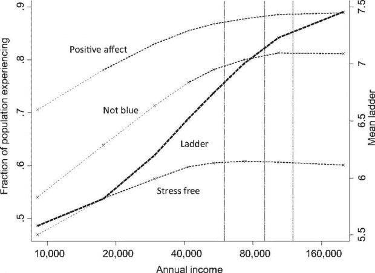
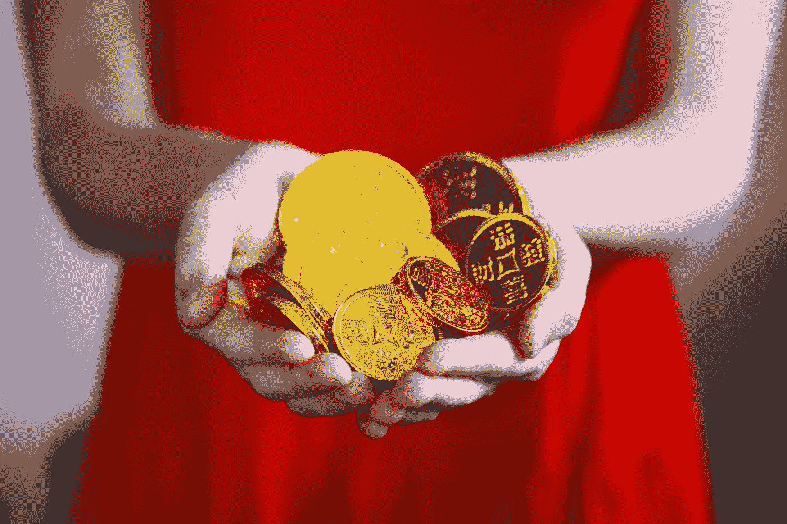

# 多少钱会让你幸福？

> 原文：<https://medium.datadriveninvestor.com/how-much-money-will-make-you-happy-1735c1e28f75?source=collection_archive---------13----------------------->

## 按照两位诺奖得主的说法，75k 应该够了。

Picture provided by Data Driven Investor

金钱和幸福。这是两个非常不同的概念，在经济学领域引起了很多关注。以至于有两位不同的诺贝尔奖得主研究过这个话题:丹尼尔·卡内曼(2002 年获奖)和安格斯·迪顿(2015 年获奖)。

现在，对于普通的行为经济学家/科学家来说，卡内曼的名字和巴甫洛夫的任何研究一样响亮。然而，迪顿这个名字有点模糊。对于一般的行为爱好者来说，这几乎不是一个家喻户晓的名字。所以，我们去调查他。

迪顿的大部分工作专注于不平等和贫困，以及世界上最贫穷的国家如何面临重大的经济和健康挑战。以此为起点，迪顿以研究一般消费而闻名:我们如何使用商品和服务，这对我们的福利意味着什么。

 [## 为什么包容性财富指数比 GDP 更能衡量社会进步？|数据驱动…

### 你不需要成为一个经济奇才或金融大师就能知道 GDP 的定义。即使你从未拿过 ECON 奖…

www.datadriveninvestor.com](https://www.datadriveninvestor.com/2019/03/08/why-inclusive-wealth-index-is-a-better-measure-of-societal-progress-than-gdp/) 

此外，迪顿在 1980 年与约翰·穆尔鲍尔一起创建了“近乎理想的需求系统”，塑造了对商品消费的研究。此外，他的研究对经济学家如何衡量发展中国家的生活水平和贫困程度产生了不可思议的影响。用诺贝尔奖委员会的话说:“迪顿帮助发展经济学从一个基于粗糙宏观数据的理论领域转变为一个由基于高质量微观数据的实证研究主导的领域。”

当有人告诉你你需要赚多少钱和/或消费多少钱才能快乐，或者至少对你的福利产生影响时，迪顿似乎是那个人。

Photo by [Micheile Henderson @micheile010 // Visual Stories [nl]](https://unsplash.com/@micheile?utm_source=medium&utm_medium=referral) on [Unsplash](https://unsplash.com?utm_source=medium&utm_medium=referral)

他和卡尼曼一起做的工作的主题当然并不令人惊讶:迪顿研究消费和福利，卡尼曼已经过渡到幸福研究。这一合作的不出所料的结果是关注多少钱会让你快乐的研究。

嗯？

看来 7.5 万美元年薪应该能行。

如果你读了 T2、福布斯等的文章。)你会被这个数字从各个角度抛向你。但是实际上这篇论文声称了什么呢？

这篇论文的正式标题是:**高收入提高了对生活的评价，但没有提高情感幸福感。**这是摘自该论文的两种非常不同的主观幸福感测量方法:

*   *情绪健康*指的是个人日常经历的情绪质量——快乐、压力、悲伤、愤怒和情感经历的频率和强度，这些经历使人的生活愉快或不愉快。
*   *生活评价*指的是人们思考生活时对生活的想法。

这篇论文实际上展示的是，这两个概念与收入的关系非常不同。在论文中，他们分别针对主观幸福感的这两个方面，提出了金钱能否买到幸福的问题。

他们用来找出这些关系的方法是对盖洛普-健康之路幸福指数(对 1000 名美国居民的每日调查)的 45 万多份回复进行分析。情感幸福是通过关于前一天的情感经历的问题来衡量的，而生活评价是通过坎特里尔的自我锚定量表来衡量的(你可以问自己在这两个测量工具中放了多少股票)。

现在，他们发现了什么？生活评价与收入和教育更相关，而健康、护理、孤独和吸烟是日常情绪相对更强的预测因素。

本文围绕的主要内容是下图(图 1)。当查看图 1 时，不清楚 75.000 来自哪里。嗯，这一段可能会有帮助:

*“图 1 显示，对于所有体验幸福的衡量标准，低收入群体中的个人平均比他们上面的人做得更差，但前两个群体中的人没有区别。为了使两个最高类别相等，第二类别的整个范围必须位于饱和点之上。这一观察表明，情绪上的幸福满足了从顶层开始的第三类收入。我们推断，超过大约 75，000 美元/年，在情绪幸福的三个指标中的任何一个都没有改善。相比之下，该图显示，在整个范围内，随着收入的增加，生活评价稳步上升；收入对个人生活评价的影响没有显示出满足感，至少远远超过 12 万美元。*

为了帮助你:收入类别似乎如下(也可以在图表中看到):

1.类别 1:0–6 万
2。第二类:6 万–9 万
3。第三类:9 万–12 万
4。第四类:> 12 万

Picture taken from the paper as referenced below

**取自纸张的图形描述:*图 1。*** *积极情感、蓝色情感、压力和生活评价与家庭收入的关系。积极情绪是报告快乐、微笑和享受的人口比例的平均值。“不忧郁”是 1 减去报告忧虑和悲伤的人口分数的平均值。“无压力”是指前一天没有报告压力的人口比例。这三个享乐指标标在左边的刻度上。阶梯是在 0-10 的范围内报告的平均数字，标记在右边的刻度上。*

那么 75000 美元从何而来呢？这是第二类的平均值。60，000 到 90，000 之间是 75，000。就这么简单。

当看图表时，我们看到生活评价稳步上升。情绪幸福感(积极影响)也随着对数收入的增加而增加，但是当达到第二类时，大约在中间点，除了年收入就没有进一步的进展了。

在这篇论文中可以找到一大堆其他的结果，而不仅仅是 75.000 这个任意的数字。更重要的是要记住，低收入加剧了与离婚、健康不佳和孤独等不幸相关的情感痛苦。孩子让你更担心，更有压力。压力通常会导致更糟糕的生活评价和健康状况。所以这是一个恶性循环。但这些结果很快被提及，而不是为了掩盖 75.000。

最后，迪顿和卡尼曼得出结论，高收入买到的是生活满意度(积极的生活评价)，而不是幸福(高情感幸福感)，低收入与低生活评价和低情感幸福感都有关联。

Photo by [Sharon McCutcheon](https://unsplash.com/@sharonmccutcheon?utm_source=medium&utm_medium=referral) on [Unsplash](https://unsplash.com?utm_source=medium&utm_medium=referral)

你知道我认为你能从这篇论文中学到什么吗？ ***快乐稍纵即逝，积极的生活满足感却不会。*** 照此，以后者为目标。

怎么会？

这篇论文表明，积极生活评价的最强预测因素是收入和教育。尽管人们真的抓住这 75000 美元不放，但我不买。尤其是作为薪水。我不知道这对一个非美国人或不同的税收体系意味着什么。旁边应该有多少资产？如果我负债累累怎么办？挣那份薪水有年龄上限或下限吗？很多问题是看了实际研究后留下的。

最终的结论并不牵强:当你已经拥有特权时，你会对生活更加积极:高收入，可能来自良好的教育。*触目惊心。*

虽然身体好戒烟也无妨。随便说说。

## 参考

卡尼曼博士和迪顿博士(2010 年)。高收入提高了对生活的评价，但没有改善情感健康。*美国国家科学院院刊*， *107* (38)，16489–16493。

莫尔·范·登·阿克是华威商学院行为科学专业的博士生。她研究了不同的支付方式，尤其是非接触式和移动支付方式，对我们管理个人财务的影响。在她的“空闲”时间里，她写了一些关于个人理财、行为科学、行为金融和博士生生活的文章，这些都发表在《金钱在头脑》上。通过 DDI，她撰写了关于个人和行为金融的文章，以确保学术界的知识流入主流，并能帮助尽可能多的人！

*原载于 2020 年 1 月 23 日 https://www.datadriveninvestor.com***。**