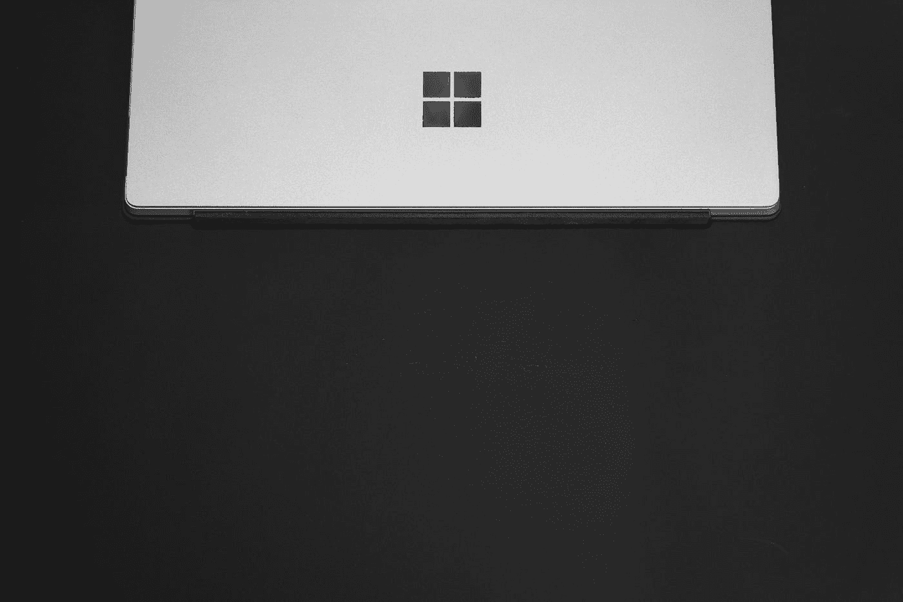

# 你应该害怕 FAAMG 公司拥有的权力吗？

> 原文：<https://medium.datadriveninvestor.com/how-much-power-and-influence-do-the-faamg-companies-really-have-ed6f8fe1e314?source=collection_archive---------18----------------------->

## 当他们有能力吞下每一个竞争对手的时候？

Photo by [Medhat Dawoud](https://unsplash.com/@medhatdawoud?utm_source=medium&utm_medium=referral) on [Unsplash](https://unsplash.com?utm_source=medium&utm_medium=referral)

最近，在 2020 年 7 月 31 日，苹果成为世界上第一家市值达到 2 万亿美元的公司。举个例子，这个数字如此巨大，以至于如果按 GDP 计算，它可以被列为第八大国家。此外，我确信，你们中的一些人已经听说苹果公司拥有大约[1930 亿](https://www.cnbc.com/2020/07/30/apple-q3-cash-hoard-heres-how-much-apple-has-on-hand.html)美元的现金。现在，这家公司是如何发展壮大的，他们手中有 1930 亿美元有什么好处，脸书、谷歌、亚马逊和微软呢？

Photo by [Solen Feyissa](https://unsplash.com/@solenfeyissa?utm_source=medium&utm_medium=referral) on [Unsplash](https://unsplash.com?utm_source=medium&utm_medium=referral)

首先，我们来说说谷歌。谷歌(Alphabet Inc .)成立于 1998 年，截至 2020 年 9 月，其市值已达到约 1.14 万亿美元。谷歌有相当数量的成功和不成功的项目，导致他们这样的估值。但是谷歌保持领先地位的一个主要策略是收购较小的公司。2020 年，谷歌已经收购了超过 200 家公司！例如，谷歌在 2005 年仅以 5000 万美元收购了 Android 操作系统，在 2005 年以 16.5 亿美元收购了 YouTube，这两家公司现在都与科技世界和谷歌的生态系统深度融合。

Photo by [Ashkan Forouzani](https://unsplash.com/@ashkfor121?utm_source=medium&utm_medium=referral) on [Unsplash](https://unsplash.com?utm_source=medium&utm_medium=referral)

微软呢？多年来，微软已经收购了大约 232 家公司，包括 Skype Technologies、LinkedIn Corp、GitHub 和 Mojang。

 [## 谷歌最近的想法是将一个城市地区运作的几乎每一个方面都转移到服务器上，这是一个…

### 直到现在，几乎每次致力于智能城市的会议都会提供智能大都市的例子，它…

www.datadriveninvestor.com](https://www.datadriveninvestor.com/2020/04/04/googles-recent-idea-to-move-nearly-every-aspect-of-a-city-districts-operation-to-a-server-is-a-whole-new-quality-in-terms-of-smartcity-development/) 

脸书？他们在 2012 年以 10 亿美元收购了 Instagram，在 2014 年以 160 亿美元收购了 WhatsApp。总计达 [72 次收购](https://www.techwyse.com/blog/infographics/facebook-acquisitions-the-complete-list-infographic/)。

随着 87 起收购的完成，亚马逊还收购了全食超市、捷步达康和 Twitch，以进一步丰富其产品。

合并和收购只是为什么小公司从来没有大到足以与 FAAMG(脸书、苹果、亚马逊、微软、谷歌)公司竞争的例子之一。换句话说，当大公司看到市场中的“潜在威胁”时，他们可以直接收购该公司。通过这样做，他们不仅消除了竞争，还获得了相当大的市场支配力。

在较小的公司眼中，让我们说 Instagram，它在 2010 年从只有【2010 万美元资金开始，收到了一家像脸书这样的公司向他们提供 10 亿美元的消息，当然，较小的公司对 2000 倍的投资回报和出售他们公司的收益感到兴奋。这也是为什么苹果手里会保留一定数量的现金，以防他们想做出类似的举动。

通过进行这些收购，这些超级大公司除了彼此之外几乎没有任何竞争！因此，竞争发生了变化，问题变成了:哪家公司能够进行最好的收购来发展各自的公司，以及这些公司能否在市场上保持实力。

经过多年的滚雪球式的方法，苹果、谷歌和微软已经建立了一个生态系统，它如此融入我们的社会，已经成为公众的某种形式的公用事业。

> 很有可能，当你读到这里的时候，你正在使用这些公司的产品。

这个问题也部分归咎于软件开发人员。软件开发人员倾向于更成熟的平台，因为与任何初创公司相比，它们拥有更大的市场。

既然是这样，那就变成了一个无止境的，自我实现的循环。只要苹果、谷歌和微软仍然是世界上最大的科技公司，大多数软件开发人员就会在他们的应用程序中使用这些生态系统/平台。反之亦然，只要大多数软件开发人员在他们的应用程序中使用这些生态系统/平台，苹果、谷歌和微软就能领先于所有其他竞争对手。

Photo by [Mark Timberlake](https://unsplash.com/@mtimber71?utm_source=medium&utm_medium=referral) on [Unsplash](https://unsplash.com?utm_source=medium&utm_medium=referral)

此外，FAAMG 公司拥有的资金允许他们建造昂贵的基础设施，从而巩固了他们在市场中的地位。以亚马逊为例。他们目前在世界各地有超过 175 个运营中的履行中心来管理他们的拣货、包装和运输。而对于较小的公司来说，由于产生的成本，这不一定是可能的。

从另一个角度来看，亚马逊本质上是在通过制造一个创业公司无法逾越的障碍来提高进入门槛。

一旦这些基础设施建立起来，它将使公司在市场上极具竞争力。举例来说，亚马逊的履行中心允许该公司推出 Amazon Prime(一日送达)。而一个较小的公司，他们可能没有资源来实现这一水平的竞争力。

从消费者的角度来看，如果亚马逊和一家较小的公司都提供类似的产品，大多数人会选择亚马逊，因为它有一天送达的好处。

由于所有的芯片都堆在一边，任何初创公司都不太可能以指数级增长他们的公司，并成为科技市场的竞争者。它要么被其中一家巨头收购，要么根本没有增长的机会。因此，允许 FAAMG 公司支配和完全垄断各自的行业。

Photo by [Austin Distel](https://unsplash.com/@austindistel?utm_source=medium&utm_medium=referral) on [Unsplash](https://unsplash.com?utm_source=medium&utm_medium=referral)

因为所有这些被提及的项目，[美国国会](https://www.washingtonpost.com/technology/2020/07/29/apple-google-facebook-amazon-congress-hearing/)担心联邦航空公司的行为是否被认为缺乏竞争力，因为在这些巨型公司附近根本没有任何竞争。

苹果、谷歌、亚马逊、脸书或微软失败的原因是什么？尽管可能性很小，但如果这些公司决定合并，会发生什么？

> 随着时间的推移，技术只会越来越好。

人类越来越依赖科技产品来改善我们的生活。因此，公平地说，随着这一趋势的持续，这些公司的规模只会越来越大。

问自己这些问题:如果脸书、苹果、亚马逊、微软和谷歌不存在，现代世界会是什么样子？如果这些公司明天不复存在，会发生什么？你和我会做什么？这些公司如此控制我们的生活可以吗？

**这就是这些公司拥有的力量。**

*嘿，既然你在这里，为什么不加入我的* [***邮件列表***](https://marcuschan.ck.page/76504d9d12)**来看看你收件箱里偶尔出现的精彩故事，或者考虑成为会员***来阅读我所有的故事！☺***

****访问专家视图—** [**订阅 DDI 英特尔**](https://datadriveninvestor.com/ddi-intel)**