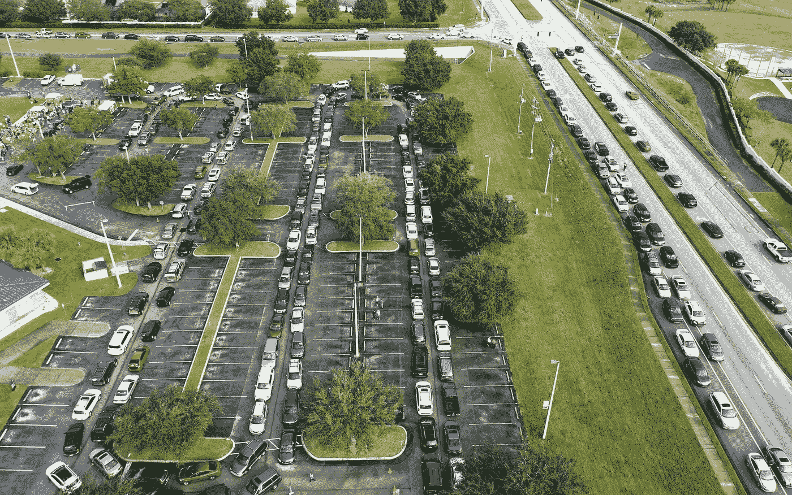

# 你的政府从你那里偷走了多少财富？

> 原文：<https://medium.datadriveninvestor.com/how-much-wealth-has-your-government-stolen-from-you-86de6c720757?source=collection_archive---------11----------------------->

## 科学家开发疫苗，政府制造贫困，民主是一种幻觉。

SOPA Images Limited / Alamy Stock Photo

在 Covid 的第八个月，美利坚合众国的粮食救济请求达到了历史最高水平。宾夕法尼亚州的食物银行在 10 月的前三周向 275 万人发放了援助，全国有五分之一的美国人依靠这些食物。虽然[英雄法案](https://www.congress.gov/bill/116th-congress/house-bill/6800/text)被参议院扣为人质，但是到 12 月底，5400 万受经济影响的受害者可能会经历饥饿。美国政府赢得了世界上最富裕、最残酷国家的第一名，圣诞节后第二天到期的失业救济金是最大的败类。几十年前，像美国这样扩张和强大的经济体本可以/应该消除其境内的贫困，然而百万富翁变成了亿万富翁，而该国其他人却在拼命挣扎，因为金融安全不是为建立经济的人准备的，疫情或经济复苏计划需要大量工作。

尽管 [63%的美国公众](https://www.pewresearch.org/fact-tank/2020/09/29/increasing-share-of-americans-favor-a-single-government-program-to-provide-health-care-coverage/)表示政府应该为所有人提供医疗保健，全民覆盖在美国仍然是一个非常棘手的考验，但是遍布六大洲的 67 个国家(其中许多是发展中国家)已经解决了医疗保健之谜。英国、欧盟、澳大利亚、新西兰和加拿大的既定官僚体系通过直接向银行账户存款来加速和简化财政援助的发放，而美国人则等待支票的邮寄。没有一项经济刺激措施能充分满足所有社会成员的需求，但没有一项措施像美国这样冷酷无情，至少人们不关心医疗保健，也不知道如何支付账单。虽然对赤字的担忧限制了美国，但新西兰财政部长宣布，该国将增加债务，以减轻新西兰人的金融痛苦；什么概念！

 [## 无论如何，政府在自由世界中的地位会是怎样的？数据驱动的投资者

### 撇开政治科学的争论不谈，围绕政府角色的讨论比以往任何时候都更加重要…

www.datadriveninvestor.com](https://www.datadriveninvestor.com/2020/08/20/what-would-governments-place-in-a-free-world-look-like-anyway/) 

美国、英国、澳大利亚和其他富裕国家有能力为所有人提供基本必需品，但他们宁愿看着或忽视(恶意程度不同)人们挨饿，也不愿偏离不平衡的新自由主义模式(涓滴效应、全球化、去监管化、富人更快变富、经济意识形态骗局)。自由市场资本主义不是自由的；这是一个由少数富裕精英和企业主主导的政府计划经济，而美国是最好的计划者。

***民主***

1.  **民治政府；一种政府形式，在自由选举制度下，最高权力属于人民并由他们或他们选出的代理人直接行使。**
2.  *有这种政府形式的国家:美国和加拿大是民主国家。*
3.  *权利和特权形式上平等的社会状态。*
4.  **政治或社会平等；* [*民主*](https://www.dictionary.com/browse/democratic) *精神。**
5.  *区别于任何特权阶级的普通人；普通人的政治权力。*

*如果政府重新开始投资于公共事业(是的，这是 20 世纪 80 年代以前的事情)，这将提高人们的期望，人们可能会意识到社会服务的减少或缺乏是政府出售、解除管制和私有化公共服务的结果。援助最富有者的机会成本(如果你必须为收入而工作，这不是你)，是以社会的生计、健康和金融安全为代价的。政府可能认为公共产品和服务的私有化通过“让市场竞争”获得了更低的价格，并忽视了企业商业模式增加利润率的目标，这不可能不尖叫咄！像能源这样的公共事业被以数十亿美元的价格卖给了私人企业，但是有人同意出售或者至少接受分红吗？*

> *充满希望的竞争会降低能源成本，澳大利亚政府在 1999 年将能源市场私有化。到 2012 年，成本增加了 170%，2019 年，老年人因体温过低在家中死亡的人数创下历史新高。澳大利亚研究所*

*美国政府对[传染病控制](https://www.theatlantic.com/health/archive/2020/06/scientists-predicted-coronavirus-pandemic/613003/)的资助于 2019 年结束，在武汉与中方合作的美国科学家于 2019 年 9 月被遣送回国。科学家们尖叫着爆发迫在眉睫，但联邦政府不感兴趣，该研究未被阅读，而警告被拒绝。不幸的是，我们永远不会知道如果合作继续下去会发生什么，但我们知道世界上每一个联邦政府都让我们失望了，因为他们事先得到了确凿、无可辩驳的证据以及大致的时间表。美国军方，正如我们今年早些时候了解到的；警察已经做好了随时随地战斗的准备，但是保护公众的利益并不是他们的工作。*

*就像易受捕食者伤害的活靶子，疫情的愤怒洗劫了我们的生活、未来和健康，政府忘记了如何治理人民，关闭经济，或让我们在 Covid 和饥饿之间做出选择，并迫使我们陷入贫困。他们会对可避免的死亡、情感痛苦、健康影响和经济损失负责吗？Covid 会成为重启以人为本的经济规划时代的催化剂吗？大概不会。我们已经把街道上的饥饿、无家可归和绝望正常化了；多 7000 万人没什么大不了的…对吧？*

*[Vox 拍摄的照片](https://www.vox.com/2020/5/9/21251895/food-banks-lines-pandemic)显示，美国当前的饥饿危机仅仅是噩梦的开始，这个噩梦困扰着我们醒着的每一分钟，但其他人却没有保险！这只会变得更糟…要是我们能做点什么就好了？*

## *获得专家观点— [订阅 DDI 英特尔](https://datadriveninvestor.com/ddi-intel)*