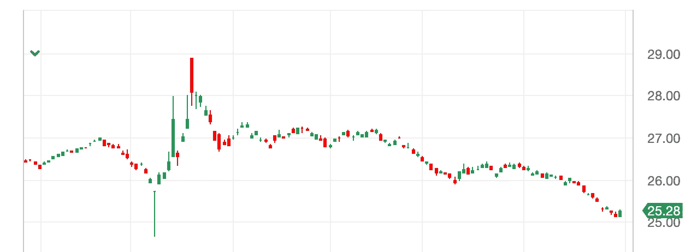
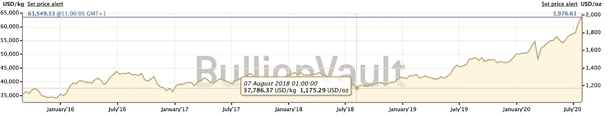

# 美元会下跌多少？

> 原文：<https://medium.datadriveninvestor.com/how-much-will-the-us-fall-by-ef3ceb034182?source=collection_archive---------27----------------------->

# 景顺 DB 美元指数看涨基金-下跌 10.86%

Source: etfdb.com

外汇市场是一个零和游戏，当一种货币贬值，另一种货币应该升值时，你卖出日元或€，买入美元。

在出现法定货币的替代品之前，情况确实如此。有些人会建议用黄金。但是黄金是以美元定价的，所以如果有投资者逃向黄金，就像过去 24 个月价格上涨 68%那样，理论上这将有助于美元的价格，因为你需要购买美元来购买黄金

黄金价格从 1175 美元上涨到 1975 美元，涨幅 68%

来源:[金条库](https://www.bullionvault.com/gold-price-chart.do)

然而，随着加密货币的出现，如果人们希望出售法定货币，我们可以说有了一种替代资产类别。现在可以出售法定价格的资产，如债券、股票、房地产等，并购买 BTC、瑞士联邦理工学院、XRP 等(虽然不是稳定的硬币，因为这些通常与法定货币挂钩)。

很多人都在谈论美元的贬值，世界著名的经济学家斯蒂芬·罗奇甚至提出，由于新冠肺炎[，美元崩溃是不可避免的](https://www.cnbc.com/2020/06/15/dollar-crash-is-almost-inevitable-asia-expert-stephen-roach-warns.html)

美国经济最近[下跌 32.9%](https://www.theguardian.com/business/2020/jul/30/us-gdp-economy-worst-quarter-covid-19-unemployment)显示了新冠肺炎对世界最大经济体的影响，随着失业率上升和美联储轮廓印刷钞票，不难看出为什么曾经强大的美元正在挣扎。

在过去的几个月里，美元对一篮子其他法定货币下跌了近 11%。

随着世界经济进入自 1930 年以来全球最严重的衰退，Cryptos(又名 BTC、瑞士联邦理工学院、XRP 等)是否会反弹，只有时间会告诉我们，但请记住这句格言:“不要把所有的鸡蛋放在一个篮子里”。

鉴于美国经济面临的经济逆风，今天说美元将下跌多少只是猜测，但值得记住的是，房地产、股票和债券都有惊人的表现。现在是不是该放弃一些筹码，但不仅仅是持有现金，而是寻找一个真正的替代选择？

给你带来的数字字节，如果你想收到你的每周版有更多的文章，像这封电子邮件 info@teamblockchain.net

**#区块链#黄金# BTC #以太坊#密码#美元#衰退#新冠肺炎#经济#投资#外汇**