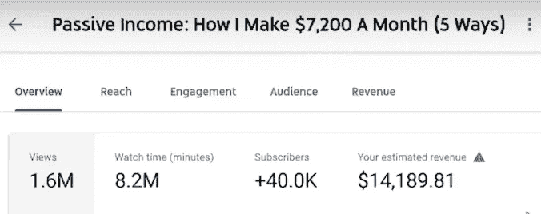
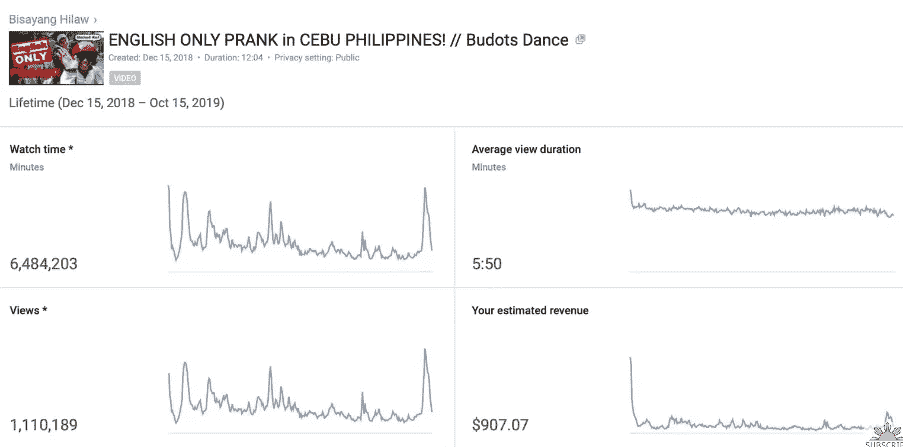
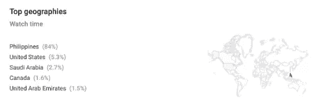
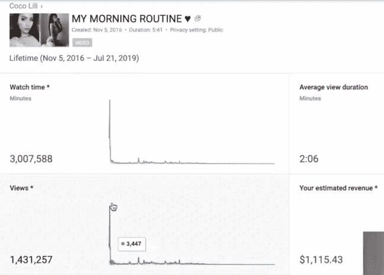

# 每 100 万次点击，YouTube 向不同的 YouTube 支付多少钱

> 原文：<https://medium.datadriveninvestor.com/how-much-youtube-pays-to-different-youtubers-per-1-million-views-aa02bd94c661?source=collection_archive---------1----------------------->

Photo by [Rachit Tank](https://unsplash.com/@rachitank?utm_source=medium&utm_medium=referral) on [Unsplash](https://unsplash.com?utm_source=medium&utm_medium=referral)

在当今世界，每个人都知道 youtube 是什么，许多人使用它来娱乐和教育，但你知道吗，你可以从 youtube 上赚钱，对大多数人来说，答案是肯定的，因为你可能已经看过许多关于 youtube 每 100 万次点击支付多少钱的视频。但是如果我问你**“每 100 万次点击，youtube 向不同的 YouTube 支付多少钱”**，你们大多数人都不会知道答案，所以下面是答案。

# 从 YouTube 赚钱

在 youtube 上，你可以从不同的东西中赚钱，通过广告、联盟营销(推广其他人的产品)、赞助和你的商品，但今天我们只谈论通过 adsense 从**广告中赚钱。**

 [## 艺术、科学和梦想的共同本质|数据驱动的投资者

### 人类的梦想是强大和无限的。这种形而上学的思想世界可能是最持久的，并且是存在的…

www.datadriveninvestor.com](https://www.datadriveninvestor.com/2020/06/18/common-substance-of-art-science-and-dreams/) 

当我们谈论从adsense 在 youtube 上赚钱时，有很多因素会影响 youtube 的收益，比如你的定位、视频主题、你的观众所在的国家、CPM(每英里每千次观看的成本)以及人们观看你的视频的时间。因为不同的 YouTubers 为不同国家的不同观众制作不同主题的视频。对于广告商来说，重要的是哪种类型的观众正在观看视频，他们是否有能力购买一些东西，如果播放广告的观众或国家能够从广告中购买一些东西，广告商将更有可能投放**高 CPM 广告**，这将转化为更多的收入，如果你的观众不能购买一些东西，那么他们将投放**低 CPM 广告**，你可能会赚更少的钱。

由于以上因素，我们将分析来自不同 YouTubers 的不同主题的视频，这些视频在不同国家被观看，所有视频的观看量在一百万之间。

# 第一个视频:“被动收入:我如何每月挣 7200 美元(5 种方式)”

Analytics screenshot for “Passive Income: How I Make $7,200 A month (3 Ways)”

如你所见，[这个视频](https://www.youtube.com/watch?v=kSSnIZHfteY)从**160 万次**观看中赚了**14 . 189 . 81 美元**，因为这个视频是关于赚钱或金融教育的，大约 60%到 65%的人来自 CPM 更高的**美国**。

YouTube 倾向于给商业和金融频道最高的 CPM 比率，这就是为什么这个视频的 CPM 在 10 美元之间，这意味着这个视频每 1000 次观看可以赚 10 美元。

> 这个视频赚更多的钱，因为它有 10 分钟长，如果一个视频长于 10 分钟，那么你可以放更多的广告(在视频中间插入广告)。

# 第二个视频:“菲律宾宿务英语恶作剧！//Budots 舞蹈”

Analytics screenshot for “ENGLISH ONLY PRANK in CEBU PHILIPPINES! //Budots Dance”

如你所见，[这个视频](https://www.youtube.com/watch?v=VFGdTAsORTA)也有**110 万**的浏览量，但只产生了**907.07 美元**的浏览量，这远远低于另一个视频，因为这是一个旅游视频频道，其 CPM 比率**低于另一个频道**。

Geographical analytics for video

这个视频的 CPM**很低**，因为大部分的观看来自**菲律宾**，其中 84%的观看来自**美国**，只有 5.3%的观看来自**美国**，这个视频的平均 CPM 接近 1 美元。

> 这个视频也超过 10 分钟。

# 第三个视频:“我的早晨惯例”

Analytics screenshot for “My Morning Routine”

如你所见，[这个视频](https://www.youtube.com/watch?v=r1-BagV133Y)有**140 万**的浏览量，而且只赚了**1115.43 美元**因为主题对广告商不友好，视频不长于 10 分钟，所以没有更多的广告，这是一个生活方式频道，生活方式频道的 CPM 高于 vlogging 频道，但低于商业和金融频道，这就是为什么这个视频比第二个视频赚得多，但比第一个少。

大约 25%到 30%的浏览量来自美国，因为这个视频做得很好，给了大约 1 美元的 CPM。

我给你看了三个不同的视频，来自不同的创作者，还有他们的分析，我想你现在可以估计一下 YouTubers 的收入，希望你也喜欢这篇文章。

感谢您的阅读……

**访问专家视图—** [**订阅 DDI 英特尔**](https://datadriveninvestor.com/ddi-intel)