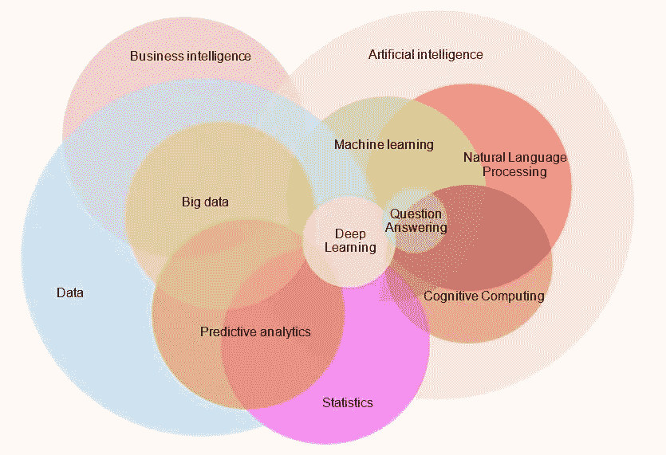
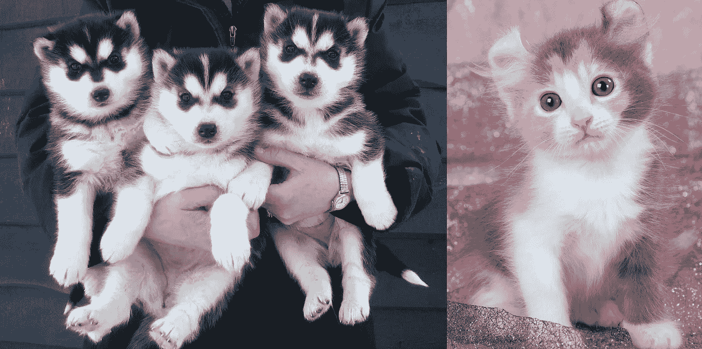

# 我的电脑如何复制婴儿:机器学习类型

> 原文：<https://medium.datadriveninvestor.com/how-my-computer-copies-a-baby-machine-learning-types-5ffc8add6b31?source=collection_archive---------1----------------------->

人工智能在过去几年里一直是热门词汇。从网飞推荐到我们最喜欢的助手，如 Siri 或 Cortana，人工智能(简称 AI)在我们的生活中无处不在。它有潜力彻底革新

许多人认为他们了解人工智能，但实际上他们对它有一些怪异的反乌托邦式的理解。事实上，人工智能是许多其他事物总称。例如，回到个人助理的例子。

Siri、Cortana、Alexa、Google Home 和任何其他语音激活设备都使用 AI。具体来说，他们利用一种叫做**自然语言处理的人工智能形式。**本质上，自然语言处理(简称 NLP)是用来将口头数据处理成机器可以理解和使用的格式。通常，这个过程也是由另一种类型的人工智能完成的，称为机器学习，具体来说是神经网络。

 [## 认知计算——一套被广泛认为是……

### 作为它的用户，我们已经习惯了科技。这些天几乎没有什么是司空见惯的…

www.datadriveninvestor.com](https://www.datadriveninvestor.com/2020/02/19/cognitive-computing-a-skill-set-widely-considered-to-be-the-most-vital-manifestation-of-artificial-intelligence/) 

仅仅从上面的例子，我们就可以看出 AI 可以有多盘根错节，多复杂。不同类型的人工智能的子部分用于其他类型的人工智能。这是人工智能实际上如何适应及其所有不同组件的视觉映射:

如上所述，人工智能只是拼图的一部分。一个**对 AI** 的简化定义是这样的:

> 使用计算机来完成通常需要人类智能的任务。这些任务包括图像识别(需要你解释你周围看到的东西)、语音识别(需要你理解语言)、基于众多标准做出复杂的决策，以及其他类似的任务。

> 我上面引用的定义实际上来自我的好朋友 Adam Majumdar，他最近写了一本关于人工智能的很棒的、全面的指南。你可以在这里查看。

在这篇具体的文章中，我将关注最令人兴奋的人工智能类型:**机器学习**。将机器学习概念化的一个简单方法是将其与婴儿学习进行比较。

Photo by [Markus Spiske](https://unsplash.com/@markusspiske?utm_source=medium&utm_medium=referral) on [Unsplash](https://unsplash.com?utm_source=medium&utm_medium=referral)

当一个婴儿出生时，他们完全不知道这个世界是如何运作的。这就是为什么他们经常触摸、嗅闻和尝试品尝周围的一切。这就是机器学习模型最初启动时的样子:完全不知道任何事情。

例如，作为一个婴儿，如果你被告知要区分苹果、樱桃和桔子，它们在你看来都是一样的。随着时间的推移，你将开始**接收大量数据**，比如每种水果的味道、气味、外观等等。利用这一点，你将开始从你的环境中进行观察，从你过去的经历中学习，并能够了解每一种水果是什么。

这正是机器学习的工作方式。机器学习是计算机如何能够获取大量数据，并能够在其中找到模式，并使用这些模式来学习某个目标。

随着时间的推移，机器学习**算法**(代码指令集)能够变得更好，产生更准确和精确的结果，甚至可以生成人造人脸！

Those faces above, aren’t real people. A computer made them. Isn’t that crazy?!

现在我们了解了一些背景，让我们更具体一些。我将在本文中介绍三种不同类型的机器学习**:监督学习、非监督学习和强化学习。让我们一个一个地检查。**

# 监督学习

*TL；博士:机器通过使用标签数据来学习。*

监督学习是最容易解释的类型。在监督学习中，给一个算法**带特定输入的标签数据和一个定义的输出**，并告诉它找到一种用输入得到输出的方法。

这有点令人困惑，让我们简化一下。

假设你刚被当地一家超市聘为数据科学家。他们告诉你，他们希望你找到一种方法来预测一个人是否会在商店里买东西。他们还会给你 10，000 名顾客的个人数据，以及他们是否买了东西(假设所有这些都是双方同意的)

Photo by [Fikri Rasyid](https://unsplash.com/@fikrirasyid?utm_source=medium&utm_medium=referral) on [Unsplash](https://unsplash.com?utm_source=medium&utm_medium=referral)

现在，您有了每个客户的特定**输入数据**(年龄、性别和收入等)和特定**输出数据**(他们是否购买了某些东西)。在这种情况下，由于您已经标记了数据和已定义的输出，因此您可以使用监督学习。

因此，您使用客户的*9000*作为您的算法的训练数据，以找到一种方法来确定客户是否会购买。然后，您使用剩余的 1000 名客户作为训练数据，只输入输入数据，如果一切顺利，您将获得每个客户的正确输出，您的模型就成功了。

# 无监督学习

*TL；dr:机器通过使用未标记的数据在没有指导的情况下学习。*

无监督学习类似于监督学习，但有一个关键区别，**无标记数据或标记结果**。

在这种类型的模型中，给出了未标记的输入数据，计算机负责确定输出。与监督学习不同，计算机不知道你想要的输出，因为它没有定义，因此必须找到模式并将相似的数据聚集在一起。

这方面的一个例子可以是*猫和狗标识符*。假设你的电脑里有一大堆随机的猫咪照片——说实话，谁没有呢？但不幸的是，你不小心把狗的照片也放进去了。现在你有数百张狗和猫的照片，并且想要整理它们。

> 需要注意的是，计算机不能像我们一样区分猫和狗。虽然我们可以通过视觉、听觉和阅读来理解，但计算机只能理解代码，甚至是特定类型的位数据(0 或 1)。
> 
> 所以对于计算机来说，它不知道我们放入算法的图片是猫、狗、房子、人还是任何东西。为了克服这一点，你上网找到一个巨大的数据库，里面有成千上万张独特的猫和狗的照片，然后在你的算法中运行这个数据库。

所以你创造了一个无监督的学习算法！在这种情况下，该算法获取每张图片，并逐个像素地分析每张图片，然后找到。随着时间的推移，计算机能够破译图片的某些部分，如动物的耳朵。

它意识到一些图片在圆形(脸)上有两条尖角线(猫),而另一些图片有更多的圆形线(狗)。当然，这不能推广到所有的狗和猫，因为有明显的例外，如西伯利亚哈士奇和美国卷毛猫。

I know, adorable.

但随着时间的推移，无监督学习模型能够找到足够的相似性和差异来区分这两者。然后你把你的猫文件夹放到模型里，然后——*瞧——*——一切都组织好了。

# 强化学习

*TL；dr:机器通过一个智能体使用奖励/惩罚系统与环境互动来学习。*

强化学习是我个人最喜欢的，也可能是最令人兴奋和最难编码的学习类型。

在强化学习中，你有一个可以比作玩家的代理人。**代理处于一个开放的环境**中，没有关于它需要做什么的预定义数据或指令，但只有一个目标:最大化回报。

它通过产生动作并获得一定的奖励来鼓励该动作来实现这一点，因为它更接近模型需要完成的内容。这可以比作一个被困在孤岛上的人。

Bob crashed 降落在一个岛屿上，之前从未见过岛屿或天然食物(不现实，但对我们的类比有帮助)。他需要确保自己能存活足够长的时间，让路过的飞机发现他并救他。为此，他需要学习如何生存。

最初，鲍勃可以做一些无用的事情，比如抓狂，但很快他就会意识到这对他确保生存是有害的，所以他会停止。由于鲍勃一无所知，他试图吃沙子，但很快意识到沙子是不可食用的，于是停下来。然后他进入森林寻找潜在的浆果。幸运的是，他立刻发现了一丛蓝莓，松了一口气。但是他尝了一个，结果是酸的，可能致命，所以他没有吃。他继续往前走，开始感到口渴。然后他发现了一条有干净水的小河，并意识到为了生存他需要喝水。所以他喝了水，感觉更有活力和水分，所以决定用瓶子装一些水，并在周围寻找更多的食物…

这个故事可以永远继续下去，直到鲍勃得救。尽管阅读整段摘录令人望而生畏，但这是强化学习模型的基本工作方式:

*   代理人(鲍勃)尝试随机行动，要么给它奖励(营养或生存水化)
*   惩罚(酸浆果)或
*   两者都不给，但是加班会导致更多的惩罚(什么都不做)

最终，该模型能够自学什么是最有效的，以获得最大的回报，并经常能够找到极其有效的方法来解决问题，甚至像下面的捉迷藏示例所示的那样利用它。

# 那是一个包裹

基本上每个机器学习模型都是这样工作的！每一个都是为不同的用例及场景选择的，由于篇幅原因，我没有在本文中介绍。但是这三种类型的学习都非常强大，有巨大的潜力来积极改善我们生活的世界。

# 等等！在你离开之前:

请允许我自我介绍:)

嗨！我是 Sabeeh，我是一个好奇的 17 岁少年，对新兴技术如人工智能、脑机接口、基因编辑等**充满热情。我也很想联系并了解你更多——给我发个 DM 吧！**

在[上联系我 *Linkedin*](https://www.linkedin.com/in/sabeeh-hassany-334b6b194/) ，在 [*上关注我*](https://medium.com/@sabeehhassany) (哦看！你已经在这里了)，在 [*Twitter*](https://twitter.com/sabeehhassany) 上关注我