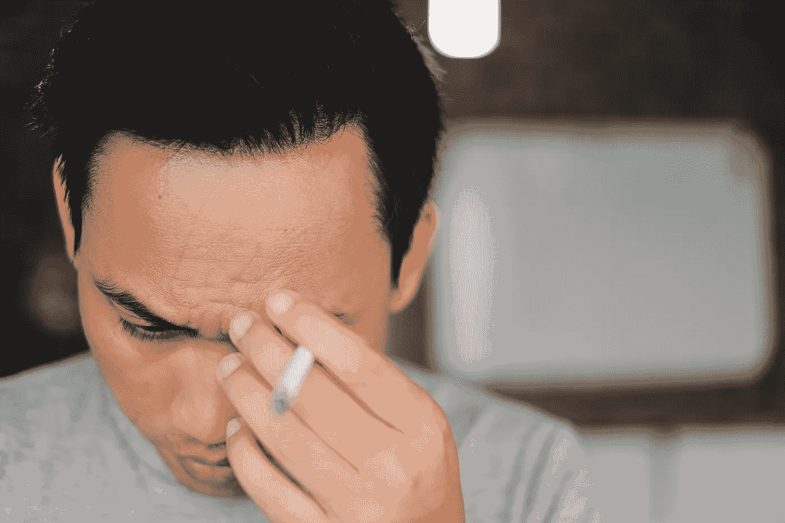

# 我丈夫是如何输掉我们一半的积蓄的

> 原文：<https://medium.datadriveninvestor.com/how-my-husband-lost-half-of-our-life-savings-69e8f8e9247a?source=collection_archive---------0----------------------->

## 冠状病毒自白

## 低买。高价出售。我想我在哪里听过这句话。然而，很明显，我丈夫没有收到备忘录。

Photo by Ali Yahya on Unsplash

要了解发生了什么，你必须了解他。他很清醒，但我一直叫他瘾君子。他变得痴迷，全力以赴，直到下一次痴迷到来。自从我们相识以来，他已经是一名摇滚明星、自行车动感单车教练、铁人、业余摄像师、有抱负的天体物理学家、公路自行车手和冷冻治疗师。他参加过波士顿马拉松训练，拍过拖拉机广告，还开了一个播客。

我爱他的精力、决心和无所畏惧。他是我见过的最可靠的人。如果他说他要做某件事，他会毫不犹豫地立刻去做。

 [## 利用股市相关性的最佳方式|数据驱动的投资者

### 当阿尔弗雷德·温斯洛·琼斯开创了世界上第一个“对冲”基金(后来“d”被去掉了)时，他让其他投资者大吃一惊…

www.datadriveninvestor.com](https://www.datadriveninvestor.com/2020/02/02/the-best-way-to-use-stock-market-correlations/) 

他最近痴迷于清洁能源。在我放弃这个想法之前，他差点让我们签了一份我们负担不起的房子太阳能电池板的合同。

然后他发现了埃隆·马斯克和特斯拉。我想他恋爱了。

“亲爱的，你知道我们可以花 3 万美元买一辆新的特斯拉，”有一天，他在帮我准备晚餐时说道。

我们不需要新车。几个月前，我们刚刚把 SUV 换成了电动汽车。我们在那笔交易中赚了钱。

“为什么我们现在要增加汽车付款？”我问，仍然专注于煎锅里的洋葱变色。

“我是说，我知道我们现在买不到了，但它们实在太漂亮了。你知道电池是制造的吗……”他继续说道，我的思绪又回到了我脑海中正在构思的故事。我有一个即将到来的最后期限。

他一周又一周地谈论工厂、不同种类的金属、无人驾驶汽车和油漆颜色。他熬夜在 YouTube 上看关于埃隆·马斯克的传记和特斯拉公司未来的视频。他被迷住了。

至少一年来，我们一直就如何投资卖掉上一套房子所得的现金意见不一。他已经回复了几个来自当地经纪人的陌生电话，我甚至和他们中的几个谈过话。我们发现，问题的根源在于我和我丈夫对风险的容忍度非常不同。我一边给他发送短期 CD 报价，一边担心我们应该保持多少流动性以备不时之需。

我记得 2008 年我妈妈的投资组合发生了什么，以及她在 2018 年终于赚回损失时是多么激动。

当我丈夫向我展示他承诺回报的图表时，我很警惕。“你必须接受失去一半，这就是我要说的，”我像副歌一样唱着。“这是一场长期的风险游戏。我们应该只投资我们能承受的短期损失。然后，我们必须假装钱不存在。”

在过去十年的婚姻生活中，我们通过保持财务独立来避免在金钱上的分歧。就像完全分开，不在网上链接什么的。我们一直都有自己的银行账户。事实上，在我们交往的头八九年里，我们使用了不同的银行。我们挣自己的工资，我们支付自己的信用卡账单，我们分担国内费用；他付了抵押贷款，我付了食物和托儿费。这种设置对我们很有效。我们为钱吵架的次数可能不到五次。

正如你现在所理解的，我丈夫决心带着他为特斯拉公司培养的激情去做一些事情。他想投资。他想知道我们是否可以转移一些资金。另一方面，我——一如既往——对任何快速决策都很谨慎。这是 2019 年的秋天，飙升的市场似乎正在走向回调，或者至少这是我从我正在阅读的经济学家那里收集的信息。

我们陷入了僵局。

有一天工作压力特别大，我收到了丈夫一条戏谑的短信，说什么特斯拉的股票正在攀升，希望他在游戏中有钱。他说那会要了他的命。我当时轻率地回答。

> 你可以吃一半。但如果你他妈的失去了它，我真的会杀了你。

他从未回应。

几个星期以来，他每天晚上从办公室出来时都精神抖擞。“你看过市场吗？我今天赚了 1000 美元，”他会说，眼里闪烁着光芒。

“嗯嗯，”我回答。“你卖了吗？”在那种幸灾乐祸了两个月后，我问道。

“不，当然不。”

“好吧，那么，这不是真的钱，”我嘲笑道。我真扫兴。“别再给我每天的市场更新了。别管它了，不要再说了。这让我压力很大。”

但我会打破自己的规则，几周后，当我在 2 月初辞去工作时，提出这笔资金。"亲爱的，我们能不能兑现一些利润，让我浮起来？"我问。

“你可以自己做，”我丈夫回答，显然很生气。“我给你登录。但你为什么不从存款中取出你需要的呢？如果我们留在这里，这支股票可以让我们赚一百万美元。”

“好吧。”我想，把一切都分开就好了。你做你的，我做我的，对吧？

事实证明，我最后悔的是去年年底我下班时发的那条短信。我的丈夫会非常后悔几周前在他赢了一手牌的时候没有离开牌桌。

现在这一切看起来像是不同的一生。如你所知，读者，一个微小的病毒席卷全球，破坏了一切，市场陷入混乱。

上个月的一个星期五，我丈夫下班回家，垂头丧气。他非常沮丧，走进餐厅，静静地坐在空椅子上，旁边是我们的儿子正在建造的史诗风火轮赛道。

“我看到了市场新闻。我很抱歉，亲爱的，”我喊道，同时从另一个房间的冰箱里拿了一瓶啤酒。“只要不卖，一切都会好的。低买。高价出售。这是唯一的规则，对吗？我的意思是，要多样化。”

他没有回应。

我丈夫是个吉他天才。需要任何电子表格，他是你的人。他是个杰出的视频制作人。但有时我会怀疑他。

如果他找不到东西，他已经不再让我帮他在房子周围找了。我们经常玩“我的 X 在哪里”的游戏——当 X 一直在他怪异的脸前面时——这变得很难看。他只是没有现在，而不是让我愤怒的事实，没有人在房子里可以找到任何东西，除了我。

有一次，他在我们在东边租的一个地方弄坏了我们的煤气炉，因为他把漏勺塞到水里太快了，水溢出来了。他已经做过一次了，觉得看起来很酷，又以快动作试了一次，想知道当水像液体一样从每个孔中挤出，或者像大坝从地基的一百个裂缝中决堤时会发生什么。当我进来发现我的丈夫在清理地上的水，炉子从墙上拔出来，我不记得了，但我觉得我只是在外面走了回来。

有一次，他把我的车留在了一个公寓停车场，车的门开着，钥匙放在驾驶座上。他在达拉斯或拉雷多或他以前巡回演出路线上的那些地方演出时，车停了一夜。当他第二天早上回来时，它仍然奇迹般地在那里。

我丈夫花了三天才承认，他感到害怕、紧张、不知所措，不知道该怎么办，所以他确实卖掉了他在市场上的投资。他跟着其他人一起掉下了悬崖。因为巨大的损失。他没有打电话给我，也没有和我谈过这件事，就把我们一生的积蓄挥霍掉了一半。

我还没有大叫或者哭泣。也许我很震惊。我还没看账户，看看还剩下什么。

尽管如此，我还是答应不管他是富是穷，我都会留下他。如果说我从股市中学到了什么，那就是当你周围的一切都崩溃的时候，你不会卖掉你所有的资产。我要从长计议。趋势通常是上升的，对吗？这一切都会过去的。直到死亡将我们分开。

从现在开始，我正式负责所有的事情。