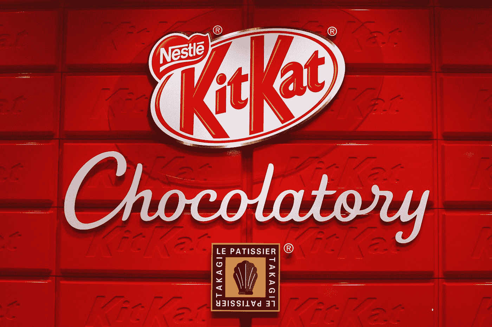

# 雀巢如何用最伟大的策略征服日本

> 原文：<https://medium.datadriveninvestor.com/how-nestl%C3%A9-conquered-japan-with-the-greatest-tactic-12ed4d3c87eb?source=collection_archive---------0----------------------->

## 他们了解他们的消费者，并且玩长线游戏

Photo by [Trent Szmolnik](https://unsplash.com/@ts_imagery?utm_source=medium&utm_medium=referral) on [Unsplash](https://unsplash.com?utm_source=medium&utm_medium=referral)

20 世纪 70 年代，日本经济空前繁荣。市场在增长，人均收入和支出也在增长。

雀巢，当时世界上最大的食品公司，设想了一个在这个不断增长的市场中获取价值并赚取巨额利润的机会。因此，他们开始了市场调查。

Nescafé是雀巢收入最大的产品，它似乎是一个显而易见的选择。

## 他们的第一次尝试

从 20 世纪 60 年代开始，日本对西方文化越来越感兴趣。咖啡开始通过自动售货机出售，提高了人们对咖啡的认识和兴趣。

然而，众所周知，日本人喜欢喝茶。几个世纪以来，茶一直是主要的饮料。

因此，雀巢在介入之前进行了谨慎的审查。他们进行了广泛的二级市场研究。

他们接着进行了初步研究——接触潜在客户并对他们进行采访。他们对所有年龄和性别的顾客进行了集中的小组讨论，以收集他们对雀巢咖啡的看法。

令人惊讶的是，每个人都喜欢它。所有焦点小组的反馈都非常积极。原来，日本消费者爱上了咖啡的味道。

看到如此积极的迹象，雀巢公司的高管们兴奋不已，并开始全力以赴，准备一项广泛的计划，在日本的每个货架上推出咖啡。

在广告和建立分销渠道上花费了巨额资金，他们的咖啡在市场上大放异彩。

然后……什么都没发生。

雀巢咖啡在日本卖不出去。咖啡馆里空无一人。

这毫无意义。市场是一片蓝海。它很大，而且还在成长。他们所做的每一项研究都表明雀巢咖啡是下一个大事件，日本人喜欢它。

即使他们喜欢咖啡的味道，他们还是不买。

发现自己处于一个棘手的境地，雀巢公司决定引进营销界的古怪超级明星: [**Clotaire Rapaille。**](https://en.wikipedia.org/wiki/Clotaire_Rapaille)

## Clotaire Rapaille 的背景

克洛泰尔有着有趣的职业背景。他是一名儿童精神病医生，多年来一直从事自闭症儿童的工作。

他坚信“人们不会告诉你他们真正想要什么”

他认为，驱动人类行为的真正欲望是无意识的，很少有人拥有自我意识来理解它们，更不用说表达了。

为了理解这个家伙的才华，我将分享一个他如何帮助“吉普”起死回生的例子。然后我们会回到雀巢公司。

由于刚刚起步的销售，克莱斯勒即将重新配置甚至退役标志性的吉普牧马人。消费者要求宽敞、功能更多的汽车。然而，在接最后一个电话之前，克莱斯勒找到了克洛泰尔。

克洛泰尔在他的任务中做的第一件事是深入研究美国人和他们的汽车背后的文化原型。

在一系列深度采访中(他喜欢称之为探索会议)，他设法揭示了美国人对汽车的更深层次的意义，从早期童年记忆到他们的第一次驾驶经历。

然后，拉帕耶向克莱斯勒的高级管理层陈述了他的情况。他解释说，对普通美国人来说，吉普车象征着自由。它象征着狂野的西部和奔跑的马。

他建议把方形大灯改回原来的圆形。他的理由？马没有方眼睛。他们有圆形的。

克莱斯勒听从了这个建议，不出所料，不管后备箱大小或发动机功率如何，销量都开始回升。

很不可思议，不是吗？现在让我们回到雀巢的问题上来。

当 Clotaire 到达现场时，他很快明白日本消费者无法与咖啡联系在一起。日本人从小看着父母喝茶长大，生活在空气中的茶香里，吃着茶味的零食。那么，他们成年后选择茶而不是咖啡，这有什么奇怪的吗？

他断定咖啡不是日本文化的一部分。

那么克洛泰尔推荐了什么呢？

## 咖啡糖果。

Photo by [Matt & Chris Pua](https://unsplash.com/@yo_puaaa?utm_source=medium&utm_medium=referral) on [Unsplash](https://unsplash.com?utm_source=medium&utm_medium=referral)

在他的推荐下，雀巢在日本推出了多种咖啡口味的儿童糖果。与饮料领域相比，糖果领域的进入壁垒明显较低。

因此，突然间，成群的孩子开始通过几十种不同的糖果发现咖啡的味道。

今天有超过 350 种不同的口味，抹茶绿茶和红豆是最受欢迎的一种，因为它们是日本文化的一部分。这些品种的成功对以咖啡为基础的品种产生了溢出效应，孩子们变得更习惯于咖啡的味道。

除了具有与文化相关的口味，雀巢还采取了另一个聪明的营销举措，将他们的糖果命名为“KitKat”，大致音译为 positivity。因此，KitKat 开始与好运护身符联系在一起，并成为考试期间学生们的流行礼物。

今天，大约有 500 万日本人每天消费 500 万块巧克力。

从那以后，他们最终转向了冰糖咖啡口味的饮料。然后是拿铁。然后，在他们意识到之前，喝了一大杯热气腾腾的雀巢咖啡。

雀巢不止于此。在此之后，他们多年来不断创新，提出了 3 个以上的策略。

## 1.雀巢大使

2012 年，雀巢推出了一个大使计划，在工作场所指定一个喜欢咖啡的人作为“办公室咖啡师”。有 Nescafé大使的办公室配备了补贴的 Nescafé机器，大使们可以用这些机器煮咖啡并获得奖励。

除了在办公室提供美味的咖啡，这个项目还让人们能够社交和放松。雀巢咖啡成了团结和友好的代名词。

## 2.技术和自动化:

日本是高度自动化的。对于一个大约每 23 个人就有一台自动售货机的国家来说，Nescafé意识到实现服务自动化至关重要。

因此，他们从 2014 年开始使用一个名为 [Pepper](https://www.softbankrobotics.com/emea/en/pepper) 的人形机器人向家电商店的人们出售咖啡机。作为世界上第一个能够理解人类情感并与之互动的机器人，Pepper 向消费者解释了 Nescafé的产品和服务。它也可以制作和供应咖啡。它一炮而红。

Photo by [Franck V.](https://unsplash.com/@franckinjapan?utm_source=medium&utm_medium=referral) on [Unsplash](https://unsplash.com?utm_source=medium&utm_medium=referral)

然后在 2015 年，雀巢推出了 Gold Blend Barista 机器，引起了顾客的共鸣。这台机器可以制作 5 种不同类型的咖啡，让人们可以在自己舒适的家中享受咖啡馆风格的咖啡。

## 3.睡眠咖啡馆:

雀巢利用了日本文化的另一个方面:努力工作和加班。2019 年 2 月，[他们在东京](https://soranews24.com/2019/02/27/nescafe-opens-permanent-sleep-cafe-in-tokyo-in-time-for-sleep-day-blends-catnaps-with-caffeine/)开了一家永久睡眠咖啡馆，人们可以在这里小睡片刻，喝着美味的咖啡。

他们之前在日本也有其他睡眠咖啡馆，但只在世界睡眠日开放，而这家是全年开放的。

人们可以选择在椅子上打盹，或者睡在床垫上，并为服务付费。他们可以在午睡前后点一杯咖啡。

## 外卖

雀巢在这方面的成功有两个关键经验:

1.  **玩长线游戏，要有眼光。瞄准儿童意味着雀巢瞄准了 10 年后会消费咖啡的顾客。他们打了一个长赌。**
2.  **融入文化。人们总会发现更容易信任与他们的价值观和文化更一致的品牌。**

今天，日本是第三大咖啡进口国，每年超过 440，000 吨，雀巢是速溶咖啡销售的市场份额领先者。

对于一个大约 50 年前还不知道咖啡是什么的国家来说，这已经很不错了。对吗？