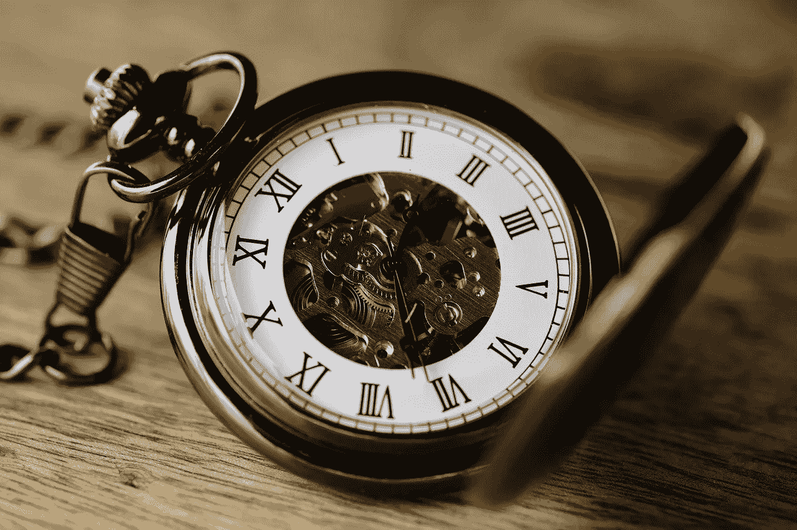
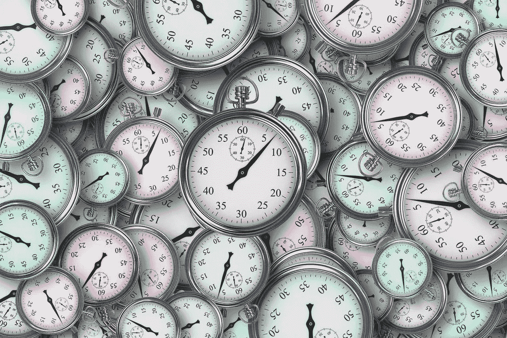
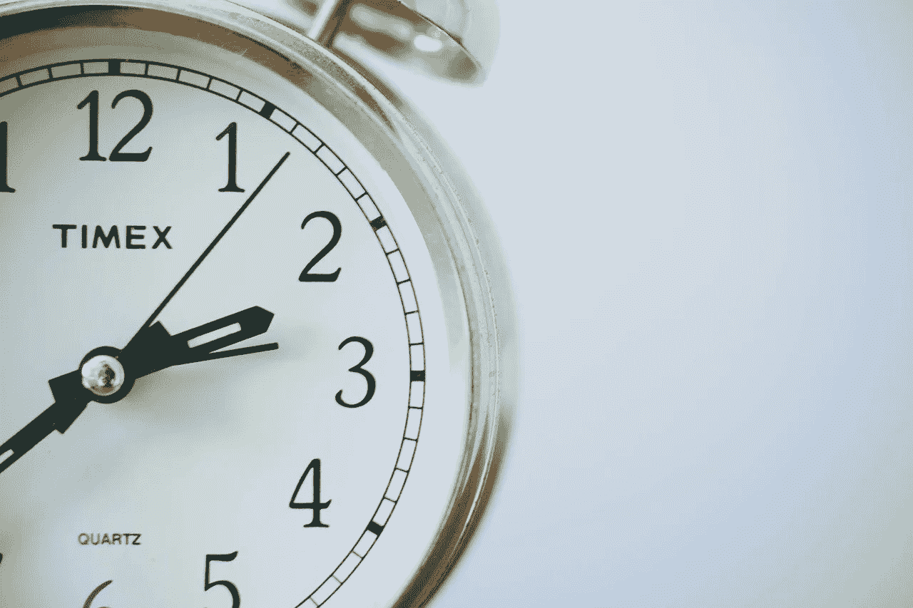
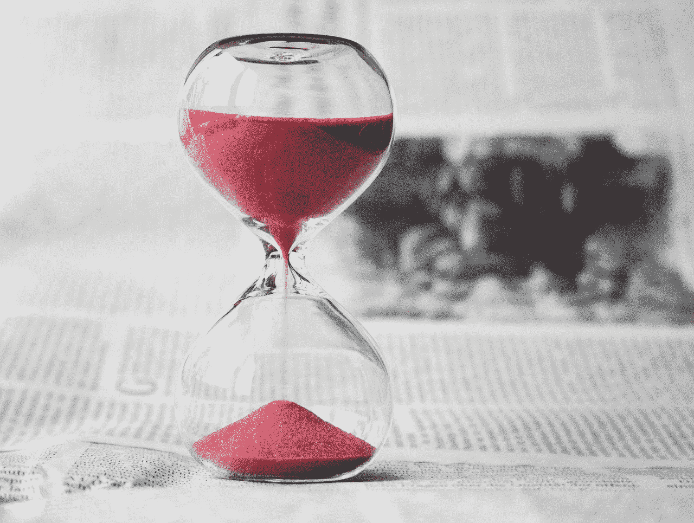

# 网飞、亚马逊、贝宝和苹果如何出售时间

> 原文：<https://medium.datadriveninvestor.com/how-netflix-amazon-paypal-and-apple-sell-time-4363e27ff0ca?source=collection_archive---------10----------------------->

现实中，什么**亚马逊(NASDAQ: AMZN)** ，**网飞(NASDAQ: NFLX)** ， **PayPal (NASDAQ: PYPL)** ，**苹果(NASDAQ: AAPL)** 等科技公司卖的都是时间。

为了解释这一点，这些公司中的每一家都推销节省日常时间的技术进步。例如，网飞和其他流媒体服务通过取消电视广告来节省时间。

Soda.com[声称](https://www.soda.com/news/you-literally-waste-years-of-your-life-watching-commercials/)2014 年，一小时的美国电视节目每天包含 15 分 38 秒的商业广告。因此，一个看三小时电视的人会看 45 分钟的广告。

# **流媒体视频如何销售时间**

因此，从有线或广播电视转向网飞或迪士尼+的观众每天可以多投注 45 分钟。因此，当人们购买网飞或 HBO Max 订阅时，他们支付的是时间，而不是娱乐。

记住，网飞、HBO Max 和 Hulu 出售的大部分节目都可以在广播或有线电视上看到。HBO Max 甚至打广告说，它在其他电视上免费提供节目；比如*南园*和*好友*。然而，网飞，HBO Max 和亚马逊 Prime 删除了广告，节省了观众的时间。

观众通过流式视频和更多的时间获得他们想要的娱乐。因此，流媒体视频服务出售时间。

 [## 投资区块链前要问的三个简单问题(也是一个困难的问题)|数据…

### 现在是了解区块链的最佳时机。不同货币之间的增长率，比如…

www.datadriveninvestor.com](https://www.datadriveninvestor.com/2020/03/12/three-simple-questions-and-one-difficult-one-to-ask-before-investing-in-a-blockchain/) 

# **亚马逊如何出售时间**

亚马逊是《时代》最成功的卖家。亚马逊通过消除购物需求来节省时间。

当你在亚马逊上订购一件商品时，没有必要开车去商店花一个小时搜索你需要的东西。相反，你可以在几秒钟或几分钟内完成购买，然后回到其他地方。

美国人喜欢亚马逊，因为它卖给他们更多的时间。例如，*石英* [估计](#:~:text=Americans spend a lot less,about 12 hours in 2003.)2018 年美国人平均每月花 10 个小时购物。2003 年，在亚马逊出现之前，美国人平均花 12 个小时购物。

美国人从亚马逊订购，因为这让他们有更多时间陪伴家人，有更多时间工作，有更多时间娱乐。例如，购物者每天可以有两到三个小时的额外时间用于她的爱好。

因此，杰夫·贝索斯真正的天才不在于零售或打折，而在于节省时间。因此，亚马逊 Prime 提供了购物、送货、音乐和流媒体视频的一站式服务。

# **苹果如何出售时间**

有一次，很多人都没有注意到的营销人员是**苹果(纳斯达克股票代码:AAPL)** 。我认为许多苹果产品的主要吸引力在于它们节省时间的能力。

例如，iPhone 包含数码相机。iPhone 相机节省了时间，因为用户不再需要单独的设备来拍照。取而代之的是，iPhone 用户拿出他或她的相机拍照。

三十年前，把你孩子昨天做的可爱事情的照片发给你在另一个州的母亲需要几个小时的工作。回到 1990 年，如果你想拍照，你需要找出相机，装上胶卷，拍照，开车去商店，冲洗胶卷，然后把照片邮寄给你妈妈。

因此，您需要两次去商店，一次去照相馆邮寄照片。今天，你可以在手机上抓拍照片，然后在两秒钟内发给你的母亲。

所以，苹果卖给你一部 iPhone，就是在卖时间。iPhone 消除了对多种设备的需求；包括录音机、照相机、摄像机和收音机。iPhone 还消除了携带这些设备所需的所有额外时间。

# **贝宝和苹果如何节省时间**

相比之下，PayPal 和苹果通过减少对银行和银行家的需求来节省时间。

例如，大多数美国银行为客户提供了用手机拍照来“存入”支票的能力。因此，iPhone 或 Android 不需要开车去银行存支票，从而节省了时间。

同样，PayPal 允许个人在没有银行账户的情况下汇款和收款，从而节省了小企业和客户的时间。因此，贝宝消除了写支票、邮寄支票和开车去银行存支票的需要。

同样，Apple Pay 允许用户通过 app 进行银行操作。例如，Apple Pay 消除了在收银台掏出信用卡进行支付的需要。

Apple Pay 不需要单独的借记卡和信用卡，从而节省了时间。相反，Apple Pay 提供信用卡和借记卡的即时访问。

# 时间值多少钱？

卖时间是很赚钱的生意。超级省时者，苹果和亚马逊是这个星球上最赚钱的两家公司。

2020 年 3 月 31 日，苹果报告季度营收 583.13 亿美元，毛利 223.70 亿美元。截至 2020 年 3 月 31 日，亚马逊报告季度收入为 754.52 亿美元，季度毛利为 311.95 亿美元。

相比之下，一家规模较小的省时公司**网飞(纳斯达克股票代码:NFLX)** 报告称，截至 2020 年 3 月 31 日，其季度收入为 57.68 亿美元，季度毛利为 21.67 亿美元。我认为网飞永远不会像苹果或亚马逊那样有利可图。

解释一下，复制网飞的业务很容易；流媒体视频。包括 **AT & T (NYSE: T)** 、**康卡斯特(NASDAQ: CMSCA)** 、**迪士尼(NYSE: DIS)** 和**维亚康姆 CBS (NASDAQ: VIAC)** 在内的几家公司正在推出流媒体服务。

然而，复制亚马逊或苹果的业务将是困难的。解释一下，推出流媒体服务只需要编程和云空间。为了与亚马逊竞争，你需要一个履行中心网络。同样，为了与苹果竞争，你需要成千上万的工程师和工厂网络。

# **如何识别超级省时器**

你可以通过识别可能节省大量时间的公司并投资它们来赚钱。

从积极的一面来看，有许多超级省时器。从负面来看，只有少数超级省时者会赚钱。

一类可能成为超级省时者的公司是食品配送服务公司，如 Grubhub(纽约证券交易所代码:GRUB) 、DoorDash 和 UberEATS。这些服务省去了外出就餐和做饭的时间。

此外，**优步(纽约证券交易所股票代码:优步)**和 **Lyft(纳斯达克股票代码:LYFT)** 不再需要拥有汽车，从而节省了时间。例如，一个开优步的人不用花时间停车、洗车、给车加油，也不用来回走到停车位。

# **Waymo 和特斯拉超级省时器**

未来的时间节省者可能是 **Alphabet(纳斯达克股票代码:GOOG)** 子公司 [Waymo](https://waymo.com/) 。Waymo 正在开发自动驾驶汽车，我们公司可以利用这些汽车进行拼车和送货。例如，一辆自动驾驶共享汽车在城市中行驶，接送人们。

另一个潜在的省时者是特斯拉(纳斯达克股票代码:TSLA)。特别是，一辆特斯拉电动汽车消除了每周花 10 分钟在加油站的需求。你可以每天晚上给特斯拉充电，而不用去加油站。

同样，特斯拉正在通过其 [Autopilot](https://www.tesla.com/autopilot) 项目开发自动驾驶汽车。讽刺的是，特斯拉；一家汽车公司可以通过减少开车来节省时间。

最后，零售商如克罗格、T2、T4、奥卡多集团、LON、OCDO、英斯特拉卡特和沃尔玛都在努力发展节省时间的送货和取货能力。特别是克罗格和奥卡多正在研发机器人仓库，可以加快食品杂货的运送速度，节省时间。

不幸的是，还需要一段时间才能看到哪些超级省时器成功了。然而，最近的历史表明，投资超级省时器的人可以赚钱。

**访问专家视图—** [**订阅 DDI 英特尔**](https://datadriveninvestor.com/ddi-intel)