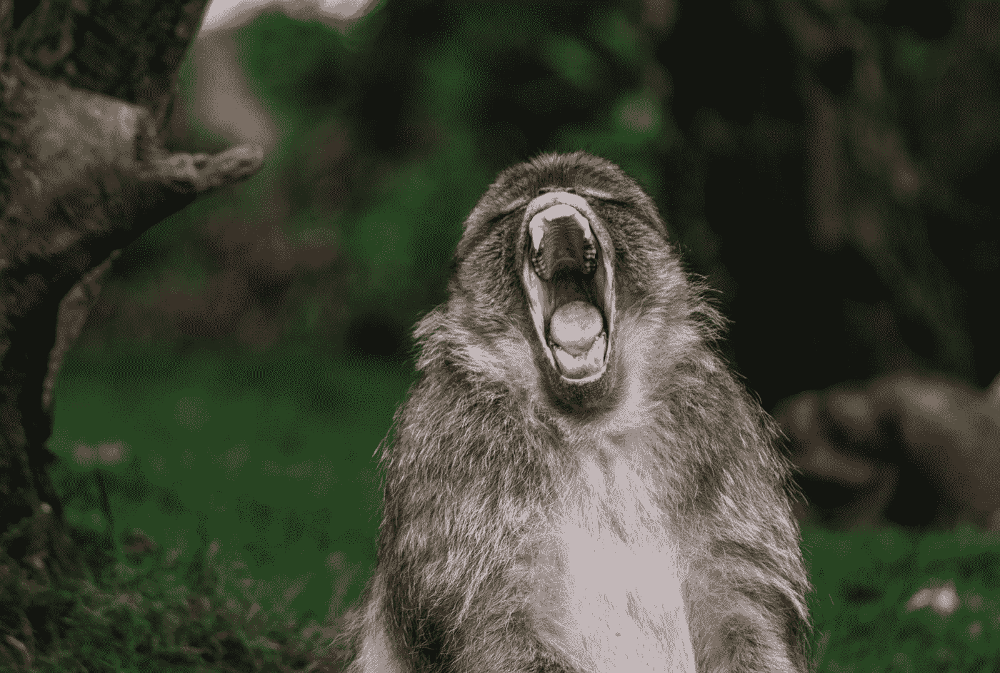
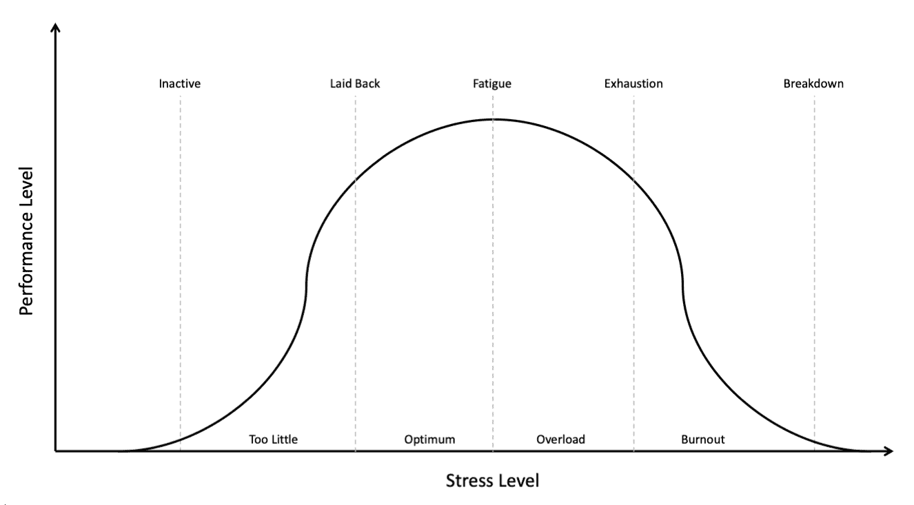

# 网飞的《混沌猴子》向我们展示了一条通往内在力量和弹性的道路

> 原文：<https://medium.datadriveninvestor.com/how-netflixs-chaos-monkey-shows-us-a-path-to-inner-strength-and-resiliency-f42116731a0d?source=collection_archive---------10----------------------->

## 他破坏东西，他制造混乱，他会让我们变得更好

Photo by [Lewis Roberts](https://unsplash.com/@31_photography?utm_source=medium&utm_medium=referral) on [Unsplash](https://unsplash.com?utm_source=medium&utm_medium=referral)

这是混沌猴。

他是一只恶意的、愤怒的、失控的灵长类动物，由网飞设计来“撕裂”其业务的核心——视频传输数据中心——一次一台服务器。

> *“想象一只猴子进入一个‘数据中心’，这些服务器‘农场’托管着我们在线活动的所有关键功能。猴子随意撕扯电缆，破坏设备，把经过手的东西都还回去[即扔屎]。IT 经理面临的挑战是设计他们负责的信息系统，以便它可以在这些猴子面前工作，没有人知道它们何时到达以及它们会破坏什么。”——安东尼奥·加西亚·马丁内斯的《混沌猴子》*

当然，网飞不会放一只真正的猴子到它的数据中心来造成真正的物理破坏。相反，它模拟这种疯狂的野兽只有一个目的:迫使其开发者在网络中建立弹性，这样，如果真的发生中断，其 1.82 亿客户可以继续接收他们付费的内容，没有任何问题。

网飞知道失败是不可避免的。他们明白，在他们全天候运行的数千台机器中，一台或多台机器可能会在任何给定时间发生故障，所有的*最终都会*发生故障。

所以他们计划失败。不，他们把失败建立在他们的系统中。他们创造了一种模拟生物——混沌猴，主动将问题引入到他们的产品中，通过向他们施加绝对的压力来提高他们系统的质量。

# 压力不是一个坏词

1908 年，心理学家罗伯特·耶基斯和约翰·多德森开始在迷宫中测试压力对老鼠的影响，方法是让老鼠大吃一惊。

当老鼠被留下来自己寻找走出迷宫的路时，它们成功了，尽管这并不是一次令人振奋的表演。当老鼠受到轻微电击，低到足以刺激和激发它们时，它们表现得更好。当电击太强时，老鼠会惊慌失措。他们四处躲避随机尝试任何东西和一切逃跑。

简而言之，一定程度的压力会提高他们的表现，而过多的压力则会破坏这种表现，最终导致恐慌引发的崩溃(Cherry，2020)。

简而言之，这两位稍微有点狡猾的研究人员表明，压力不是一个坏词。适度的压力实际上对你有好处。

我们经常从不好的方面看待压力。有充分的理由。桥上的压力太大会导致它倒塌。对棒球棒施加太大的压力会导致它碎裂。给人太多压力会导致他们变得非常暴躁。

另一方面，压力太小会导致消极的生活方式。你可能会认为这样的人缺乏动力或过于懒散；他们似乎根本不在乎完成任何事情，也没有压力去取得成果。

 [## 冠状病毒；惊慌失措；字里行间的 z |数据驱动的投资者

### 围绕冠状病毒的话题；更准确地说，新冠肺炎几乎占据了整个新闻预报的头条…

www.datadriveninvestor.com](https://www.datadriveninvestor.com/2020/03/23/coronavirus-a-to-panic-z-between-the-lines/) 

事实上，压力是一个连续统一体，从太少(你是一个不活跃的懒虫)开始，到太多(你精疲力尽)结束。正确的平衡是将你的压力水平控制在最佳水平，直到你感到疲劳，但在筋疲力尽之前。这在下面的耶基斯-多德森定律图表中得到最好的说明:

Photo by Author, [Michael J. Mehlberg](https://medium.com/u/532dbb8c940b?source=post_page-----f42116731a0d--------------------------------)

回到手边的长毛兽，混沌猴正在给网飞的数据中心制造恰到好处的压力。模拟猴子并没有撞毁每一个。这并不妨碍客户观看下一集《王国》(自《绝命毒师》以来最棒的剧集)。它给系统施加的压力足以确保它不会崩溃。它创造了全面的力量和弹性。

像网飞一样，我们的生活是一个关系和感情的网络——一个高度互动、复杂得可笑的互联节点网络。而且，像任何复杂的系统一样，不管我们愿不愿意，失败都会发生。

我们不希望发生的事情是我们生活中某一方面的一次失败蔓延开来。我们不希望失败摧毁我们的信心或破坏我们对未来的动力。

我们需要力量。我们需要弹性。建立这两者的一个好方法是在我们的生活中引入一只混沌猴。

# 给我们的生活添加混沌猴

我六年前开始举重。在乔·曼根尼罗的《T2 进化》一书的激励下，我开始着手将自己的身体改造成一个庞大的野兽般的人；钢上绷的虎皮。

尽管我吃蹩脚的食物，并且通常在锻炼上付出最小的努力，但我在第一年看到了巨大的成长。我做的一点点工作引起了巨大的变化。诚然，我仍然又高又瘦，但至少我不再像树枝一样瘦了。

然而，第二年到第五年远没有那么令人满意。我的努力保持不变，但是我的结果几乎是指数级的慢。整整四年，我没有取得多大进展。回想起来，我是在走过场，这导致了严重缺乏结果。我日常锻炼中的混乱猴子正在午睡。

叫醒他意味着陷入压力之中。这意味着把自己推向失败。毕竟，只有通过压力，我们才能成长。只有通过失败，我们才能学会如何(更聪明地)再次尝试并取得成功。

当我意识到这一点的时候，我也意识到了混沌猴对我生活中其他方面的重要性。是的，我的身体需要通过锻炼来增强压力。但是我的大脑需要通过写日记和冥想来获得压力来学习。我的生意需要通过持续的销售压力来增长。我的写作需要通过日常的、警惕的练习来增加压力。我的婚姻需要压力，通过付出比得到更多来加深。

没有足够的压力在迷宫里炸老鼠。足以让我在生活的每个主要方面都有弹性。

> *“失败不是成功的反面；这是成功的一部分。”—阿里安娜·赫芬顿*

你有混沌猴心态吗？你把正确的压力源引入到你的生活中去了吗？你是否积极地寻找并以优势取代劣势？

这些问题的答案表明你将变得多么坚强和有韧性。

因为失败是不可避免的，只有拥抱失败，我们才能防止失败摧毁我们。力量和韧性不仅仅来自失败。它们来自于当它突然袭击我们时我们的反应。

找到你内心的混沌猴子。拥抱生活中各方面可控的压力和失败，这样你就可以学习、成长，找到下一个层次的内在力量和弹性。

这篇文章的摘录摘自我的书，[早回家:消除分心，变得高效，在晚饭前完成工作](http://www.amazon.com/Home-Early-Distraction-Powerfully-Productive-ebook/dp/B089Y341NC)。

## 获得专家观点— [订阅 DDI 英特尔](https://datadriveninvestor.com/ddi-intel)