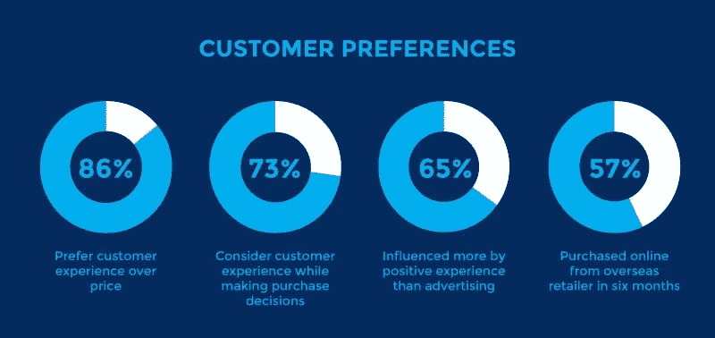
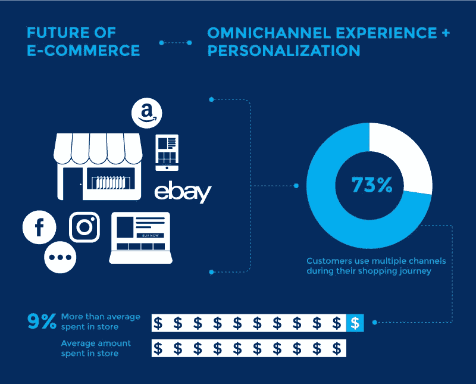

# NetSuite 云 ERP-电子商务集成如何改善客户体验

> 原文：<https://medium.datadriveninvestor.com/how-netsuite-cloud-erp-ecommerce-integration-improves-customer-experience-ad8b1ab683a?source=collection_archive---------19----------------------->

# NetSuite ERP 电子商务集成

电子商务业务在全球范围内稳步增长。根据 eMarketer 的报告，到 2021 年，全球零售电子商务销售额将创下新高。与 2014 年的 1.3 万亿美元相比，预计到 2021 年将达到 4.9 万亿美元。全渠道购物、个性化和更好的客户体验是推动电子商务企业主更多参与和销售的关键因素。

## ERP 电子商务集成全速

> *“一个系统管理你的企业！网店、销售、库存、会计等。”*

**当这成为可能时，所有的头条新闻如下:**

*   实时库存可见性
*   电子商务+ ERP 集成|自动化客户订单

创新历来被视为实现 ERP [好处](https://www.bigcommerce.com/blog/erp-integrations/#the-api-economy-innovation-as-the-crux-for-future-proofing)的最后一步——但很少有品牌走到这一步，更少的品牌能够像亚马逊或一系列新兴的微型品牌那样有效地创新。

 [## 2019 年即将改变世界的技术|数据驱动的投资者

### 很难想象一项技术会像去年的区块链一样受到如此多的关注，但是……

www.datadriveninvestor.com](https://www.datadriveninvestor.com/2019/01/17/the-technologies-poised-to-change-the-world-in-2019/) 

## NetSuite ERPeCommerce 集成如何改善客户体验:

当渠道分散时，大多数实体企业缺乏实时数据访问和准确的库存水平。这会对客户体验造成负面影响。事实上， [33%的](https://beeketing.com/blog/future-ecommerce-2019/)客户已经结束了与个性化程度较低或没有个性化的品牌的关系。

## 了解 NetSuite 电子商务集成如何确保无缝购物和客户体验:

1.  通过自动化流程确保数据的一致性和准确性
2.  实现无障碍导航体验，并促使他们购买
3.  集成消除了报告准备和数据导出中的人工干预
4.  跨多个渠道集中信息。
5.  通过一致的实时数据，集成使企业所有者知道何时将库存从一个位置转移到另一个位置。此外，NetSuite 电子商务集成让您知道如何在各个地区进行营销。它显著改善了销售和客户体验。
6.  自动同步多个电子商务平台之间的数据。

## 全渠道和个性化客户体验的重要性:统计数据

1.  86%的买家愿意为最佳客户体验支付更多费用。[ [1](https://www.superoffice.com/blog/customer-experience-statistics/)
2.  73%的购买者指出客户体验是购买决策的一个重要因素。
3.  65%的购买者认为对品牌的正面体验比伟大的广告更有影响力。
4.  57%的网上购物者表示在过去六个月中曾在海外零售商处进行过网上购物。

*NetSuite 委托 Forrester Consulting 进行的一项新研究显示，62%的中端市场 B2B 卖家在计划电子商务采购时打算采用集成解决方案。*

## 将客户体验作为您的第一要务

电子商务的未来很大程度上取决于个性化。据报道，73%的顾客在购物过程中使用多种渠道。NetSuite ERP- eCommerce 集成允许您了解客户如何购买、他们参与的营销渠道以及购买的驱动因素。据报道，使用 4 个以上购物渠道的顾客在店内的消费很可能会多 9%。

随着电子商务销售的持续增长，企业正在加大投资以实现全渠道体验。由于市场上有过多的信息和竞争对手，很难吸引和赢得客户的期望。

网上顾客很难吸引。他们需要一个吸引人的网站、简单的导航、便捷的订单处理和快捷的支付网关。除此之外，你的网站应该提供所有销售渠道的详细产品描述和库存管理。你与顾客互动越多，取悦顾客越多，你就越有可能从拜访中获得销售额。

来源:[Amzur technologies | NetSuite 咨询合作伙伴](https://amzur.com/blog/netsuite-erp-eCommerce-integration-6-best-ways-to-improve-customer-experience/)