# 神经网络如何爱上计算机硬件

> 原文：<https://medium.datadriveninvestor.com/how-neural-nets-fell-in-love-with-computer-hardwares-79a4617c8f3a?source=collection_archive---------12----------------------->

这篇文章是一个关于神经网络的爱情故事，她是科技行业的热门女演员。她是如何爱上这个多年来一直是技术计算骨干的家伙的。一颗硅心的家伙。

## **为什么神经网络和硬件以前从未相处过？**

神经网络出现在文献中已经超过 80 年了，但在过去的 5-6 年里，研究和商业领域出现了巨大的繁荣，因为我们都知道的原因是缺乏计算能力。直到 1999-2000 年，计算机科学家才在一系列应用(医学领域)中使用 GPU 来加速他们的计算，这导致了[通用 GPU 计算的出现。](https://www.nvidia.com/content/GTC-2010/pdfs/2275_GTC2010.pdf)

## 神经网络的解剖

*   神经网络源于图论，属于图结构学习领域。处于初级水平的神经网络具有完全连接层、卷积层、递归层、子采样层、标准化层和分类层。

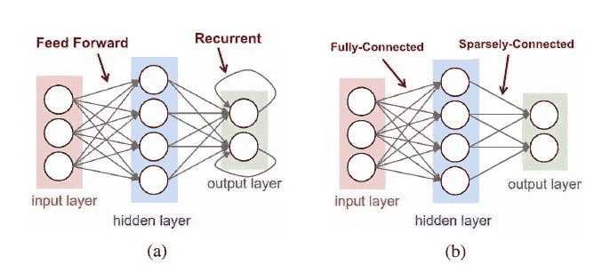

这些层堆叠在一起，形成一个网络架构。我们现在知道的一些著名的网络架构有 LeNet、Alexnet、VGGNet、Resnet、InceptionNet、PyramidNet、XceptionNet 和 ZFNet。

*   除了这些基于卷积层的架构之外，我们还有用于顺序数据的基于连接的循环网络，一些著名的网络包括基于 RNN GRU 的单向网络、基于 and some 的单向网络和基于 data and 的定向网络 Transformers。
*   相比之下，循环神经网络(RNNs)，其中长短期记忆网络(LSTMs)是一种流行的变体，具有内部记忆，允许长期依赖影响输出。在这些网络中，一些中间操作生成的值存储在网络内部，并作为其他操作的输入，与后面的输入一起处理。
*   为了执行学习，神经网络使用称为反向传播的一阶微分算法，该算法基本上使用微分学的链规则来找出每一层的权重随着作为输出的预测值的变化而变化的速率。

网上有很多关于这些网络的文献可以研究，所以我就不赘述了。我将继续考虑，你知道机器学习和深度学习在不同层次方面的基础。

**在本文中，我们将关注前馈网络，因为
1)RNNs 中的主要计算仍然是加权和
(即矩阵向量乘法)，这由
前馈网络涵盖；2)到目前为止，很少有人关注
专门针对 rnn 的硬件加速。**

现在让我们关注一种叫做卷积神经网络的神经网络来开始这个爱情故事。

## 流行的 CNN 网络

**LeNet**

*   LeNet 是 1989 年引入的第一个 CNN 方法之一。它是为 28 × 28 的灰度图像的数字分类任务而设计的。最著名的版本 LeNet-5 包含两个 CONV 层和两个 FC 层。
*   每个 CONV 层使用大小为 5 × 5 的滤波器(每个滤波器一个通道)，第一层有 6 个滤波器，第二层有 16 个滤波器。每次卷积后使用 2 × 2 的平均池，并使用一个 sigmoid 来表示非线性。
*   **LeNet 总共需要 60，000 个权重和 341，000 个
    乘加(MAC)每张图像。** LeNet 导致了 CNN 的第一次商业成功，因为它被部署在自动取款机上来识别支票存款的数字。

**Alexnet**

*   AlexNet [3]是第一个赢得 2012 年 ImageNet 挑战赛的 CNN。它由五个 CONV 层和三个 FC 层组成。在每个 CONV 层中，有 96 到 384 个滤波器，滤波器大小从 3 × 3 到 11 × 11 不等，每个滤波器有 3 到 256 个通道。
*   在第一层中，滤镜的三个通道对应于输入图像的红色、绿色和蓝色分量。在每一层中使用 ReLU 非线性。3 × 3 的最大池应用于层
    1、2 和 5 的输出。
*   为了减少计算量，在网络的第一层使用步长 4。AlexNet 在 max pooling 之前在第 1 层和第 2 层引入了 LRN 的使用，尽管 LRN 在后来的 CNN 模型中不再流行。
*   将 AlexNet 与 LeNet 区分开来的一个重要因素是
    重量的数量要大得多，并且每层的形状都不相同。为了减少第二 CONV 层中的权重和计算量，第一层的 96 个输出声道被分成第二层的两组 48 个输入声道，使得第二层中的滤波器只有 48 个声道。类似地，第四层和第五层中的权重也被分成两组。
*   AlexNet 总共需要 6100 万个砝码和 7.24 亿台 MAC 来处理一张 227 × 227 的输入图像。

**VGGNet**

*   VGG-16 深入到 16 层，包括 13 个 CONV 层和 3 个 FC 层。为了平衡更深入的成本，较大的过滤器(例如 5 × 5)由多个较小的过滤器(例如 3 × 3)构成，这些过滤器具有较少的权重，以实现相同的有效感受野，如下图所示。因此，所有 CONV 图层都具有相同的 3 × 3 滤镜大小。

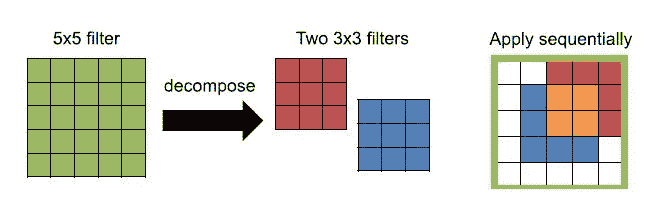

Decomposing larger filters into smaller filters. Constructing a 5x5 support for 3x3 filters.

*   总的来说，VGG-16 需要 1.38 亿个砝码和 15.5G MACs 来处理一个 224 × 224 的输入图像。VGG 有两种不同的型号:VGG-16(在此描述)和 VGG-19。VGG-19 给出了比 VGG-16 低 0.1%的 top-5 错误率，代价是多 1.27 倍的 MAC。

**谷歌网**

*   GoogLeNet 更深入，有 22 层。它引入了一个由并行连接组成的初始模块，而以前只有一个串行连接。

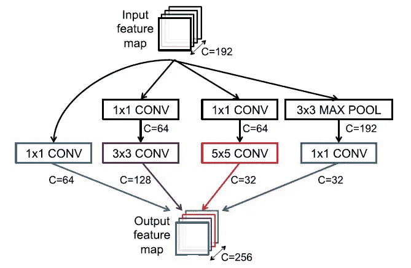

Inception module from GoogleNet

*   不同尺寸的滤波器(即 1 × 1、3 × 3、5 × 5)以及 3 × 3 最大池用于每个并联连接，其输出连接成模块输出。使用多种过滤器大小具有在多种尺度下处理输入的效果。

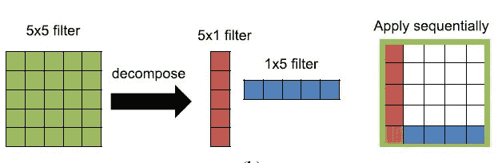

Constructing a 5×5 support from 1×5 and 5×1 filter. Used in GoogleNet/Inception v3 and v4.

*   为了提高训练速度，Google-net 的设计使得在训练过程中为反向传播存储的权重和激活度都可以放入 GPU 内存中。
*   为了减少权重的数量，1 × 1 滤波器被用作减少每个滤波器的通道数量的“瓶颈”。这 22 层包括三个 CONV 层，随后是九个 inceptions 层(每个层有两个 CONV 层深)和一个 FC 层。

**ResNets**

*   ResNet，也称为 Residual Net，使用剩余连接可以更深入(34 层或更多)。这是 ImageNet 挑战赛中第一个超过人类水平准确性的参赛 DNN，前 5 名的错误率低于 5%。深度网络的挑战之一是训练期间梯度的消失:随着误差通过网络
    反向传播，梯度缩小，这影响了在非常深的网络的早期层中更新
    权重的能力。
*   快捷模块学习残差映射[F(x)= H(x)-x]，而不是学习权重层 F(x)的函数。最初 F(x)为零，取恒等式连接；然后在训练过程中逐渐使用通过权重层的实际前向连接。

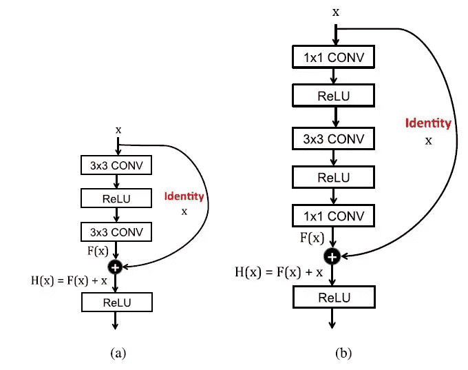

Shortcut module from ResNet

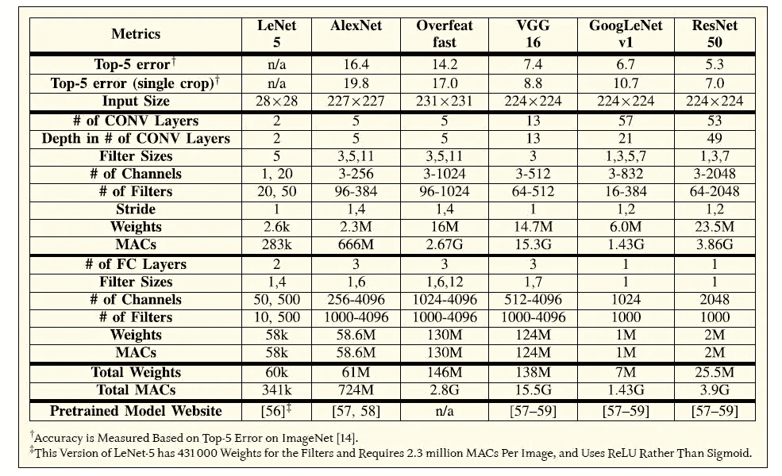

# 用于 DNN 处理的硬件

*   Conv 和 FC 层的基本概念都是乘法和累加( [MAC](https://en.wikipedia.org/wiki/Multiply%E2%80%93accumulate_operation) )运算。需要对这些 MAC 操作进行优化，以便更快地计算 DNNs。
*   有两种硬件架构，空间和时间架构。时态架构主要出现在 CPU 和 GPU 中，并采用各种技术来提高并行性，如向量( [SIMD](https://www.sciencedirect.com/topics/computer-science/single-instruction-multiple-data) )或并行线程( [SIMT](https://medium.com/@valarauca/wtf-is-a-simd-smt-simt-f9fb749f89f1) )。

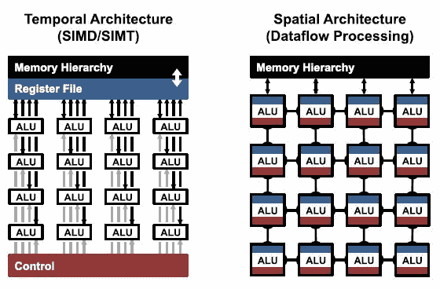

*   **时序架构**对大量[alu](https://study.com/academy/lesson/arithmetic-logic-unit-alu-definition-design-function.html)使用集中控制。这些 alu 只能从内存层次结构中获取数据，并直接相互通信。
    对于 CPU 和 GPU 等时态架构，内核上的计算变换可以减少乘法次数，提高吞吐量。
*   **空间架构**使用数据流处理，即 alu 形成一个处理链，以便它们可以直接将数据从一个传递到另一个。空间架构通常用于 ASICs 和 FPGAs 中的 dnn。
    为空间加速器。我们将讨论数据流如何增加存储器层次结构中低成本存储器的数据量，从而降低能耗。

## 加速 CPU 和 GPU 平台上的内核计算

*   CPU 和 GPU 使用 SIMD 和 SIMT 等并行化技术来并行执行 MAC。所有 alu 共享相同的控制和存储器。
*   在这些平台上，操作被映射到矩阵乘法(内核计算)。
*   下面是矩阵和向量乘法以及矩阵和矩阵乘法的图示。
    下面的输入张量的高度代表通道的数量，宽度代表每个通道的二维特征图中的元素数量。

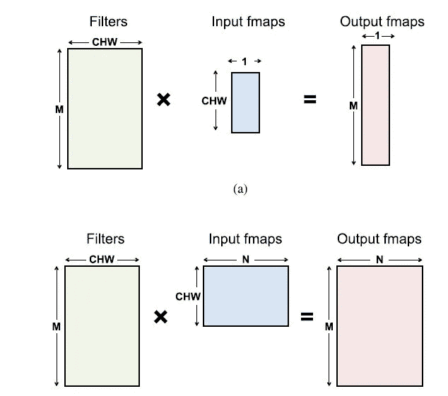

*   **卷积层的矩阵乘法:** 输入的特征映射矩阵中有冗余数据。这要么导致存储效率低下，要么导致复杂的内存访问模式。
    我们使用[托普利兹](https://en.wikipedia.org/wiki/Toeplitz_matrix)矩阵来有效映射 conv 层中的冗余特征。

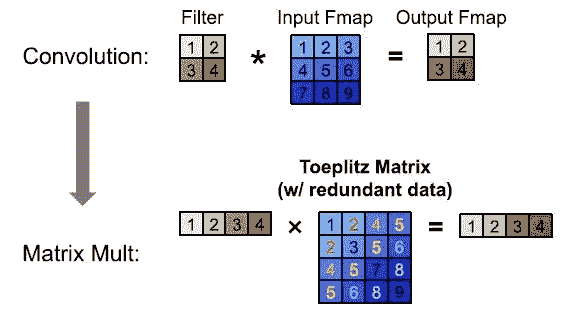

*   这些平台上的矩阵乘法可以通过对数据应用计算变换来进一步加速，以减少乘法次数，同时给出相同的逐位结果。
*   **快速傅立叶变换:** [快速傅立叶变换](https://www.google.com/search?q=fast+fourier+transform+matrix+multiplication&oq=fast+fourier+transform+for+matri&aqs=chrome.2.69i57j0l7.10781j1j7&sourceid=chrome&ie=UTF-8#kpvalbx=_b54-Xq3NKP2P4-EP0JOpuA418)将乘法次数从
    O( No *Nf)减少到 O( No *log2*No)，其中
    输出大小为 No× N o，滤波器大小为 Nf×N f。
    我们对滤波器和输入特征图进行 FFT，然后在频域中执行乘法，然后将逆 FFT 应用于
    所得乘积，以在空间域中恢复输出特征图。
    傅里叶变换的问题:
    1)FFT 的好处随着滤波器尺寸的增大而减小。
    2)FFT 的大小取决于输出特征图的大小，它通常比滤波器大得多。
    3)频域中的系数是复数。因此，虽然 FFT 减少了计算，但它需要更大的存储容量和带宽。
*   [**铜匠-威诺格拉算法**](https://blog.usejournal.com/understanding-winograd-fast-convolution-a75458744ff) **:** 该算法是快速矩阵乘法方法之一。Winograd 的算法将变换应用于特征图和滤波器，以减少卷积所需的乘法次数。Winograd 是逐块应用的，乘法运算的减少因滤波器和块大小而异。较大的块大小以较高复杂度的变换为代价导致乘法的较大减少。一个特别吸引人的滤波器尺寸是 3 × 3，在计算一个 2 × 2
    输出的块时，可以将乘法次数减少 2.25 倍。
*   [**斯特拉森算法**](https://stanford.edu/~rezab/classes/cme323/S16/notes/Lecture03/cme323_lec3.pdf) **:** 斯特拉森算法也被探索用于减少 DNNs 中的乘法次数。它以递归方式重新安排矩阵乘法的计算，将乘法次数从 O( N)减少到 O( N ^2.807)。然而，Strassen 的好处是以增加存储需求和有时降低数值稳定性为代价的。

**一般来说，FFT 用于滤波器>5×5
wino grad，Strassen 用于滤波器<3×3**

## 面向加速器的高能效数据流

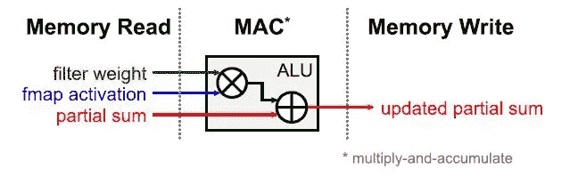

*   DNNs 的处理瓶颈在于内存访问。每个 MAC 需要三个存储器访问过滤器权重、fmap 激活、用于存储器读取的部分求和以及用于存储器写入的一个操作。
*   目标是开发一种架构，减少从 DRAM 访问存储器的次数。因为 DRAM 存储器访问是能量昂贵的。
*   如上所述的诸如空间架构之类的加速器通过引入具有不同能量成本的不同级别的本地存储器层级来降低数据移动的能量成本。
*   连接 DRAM 和内部 PE(处理元件)网络的全局缓冲器的大小增加了。它可以在 alu 和每个 PE 内的寄存器文件之间传递几千字节大小的数据。这种多级存储器体系通过提供低成本数据访问来帮助提高能量效率。

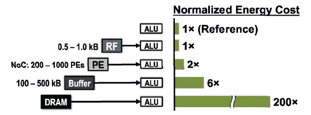

*   上图显示了从不同级别到 ALU 的内存访问的能耗，DRAM 到 ALU 的能耗是 ALU 访问的 200 倍。

以下是不同的空间架构，用于提高内存访问的能效。

1.  **权重固定(WS):** 通过最大化 PE 对寄存器文件中权重的访问，最小化读取权重的能耗。每个权重从每个 PE 的 DRAM 访问到 RF，并在那里保持不变以供进一步访问。它最大化权重的卷积和滤波器重用。输入和部分和必须在空间数组和全局缓冲区中移动。

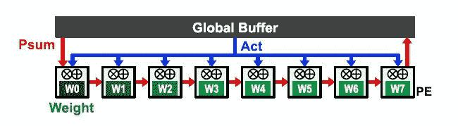

2.**输出固定(OS):**

*   它将相同输出激活
    值的部分和的累加保持在 RF 本地。为了在 RF 中保持部分和的累积稳定，一种常见的实现方式是使输入激活流过 PE 阵列，并将权重广播给阵列中的所有 PE。

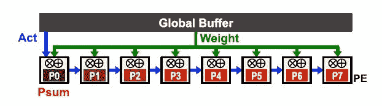

*   有多种输出稳定变量，即 OSa、OSb 和 OSc。变体 OS A 以 CONV 层的处理为目标，因此一次专注于来自相同信道的输出激活的处理，以便最大化卷积数据重用机会。变体 OS C 以 FC 层的处理为目标，并专注于从所有不同的通道生成
    输出激活，因为每个通道只有一个输出激活。

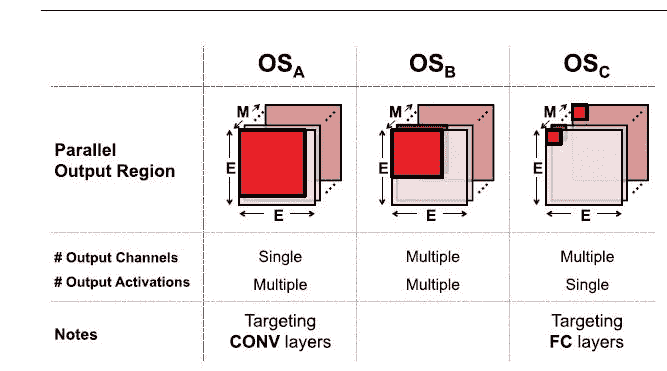

3.**没有本地重用(NLR):**

*   在这种体系结构中，我们有一个更大的全局缓冲区，没有本地存储添加到 PE 中。这种架构侧重于增加存储容量和最小化片外存储器带宽。

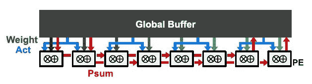

4.**行固定(RS):**

*   在中提出了一种行静态数据流，旨在最大化所有类型数据(权重、像素、部分和)在 RF 级别的重用和累积，以提高整体能效。
*   它在 PE 的 RF 内保持滤波器权重行静止，然后将输入激活流式传输到 PE。PE 一次对每个滑动窗口执行 MAC，这仅使用一个存储空间来累加部分和。由于在不同的滑动窗口之间存在输入激活的重叠，因此输入激活可以被保存在 RF 中并被重新使用。

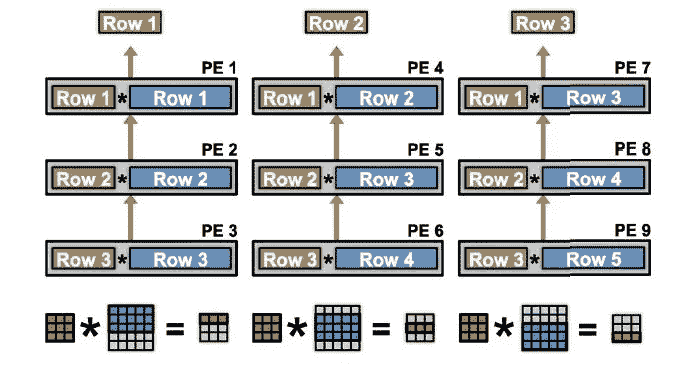

**不同数据流的能量比较**

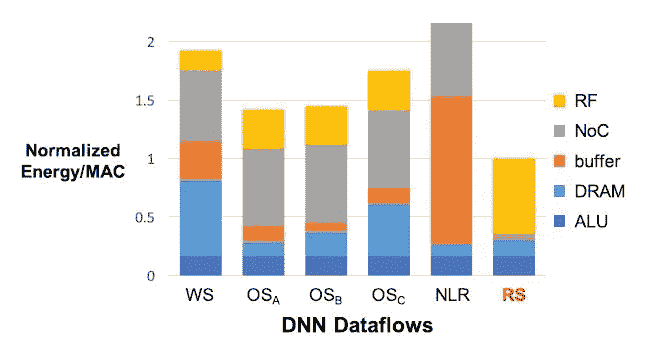

*   WS 和 OS 数据流分别具有访问权重和部分和的最低能耗。然而，RS 数据流具有最低的总能耗，因为它针对整体能效进行了优化，而不是仅针对特定的数据类型。

## 内存中的处理/内存中的逻辑

*   虽然存在空间架构来使存储器访问高效。还有另一种体系结构，它将内存移动到靠近处理单元的位置，这样数据的移动可以最小化。使用混合信号电路设计和先进的存储技术可以帮助我们减少数据移动。

**嵌入式 DRAM (eDRAM)**

*   它带来了高密度的片上存储器，以避免切换片外电容的高能源成本。eDRAM 的密度
    比 SRAM 高 2.85 倍，能效比 DRAM
    (DDR3)高 321 倍。
*   在 DNN 处理中，eDRAM 可用于在芯片上存储数十兆字节的权重和激活，以避免芯片外访问。eDRAM 的缺点是密度比片外 DRAM 低，会增加
    芯片成本。

**3D 内存**

*   DRAM 也可以使用硅通孔([tsv](https://semiengineering.com/knowledge_centers/packaging/advanced-packaging/through-silicon-vias/))堆叠在芯片顶部。这项技术通常被称为 3-D 存储器，并且已经以[混合存储立方体](https://www.allaboutcircuits.com/industry-articles/hybrid-memory-cubes-what-they-are-and-how-they-work/) (HMC)和高带宽存储器(HBM)的形式商业化。相对于现有的 2-D dram，三维存储器提供了高一个数量级的带宽，并减少了高达 5 倍的访问能量，因为 tsv 的电容低于典型的片外互连。
*   [俄罗斯方块](https://web.stanford.edu/~mgao12/pubs/tetris.asplos17.pdf)探索了 HMC 与 [Eyeriss 空间架构](https://dl.acm.org/doi/abs/10.1145/3007787.3001177)和行静态数据流的使用。它提出为计算分配比片上存储器更多的区域(即，更大的 PE 阵列和更小的全局缓冲器)，以便利用 HMC 的低能量和高吞吐量特性。它还调整数据流，以适应 HMC 存储器和较小的片上存储器。与采用传统二维 DRAM 的基准系统相比，俄罗斯方块的能耗降低了 1.5 倍，吞吐量增加了 4.1 倍

**另一种减少数据移动的方法是让计算机靠近内存，而不是让内存靠近计算机。**

乘法和累加操作可以直接集成到 SRAM 阵列的位单元中。

**非易失性电阻存储器**

*   乘法和累加操作也可以直接集成到高级非易失性高密度存储器中，将其用作可编程电阻元件，通常称为[忆阻器](https://www.memristor.org/reference/research/13/what-are-memristors)。

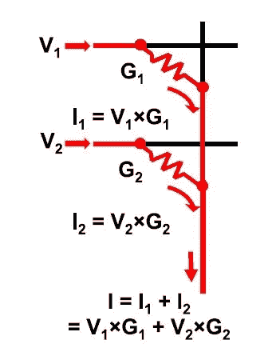

如图所示，以电阻的电导作为权重，电压作为输入，电流作为输出，执行乘法运算。加法是通过用基尔霍夫电流定律对不同忆阻器的电流求和来完成的。这是权重静态数据流的最终形式，因为权重总是保持在适当的位置。这种方法
的优势包括降低能耗，因为计算嵌入在内存中，减少了数据移动，以及增加密度，因为内存和计算可以以类似于 DRAM 的密度密集封装。

*   有几种流行的非易失性电阻存储器件，如[相变存储器](https://www.enterprisestorageforum.com/storage-hardware/phase-change-memory.html) (PCM)、电阻 RAM ( [RRAM](https://www.webopedia.com/TERM/R/resistive_memory_reram_rram.html) 或 ReRAM)、导电桥 RAM ( [CBRAM](http://iopscience.iop.org/article/10.1088/0268-1242/31/11/113001/ampdf) )和自旋转移力矩磁性
    RAM ( [STT-MRAM](https://www.mram-info.com/stt-mram) )。
*   用非易失性电阻存储器进行处理有几个缺点。首先，它会受到模拟处理精度降低和 ADC/DAC 开销的影响。第二，阵列大小受到连接电阻器件的导线的限制；具体来说，对于大型阵列(如 1000 × 1000)，导线能量占主导地位，沿导线的 IR 压降会降低读取精度。第三，对电阻器件进行编程的写入能量可能
    很昂贵，在某些情况下需要多个脉冲。最后，阻性器件也会受到器件间干扰的影响。

# **DNN 模型和硬件的代码设计**

*   在网络的计算效率和准确性之间总是有一个折衷。当开发这样的网络时，在任何一个方面都有一个折衷。
*   因此，我们的目标不仅是大幅降低能耗
    和增加吞吐量，还包括最大限度地降低精度。
*   协同设计方法可以大致分为以下几类
    :
    ；降低运算和操作数的精度(这
    包括从浮点到定点、
    降低位宽、非均匀量化和
    权重共享)；
    减少操作数量和模型大小(此
    包括压缩、修剪、
    和紧凑网络架构等技术)。

## 降低精度

*   **量化**涉及将数据映射到一个较小的量化级别集合。最终目标是最小化来自量化级别的重构数据和原始数据之间的误差。
*   量化级数反映了精度，并最终反映了表示数据所需的位数(通常是级数
    的对数 2)；因此，精度降低是指减少级数，从而减少位数。
*   量化基本上包括减少比特数来表示权重值(最初)，但是现在焦点已经转移到量化激活函数上。
*   目前，大多数研究都是针对权重的量化和推理的激活，因为梯度训练对量化技术高度敏感。

## **均匀量化**

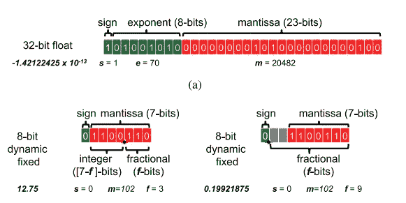

*   如上图所述，浮点数是用比特来表示的。它有三个部分，尾数、指数和符号。在 32 位浮点表示中，1 位分配给符号，8 位分配给指数，23 位分配给尾数。
*   N 位定点数可以用(1)s×m×2 f
    表示，其中 s 是符号位，m 是(N-1)位尾数，f 决定小数点的位置并作为比例因子。
*   上图第二部分显示了**动态定点表示**，其中小数点可以根据 f 的值移动。在中，我们使用 7 位作为尾数，如果我们使用 f=3，则我们使用 3 位作为小数，4 位作为整数。
*   动态定点表示允许 f 根据期望的动态范围根据
    变化。这对于 DNNs 很有用，因为权重和激活的动态范围可能非常不同。此外，动态范围也可以随着层和层类型而变化。使用动态定点，可以将权重的位宽减少到 8 位，将激活的位宽减少到 10 位，而无需对权重进行任何微调。通过微调，权重和激活都可以达到 8 位。

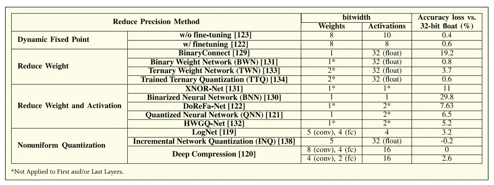

上表显示了权重和激活的位数的不同精度方法，还指出了精度降低时的精度损失。

**定点展示的能耗和面积影响**

> 8 位定点加法比 32 位定点加法消耗的能量少 3.3 倍(面积少 3.8 倍)，比 32 位浮点加法消耗的能量少 30 倍(面积少 116 倍)。定点加法的能量和面积与位数近似成线性比例
> 。
> 
> 8 位定点乘法器比 32 位定点乘法器消耗能量少 15.5 倍(面积少 12.4 倍)，比 32 位浮点乘法器消耗的能量少 18.5 倍(面积少 27.5 倍)。定点乘法的能量和面积与位数近似成二次方比例。

**然而，应当注意，从浮点变为定点，而不减少位宽，并不减少存储器的能量或面积成本。**

**二进制量化**

*   精度甚至可以更积极地降低到一位；这个研究领域通常被称为二元网络。二进制权重(即 1 和 1)使用二进制权重将 MAC 中的乘法运算简化为加法和减法运算。

**三进制量化**

*   三元量化将权重限制为 3 个值-1，0，+1。虽然
    与二进制
    权重相比，这需要每权重一个额外的比特，但是可以利用权重的稀疏性来降低
    计算和存储成本，这可以潜在地抵消
    额外比特的成本。
*   已经开发了许多使用二进制和三进制量化技术的网络，例如[三进制权重网络](https://arxiv.org/abs/1605.04711)(TWNs)[训练三进制量化(TTQ)](https://arxiv.org/abs/1612.01064) 、[约丹](https://arxiv.org/abs/1606.05487)使用二进制权重，而[布雷因](https://arxiv.org/pdf/1806.07550.pdf)使用二进制权重和激活。SRAM 工作中的计算也使用二进制权重。最后，名义上受 spike 启发的 [TrueNorth 芯片](http://www.research.ibm.com/articles/brain-chip.shtml)可以使用 TrueNorth 的量化权重，通过二进制激活和三进制权重来实现精度降低的神经网络。

## **非均匀量化**

*   已经表明，权重和激活的分布是不均匀的，因此，当级别之间的间隔变化时，不均匀量化可以潜在地提高准确性。

**对数域量化**

*   如果基于对数分布来分配量化级别，则权重和激活在不同级别上更平均地分布，并且每个级别被更有效地使用，从而导致更少的量化误差。例如，使用 4 b 和统一量化
    会导致 27.8%的精度损失，相比之下，VGG-16 的 log base-2 量化会导致 5%的精度损失。
*   [增量网络量化(INQ)](https://arxiv.org/abs/1702.03044) 通过将大小权值分成不同的组，然后迭代量化和重新训练权值，可以进一步降低精度损失。

**学习量化或权重分配**

*   权重共享强制几个权重共享一个值；这减少了过滤器或层中唯一权重的数量。可以使用散列函数或 k-means 算法对权重进行分组，并且为每组分配一个值。
*   然后构建码本，以将每组权重映射到其共享值。
    因此，为滤波器中的每个位置存储码本中对应组的索引，而不是权重值。
*   注意，与之前的量化方法不同，权重共享方法不会降低 MAC 计算本身的精度
    ，只会降低权重存储要求。

## **减少操作次数和模型尺寸**

对于减少运算次数和模型大小的方法已经有了大量的研究。

**利用激活统计**

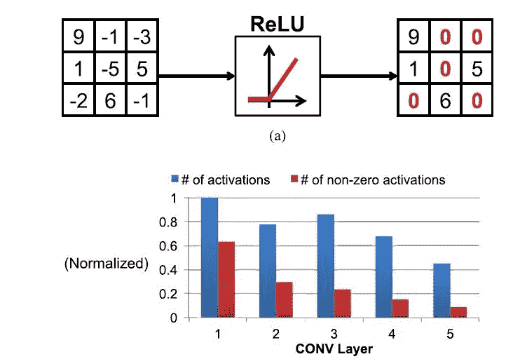

*   ReLU 是 DNNs 中常用的非线性形式，它将所有负值设置为零。因此，ReLu 操作后的输出激活是稀疏的。Alexnet 中的特征图稀疏度在 19%到 63%之间，如边上的图表所示。
*   可以利用这种稀疏性，通过压缩节省能量和面积，特别是对于昂贵的片外 DRAM 访问。
*   除了压缩之外，还可以修改硬件，以便
    跳过读取权重和执行零值激活的 MAC，从而降低 45%的能源成本。除了选通读取和 MAC 计算，硬件还可以跳过该周期，将吞吐量提高 1.37 倍。

**网络修剪**

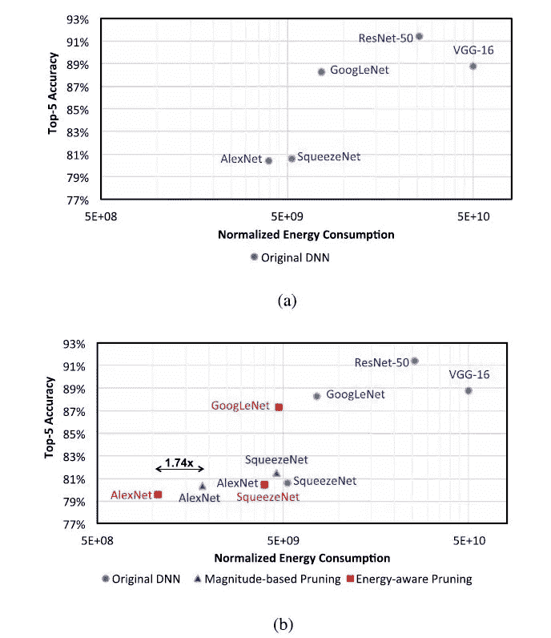

*   为了使网络训练更容易，网络通常被过度参数化。因此，网络中的大量权重是冗余的，并且可以被移除(即设置为零)。这个过程称为网络修剪。
*   低显著性权重被移除，剩余的权重被微调；重复这一过程，直到达到所需的重量减轻和精度。
*   可以使用能量评估方法来估计 DNN 能量，该能量考虑了来自存储器分级结构的不同级别的数据移动、MAC 的数量以及数据稀疏性。
*   **能量感知修剪**可用于根据能量修剪权重，以将 AlexNet 所有层的总能量减少 3.7 倍，比基于幅度的方法效率高 1.74 倍。

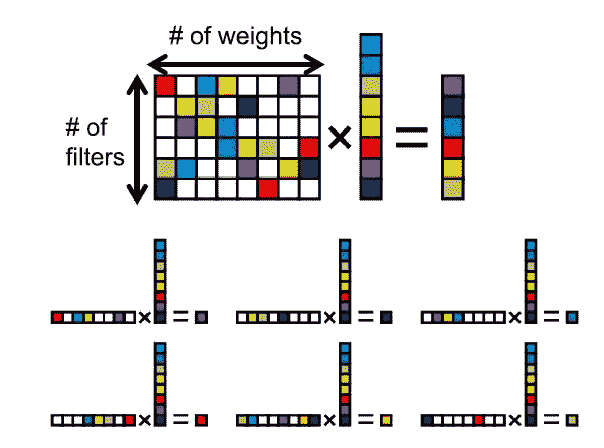

*   一个感兴趣的领域是如何在修剪后最好地存储稀疏权重。当 DNN 处理作为矩阵向量乘法执行时，一个挑战是确定如何以压缩格式存储稀疏权重矩阵。压缩可以按行或列顺序应用。**压缩稀疏行(CSR)** 格式通常用于执行稀疏矩阵-向量乘法。然而，由于矩阵的每一行都是稀疏的，即使只使用了输入向量的一个子集，也需要多次读取输入向量。

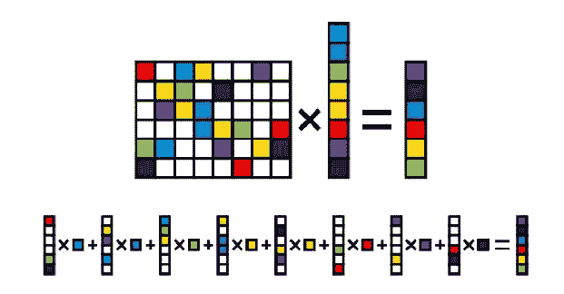

*   **可使用压缩稀疏列(CSC)格式**，其中输出更新数次，一次仅读取输入向量的一个元素。如果输出小于输入，或者在 DNN 的情况下，如果滤波器的数量没有明显大于滤波器中的权重数量[C × R × S]，CSC 格式将提供比 CSR 更低的整体存储器带宽。因为这通常是真的，CSC 可以是稀疏 DNN 处理的有效格式。
*   最近的工作还探索了使用结构化修剪来避免对定制硬件的需要。结构化修剪涉及修剪
    组权重(也称为粗粒度修剪)，而不是修剪单个权重(也称为细粒度修剪)。
*   结构化修剪的好处如下:1)得到的权重可以更好地与现有通用硬件中的数据并行架构(例如，SIMD)一致，这导致更有效的处理；以及 2)它分摊了跨一组权重发信号通知非零权重的
    位置所需的开销成本，这改进了压缩，从而降低了存储成本。

**紧凑型网络架构**

*   **训练前**:在最近的 DNN 车型中，宽度和高度较小的过滤器使用得更频繁，因为将几个过滤器串联起来可以模拟更大的过滤器。例如，一个 5 × 5 卷积可以用两个 3 × 3 卷积代替。或者，一个 N × N 卷积可以分解成两个 1-D 卷积，一个
    1 × N 和一个 N × 1 卷积。这基本上施加了二维滤波器必须是可分离的限制，这是图像处理中的常见约束。
    同样，一个三维卷积可以用一组二维卷积(即仅应用于一个输入通道)来代替，后面是 1 × 1 三维卷积，如 Xception 和 MobileNets 所示。二维卷积和 1 × 1 -3D 卷积的顺序可以互换。
    1 × 1 卷积层也可用于减少给定层的输出特征图中的通道数量，这减少了滤波器通道的数量，从而减少了
    下一层中滤波器的计算成本。
*   **训练后:**张量分解可用于分解已训练网络中的滤波器，而不会影响精度。它将层中的权重视为四维张量，并将其分解为更小张量的组合(即几层)。然后可以应用低秩近似，以精度下降为代价进一步提高压缩率，精度下降可以通过微调权重来恢复。
    **正则多元分解，奇异值分解的高阶扩展，可以通过各种方法求解，或者非线性最小二乘法。将 CP 分解与低秩近似相结合，在 CPU 上实现了 4.5 倍的加速。**

****知识蒸馏****

*   **这种技术试图从经过训练的更大的网络(教师)中创建一个更小的网络(学生)。因此，学生网络可以达到用相同的数据集直接训练时无法达到的精度。**

**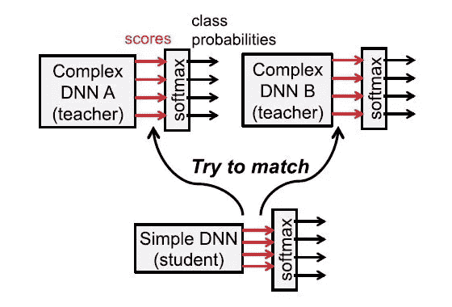**

*   **对于该知识提炼方法，教师 DNN(或教师 DNN 的集合)的班级分数被用作目标，并且目标是最小化目标和学生 DNN 的班级分数之间的平方差。类分数而不是类概率被用作目标，因为 softmax 层通过将相应的类概率推向 0 来消除小类分数中包含的重要信息。或者，如果 softmax 被配置为生成更平滑的类别概率分布，更好地保留小类别分数，则类别概率可以
    用作目标。**

# ****如何量化硬件和神经网络之间的化学作用(基准评估指标)？****

*   **当在电池容量有限的嵌入式设备(例如，智能手机、智能传感器、无人机和可穿戴设备)的边缘处理 dnn 时，或者在由于冷却成本而具有严格功率上限的数据中心的云中处理 dnn 时，能量和功率都很重要。由于延迟、隐私或通信带宽限制，对于某些应用，边缘处理优于云。**
*   ****高吞吐量**是为导航和机器人等交互式应用提供实时性能所必需的。随着可视化数据量呈指数级增长，高吞吐量大数据分析变得非常重要，尤其是在需要根据分析采取行动的情况下。**
*   ****低延迟**是实时交互应用所必需的。延迟衡量像素到达系统和产生结果之间的时间。延迟以秒为单位，而吞吐量以操作数/秒为单位。**

> **硬件成本在很大程度上取决于片上存储量和内核数量。典型的嵌入式处理器具有大约几百千字节的有限片上存储。由于片内存储器数量和外部存储器带宽之间存在权衡，因此两个指标都应该报告。同样，内核数量和吞吐量之间也存在相关性。此外，虽然一个芯片上可以构建多个内核，但应该报告在给定时间内实际可以使用的内核数量。**

## **DNN 模型的指标**

*   **该模型在 ImageNet 等数据集上前 5 名错误方面的准确性。**
*   **应报告模型的网络架构，包括层数、过滤器尺寸、过滤器数量和通道数量。**
*   **权重的数量会影响模型的存储要求，因此应予以报告。**
*   **应报告需要执行的 MAC 数量，因为它在一定程度上表明了给定 DNN 的操作数量和潜在吞吐量。**

## **DNN 硬件的指标**

*   **应提供 DNN 模型规范，包括测量期间硬件支持哪些层和位精度。**
*   **需要提到 DRAM 或片外访问的数量。可以根据每次推理在片外读取和写入的数据总量进行报告。**
*   **延迟和吞吐量应该按照批处理大小和各种 DNN 模型的实际运行时间来报告，这说明了映射和内存带宽的影响。**
*   **芯片的成本取决于面积效率，面积效率考虑了存储器(例如寄存器或 SRAM)的大小和类型以及控制逻辑的数量。**

**我想我已经给了你们很多需要消化的内容。但肯定的是，这个故事只是冰山一角，在这个领域已经有了很多有前途的东西，使人工智能计算最接近人类互动。**

## **承认**

*   **硬件调查论文:[https://people . csail . MIT . edu/emer/papers/2017.12 . pieee . dnn _ hardware _ survey . pdf](https://people.csail.mit.edu/emer/papers/2017.12.pieee.DNN_hardware_survey.pdf)**
*   **https://www.youtube.com/watch?v=WbLQqPw_n88**