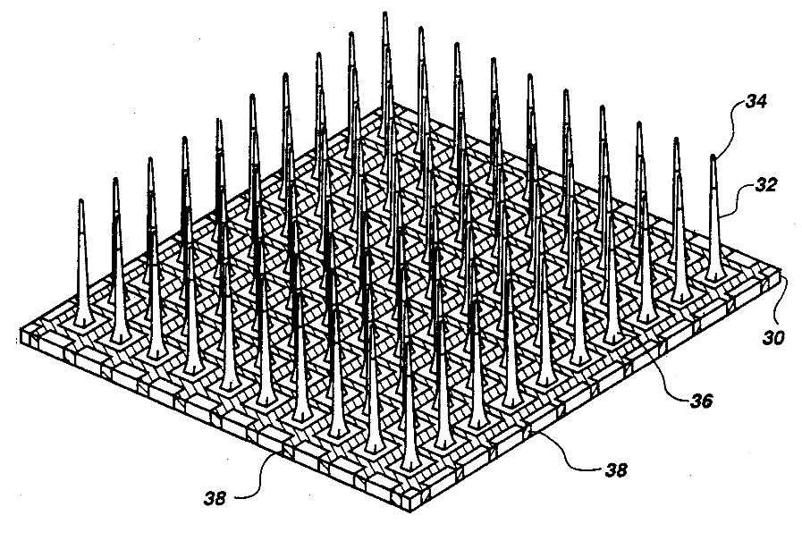
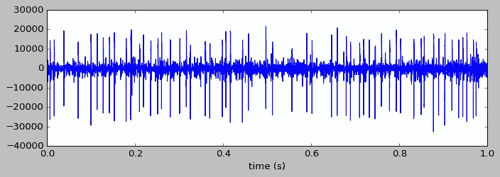
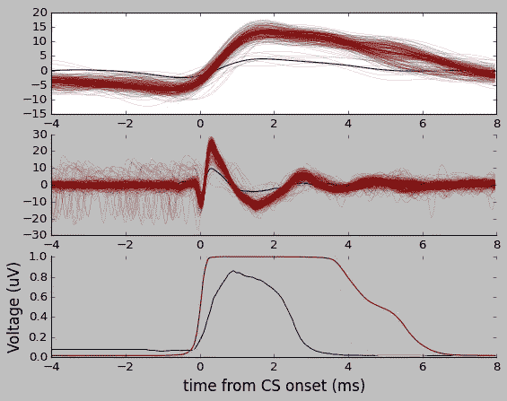
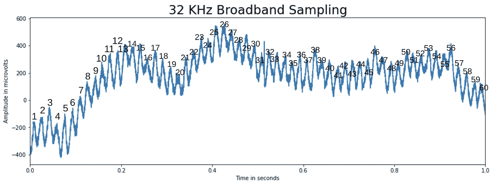
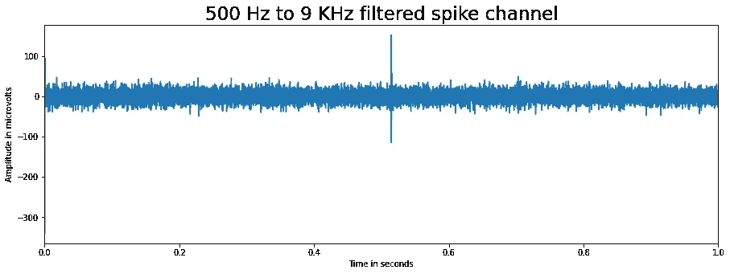
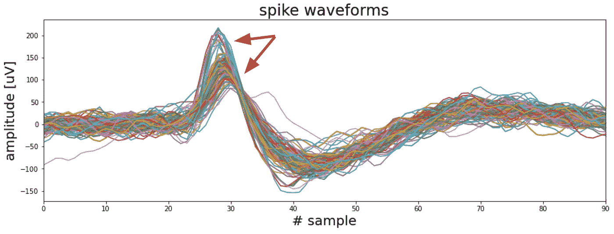
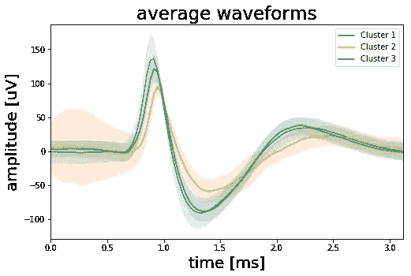

# Neuralink 如何分析你的大脑

> 原文：<https://medium.datadriveninvestor.com/how-neuralink-analyzes-your-brain-b9b7a6b3f61e?source=collection_archive---------3----------------------->

## 定义和探索神经尖峰分析。


Photo by [Leo Roomets](https://unsplash.com/@papaleo?utm_source=medium&utm_medium=referral) on [Unsplash](https://unsplash.com?utm_source=medium&utm_medium=referral)

Neuralink 版是一种电子植入物，由进入你大脑的微小导线(碳化硅微丝)组成，每根导线包含许多电极，共有 1024 个通道。在 Neuralink 之前，植入式脑机接口的行业基准是犹他阵列(一种硅微电极阵列)，仅包含 100 个通道。

犹他阵列看起来像你头上的一组大盒子，由医学专家侵入性地植入，而 Neuralink 是隐形的，由机器人在不到一个小时内自动安装。



Richard A. Normann’s US Patent #5,215,088\. Three-dimensional electrode device. Public domain.

## 写作

Neuralink 的每个通道都具有同步读/写能力，每个电极可能达到一千到一万个神经元，这样就可以写入数百万个神经元。Neuralink 的未来版本预计会好几个数量级。让我们想象一下，Neuralink v4 有 10 万个通道，理论上它可以向多达 10 亿个神经元写入数据。

## 阅读

神经元通过传播“动作电位”进行交流，也称为“神经尖峰”Neuralink v0.9 中的 1024 个微电极可以测量这些神经尖峰。Neuralink 的定制 ASIC 然后进行棘波分类，以分离神经元的活动，包括棘波检测和将棘波分配给特定的神经元。据推测，他们使用 AI 来跟踪具有神经数据的通道(并丢弃噪声通道)，然后自动找到特征形状。

# 探索当前模型

由于我们无法深入了解 Neuralink 的人工智能模型在引擎盖下是如何工作的，所以让我们看看公共神经人工智能模型，如[spike depector](https://iopscience.iop.org/article/10.1088/1741-2552/ab1e63)实际上是如何工作的。概括地说，创建 SpikeDeeptector 需要三个步骤:

*   收集并标记尖峰数据。
*   训练 DNN 来检测和分类通道(如神经或噪声)。
*   做推论(对植入微电极的患者在线运行模型)。

SpikeDeeptector 使用了来自植入了上述犹他阵列的四肢瘫痪患者和植入了深度电极以准备癫痫手术的患者的数据。使用微丝的患者有 8-16 个电极，而使用双犹他阵列的患者有 196 个电极(两个 10x10 的网格，其中四个角电极在一个阵列中保持不连接)。犹他阵列电极只有大约一毫米长，电极间距为 400 米。对于四肢瘫痪患者，数据是在两年多的时间里，每周两到四次面对面的研究中收集的。

由电极收集的模拟电活动以 30 KHz 的采样率被放大和数字化，并且用阈值程序提取棘波事件。检测到的波形由持续时间为 1.6 毫秒的 48 个样本组成，包括阈值之前的 15 个样本和阈值之后的 32 个样本。

SpikeDeeptector 将棘波分类视为监督学习问题，因此需要地面实况标签来训练模型。在一个会话中，一个通道记录数百甚至数千个原始波形。在 136 个记录时段和 8 个时段的情况下，有 3121 万个原始波形对应于神经事件和外部伪影。

数据以半自动方式标记，如下所示:

*   PCA 应用于给定通道中所有检测到的波形。
*   前两个主要成分显示在波形子集上，捕捉最高可变性的方向。
*   高斯混合模型被部署在 PCA 空间中的数据上，以将它们分配给聚类。
*   群集的数量是手动定义的。在视觉上不令人满意的聚类的情况下，波形被手动标记。

在这个阶段，只进行了批次分类，这样，如果所有连接的波形都被标记为非神经活动，则该批次被分类为伪迹，而如果至少有一个神经棘波标记，则该批次被分类为神经事件。

[](https://www.datadriveninvestor.com/2020/09/03/futuristic-tech-neuralink-update/) [## 未来科技:Neuralink 更新|数据驱动的投资者

### 8 月 28 日，埃隆·马斯克提供了他的公司 Neuralink 的最新进展，该公司旨在创造植入式…

www.datadriveninvestor.com](https://www.datadriveninvestor.com/2020/09/03/futuristic-tech-neuralink-update/) 

对于 3121 万个标记波形和一批大小为 20 的波形，有 156 万个标记特征向量。然后，数据被分成训练测试组，并建立了两个模型变体:卷积神经网络(CNN)和 FNN(全连接神经网络)。

两种变体都采用了非新颖的架构细节、正则化、优化和超参数调整。

有趣的是，**这两种变化在从使用微丝**的患者收集的数据上明显更准确(与使用微阵列的患者相反)，即使微丝患者的通道数量少了大约一个数量级。最高的准确率是 98.9%，这是用 CNN 在 microwire 患者身上实现的。

## 探测器

另一个库是 [**D** etect **CS**](https://github.com/jobellet/detect_CS) ，检测复杂尖峰的简称。这是一个更适合的库，因为“复杂尖峰”指的是一个大的、快速的电事件，随后是一个较小幅度尖峰的缓慢尾部。

这是一个特别有趣的库，因为它提出了一种复杂尖峰检测的新方法。复杂的尖峰信号非常罕见，在这种方法之前，准确的检测需要人工视觉检查。

该库使得能够容易地分析电生理信号。例如，下面我们看到一个在 25 KHz 采样的小脑浦肯野细胞的原始宽带信号。


观察“高通”电生理信号揭示尖峰。“高通滤波器”用于滤除低频，通常低于 0.1 赫兹，从而降低噪声。



下面，我们可以看到一个检测到的复杂尖峰信号的例子，其特征是前面提到的大而快的尖峰信号后面跟着一个慢的尾巴。



与 Spike Detector 一样，使用卷积神经网络，而 Alpha Omega 工程多尖峰检测器(MSD)用于在检测器的数据收集过程中对简单尖峰进行实时分类。

## 波浪 Clus

棘波检测和分类的另一个选择是 wave clus，这是一种 Matlab 算法。为了举例说明它的用法，我将遵循这个[教程](https://towardsdatascience.com/using-signal-processing-to-extract-neural-events-in-python-964437dc7c0)，使用一个连续人类单神经元记录的[数据集](https://www2.le.ac.uk/centres/csn/publications-1/Publications/copy_of_Spike_sorting.zip)。

我下载的数据是一个`.ncs`文件，正好是录音系统厂商使用的格式。按照 Neuralynx 的数据格式化指令，我们可以像这样导入数据:

```
header_size = 16 * 1024 # Header has 16 kilobytes length
fid = open('CSC4.Ncs', 'rb')
fid.seek(header_size) # Skip header by shifting position by header size
data_format = np.dtype([('TimeStamp', np.uint64),
                         ('ChannelNumber', np.uint32),
                         ('SampleFreq', np.uint32),
                         ('NumValidSamples', np.uint32),
                         ('Samples', np.int16, 512)])
raw = np.fromfile(fid, dtype=data_format)
fid.close() # Close file 
sf = raw['SampleFreq'][0] # Get sampling frequency 
data = raw['Samples'].ravel() # Create data vector
```

正如我们所见，有一个`SampleFreq`(每秒记录的数据点)和`NumValidSamples`，这意味着我们可以用一个时间向量来绘制信号随时间的变化。首先，让我们创建时间向量。

```
dur_sec = data.shape[0]/sf 
time = np.linspace(0, dur_sec,data.shape[0])
```

这是我们目前的数据:

*   `data.shape[0]`是 61，000，192 行数据
*   `sf`是每秒 32，051 个数据点(赫兹)
*   `dur_sec`(样本长度)因此为**1903 秒**
*   是我们用于绘图的 numpy 数组

让我们用时间向量只画出第一秒**和第二秒**。

```
fig, ax = plt.subplots(figsize=(15, 5))
ax.plot(time[0:sf], data[0:sf])
ax.set_title('32 KHz Broadband Sampling'.format(sf), fontsize=23)
ax.set_xlim(0, time[sf])
ax.set_xlabel('Time in seconds')
ax.set_ylabel('Amplitude in microvolts')
plt.show()
```


有一个明显的循环模式，所以乍看之下我们也许能推断出一些有趣的东西。然而，如果我们计算尖峰信号的数量，我们会发现一秒钟有 60 个尖峰信号——60 赫兹——这等于美国的电源频率。我们看到的只是电子噪音。



虽然令人着迷，但我们希望找到电信号——动作电位只有 1 到 2 毫秒长——而不是噪音。为此，我们将过滤 500 至 9，000 Hz 的原始宽带信号(不包括 60 Hz 噪声)。

```
from scipy.signal import butter, lfilter
def filter_data(data, low=500, high=9000, order=2):
     nyq = sf/2 # Determine Nyquist frequency
     low = low/nyq # Setting bands
     high = high/nyq
     b, a = butter(order, [low, high], btype='band') # Calculate coefficients
     filtered_data = lfilter(b, a, data) # Filter signal
     return filtered_data
```

然后，我们将调用函数来创建新数据。

```
data = filter_data(data)
```

最后，我们可以像以前一样运行相同的图形代码。



不再有任何 60 Hz 的振荡，大约半秒钟后有一个明显的尖峰。因为我们已经在 1 秒内完成了，所以我们可以通过简单地缩放我们的过程来对整个 1，903 秒的数据集进行处理。我们将找到高于某个阈值的数据点，在这些事件上定义一个窗口来突出显示它们，并在它们的峰值高度对齐它们。

首先，我们定义`get_spikes`函数。

现在，我们可以绘制波形图。

这将抑制低于低阈值的频率，如标准电噪声，以及高于高阈值的频率，如较大的电伪像，如正在转动的电灯开关。它显示了从信号中提取的 100 个随机尖峰。



看起来可能有两种类型的波形——一组具有稍早的较高振幅峰值，另一组具有较宽的较低振幅峰值。这些波形很可能是由一个以上的神经元产生的，所以我们也可以将这些波形分成不同的组。

这里有一个完整教程中来自 [GitHub](https://github.com/akcarsten/akcarsten.github.io/blob/master/spike_sorting/Spike_sorting%20.ipynb) 的三个聚类波形的例子，使用 k-means 聚类应用于数据的主要成分。



# 摘要

我们已经探索了一些棘波分析的方法，这是神经科学中一个重要的研究领域。考虑一下 Neuralink 的尖峰分析的复杂性。

一年前，Neuralink 每秒记录 20，000 个样本，分辨率为 10 位，相当于每个芯片每秒 200，000 位(200 Mbps / 200 千位)。在 1，024 个通道的情况下，大约为 204，800 Mbps，通过片内算法压缩了 200 倍，恰好降至 1，024 Mbps 或 1 Gbps。对于蓝牙低能耗无线电，发送到芯片外的数据太多了，因此尖峰检测和分类也在芯片内完成，这样发送到芯片外的信息就少得多。

我们只是触及了表面，Neuralink 的进化肯定会在突破的道路上继续。

**访问专家视图—** [**订阅 DDI 英特尔**](https://datadriveninvestor.com/ddi-intel)