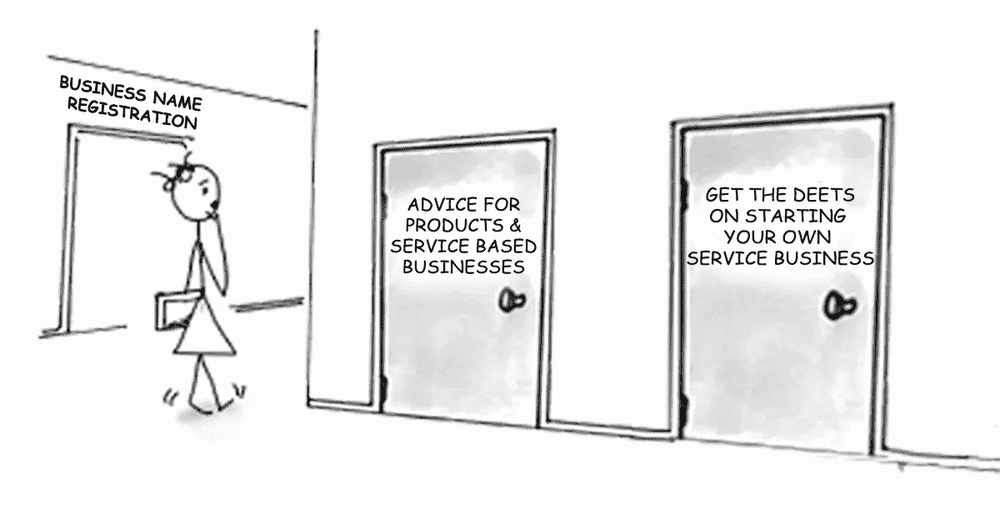

# 利基服务:如何双倍下注？

> 原文：<https://medium.datadriveninvestor.com/how-niching-impacts-your-business-4ef7cdef45d6?source=collection_archive---------18----------------------->

## 单页网站

To specialize **means** you focus on a specific aspect of a larger topic.

“我只知道我擅长什么！当谈到其他事情时，比如“我能在生意中利用什么？”想到这个，我立刻感到沮丧，因为一切都是那么模糊。"

如果你能理解这种情况，你并不孤单。

最近，我认识的一个人分享了他们的兴趣，想找到一种方法，围绕他们已经得到的推荐产生更多的动力。他们觉得这还不够，并且很难找到解决问题的方法。他们所有的工作收入都超过 80，000.00 美元，我询问他们的原因，他们只是说，“更多的钱。”
这似乎总是归结为更多的钱减去为了达到目的需要做出的决定。但是当你提供一项服务时，你的盈利能力也与你的专业知识有关；你擅长做的一件事是为渴望特定结果的特定类型的客户，通常被称为利基。

对于我们大多数人来说，第一次遇到利基市场，至少可以说是不舒服的。总有一种害怕会失去你服务过的蹩脚客户，但暗地里却不想与之有任何瓜葛。但是对于那些对利基市场感兴趣的人来说，不知道你能从你提供的服务清单中得到什么的感觉是利基市场过程变得势不可挡的地方。如果你有这种感觉，那你就错了。利基必须建立在一个未满足的需求，它的工作！你不是为了利基而利基。因此，必须了解做这件事背后的意图，这样才能满怀信心地做好这件事，相信特定的期望会实现。

小型服务企业通常没有大笔预算来投资广告。因此，利基被用来作为一种快速增加你的知名度的方式，在一小群买家中变得非常有价值。但是，只有非常具体地说明你为谁做了什么以及它提供了什么好处，它才会起作用。具有讽刺意味的是，这正是大多数小型服务企业主逃避的部分，然而他们想要可见性。

# 如果它不能阐明你的商业价值，或者让你的工作没有利润可言，那么做将军有什么意义呢？

改变你为谁解决问题，以反映更有利可图的收入，是具体的一个例子，但还有其他方式来具体。我通过为本地客户提供一种特定的上网方式，将我的设计服务定位在单页网站上。

买家错误地投资视觉品牌，认为“伟大的设计会让我赚钱”，好像他们的客户在说[“哦，因为你的网站，我想雇用你，”](http://bit.ly/32BUOYW)我在市场上看到了一个机会，可以满足一个没有得到满足的需求，这让我踏上了利基之路。

对客户来说，这是迈向更大需求的一小步，但美妙之处在于理解、回忆和分享是多么简单。因此，虽然没有人会因为你想提高企业知名度而指责你，但如果没有什么具体的东西来唤起知名度，那就毫无意义了。

与此同时，如果你已经产生了推荐，这意味着你正在做一些人们容易注意到的事情，致力于记忆并与可能需要这项服务的其他人分享。根据我的经验，你可以选择理解它是什么，主张它，培育它，看着它为你带来你想要的结果，而不是凭空捏造，在这个过程中让自己沮丧。

我是 [**、品牌桶**](http://bit.ly/TheBrandTUB) 的创始人和视觉品牌策略师