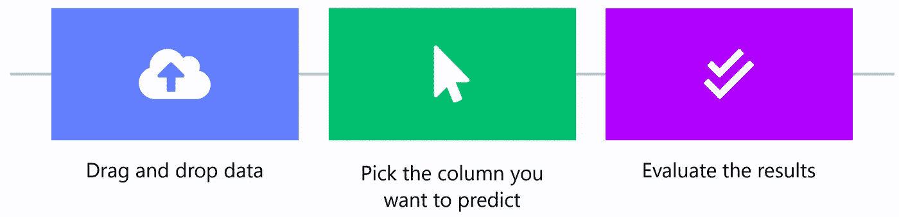

# 无代码人工智能如何用于增加电子商务销售

> 原文：<https://medium.datadriveninvestor.com/how-no-code-ai-can-be-used-to-increase-e-commerce-sales-279a5f36e0f4?source=collection_archive---------32----------------------->

## 三个简单的步骤。

# 背景

20 [数百万个](https://kommandotech.com/statistics/how-many-ecommerce-sites-are-there/)电子商务网站正在创造数万亿美元的收入，向超过 20 亿人出售商品和服务。它比以往任何时候都更具竞争力，尤其是像亚马逊这样的巨头从小商店抢走了销售额。

与此同时，转化你得到的访问者通常是非常困难的，一般的电子商务商店转化的访问者甚至不到 3 %。

鉴于这些压力，电子商务商店需要找到创造性的方法来增加销售额。

# 使用无代码人工智能

购物者每次采取行动时都会创建数据，无论是点击特定产品、打开图片、添加或删除购物车商品、下订单、留下评论、进入或离开网站、输入促销代码，还是无数其他活动。

机器学习可以用来理解所有这些数据，并优化电子商务的关键绩效指标。不管你有什么数据或 KPI，用[显然。AI](http://obviously.ai) 是一个简单的 3 步流程。

# 优化销售

## 化妆品商店

例如，让我们来看看来自化妆品商店的[电子商务数据](https://www.kaggle.com/mkechinov/ecommerce-events-history-in-cosmetics-shop)，它包含了前面提到的一些用户行为数据，包括访问者何时查看产品、从购物车中添加或删除产品、或者购买产品，以及产品信息。

你选择优化和预测的 KPI 完全取决于你的业务和你的目标。例如，如果购物车放弃量很高，您可以选择该指标作为 KPI。如果你的用户没有留下评论，你可以选择一个二进制评论列作为你的 KPI。如果转换率很低，可以选择转换率作为 KPI。

在化妆品数据集中，购物者事件列被称为“event_type”，其中包括销售额，因此我们显然可以选择该列。人工智能能够洞察销售的驱动因素。

## 售出的 Wish.com 单位

另一个[数据集](https://www.kaggle.com/jmmvutu/summer-products-and-sales-in-ecommerce-wish)包含 Wish.com 产品的信息，包括产品列表、评级和销售业绩。虽然这个数据集只有大约 1500 行，但足以应用机器学习。

显然正在将数据上传到[。AI](http://obviously.ai) ，并选择“units_sold”作为预测的列，我们可以看到，收视率是迄今为止对销售额最重要的贡献者。拥有高质量和高数量的评级胜过一切，这是有道理的——做生意是以信任为基础的。

其他指标，如是否有紧急文本(如“立即购买”)或是否使用了广告宣传，远没有那么重要。

Wish.com 或任何电子商务商店都可以部署这些模型，向卖家提供实时反馈和预测。卖家将根据他们的产品信息、产品和商家评级获得独特的建议和销售预测。

# 摘要

电子商务比以往任何时候都更具竞争力，但店主可以通过无代码人工智能获得竞争优势，使他们能够在几分钟内预测和优化 KPI。

**访问专家视图—** [**订阅 DDI 英特尔**](https://datadriveninvestor.com/ddi-intel)