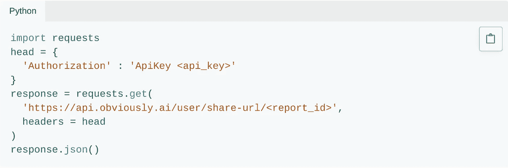

# 无代码人工智能如何修复人工智能的可复制性危机

> 原文：<https://medium.datadriveninvestor.com/how-no-code-ai-is-fixing-ais-reproducibility-crisis-9a05939da9c1?source=collection_archive---------17----------------------->

## 一键共享 AI。

人工智能行业有几个主要问题:缺乏可重复性和透明度。

更简单地说，有大量的人工智能研究，没有人能够理解。有超过 150 万篇的论文发表在[网站上，但真正能够被复制和理解的却不多。](https://www.statista.com/statistics/941037/ai-paper-publications-worldwide-by-country/#:~:text=The%20statistic%20shows%20the%20number,amounted%20to%20almost%20370%20thousand.)

在一项对 400 篇人工智能研究论文的[荟萃分析](https://www.aaai.org/ocs/index.php/AAAI/AAAI18/paper/viewFile/17248/15864#:~:text=Background%3A%20Research%20results%20in%20artificial,criticized%20for%20not%20being%20reproducible.&text=Hypotheses%3A%201)%20AI%20research%20is,practices%20have%20improved%20over%20time.)中，*没有一篇*被完整记录或可复制。另一项研究表明，只有 15%的研究论文分享他们的代码。

简而言之，AI 行业本身就是出了名的不透明和混乱。

# 共享人工智能

想象一下，如果您可以在几分钟内构建、共享和部署模型。如果你能用一个链接分享透明的，可复制的人工智能。你很快就能明白。人工智能的“可共享报告”功能，让你只需点击一下鼠标就可以创建一个人工智能模型的可共享链接。

任何人都可以访问和理解报告，无需注册、技术专业知识或代码，只需一个如下所示的链接:

## 无代码人工智能如何让机器学习变得毫不费力

人工智能曾经是一项非常复杂的工作，需要高技术研究科学家团队和雄厚的资金。

然而今天，情况发生了巨大的变化，机器学习变得毫不费力，这要归功于无代码——或者像[这样明显的可视化工具。AI](http://obviously.ai) 让你无需编写代码，只需点击鼠标就能构建和部署模型。

很明显，已经几个月了。AI 一直在开发一些功能，让 AI 变得更简单、更容易使用，包括只需点击一下就能创建“可共享的报告”。

显然，创建可共享报告的旧方法。人工智能包括使用编程语言，如 Python 或 JavaScript。很快，这可以通过一次点击来完成。

# “可共享人工智能”的真正含义是什么

在一份可共享的人工智能报告中，你可以深入研究机器学习模型的细节，创建预测，了解给定 KPI 的驱动因素，等等。

技术规范包括所使用的算法、模型性能和准确性(训练、验证和测试)、训练/测试分割、训练时间、损失函数、数据集来源等。

您还将获得描述模型性能的视觉效果，例如一个简单的决策树。

这一切即使不做账也是看得见的。

# 摘要

人工智能是未来，但如果没有可解释、透明和可共享的人工智能，它将无法实现。可共享的无代码人工智能报告解决了这个问题，有助于人工智能的民主化。