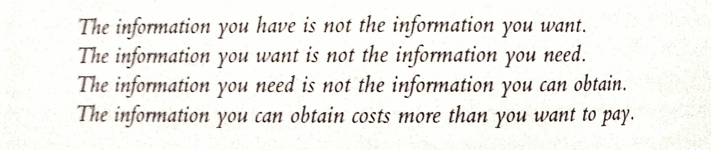

# 如何不做哑巴钱:渠道检查研究

> 原文：<https://medium.datadriveninvestor.com/how-not-to-be-dumb-money-channel-check-research-bebde4c02a33?source=collection_archive---------4----------------------->

Why channel check firms exist — and how an individual investor can channel check

**你没有的信息如何能拿走你的钱**

任何人读了标题一定会认为作者相信他是聪明的钱。我承认两者都有，虽然不是同时。我在这里的目的是展示愚蠢的钱如何变成聪明的钱，因为处于信息不对称的错误一端正是愚蠢的钱的定义。

战后意大利马基雅维利式的权力政治君主朱利奥·安德烈奥蒂创造了这句格言:“权力只会耗尽那些没有权力的人。”同样，信息可能会耗尽个人投资者的资金，因为他们不知道机构投资者可能会通过他们雇佣的渠道检查研究公司来收集有关公司业务发生的数据:供应链订单、库存周转率等。当我为这样的研究公司工作，并为一家对冲基金做渠道检查研究时，我了解到了还没有人知道的信息的好处和危险。合法获得的信息，因为内幕交易是一种犯罪。找到其他人都需要但其他人无法获得的信息，使一位机构投资者和渠道检查研究员能够收获市场预期和企业真实前景之间的差异。

**什么是渠道检查，它的可交易性如何？**

频道检查结合了调查记者的技能和深度八卦。想想菲利普·费舍尔在他 1958 年的第一本零售投资畅销书《普通股和不寻常利润》中写的“投机倒把”。事情可以这么简单:麦哲伦基金经理彼得·林奇让他的妻子和孩子告诉他他们和他们的朋友喜欢的热门新产品。目的:解决页面顶部的 quadrilemma。

渠道检查的调查报告方面可以比计算通过 Urban Outfitters 商店大门的购物袋的大小和数量或访问 Chuck E. Cheese 餐馆来感受业务疲软的脉搏更加详细。

香橼研究(Citron Research)最近关于罗塞塔石碑(Rosetta Stone，RST)的长篇文章通过渠道调查该公司的学校客户是如何增加在线学习的。这项研究告诉交易员，随着收购的前景现已成为现实，下跌空间有限。没有一个交易者可以知道买断价格，以便在不犯重罪的情况下选择看涨期权执行价格。但是，良好的通道检查可以揭示一个趋势，即卖出隐含波动率超过 50%的昂贵看跌期权的下跌空间非常有限，甚至没有。通道检查可以告诉你什么时候恐惧被高估了，所以你可以幸运地卖出一些。在 FSYS/BRC 的案例中，恐惧被严重低估，因为市场美国先生渠道检查该公司在意大利的业务存在很高的进入壁垒。

**案例分析:** **燃料系统解决方案(FSYS)，或者我的大空头**

FSYS 是一家意大利-美国公司，生产、销售和安装将汽油汽车发动机转换成压缩天然气和液化石油气的系统。FSYS 最初是一家意大利公司，其在意大利的销售额中有将近一半是以 BRC(【https://brc.it/home/】T4)的名义完成的。它通过遍布意大利和美国的经销商网络销售、改装和安装 CNG 和 LPG 发动机。FSYS 业务的健康依赖于汽油价格与 CNG 和 LPG 价格之间的巨大差距。

随着 2008 年至 2009 年的大衰退，原油价格从 2008 年 6 月 147 美元/桶的峰值跌至 2009 年 1 月 33 美元/桶的低点。尽管原油价格暴跌，汽油价格随之下跌，FSYS 的股价在 2008 年中期石油泡沫时达到了 60 美元/股的峰值，但考虑到整体市场的崩溃，它仍然表现良好:

2008 年 11 月底每股 40 美元

2008 年末每股 36.38 美元。

2009 年 1 月底每股 28 美元

2015 年被西港燃料系统公司(WPRT)以 7.54 美元/股的价格收购:

The End Game for previous bagholders

在崩盘模式下，没有哪个投资者会认为该股相对于市场其它股票有什么特别的问题。FSYS 的表现略好于一个从高峰到低谷暴跌 57%的市场。要么市场正在经历经济衰退和原油价格暴跌，要么它认为 FSYS 的意大利业务与此无关，因为政府对汽油的征税在汽油价格中所占的比例如此之高。

市场预期错了——大错特错。其中蕴含着一个有利可图的做空机会，这家对冲基金利用了这个机会，雇佣我去 channel check FSYS 的意大利业务。为什么是我？在意大利生活了 16 年，意大利语流利。

对于其他美国投资者来说，由于语言障碍，这是一个“你需要的信息不是你可以获得的信息”的案例。渠道检查一家意大利公司的分销商需要流利的意大利语，在美国渠道检查公司和对冲基金中找到这种技能既费时又费钱。这就造成了信息收集竞赛基金和渠道检查公司的进入壁垒。

**空头头寸**

FSYS 将于 2009 年 2 月中旬公布销售额和收益。我的客户在一只流动性差的小盘股上有一个七位数的空头头寸，其股票借贷成本很高。他不仅要正确，而且要很快正确，才能从预期和实际商业现实之间的差异中获利。六个月内正确是无利可图的。

 [## 将数据隐私转化为你的优势，重建消费者的信任:下一个投资前沿

### 抖音的使用在疫情期间激增，全球大约有 8 亿用户使用该平台…

www.datadriveninvestor.com](https://www.datadriveninvestor.com/2020/09/18/turn-data-privacy-to-your-advantage-and-rebuild-consumers-trust-the-next-investment-frontier/) 

**参差不齐的信息景观**

通道检查研究遵循一个粗略的 80/20 规则:你花 80%的时间钻充满错误的干洞，产生 20%最无用的信息。在你研究案例的最后 20%的时间里，你找到了 80%或更多的证明交易的最佳信息。寻找实时信息催化剂的战争是一场赢家通吃的比赛。

从纽约，我开始打电话给 FSYS 的 BRC 经销商和其他意大利消息来源，如菲亚特经销商协会和汽车制造商贸易协会的统计学家。由于 SEC 法律禁止披露非公开信息，致电 BRC 本身毫无意义。但渠道检查是从公司的供应链或销售网络或其他与公司无关的行业来源中挖掘信息。

BRC 在整个意大利有大约 150 个经销商和安装商。像米兰和都灵这样富裕的北方大城市或其附近的一些城市是大型汽车经销商和修理店。南方省城的其他商店都是只有几个员工的夫妻店。后者更愿意交谈，但人数少到足以构成抽样误差。那么，当你突然从大洋彼岸打电话给消息来源时，如何避免页面顶部四行中的第一行——“你拥有的信息不是你想要的信息”？

精心策划一个让资源开放的项目是一个迭代设计的问题。在这种情况下，听到最初的几个分销商痛苦地抱怨被 BRC 抛弃，因为油价暴跌导致业务崩溃，加快了这一过程。身为一个能说一口流利意大利语的美国人，从纽约打电话给一家对冲基金，激起了足够多分销商的好奇心，以降低拒绝率，避免抽样误差。很快，产生可靠定量数据的呼叫的命中率大幅上升。南部普利亚和坎帕尼亚地区的一些经销商在纽约有亲戚，当我回到意大利时，他们邀请我去吃饭。

底线:BRC 经销商的业务已经崩溃了 60-100 %,我甚至可以听到许多人拿着离我耳朵两英尺远的电话抱怨。一些安装人员很友好地回写了包括有价值的颜色在内的定性信息。经销商正在赠送新车的系统，国家资助的减少意大利城市著名的高空气污染的激励措施也在不断变化:

*“对美国安装商的需求是一场灾难。很少进行转换，因为不幸的是，汽车经销商在新车上免费赠送系统，所以对使用新的液化石油气和压缩天然气的汽车的需求比柴油汽车好。*

*你好，新安装的那台电脑坏了，我想买一台新的电动汽车，我想买一台新的电动汽车，我想买一台新的电动汽车，我想买一台新的电动汽车，我想买一台新的电动汽车。
distinti Saluti"*

这意味着一辆装有 BRC 系统的新车的成本与一辆装有汽油发动机的新车是一样的，这对于消费者来说是显而易见的。如果售后改装和安装人员因经销商层面的改装增加而陷入困境，BRC 只是将需求从一个渠道转移到另一个渠道。因此，如果 BRC 的 OEM 销售增长足以抵消零售安装的崩溃，我的客户的空头头寸就有风险。

然后是政府对发动机转换的激励措施的移动目标，以及对购买使用 CNG 和 LPG 发动机的新车和卡车的更高激励:

***“意大利刺激新车销售:***

*意宣布购买汽车和家用电器的刺激方案*

*   *以旧车换新型混合动力车的人将获得 3000 欧元的现金奖励*
*   *作为计划的一部分，汽车工厂将保留在意大利*
*   *意大利的汽车工业约占国内生产总值的 11.4%，雇佣了约 100 万人”*

10 年(或更长时间)旧车换现金计划为在经销商处交易的混合动力车、压缩天然气和液化石油气车提供了 1500 欧元的额外补贴，而在零售层面进行简单改装的费用则较少。意大利的汽车工业占国内生产总值的 11%，雇佣了 100 万人。根据一家经销商的数据，政府政策似乎正在削弱零售安装商的改装，以利于 OEM 和经销商的销售:

*“现在是新车市场在推动液化石油气和压缩天然气系统，因为它们的燃料成本更低，污染更少。对于那些已经有车并想现在改装的人来说，政府的贡献取决于它的污染等级(0/1/2 欧元= €液化石油气 500 欧元/€压缩天然气 650 欧元-3/4/5 欧元= €液化石油气 350 欧元/€压缩天然气 500 欧元)。但是政府正在批准一项修正案，该修正案将对所有液化石油气给予€500 的奖励，对所有压缩天然气系统给予€650 的奖励。现在汽油价格逐渐上涨，需求也有所增加，但是从国家获得更多的资金可以鼓励人们(改变信仰)。无论如何，自去年以来有所下降。其他信息由你支配。”*

我们必须衡量激励措施的影响，因为将发动机转换为污染更少的压缩天然气和液化石油气燃料的司机将免受许多意大利城市实行的单双号限行措施的限制。米兰、都灵、佛罗伦萨、罗马和那不勒斯是欧洲污染最严重的城市。

但是 BRC 销售给原始设备制造商的利润较低:销售给安装商的每个系统为 1200-1500 欧元，而销售给原始设备制造商的每个系统为 800 欧元。

通过给意大利大部分地区的 60 多家经销商打电话，我可以为客户构建一个详细的电子表格，其中包含有关发动机改装数量和安装价格的数据，以及在事故发生前和事故发生期间的半年内每个季度或每个月完成的安装数量，并将它们与油价相关联。

**什么必须正确:交易设置**

我们有一个已知的催化剂和上市日期:2 月中旬的下一次收益公告，其中将包括 BRC 分销商在市场先生知道之前透露的实际情况。公告发布前的周四，我问我的客户，我是否可以做期权交易。当被告知“是”时，我以每份 2.60 美元的价格买入了 5 份 22.50 英镑的 FSYS 执行期权，这些期权将于下周五到期。我应该买更多，但只投资我认为我能承受损失的。有些交易错误是出于正当的理由。如果 FSYS 的收入下降不足以立即引发大幅下跌，我会输掉整个 1300 美元的赌注。但市场预期和商业现实之间的差距已经足够大了。接下来的周二收盘后，FSYS 从 27.50 跌至 14，周三更是跌至 12。周三，我以每份 8.30 美元的价格卖出了看跌期权。

交易结束后，我问我客户的分析师，他多久看到一次像 FSYS 这样的案例——一种已知的催化剂，有固定的触发日期，但市场先生认为不会出现。“几乎没有”。我开始了为期三年的频道检查工作，就像一只随机的成功的黑天鹅，这是我第一次走运。我们试图复制第一个案例，对金融系统进行多头和空头押注，但从未取得同样程度的成功。

一旦消息传出，市场聚焦于意大利汽车销售，将其作为 FSYS 股价的催化剂。市场表现出弱形式效率——有效市场假说(emh in small letters，eugene fama & co)。

**后续研究:微观与宏观催化剂**

在第一次交易后，下一步是跟踪整个意大利的汽车销售，因为 BRC 销售给分销商的改装和安装费用依赖于这个数字，并且与这个数字高度相关。FSYS 的股价对这一数字非常敏感，当时由于持续的金融危机加上政府对汽车行业的大力激励，股价波动很大。

外国汽车贸易协会 UNRAE 从经销商处收集了汽车销售数据，并于每月 5 日公布上个月的销售情况。但是，意大利就是意大利，菲亚特汽车本月的部分销售数据大约在每月 27 日从另一个来源获得:菲亚特经销商协会的统计学家。该协会从未公开宣布过这些数据，而是免费提供给经销商、汽车记者、经济学家…..和纽约频道检查研究员。这意味着我的客户找到了渠道检查研究的圣杯:其他投资者没有的公开信息和合规信息。(他咨询了他的合规顾问；使用这些信息是合法的。)

接下来的一年，我会在每个月 27 号左右和我在都灵菲亚特经销商协会的统计学家朋友核实一下。我在都灵郊区的一个山坡上，在一位大学教授兼葡萄酒化学家的家里学会了意大利语，在一艘 lago di vino(就是 di vino)上融入了意大利语言和文化。所以对于我的消息来源来说，我就像是一个当地人，也是业外唯一一个就这些数据给她打过电话的人。我客户的合规官让我向统计学家核实，这一非常重要的信息确实是公开提供的，尽管在我获得该信息的早期，广大市场显然不知道。这次合规性检查可不是闹着玩的，这一点从以下内容中可以明显看出:

***“通道检查”是否已经成为犯罪行为？***

*最近几天，随着联邦检察官开始关注内幕交易案件，华尔街分析师感到困惑，这些案件似乎涉及上市公司供应链的例行发布信息。“内幕交易基本上归结为你知道或应该知道你从其获得信息的人对其他人负有保密义务，”前证券交易专员保罗·阿特金斯在与华尔街日报的视频采访中说。"如果你进去付钱给邮递员给你特殊的信息，那是不合适的。"(*[*https://www . wsj . com/articles/sb 10001424052748703730304575633173086330184*](https://www.wsj.com/articles/SB10001424052748703730304575633173086330184)*)*

我们必须检查我的都灵统计员是否像邮件员。在这种情况下，没有犯规，没有重罪——全部清除。

**结论**

燃料系统解决方案的案例非常罕见，它说明了基于信息的 alpha 的一些关键点:

1.  很少见，稍纵即逝。EMH 三振出局一两次，但不多。
2.  寻找别人没有的、找不到的或者比噪音更好解释的信号。语言只是一个障碍。另一个例子是行业专家，他们的名字可以在行业杂志或行业协会中找到。他们通常乐于助人；我们大多数人都希望自己的工作不仅仅是一份薪水。
3.  渠道检查花费大量时间，但胜过大多数投资者更容易从像格森-雷曼这样的专家网络获得的信息，因为它更难获得，成本也更高(见顶部的第 4 条)。

从那以后，我是不是成了傻钱，被我得不到或误解的信息或信号烧掉了？当然可以。所有伟大的耻辱的教训不断被重新学习。

市场先生曲解的外汇历史宏观赌注是另一个非常不同的故事，我会在另一篇文章中写。

## 访问专家视图— [订阅 DDI 英特尔](https://datadriveninvestor.com/ddi-intel)