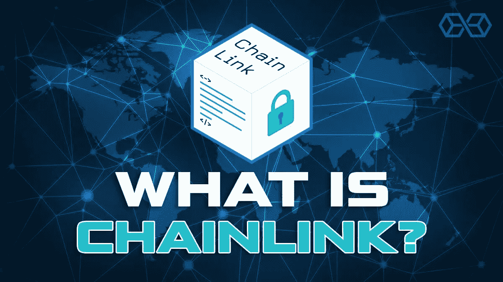
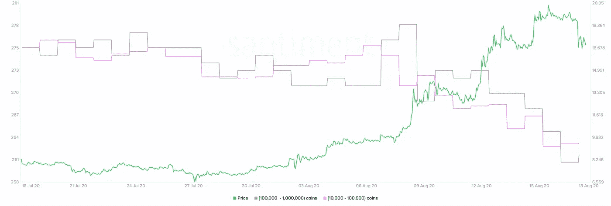

# 一个密码如何攀升 1000%

> 原文：<https://medium.datadriveninvestor.com/how-one-crypto-climbed-by-1000-c6bc83bf93e2?source=collection_archive---------21----------------------->

**市场总结。** Chainlink 经历了巨大的发展。从黑色星期四期间 1.79 美元的近期低点，我们看到了 19.84 美元的历史高点。这个价位在 8 月 16 日周日被触及，并一直维持在高位直到最近。8 月 18 日，林克已经回调了近 16%。这是预料之中的，因为大型加密鲸施加了卖出压力。

**什么是 Chainlink(链接)？**

Chainlink 是一个 DeFi oracle 解决方案，旨在向分散市场提供真实世界的数据。自然，由于共识机制，智能合约不能生成实时数据，因此 Chainlink 帮助这些程序保持最新的价格数据。这对于分散式交易所(dex)尤其重要，在那里一切都是在智能合约上运行的。拥有准确的价格可以防止不良行为者在交易中扩大价格差异，并在有害策略的帮助下获利。

**更正(链接@ 14 美元)。**

对于一个健康的上升轨迹来说，修正似乎是必要的。许多分析师认为，这枚硬币可以拉回 14.70 美元或更低。新投资者非常乐观，但这个领域的“鲸鱼”正在尽可能地离开。下面的持有人分布图显示，大持有人自 8 月 8 日以来一直在减持。大约有 64 头鲸鱼离开了这个网络，它们的销售压力使得价格下降。

*LINK Holder Distribution by* [*Santiment*](https://santiment.net/)

在 14.70 美元似乎有一个供应墙。这是因为整整 3600 个地址购买了大约 838000 个链接。这意味着投资者将寻求在该价格附近减少损失，防止 LINK 回到更高的价格。另一方面，在 16.90 美元到 17.40 美元之间，大约有 9200 个地址拥有超过 320 万个链接。这些投资者可能会在短期内持有，但再次通过试图以相同的价格退出来压低价格。

 [## 加密货币行业是死是活？数据驱动的投资者

### 九月初，我们在 X-Order 内部就代币市场的未来进行了一场辩论。有趣的是，我们的观点是…

www.datadriveninvestor.com](https://www.datadriveninvestor.com/2019/12/12/will-the-cryptocurrency-industry-be-dead-or-alive/) 

短期内，我们可能会继续看到这枚硬币的调整，但这是必要的。势头不可能永远持续，但如果你对这个项目感兴趣，低价买入的机会很可能会到来。

**访问专家视图—** [**订阅 DDI 英特尔**](https://datadriveninvestor.com/ddi-intel)