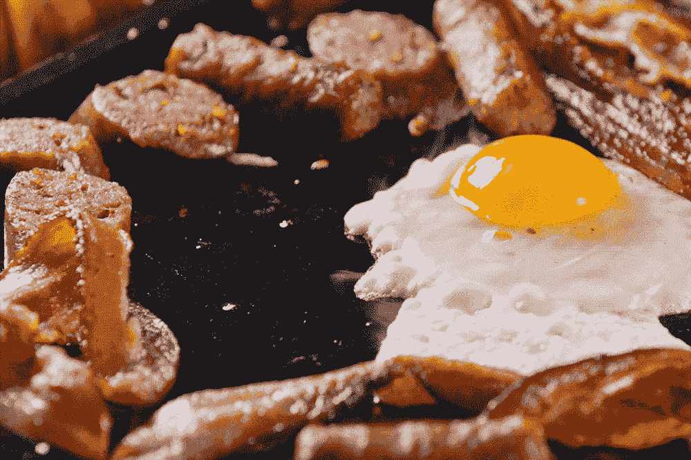
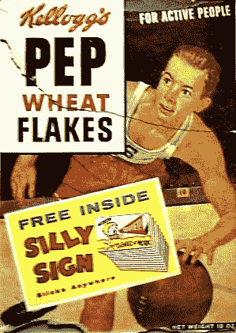

# 一个营销人员如何创造了“美国早餐”

> 原文：<https://medium.datadriveninvestor.com/how-one-marketer-created-the-american-breakfast-e1ad271b321?source=collection_archive---------14----------------------->

## 的故事🥓和🍳

描绘了典型的美国早餐。你可能会想象铁板熏肉和单面煎的鸡蛋，但是这个普遍的形象是怎么来的呢？

事实证明，美国早餐有着过山车般的历史。在工业革命之前，美国人通常吃丰盛的早餐，有熏肉和鸡蛋——这很容易从农场得到。

然而，工业革命后，许多人搬到了城市地区，远离了农场，早上还要去繁忙的工厂和办公室上班。在约翰·哈维·凯洛格的推动下，他们需要一些快速、清淡的早餐，而谷类食品填补了这一角色。

 [## 抓住智能营销，获得巨大成果|数据驱动的投资者

### 网上的人都看过。每当人们在谷歌上搜索某样东西，他们最终都会与类似的广告互动…

www.datadriveninvestor.com](https://www.datadriveninvestor.com/2020/08/19/grab-on-to-intelligent-marketing-for-great-results/) 

凯洛格成功地让美国人相信，像麦片一样的清淡早餐会增进健康，提高职业道德，让你精力充沛。

这对卖熏肉的人来说是个坏消息。一家名为 Beech-Nut 的公司，如今以销售婴儿食品而闻名，当时正在销售和包装猪肉。Beech-Nut 聘请了“公共关系之父”爱德华伯奈斯，将美国带回它的培根鸡蛋时代。

他是怎么做到的？

爱德华意识到美国人越来越注重健康，所以他采用了营销中最受欢迎的策略之一来说服人们相信熏肉和鸡蛋是健康的:权威。

我们都信任医生(或者说，至少我们曾经信任)。他们是 T2 健康和营养方面的权威。

爱德华问旅行社的医生早餐吃得太多是否健康，医生说“是”然后，爱德华说服医生向 5000 名同行发送邮件，以证实早餐吃得多确实更健康。这些证实被整合成一项研究，并在所有主要新闻媒体上发表。

结论是:丰盛的早餐，而不是谷物，更健康。

当然，战斗仍在继续，我们中的许多人以一碗麦片开始新的一天，但爱德华·伯奈斯成功地运用权威创造了“美国早餐”的主导形象。

## 获得专家观点— [订阅 DDI 英特尔](https://datadriveninvestor.com/ddi-intel)