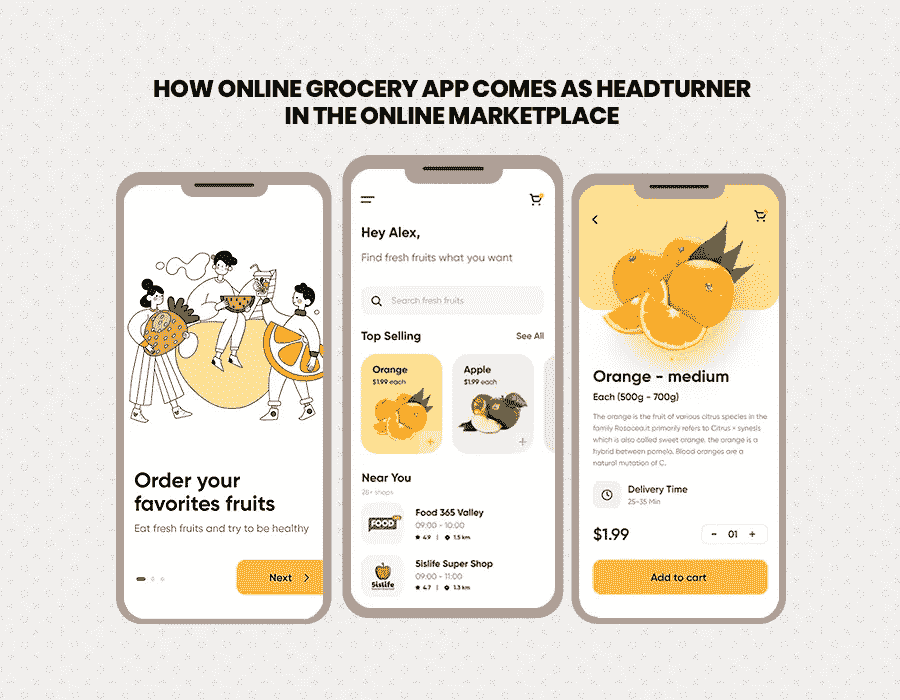

# 在线杂货应用程序如何在在线市场中引人注目？

> 原文：<https://medium.datadriveninvestor.com/how-online-grocery-app-comes-as-headturner-in-the-online-marketplace-cc2d6733d16b?source=collection_archive---------23----------------------->

**在线杂货应用的机遇浪潮**

你知道吗！

美食网站的搜索量增长了 33%，像多米诺骨牌和赛百味这样的大赢家分别增长了 41%到 60%。

对“网上药店”的搜索增加到 238 %,而对“药品配送”的搜索激增了 184%。

阿联酋网络流量分析显示，用户有绕过聚合器在线订购食品的趋势。

世界经济论坛预测，阿联酋 2020 年的电子商务市场价值为 272 亿美元。

所有这些数据都支持在线杂货应用的技术浪潮，随之而来的问题是“杂货应用如何成为在线领域的下一件大事”？

有没有想过，为什么像 Grofers、Big Basket、Amazon 和其他一些公司这样的主要参与者通过**应用程序开发公司巩固他们在消费者市场的足迹，将创新引入一个重要的有利可图的领域，同时让他们的受众受益？**

**由于价值超过 10 亿美元的在线杂货空间比去年增长更快，战略玩家和新进入者确实标志着该领域的巨大实力和潜力。为了支持这种强烈的观点，最近沃尔玛对 Flipkart 产生了浓厚的兴趣，收购了该公司 77%的大部分股份，这表明这个已知领域正在成为食品和杂货领域的一个重要组成部分，成为最大的颠覆者之一。**

**然而，随着在线主导的企业传播舒适，基于 GMV 的需求预计将在 2019 年至 2025 年间增长 34%。越来越多的公司预计将专注于与供应商和商店零售商的合作，以满足客户的需求。**

**对于消费者来说，在家门口拥有极简主义的东西是一种绝对奢侈的资产，阿联酋迪拜领先的 [**移动应用程序开发公司**](https://www.xicom.ae/services/mobile-app-development/) 正在这一领域做得越来越好。没错，从优惠和折扣券到 90 分钟送货和与安全支付网关的合作，这款杂货应用程序让消费者可以高枕无忧。与此同时，网上本地市场有助于收集所有订购的商品，并送货上门。**

**从消费者的角度和商业的角度来看，让我们来看看为什么网上杂货店的未来会更好，肯定更可行:**

# **时间短缺**

**今天的现代工作文化和职业 bug 不只是留给大城市；事实上，它已经开辟了一条通向社会各个角落的道路。一个城市，无论其规模大小，都有大量的人在成长，他们只是有时间去每周一次的杂货店购物。**

**作为文化的一部分，雇佣女佣和厨师每天都在迅速出现，购买食品杂货和设定具体的送货时间一点也不耗时，而是一个更快、管理费用更低的选择。**

# **仓库投资**

**作为一个成本可承受的提议，电子杂货商可以很容易地在位于中心位置的仓库中建立基地，以确保他们可以更轻松地覆盖市场，而不是在仓库旁边投资实体商店。**

**是的，很容易集成一种实用的、非常理想的审查操作的方法。因此，节省下来的时间可以进一步投资于提供更好的交易和折扣，而不是增加实体店的管理费用。**

# **固定价格商店**

**网上杂货店被证明是对“讨价还价”概念的突破。电子杂货商可以选择提供折扣和省钱的交易，给人的感觉是“要么买我，要么失去我”。**

**随着 [**移动应用程序开发公司**](https://www.xicom.ae/services/mobile-app-development/) 对应用程序进行改进，在当地为西红柿和洋葱讨价还价的空间已经不大了，这是一种由来已久的文化。好的促销确实伴随着好的生意，没有任何每日价格波动的烦恼。**

**除了牢记新冠肺炎疫情，冠状病毒消退后，在线杂货应用程序决心在在线市场上占据领先地位。即使在疫情期间，杂货商在无数便捷渠道中标记尽可能多的订单的能力也很重要，因为如果你的应用程序不能勾选用户想要的需求，消费者可能会转向其他选择。**

**因此，在疫情期间满足消费者需求的杂货应用程序将在疫情消退后引领行业。此外，为了保持竞争优势，你所需要的是迪拜经验丰富的 [**移动应用开发者**](https://www.xicom.ae/services/mobile-app-development/) 来让你的应用成为灾难平息后的必需品。**

# **一个屋檐下的所有信息**

**传统上，零售商的杂货购物应用程序为用户提供关于产品的完整和所需的信息。**

**许多零售商选择创建超市应用程序，为顾客提供所需的产品价格、折扣和营养信息(特别是食品)。像 Costco 这样的应用程序走得更远，在数据库中的每个产品上附加一个包含全部信息的 PDF。甚至，大多数店内杂货应用程序允许用户检查特定产品在某些商店的可用性。**

**而对于杂货应用程序，高级搜索和分类是任何应用程序的另一个因素。让我们来看看让你的应用程序获得巨大成功的独特功能。**

# **无可挑剔的功能让您的应用充满活力**

**杂货应用 important 不可否认是“购物清单”。如您所知，列表不仅限于简单地添加、编辑、删除特性和功能。在这里，我挑选了最新鲜和最突出的功能，你可以用它们来丰富购物者的购物清单应用程序。**

## **一次多个购物清单**

**这就是“新”！**

**让我们用一个例子来理解这一点。一个用户想要为整个星期创建一个食品购物清单，但是考虑到每天的膳食和时间表，作为星期三聚会的食品杂货清单，同时你想要为同一天的家庭晚餐购买产品。将两个列表混在一起或者删除另一个来创建一个混合列表通常会让你陷入困惑之中。**

**这为这个优秀而有用的特性腾出了空间。与 Costco 和 Target 类似，你也可以在你的应用程序中添加这一功能，在泛滥的选择中脱颖而出。**

## **无数种输入方式**

**在某些情况下，手动和搜索输入可能会成为障碍，所以让我们看看一些向购物袋添加物品的替代方法:**

## **列出最喜欢的**

**有了装满他们喜欢的杂货的袋子，用户可以轻松快速地将经常购买的物品添加到购物清单中。**

## **条形码扫描**

**迪拜 领先的 [**移动应用开发公司特别重视条形码扫描功能。通过条形码扫描，聚合应用程序可以读取产品的条形码，因此用户可以直接将商品添加到列表中。为了集成条形码扫描，Google 的条形码 API(现在是 ML Kit 的一部分)适用于两个著名的平台——iOS 和 Android 或专门用于 iOS 的 AVFoundation 框架。**](https://www.xicom.ae/services/mobile-app-development/)**

**语音命令集成——使用语音添加、删除或创建整个列表不再是梦想。相反，你的应用应该包含这个特性。语音助手的一些流行选择是 Android 设备的谷歌助手，而 Siri 是苹果设备和用户的一个著名选择。**

## **要亲自尝试的食谱**

**在你的杂货应用中，你可以添加跟随食谱的功能，甚至可以添加你自己的食谱。它仅仅意味着将食谱和标准的购物清单功能结合起来。这个应用程序的用户可以选择任何成分，并寻找它的配方。应用程序的用户可以滚动食谱，如果他们喜欢某个食谱，他们可以看到所用产品和杂货的完整列表，并可以将其添加到购物清单中。**

**而且，谁知道呢，你的食谱会变得出名，受到广大观众的称赞。**

## **提醒我功能**

**你的杂货应用程序还可以提醒用户在购买杂货时购买面包、鸡蛋、谷物等主食。为了更好地理解，一个名为“每日面包”的应用程序让用户知道他们什么时候将耗尽主食和杂货。**

**所以，事不宜迟，与你在迪拜 的合作伙伴 [**应用程序开发人员讨论这个功能，并将其集成到你的在线杂货应用程序中。**](https://www.xicom.ae/services/mobile-app-development/)**

## **优惠券和忠诚度计划**

**不管你同意与否，折扣券和每周广告都与购物清单的功能密切相关。让我们仔细看看，以便更好地理解它，“它是如何工作的？”**

**当用户将商品添加到购物车时，应用程序会通知他们是否有任何优惠券可供打印或加载到他们的杂货店忠诚度计划中。此外，你可以让购物者在你的应用程序中搜索、浏览、过滤和找到基于杂货必需品的最佳交易，方法是将当地交易与购物者最喜欢的品牌的优惠券相匹配。**

**揭开秘密——Pyments.com 在 eMarketer 上发表的一项研究表明，用户使用应用程序的最大好处是折扣券(87.6%)、忠诚度/奖励计划(79.7%)和产品搜索功能(56.7%)。**

**大多数用户对数字优惠券和店内优惠券充满热情，前提是应用程序能让他们简单地将虚拟优惠券转化为实际节省的费用。毫无疑问，用户无疑会喜欢定制，根据他们目前的购物清单为他们提供定制的优惠券。**

## **易于共享的功能**

**这项功能是商店应用程序和杂货应用程序独有的。通过你的应用程序购买食品杂货的用户应该能够在一次点击中与在那里帮助你的人分享它。甚至，确保提供几个其他的购物选择。**

**例如，用户可以通过流行的信使和社交网络在 Lidl 应用程序中共享列表，并将列表转换为笔记，甚至保存在 Google drive 中以备将来使用。此外，您还可以添加一个功能，只需轻轻一点，就可以打印出您最喜欢的购物清单。**

## **成本评估计算器**

**放在最后，但非常重要。**

**当用户从数据库中的项目创建购物清单时，请确保向您的[移动应用程序开发公司](https://www.appsted.com/services/mobile-app-development/)询问嵌入在应用程序中的成本计算功能。**

**一个应用程序的成功必须使用一个简单的价格计算器来计算订单的成本。甚至，你还可以让用户用积分卡和折扣来计算。**

## **你应该特别注意的几点**

## **明智地对一堆功能说“是”**

**在添加功能的同时，有一点要特别注意，就是你的 app 要添加什么功能。简化的趋势越来越明显。用户只是不喜欢被雪片般的通知淹没，并不断被那些提供他们已经搜索过或有购买历史的产品的残余广告所困扰。**

**因此，保持一个应用程序流畅上网需要不断质疑其现有功能。另一方面，每个新功能都必须是合理的，如果不合理，那么从市场平台中消除它是最好的解决方案。**

## **复杂的注册和登录**

**在访问应用程序时，这些障碍通常会让用户感到困惑和沮丧，阻止他们使用应用程序。让购物者无需注册账户或登录就能使用应用的基本功能是解决这一问题的办法。**

**此外，对于准备使用所有功能的购物者来说，简化注册过程也很重要。此外，它确保容易登录的回访用户也是必不可少的。所以，慎重选择全栈服务商。**

## **从提货和送货选择中走在前面**

**目前，一个功能齐全的列表对忠诚的客户来说很方便。但是，从一个典型的角度来看，购物清单只是顾客旅程的第一步。这是为什么企业在他们的应用程序中实现在线功能的最大原因之一，在迪拜有最好的应用程序开发。**

**甚至有统计显示，增加网购是正确的决定！Coresight Research 在 2020 年进行的一项调查表明，超过一半的受访者在网上购买过杂货。这大约是过去两年增加人数的两倍。此外，调查预测，由于封锁导致的高需求，美国在线杂货比例将从今年的 22%攀升至 40%。**

**最终… 越来越多的人将网上购物者从奢侈品转向日常用品；这些应用还需要在交付方面突飞猛进，这正是客户所期待的。**

**不管这个领域的竞争轨迹如何，让你的应用真正伟大的是在阿联酋迪拜选择正确的功能和正确的应用开发团队。此外，当一个人要么跟上正确功能的集成，要么准备好留在比赛中时，Xicom Technologies 将为您提供帮助。**

**你可能想知道为什么，西科姆？**

**因为我们的专家管理您项目的每一个小细节，并准备走额外的一英里，将您的想法作为今天的运营现实，尽管有许多公司做出选择，但只有选定的公司拥有多年卓越的公认专家舰队，并以其良好的声誉为背景。Xicom Technologies 是少数符合这些标准的公司之一。**

**如果你已经准备好了你开创性的应用程序想法，那就开始用你的 [**免费项目评估**](https://www.xicom.ae/services/mobile-app-development/) 为你下一件大事的成功做准备吧。**

***原载于 2020 年 7 月 30 日*[*https://www . xicom . AE*](https://www.xicom.ae/blog/how-online-grocery-app-comes-as-headturner-in-the-online-marketplace/)*。***