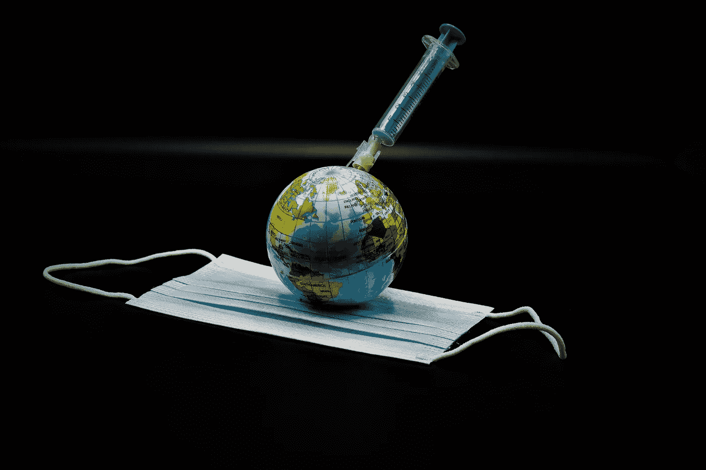
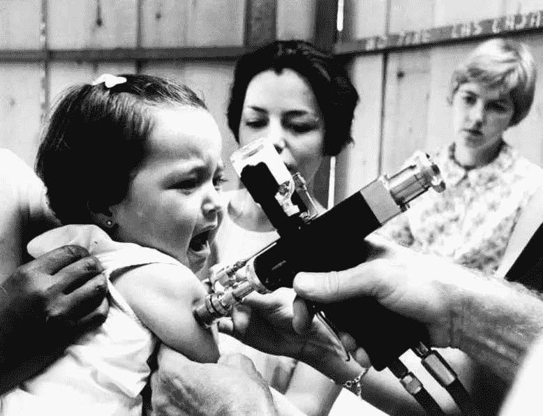
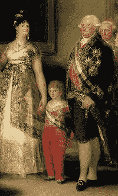
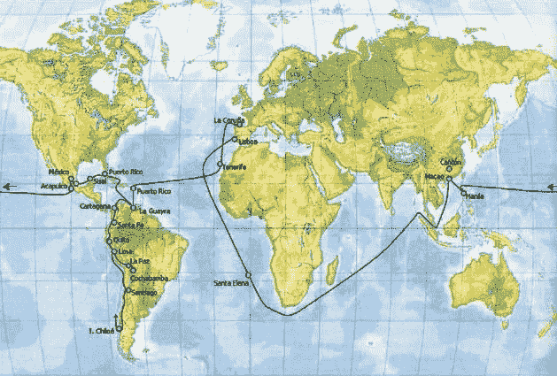
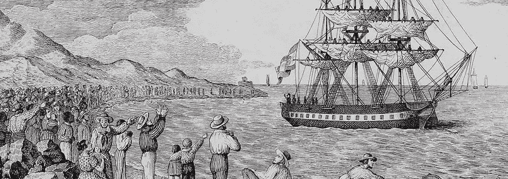

# 孤儿如何在世界各地注射天花疫苗

> 原文：<https://medium.datadriveninvestor.com/how-orphans-took-the-smallpox-vaccine-around-the-world-dfb47159b49?source=collection_archive---------13----------------------->

## 你可能不知道，世界上第一次全球疫苗接种运动发生在两百年前，当时的疫苗是一群一出生就被遗弃的孤儿

Image by [Jeyaratnam Caniceus](https://pixabay.com/users/caniceus-15612619/?utm_source=link-attribution&utm_medium=referral&utm_campaign=image&utm_content=5198347) from [Pixabay](https://pixabay.com/?utm_source=link-attribution&utm_medium=referral&utm_campaign=image&utm_content=5198347)

在两百年前的欧洲，天花死亡率达到 30%，而对于从未接触过[天花病毒](https://en.wikipedia.org/wiki/Smallpox#Cause)的南美，天花死亡率高达 50%。16 世纪西班牙入侵带来的天花导致南美洲的[阿兹特克](https://en.wikipedia.org/wiki/Aztecs)和[印加文明](https://en.wikipedia.org/wiki/Inca_Empire)毁灭。在西班牙征服之初(1519-1520)，阿兹特克人口为 2600 万，但到了 1620 年，只剩下 160 万。

但是在其他地方，人类已经找到了与天花共存的方法。中国、印度、中东与天花共存历史悠久，发明了早期的天花免疫技术——人痘疫苗。

> 人痘疫苗利用天花病人的脓液或痂来感染健康人，使后者获得对天花的免疫力

接种人痘疫苗后，接种者的症状会比真正的天花弱，不会留下大面积的疤痕。接种人痘疫苗的死亡率仅为 2%，远低于自然感染天花的死亡率。所以在没有天花疫苗的时代，接种人痘疫苗是一种有效的免疫手段。

**在古代中国，**人痘疫苗接种分为:

*   **涂痘法(给健康儿童穿上儿童内裤)**
*   **痤疮方法(给健康儿童接种来自儿童的新鲜痤疮浆液)**
*   **水疫苗法(将粉状粉刺痂与水混合后塞入鼻腔**
*   **干苗法(将粉状痤疮痂充气到鼻腔内)**

**印度也有类似的人痘疫苗**。在印度，人痘疫苗甚至被纳入宗教体系，与药神 Dhanvantari 联系在一起。在中东和非洲的部分地区，也有接种痤疮疫苗的习俗。

**欧洲大陆**6 世纪开始接触天花，但在 18 世纪中叶之前，欧洲一直对天花束手无策。

 [## 爆炸之后:布拉沃城堡的幸存者

### 从第二次世界大战结束时的两次巨响，到福岛核电站事故，这是疯狂的…

medium.com](https://medium.com/datadriveninvestor/after-the-bomb-survivors-of-castle-bravo-159f6f5cd579) 

事实上，中国人接种人痘疫苗的方法早在 1700 年就通过东印度公司传到了伦敦的皇家学会。

然而，在很长一段时间里，西方世界将东方的疫苗接种视为无效的[民间传说](https://en.wikipedia.org/wiki/Folklore)。直到 1714 年意大利医生伊曼纽尔·蒂莫尼(Emmanuel Timoni)的普及和宣传之后，疫苗接种才在欧洲流行起来。

**1738 年，**人痘疫苗被收入[钱伯斯的第二版《cyclop dia](https://en.wikipedia.org/wiki/Cyclop%C3%A6dia,_or_an_Universal_Dictionary_of_Arts_and_Sciences)中，确立了其在科学界的地位。

**1721 年，**伦敦和波士顿开始使用人痘疫苗来遏制天花流行。

(Image: Lynn Pelham//Time Life Pictures/Getty Images)

人痘疫苗虽然对天花有效，但也带来一些副作用。早期大规模的人痘疫苗接种往往存在免疫设备共用的问题。

因此，接种者在接受天花免疫的同时，也可能感染肝炎[梅毒](https://en.wikipedia.org/wiki/Syphilis)等传染病。还有，与天花疫苗相比，接种人在接种后一段时间内仍具有传染性，死亡率(2%)也更高。

**又过了 60 年，**英国医生爱德华·詹纳[发明了天花疫苗。他发现，用一种与天花病毒相似的](https://en.wikipedia.org/wiki/Edward_Jenner)[痘苗病毒](https://en.wikipedia.org/wiki/Vaccinia)感染健康人后，人体会获得对天花的免疫力。

詹纳的天花疫苗需要使用牛痘的脓液。但是，如何给漂洋过海的人接种[牛痘](https://en.wikipedia.org/wiki/Cowpox)是个大问题。

**19 世纪，**大规模人群接种疫苗的最大障碍是病毒的储存和运输。

当时用于牛痘接种的病人脓液是一种珍贵但原始的疫苗。它们被涂在绸缎上或放入密封的试管中，然后被运送到需要接种疫苗的地方。

由于缺乏消毒和冷藏设备，当这些疫苗漂洋过海运输到热带或亚热带殖民地时，脓液的质量无法得到保证。

 [## 第二波新冠肺炎，第二次冲击？

### 放眼全球，医学专家早就给出了这样一致的预期。历史上，越激烈…

medium.com](https://medium.com/datadriveninvestor/the-second-wave-of-covid-19-the-second-impact-bcd3d474ec09) 

为此，一位医生想出了一个大胆的计划——将活人作为疫苗运送。这位医生是西班牙君主卡洛斯四世的私人医生约瑟夫·弗洛里斯。

熟悉欧洲近代史的人可能知道，就政治和军事才能而言，[卡洛斯四世](https://en.wikipedia.org/wiki/Charles_IV_of_Spain)经常被历史学家视为侏儒。但是从人道主义的角度来看，卡洛斯四世是一个巨人。

*(The Family of Charles IV* by [Goya](https://academickids.com/encyclopedia/index.php/Francisco_Goya))

**18 世纪的西班牙，**许多王室成员死于天花，如卡洛斯四世 3 岁的女儿，以及他的哥哥和嫂子。

在失去许多亲友后，卡洛斯四世下令王室成员接种疫苗。

詹纳的天花疫苗发明后，卡洛斯四世宣布所有西班牙公民都将接种牛痘疫苗。当天花在西班牙殖民地[新格拉纳达(今哥伦比亚)](https://en.wikipedia.org/wiki/Viceroyalty_of_New_Granada)蔓延时，1800 年，国王还派遣医务人员到南美和亚洲殖民地给那里的人们接种疫苗。

正是在这种背景下，卡洛斯四世提议给来自南美殖民地的人大规模接种疫苗。然而，没有疫苗可以漂洋过海，所以卡洛斯四世的医生 Joseph Flores 建议将一群孤儿用作痘苗病毒的活容器，前往新世界。

> **这样的建议在当今社会显然会受到道德批判，但在 200 年前却是一种实用的集体免疫技术。**

在这场疫苗接种运动中，选择了 22 名 10 岁以下的男性弃儿。其中 18 人来自慈善医院，另外 4 人是从孤儿院挑选出来的。在随后的旅程中，来自不同国家的另外 40 名儿童加入，成为携带病毒的容器。

**就这样，1803 年 11 月，**一支由[弗朗西斯科·哈维尔·德·巴尔米斯](https://en.wikipedia.org/wiki/Francisco_Javier_de_Balmis)博士和 22 名**“牛痘病毒容器”**组成的医疗队踏上了 [**( *真正的探险*)**](https://en.wikipedia.org/wiki/Balmis_Expedition)**未知的旅程。**

****

**The map with the route of the Balmis Expedition. It includes its southern expedition through Cuba and Mexico and Salvany’s southern expedition through South America (Image: [Spanish Vaccine Advisory Committee](https://vacunasaep.org/profesionales/noticias/isabel-zendal-y-expedicion-balmis))**

**在这次任务之前，22 个男孩中没有一个感染过天花或牛痘。为了保证到达美洲时有新鲜可靠的疫苗，男孩们按照到达美洲的时间接种了牛痘疫苗，他们的痘痘液也被保存了下来。**

****1804 年 2 月 9 日，**来自[巴尔米斯](https://en.wikipedia.org/wiki/Balmis_Expedition)的医疗队抵达[波多黎各](https://en.wikipedia.org/wiki/Puerto_Rico)。巴尔米斯和当地政府组成了天花疫苗接种工作组，并保留了可用于接种疫苗的血浆。然后，一行人来到了委内瑞拉。一个月内，他们为超过 12000 人接种了牛痘疫苗。**

**卡洛斯四世命令医疗队去菲律宾。由于卡洛斯四世承诺 22 名孤儿将在墨西哥接受教育，他们没有参加随后的旅行。**

**在前往菲律宾群岛的旅途中， [**巴尔米斯**](https://en.wikipedia.org/wiki/Balmis_Expedition) 带了 25 名墨西哥儿童作为人肉病毒的容器。这些孩子的父母将孩子托付给**巴尔米斯**以换取报酬，**巴尔米斯**承诺事后将孩子送回家。**

> ****1805 年 4 月 15 日，**医疗队抵达菲律宾马尼拉，为两万多人接种疫苗**

****然后巴尔米斯**带着三名菲律宾孤儿作为新的病毒容器前往**澳门(当时的葡萄牙殖民地)**和[广州](https://en.wikipedia.org/wiki/Guangzhou)进行医疗活动。在他返回中国期间，他还为英国圣赫勒拿岛的当地人接种了疫苗。**

****你知道，西班牙和英国当时是敌对国家。****

**【1967 年至 1980 年，世界卫生组织(世卫组织)发起了全球根除天花运动。**卡洛斯四世**发起的跨洋大规模疫苗接种运动比世界卫生组织**早 150 年。****

> ******这是世界上第一次国际性的预防接种运动，也是医学史上最重要的事件之一。******

****因为这是世界上第一例，困难和障碍也是非同寻常的。此外，为了向当地人普及疫苗接种知识，有必要在漫长的旅途中克服各种政治和意识形态障碍。****

****医疗团队经常向马德里报告在海外遇到的政治和社会障碍。事实上，除了少数受过教育或支持西班牙政府的官员之外，大多数人都不信任和害怕牛痘。****

********

****The first major vaccination campaign, led by a Spanish military doctor (Credits: outono.net)****

******1806 年 1 月**当一支医疗队在秘鲁兰巴耶克省附近的 [**乔佩为当地人接种疫苗时**](https://en.wikipedia.org/wiki/Chochope_District) **、**当地人认为接种程序过于简单，并怀疑其有效性。****

****1804 年 8 月，他们在墨西哥城遇到了类似的情况。由于缺乏志愿者，殖民官员强迫 20 名土著妇女带着孩子去接种疫苗。接种疫苗后，这些母亲去附近的药房购买解毒剂，试图清除孩子手臂上的毒素。****

**** [## 《疫情》如何改写金融史

### 正是美联储向散户投资者发放的近两万亿美元的流行病补贴…

medium.com](https://medium.com/datadriveninvestor/how-the-financial-history-rewritten-by-the-pandemic-3bce41d8e138) 

**1806 年 3 月 9 日**医疗队在秘鲁[卡哈马卡](https://en.wikipedia.org/wiki/Cajamarca)未受到热情接待。当地医生将天花疫苗接种业务化，非常反对医疗团队的公益性疫苗接种行为。幸运的是，后来一位新州长来到了秘鲁。在他的支持下，秘鲁有超过 19.7 万人接种了疫苗。

**在菲律宾群岛，**当地天主教会起初不愿意协助接种疫苗。在医疗团队成功为五名儿童接种疫苗后，当地教会同意提供帮助。

**赴澳门途中，** 20 名队员不幸在暴雨中丧生。那些承载着新世界希望的孤儿们也是命运多舛。在途中，62 名孤儿中有 4 名死亡。

巴尔米斯于 1806 年 7 月回到西班牙。但是在几年之内，卡洛斯四世遭受了更坏的运气。

事实上，当医疗探险队起航时， [**拿破仑的**](https://en.wikipedia.org/wiki/Napoleon) **军队**早已入侵西班牙。特拉法尔加 战役期间，西班牙军队被法国人打得落花流水。

**1808 年，**巴尔米斯回国后不久，**卡洛斯四世**在宫廷斗争失败后被迫退位。后来他逃到**罗马**死在那里。

但是巴尔米斯医疗队的事迹并没有被遗忘。

**发明了天花疫苗的詹纳**这样评价这次行动:**“在人类历史上，我还没有发现过如此崇高和大规模的慈善活动。”**被泛美卫生组织**誉为**【美国公共卫生英雄】**之一。 [**墨西哥医生卡洛斯·坎塞科**](https://en.wikipedia.org/wiki/Carlos_Canseco) 也受到了**巴尔米斯医疗团队**的启发，在全球范围内发起根除 [**小儿麻痹症**](https://en.wikipedia.org/wiki/Polio) 的小儿麻痹症 Plus 慈善活动。**

**然而，西班牙征服者将天花带到了美洲，并在 300 年后送来了孤儿，为世界消除了灾难。**

**除了慈善，也是一种补偿。******