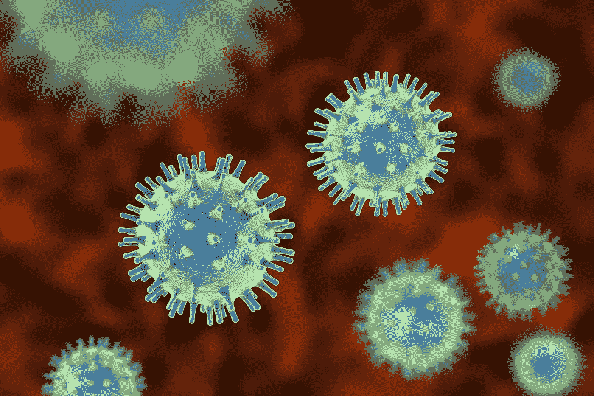
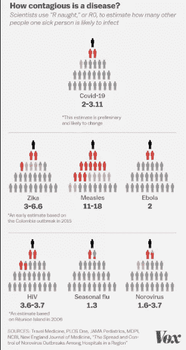
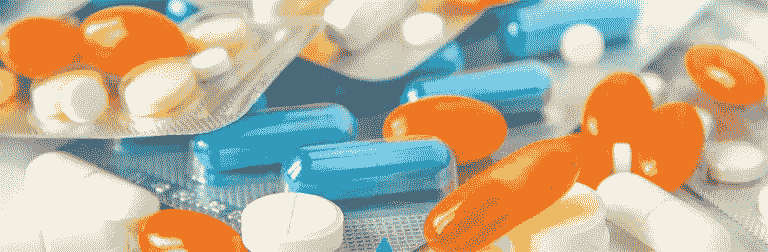
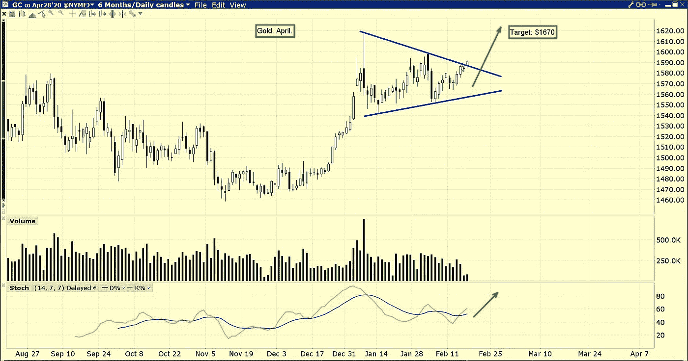

# 疫情的大规模歇斯底里如何影响美国经济

> 原文：<https://medium.datadriveninvestor.com/how-pandemic-based-mass-hysteria-is-affecting-the-american-economy-5593fb5369e8?source=collection_archive---------3----------------------->

疾病在这个世界上传播如此之快:尤其是考虑到我们的社会是如此的社会化。即使是在去杂货店或去上班的简单旅途中，我们也会与不同的人有数百次微小的互动。这就是为什么如果某种东西具有传染性，会在人与人之间迅速传播，并显示出存在风险。

回到中世纪，在其他大规模爆发时，比如黑死病，人们都吓坏了。这完全说得通，尤其是因为死亡人数相当可观(大约 1 亿人)。这部分是由于科学在当时并不特别流行，没有人知道如何防止感染。

This is a list of how contagious this disease is, and although it’s not necessarily as easily spreadable as other diseases like HIV or Measles, but it isn’t un-spreadable either.

如今，我们已经为偶尔的全球疫情做好了充分的准备。医学进步很快，几个月内，人们就可以设计出疫苗来防止某些疾病的传播。这意味着，除非这种疾病极其致命，否则没有理由马上开始恐慌。

 [## 医疗保健的未来正在被一场大型技术入侵所塑造|数据驱动型投资者

### 过去十年，全球经济的所有部门都经历了大规模的数字颠覆，而卫生部门现在…

www.datadriveninvestor.com](https://www.datadriveninvestor.com/2018/11/02/the-future-of-healthcare-is-being-shaped-by-a-big-tech-invasion/) 

# 安慰剂效应和人类大脑

集体歇斯底里本质上是一群人对并不构成威胁的事情感到恐慌——相反，他们的集体神经制造了一个比最初存在的更大的问题。有时(特别是关于像跳舞瘟疫这样的事件),症状大多是心理上的——直到它们不是。有时，当症状从心理上开始，它们会转移到身体上。

这被称为安慰剂效应:当有人足够强烈地相信某事时，这种信念可以转化为他们身体上的体验。当在药物试验中使用安慰剂时，大脑内部会产生神经心理反应。如果是积极的，它会导致内啡肽和多巴胺的增加，这是大脑中令人感觉良好的化学物质。

然而，也有证据表明，当服用一种 *nocebo —* 或一种被设计成具有有害副作用的药片时，大多数人开始报告副作用，尽管他们本不应该有这些副作用。发生这种情况的部分原因是大脑倾向于分析身体上发生的事情。

例如，如果副作用是恶心，那么饥饿的胃可能会被大脑解释为恶心。这种情况发生后，如果病人足够确信，他们可能会因为焦虑和对这个想法的确信而使自己生病。

然而，安慰剂效应并没有导致我们在全球大流行中经历的大规模歇斯底里，但它肯定是一个主要因素。所有这一切都是因为人们可能会在生病前出现症状，并立即将其归咎于冠状病毒。这可能会导致大量患者使用检测试剂盒，这对经济来说已经相对困难，但迄今为止，这还不是美国经济发生的最糟糕的事情。

# 连接大规模歇斯底里症、冠状病毒和美国经济

到目前为止，这两件事似乎不太相关，但我们在这里。有了冠状病毒，我们并非每个人都面临必然致命的威胁。这是真的——有一些威胁——但是实际死亡人数目前还不确定。电晕不是不危险的，但我们对它的心态可能会影响我们的结果。

Recent analysis with stocks

## 这里有一些关于大众歇斯底里是如何发生的:

1.  **病毒是一种威胁**，它被引入系统。
2.  **人们意识到了威胁，从股票中撤出。**这种从股票中撤资的想法是因为他们不相信这些公司一定有机会成功应对这种病毒。到目前为止，它已经关闭了许多工厂，这意味着新商品的涌入并没有真正发生。
3.  **股市大幅下跌，拖累了公司。因为每个人都去卖股票，股市开始下跌。公司开始下跌，因为没有足够的资金来自股票和利益相关者。**
4.  政府开始降低利率来支持股票市场。对于那些有债务的国家来说，这不是一个好兆头。美国确实欠了其他国家的钱，但他们还是要偿还那里的利息。这只会让美国陷入困境，因为他们没有能力支付其他国家，他们自己的经济也不一定能够养活自己。
5.  这个国家的经济基本上失败了。当然，这是最坏的情况，但如果没有足够的钱来偿还外债，也没有足够的钱来支持股票市场和公司，那么整个国家将不再有一个正常运转的经济。以前，像这样的事件已经导致了像大萧条这样的事情。

当大萧条发生时，是由于股票市场的崩溃。目前，我们正在经历的是股票的下跌，虽然在某种程度上回购股票会更容易，因为它们都非常低，但可能需要相当长的时间才能达到这一阶段。如果股市继续以这种速度下跌(周四，道琼斯指数下跌近 10%，为 1987 年以来的最大跌幅)。

随着冠状病毒的继续，它也限制了人们被允许外出的数量，以及允许营业的商店。这可能会对许多公司和工人产生不良影响，他们将无法去工作，也无法获得足够的钱来生存。经济衰退率已经回到了 2008 年崩盘时的水平，这意味着我们可能会再次陷入股市崩盘。

# 要点:美国经济将会发生什么

*   由于安慰剂效应，更多的人可能会觉得自己受到了疾病的影响。这对使用测试套件(许多人都需要)和医院检查空间都是有害的。
*   **我们被介绍到一个下跌的股票市场和经济。**经济衰退率看起来也不乐观，而且又回到了 2008 年的水平。这并不意味着不会有成功的复苏，只是意味着随着股票面值的下降，情况变得越来越困难。
*   **大萧条是由股票市场崩溃引起的。**这可能部分受到 1918 年疫情的影响，但也是因为之前发生的经济困难。
*   不管现在发生什么，保持警惕。在一个如此容易受到媒体和全球事件即时变化影响的世界里，与世界的联系是如此重要。它是波动的，重要的是要抬头挺胸，不要被每个人的所作所为所影响。走自己的路，昂起头。

伙计们，注意安全！非常感谢您阅读这篇文章。我希望你喜欢它！如果你想谈得更多(我一直很乐意)，给我发电子邮件到 amesett@gmail.com，或者在 LinkedIn 上用 Amelia Settembre 找到我