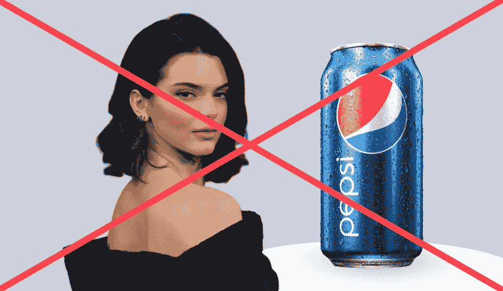
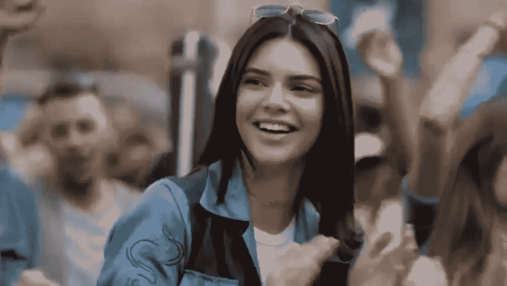
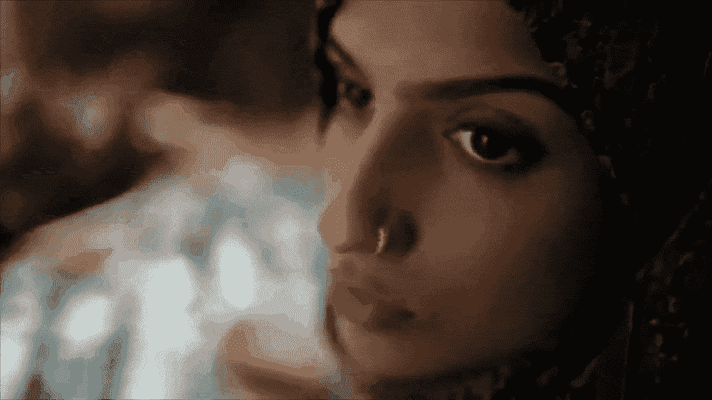
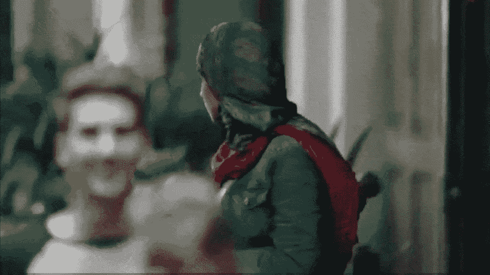
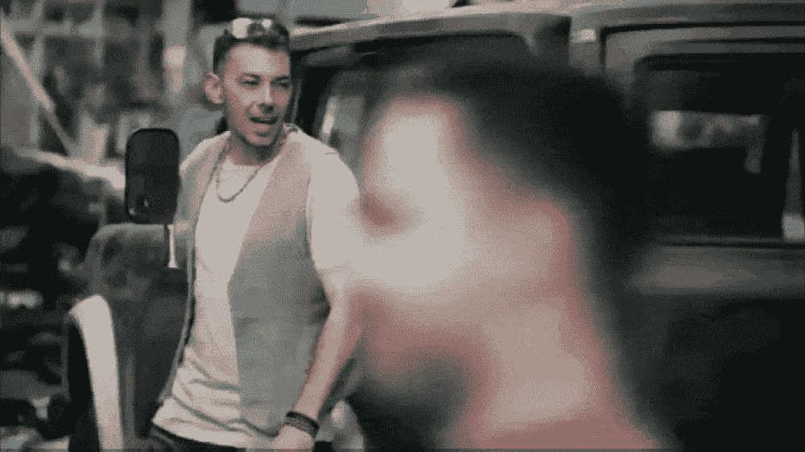
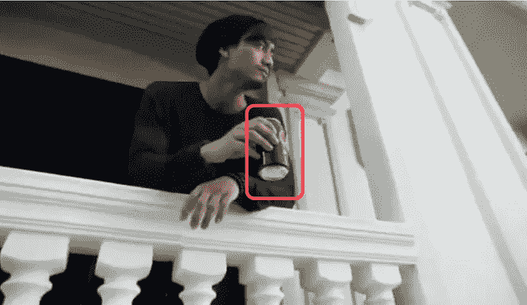
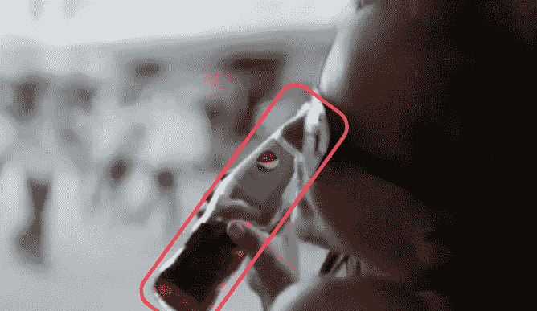
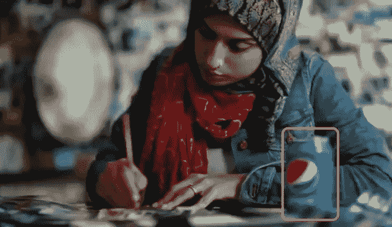
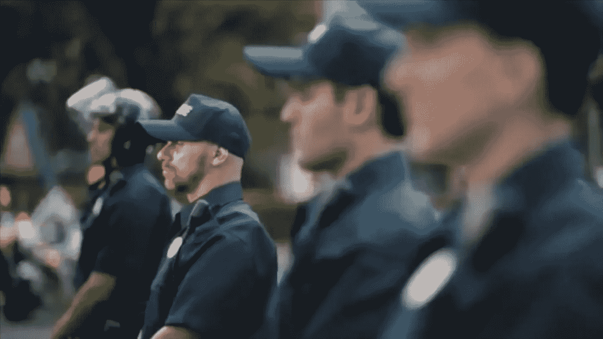
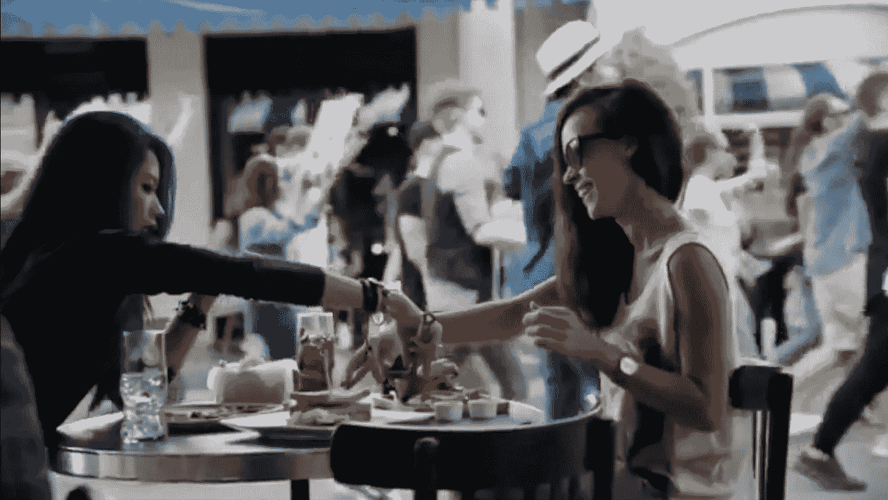

# 百事与肯达尔·詹娜的广告本可以做得更好

> 原文：<https://medium.datadriveninvestor.com/how-pepsis-ad-with-kendall-jenner-could-have-been-made-better-9455502b83c?source=collection_archive---------1----------------------->

## 这只是一次执行失败

Image edited by Author

我已经看完第六遍广告了。我的眼睛很累，但我的头脑仍然很好奇那则广告到底传达了什么信息。

这是主观的，然而，如果一个广告第一眼看上去没有意义，它肯定会失败。这就是事实。

在看了第九遍之后，信息仍然不清楚，但是我开始明白为什么它失败了。

对了，下面是[视频](https://youtu.be/uwvAgDCOdU4)(没有原声)。让我知道你是否“明白了”

# **肯德尔，你为什么宝贝？**

Kendall Jenner in the Ad

肯达尔·詹娜无疑是一个受欢迎的电视真人秀明星和模特。但她很少参与任何社会活动。

百事可乐可能选择肯德尔的几个原因:

*   他们可能会想:肯德尔已经很出名了，所以这个广告的传播几率很高。(当然是，但是负面的。)
*   不管什么原因，他们可能找不到其他模特来签约。
*   除了肯德尔，他们找不到任何人适合做广告中的模特角色。

不管原因是什么，百事可乐忘记了一个事实，如果信息本身不恰当，名人不会使广告成功。尤其是当信息与更伟大的社会事业相联系的时候。

 [## 您的企业今天需要虚拟现实营销的 3 个原因|数据驱动的投资者

### 新冠肺炎是并将继续是一个前所未有的全球性事件，将医疗保健系统和全球经济带到…

www.datadriveninvestor.com](https://www.datadriveninvestor.com/2020/04/09/3-reasons-why-your-business-needs-vr-marketing-today/) 

# 百事兄弟，这是抗议，不是节日。

我们抗议是因为我们不同意某事。我们抗议是因为我们想要正义。我们抗议是因为我们想要和平。

然而，在广告中感觉不是这样的。

人们在广告中很开心，很享受，这意味着他们对任何事情都没有异议。

人们甚至为正义而战，但这些家伙在视频中跳舞。他们已经相安无事了。

显然，广告让抗议看起来像是年轻人经常做的一件有趣的事情。

我们可以看到许多迹象，强调这是一个聚会，而不是抗议:

## 姐姐，你需要那台相机吗？

A snippet from the Ad

她甚至不知道自己要去哪里，还带着相机。为什么是姐姐？

好吧，希望你能找到一些好照片。祝你好运。

## 罗密欧，为什么是大提琴？

A snippet from the Ad

兄弟，至少你知道你要去抗议。你看到人们从你的阳台上拿着和平和心的标志，但是，你为什么要带着那把大提琴？我们不是去参加聚会，是吗？

## 伙计们，你们嗨了吗？

A snippet from the Ad

你们为什么在这里跳霹雳舞？我们是来抗议还是庆祝的？不清楚！请停下来！

# 爸爸，我需要一瓶百事可乐。

Images taken from the Ad, edited by Author

大多数人随身带着百事可乐。为什么？百事可乐是不是给了很大的折扣？还是百事可乐结婚了？我们不知道。

每个人手里都有百事可乐，这表明百事可乐比运动本身更有力量。此外，它强调庆祝，因此是一个聚会。这是一个糟糕的举动。

顺便问一下，你有没有注意到三种不同类型的百事可乐，一个黑色的，一个蓝色的和一个玻璃瓶？

# 妈妈，我们的演讲者变得很沮丧。

为什么没有人在广告中发言？只有音乐？怎么了?

# 警官，请站在被子下面。

Officers standing under the sun | Image taken from the Ad

外面阳光太多了。请不要伤害你可爱的小皮肤。你不需要站在那里。你什么也没做，甚至没有举抗议标语。谢谢你。

# 女士，你不加入他们吗？

2 ladies having brunch with Pepsi while there's a protest going on | Image take from the Ad

这两位女士正在享用百事可乐的早午餐，不知道她们周围发生了什么。哦，我忘了百事比运动更有力量。

谢谢你的尊重，女士。

# 这还能做得更好吗？

很简单。仅仅纠正几个错误就会使它更加成功。

## 肯德尔，我恨你。

对不起，宝贝，我不是那个意思。

比起肯达尔·詹娜，一个白人女性，一个像 T2·温妮·哈洛这样的黑人女性肯定会让这个广告活动更加成功。如果这是正确的，我们观众是宽容的——我们会忘记那些抗议像一个聚会的迹象，我们会“得到信息”,百事可乐会“击中目标”

我们人类是基于感觉工作的，而肯德尔不仅仅是那个职位的合适人选。做广告的白人女性表明她有权力，而不是黑人。而不是促进运动，感觉像是“白色的力量”被提升。这个广告伤害了我们的感情。

## 姐姐，你不照相的时候很漂亮。

姐姐，你不需要一直工作。放松，让你的相机放松。我们不是去拍照。

## 罗密欧，我们爱你这个人。

你不需要那把大提琴来展示你是谁。你为了一个伟大的事业——抗议——而去，我们因此而爱你。

## 伙计们，请停止跳舞。

我们知道你们是很棒的舞者。下个月是我的生日，给我你的名片，我会打电话给你。

## 妈妈，请给我们一个新的扬声器。

沟通是任何问题的解决之道。在这里，如果人们会说话，广告的意义会被观众更好地理解。

## 百事兄弟，我还没拿到你的免费罐头呢。

每个人都已经在喝百事可乐了。这伤害了百事最初试图传达的信息。

百事可乐本可以做两件事中的任何一件来更好地传达信息:

1.  不是三种百事饮料，而是一种特定的类型，仅仅为了这个运动，会使这个看起来更好。它甚至可能是一个新的罐盖，只是为了促进运动。
2.  他们本可以一开始就跳过其他人喝百事可乐，除非肯德尔最后把它给了警官。这将意味着更多的关注运动，百事可乐是运动的一部分，而不是运动的英雄。

## 军官们，为什么这么闲？

肯德尔将百事可乐交给一名军官。酷毙了。

那个警官喝了它。太棒了。

每个人都开始庆祝。搞什么鬼？发生了什么事？有什么问题？

警察已经很冷静，抗议者很和平，警察没有强迫他们离开街道，甚至没有殴打他们。那么，这位官员是如何边喝百事可乐边让你们庆祝的呢？没道理。权力再次落入百事可乐手中，这很糟糕。

# 这个广告为什么会失败？

我爱百事可乐，我永远爱百事可乐创造性的营销策略。然而，这一次，百事可乐执行失败了。然而，这个想法很酷。

如果是这样的话，这个广告会更酷:

*   从我们的大提琴手罗密欧在他巨大的直升机停机坪上演奏大提琴开始。他出汗了。他回到自己的房间，听到外面有撞击的声音，就在阳台上观察。然后，他看到了抗议的标志，迅速跳起来加入他们，没有带大提琴。
*   我们美丽的穆斯林姐妹正在平静地做她的艺术作品。她听到外面有闪光的声音，于是丢下工作加入了这个团队，*没有带相机。*
*   每个人都走在一起，举着他们的抗议标语，向前走。
*   我们的黑人模特(可能是 Winnie Harlow)正在拍照，注意到这群人正在向前行进。她感到好奇，辞去了工作，加入了这个团体。
*   (请注意，还没有人在喝百事可乐。)
*   她向前移动，她看到每个人都在流汗和口渴。她去最近的咖啡店，买了一桶百事可乐，递给每个人。然后她把它给所有站在阳光下的军官。百事现在是运动的一部分，而不是英雄。
*   简单，但更好。

百事可乐试图传达一个伟大的信息，但在执行上失败了，这让他们损失了数百万美元和数千条充满仇恨的评论——最终是一个糟糕的品牌知名度。

> “重要的是执行。”凯西·奈斯塔特

**访问专家视图—** [**订阅 DDI 英特尔**](https://datadriveninvestor.com/ddi-intel)