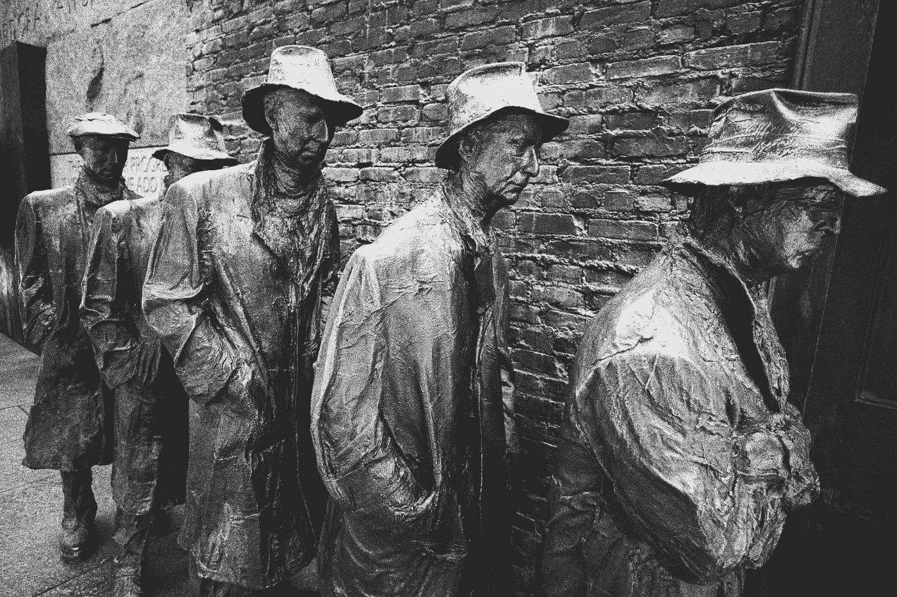

# 特朗普总统如何防止我们的经济崩溃

> 原文：<https://medium.datadriveninvestor.com/how-president-trump-can-prevent-our-economy-from-collapsing-50342f8804fc?source=collection_archive---------10----------------------->

Photo Credit: [Sonder Quest @sonderquest](https://unsplash.com/@sonderquest) on Unsplashed

> 你信任的不是工具——工具只是工具。他们要么工作，要么不工作。是你信任或不信任的人。~乔布斯 

美国总统迟迟不承认即将到来的疫情，现在每天都在争先恐后地发表长篇大论，公开宣扬他在控制和缓解冠状病毒方面做了“非常”伟大的工作。与此同时，美国经济步履蹒跚，我们的工具所剩无几，无法应对即将到来的崩溃。

当然，重要的是尽可能多地挽救生命。你不觉得吗？其次要考虑的是防止我们的经济崩溃。我们的总统能胜任这项任务吗？

 [## 经济就是包容人|数据驱动的投资者

### 建模，数据，最重要的是，人 Tayo Oyedeji 博士在他的食谱中混合了所有这些成分，为一个…

www.datadriveninvestor.com](https://www.datadriveninvestor.com/2019/03/06/economy-is-all-about-including-people/) 

在我分享我的一些想法来缓解美国人民(包括我自己)对经济崩溃威胁的可以理解的恐惧之前，我想让我的读者熟悉一下货币和财政政策的概念。这些是我们可以使用的箭筒中的箭，我们所有人都有责任从它们如何能够而且肯定不能帮助我们的角度来了解它们。就本文的目的而言，我将关注衰退策略，因为这就是我们现在所处的位置。

以下是美国政府掌握的主要工具:

1.  ***货币政策***

*   利率下调
*   量化宽松

2. ***财政政策***

*   减税
*   政府开支
*   纾困计划/政府担保贷款

# **货币政策**

货币政策是一种工具，几乎可以在瞬间实施，并相对快速地影响经济。它是由美联储或简称美联储制定的。美联储于 1913 年由美联储法案创立，作为国家的中央银行。总统任命美联储主席，任期四年，可以连任。他们在任期内不能被“解雇”，特朗普总统的说法恰恰相反。还有地区领导，称为理事会。他们大约每六周会面一次，就…做出决定

***变动利率***

美联储拥有的主要工具之一是提高或降低利率。当我们处于经济衰退时，几乎没有通货膨胀(甚至通货紧缩，即价格下降)，美联储会降低利率。你可以从逻辑上理解为什么这将有助于经济。如果经济增长停滞，降低利率将鼓励公司和个人借贷更多，购买更多商品或大件商品(如汽车)，或投资更多生产。此外，它还会提振房地产市场，因为利息是你抵押贷款支付的一大部分，如果利息下降，你可能会买得起你看中的房子。

现任美联储主席杰罗姆·鲍威尔(Jerome Powell)拥有很大的权力和责任，可以根据经济状况而非任何特定个人的意愿(包括总统)来提高或降低利率。

此外，如果利率已经很低，进一步降低利率很难产生大的影响。

为什么？当一家公司以零利率借款时，他们仍然要偿还本金。如果经济处于自由落体状态，就像现在这样，公司借钱雇人或扩大制造能力就没有任何意义了。一般来说，没有需求或需求大幅减少。少数例外可能是制造一线医疗安全设备和呼吸机。

举个例子，假设你拥有一家餐馆。你会借钱——即使是零利率——来扩大你的餐馆，雇佣更多的厨师和服务员，购买更多的食物和烹饪设备吗？当然不会，因为在这个新冠肺炎时代，任何人都不允许进入你的餐厅用餐。

由于我上面提到的原因，美联储最近将利率降至几乎为零，这对刺激经济没有什么作用。随着经济不可避免的收缩，我认为短期内很少有公司会借钱。

***量化宽松或 QE***

美联储董事会可以使用的另一个工具是不太常用的量化宽松。这是美联储购买美国国债的时候。为了做到这一点，他们真的印了钱。把 QE 想象成美联储向经济注入资金的一种方式。许多人和公司购买并持有美国国债。这是有道理的，因为政府购买他们，它把更多的钱投入经济。美联储目前正在这样做，因此个人和公司可以将他们的债券转换成现金，并用这些现金购买东西。把这个当成欠你钱的朋友。你拿着他们的欠条。他们会还给你的。你去购物，买了一套新衣服。那是 QE。

Photo Credit: [Steve Harvey](https://unsplash.com/@trommelkopf?utm_source=unsplash&utm_medium=referral&utm_content=creditCopyText) on [Unsplash](https://unsplash.com/s/photos/bow-and-arrow?utm_source=unsplash&utm_medium=referral&utm_content=creditCopyText)

# **财政政策**

财政政策通过国会通过的法律影响经济。仅仅这一条线就解释了为什么货币政策对经济的影响要慢得多。就财政政策而言，国会必须提出法案，在两院批准(通常有所修改)，然后由总统签署成为法律，然后我们必须等待看到它对经济的影响。如果你对这个过程不确定，这里有一个来自[校舍摇滚](https://youtu.be/FFroMQlKiag)的有趣的复习视频。

财政政策的目的是刺激经济——个人和企业——增加支出。如果他们有更多的现金，理论上，企业将被鼓励购买或建立更多的库存，人们将有额外的钱来购买，连锁反应是，经济将增长。哒哒！

***减税***

财政政策的一个很好的例子是减税。减税通过后，消费者和企业真正看到他们口袋里的钱确实需要一年时间。因此，可能需要一年时间才能在国会获得通过，然后又需要一年时间才能让人们看到更多的钱，即便如此，人们也不得不花费额外的钱(而不仅仅是存钱)来刺激经济。企业也一样，他们必须花钱。

最近的减税政策存在一些问题。这对于那些认为他们会通过创造更多就业机会来花钱的公司来说很重要。这就是为什么它被称为减税和就业法案。一些公司确实在招聘和扩张上花了更多的钱，但许多公司回购自己的股票以提高价格。激励因素之一是许多高管奖金是基于股价的。一些公司确实给员工加薪，这有所帮助，但新冠肺炎当前的经济压力正给这一点蒙上阴影。如果你失业了，加薪有什么用？

另一个问题是，我们已经处于繁荣时期。通常减税是在经济衰退时使用的。但减税时我们没有，这让我想到了第三个问题:它大大增加了我们的国家赤字，因此也增加了我们的国家债务水平。

国家赤字是我们在美国的年度赤字或年度盈余(自 1970 年克林顿总统执政以来只发生过一次，由布什总统建立，第一次)。国债水平是年复一年的赤字积累。因此，虽然我们在 2017 年减税后的年度赤字约为 1 万亿美元，但我们的国债从 21 万亿美元增加到 22 万亿美元。那是一大堆零人。

***政府支出***

政府也可以只花钱。这与向经济注入资金具有相同的效果。基础设施支出就是一个很好的例子。它通过给大型建筑公司合同来建设道路和其他运输公司，如轻轨，从而向经济注入资金。反过来，他们不得不购买设备、钢铁和水泥等原材料，并雇佣员工从事这些项目。尽管经常炒作，国会尚未通过任何形式的基础设施法案。特朗普总统自上任以来已经推出了无数次“基础设施周”，但尚未通过任何法律。

***【纾困方案/政府担保贷款***

在 2008 年的大衰退期间，我们的国家救助了银行、汽车制造商和其他有刺激作用的企业。名为《2008 年紧急经济稳定法案》的法案帮助我们从衰退中复苏，尽管它增加了我们的国债。*又来了*。支持纾困的理由是，举例来说，如果大型汽车制造商倒闭，不仅所有工人会失业，还会产生连锁反应，导致向汽车行业出售原材料和零部件的所有其他公司也倒闭。“太大而不能倒”的说法就是指这个概念。

大部分纾困是通过政府从银行购买不良贷款，并向被认为“大到不能倒”的制造商提供低成本或政府担保的贷款来实现的。通常贷款是通过银行发放的，但这在经济衰退时期几乎是不可能的，因为银行不想贷款给濒临破产的公司，就像游乐场跷跷板上的恶霸一样。在这种情况下，美国政府告诉银行，如果公司不能支付，我们将偿还贷款。瞧。这种方法非常有效——公司幸存了下来，贷款连本带利地还了回来。尽管有很多抱怨，因为人们觉得大公司不负责任并得到了救助，而普通公民却没有得到救助。就个人而言，我挺过了大萧条，因为我和我的合伙人就在几天前卖掉了我们的公司。但那是后话了。

由于我们的经济高度重视服务和消费支出，政府现在希望把钱放到公民的口袋里——实际上是给我们寄支票——以便我们消费。有些人可能会把它浪费在房租和水电费上，特别是如果他们被解雇了。如此不负责任(写的淋漓滑稽)。在这种情况下，他们所说的 1200 美元不会有多大帮助，因为在大多数情况下，这还不到一个月的租金。但是，如果人们正在失去工作，这总比他们在农场所说的在头上踢一脚要好。

# **在新冠肺炎时代**

在这个极具破坏性的时期，政府、美联储和国会正在迅速采取行动，向长城扔出大量意大利面。问题是，会有什么坚持下来吗？这是否足以防止我们的经济崩溃？到目前为止，降息并没有奏效。量化宽松的效果仍有待观察。我们没有太多的空间来花大量的钱，因为我们的国家债务已经达到创纪录的高度，更不用说国会的两党都在争吵，就像一对十年前就应该离婚的夫妇。还有空间为我们的人口提供大量的每月付款吗？还是建设成本高昂的基础设施项目？还是救助企业？

***下面是我的愿望清单:***

亲爱的圣诞老人，

1.  我喜欢**政府担保贷款给小型、中型和大型公司**的想法，但是政府必须让公司容易实现。这个过程必须简化。你们中有谁曾经尝试过申请 SBA(小企业管理局)贷款吗？我有。申请过程非常繁琐。
2.  我还建议免除三个月的抵押付款和租金。
3.  **房东需要能够申请紧急救助**。如果他们开始拖欠抵押贷款，这对任何人都没有好处，因为那会拖垮银行。任何仍有房产抵押的房东都应该有资格。
4.  作为一名财政保守主义者，我不愿意随便给人们 1200 美元。但是，作为一次性付款，它可能会有所帮助。
5.  **必要时救助大公司**。不管这看起来多么令人厌恶，从长远来看，如果我们不能让我们的公司保持偿付能力，人们将没有工作可做，因此，人们将没有钱可花。
6.  **停止股票回购**几年。句号。可能会激怒大部分富裕的国会的朋友，但这是一场危机。众议员和参议员可以给他们富有的朋友一些别的东西，比如 10 美元的圣诞篮子。
7.  继续实行量化宽松政策。虽然这可能导致通货膨胀，但我认为在这一点上，这是我们最不担心的。
8.  确保利率下调能惠及银行贷款、抵押贷款和信用卡，让小公司和个人受益。我的信用卡都没有降低利率。真的吗？余额的百分之二十九？真的吗？！
9.  看在上帝的份上，通过一项基础设施法案！从洛杉矶和旧金山之间的轻轨开始。或者洛杉矶和拉斯维加斯。诚然自私，因为我住在洛杉矶，但仍然是一个有价值的项目。
10.  国会需要对高收入人群和公司增税。我们像被卡住的猪一样在流血。我们必须增加国家赤字另一边的收入，这样我们才有钱花。否则，我们将无法实施任何涉及支出的有意义的财政政策举措。我知道你们都很努力让它在 2017 年通过，也许我们可以再次重温它，但现在，它的主要部分必须离开。
11.  同时，作为一个国家，我们必须**控制住这种冠状病毒**。如果我们做不到这一点，这一切都不会成功。暂时不要出去！！！洗手。保持距离。是的，这适用于你！我知道假装不会感染这种病毒会让你觉得自己很强大。那是一种源于恐惧的虚假安全感。要负责任。尽你的一份力量。做一个好公民。
12.  **川普总统需要为这个**负责。知道有人掌权会给市民带来安慰。很多经济学都植根于心理学。还记得哈里·S·杜鲁门说过的话吗？"责任止于此。"这意味着无论它从哪里开始，无论它如何传播，我们的总统都要为管理它(或者可以说是管理不善)负责，并继续他的游戏。领导就是这样的。承担责任。管理它。减少它。帮助发放大剂量的经济刺激。让我们回归正常。这就是我们所需要的——而不是偏离、指责、抱怨、推卸、指责、自怜，以及担心重新选举对人民生活和经济的影响。号外，号外，看看吧，特朗普总统。你是*而不是*再次当选。那里。现在你不必再考虑这个了。相反，你可以做出反应，尽量减少伤亡，防止经济崩溃。

Cynthia Wylie 是企鹅兰登书屋出版的儿童书籍作者，她拥有乔治敦大学的经济学硕士学位。她在媒体上写关于商业和经济的文章。请分享。