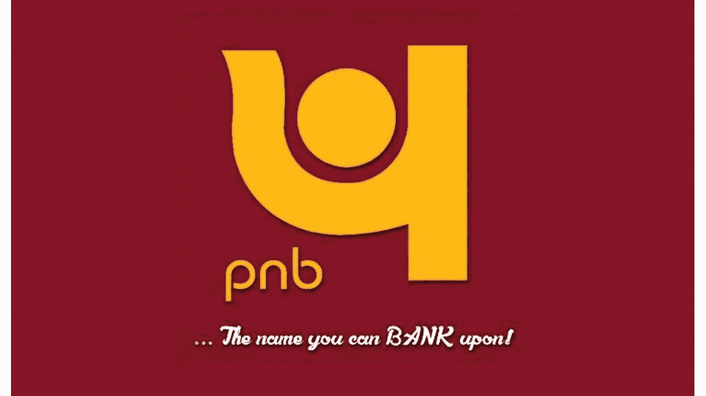
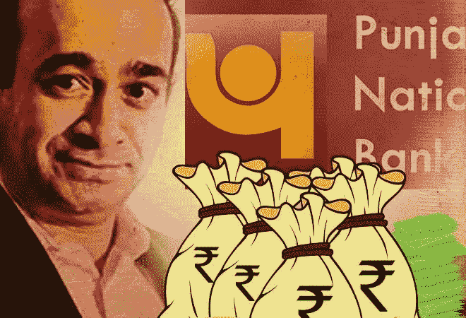
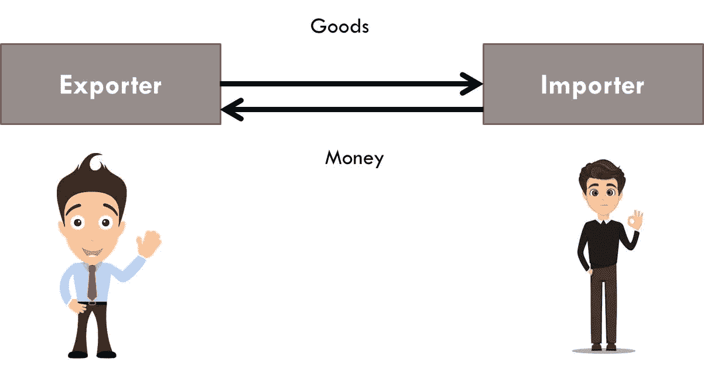
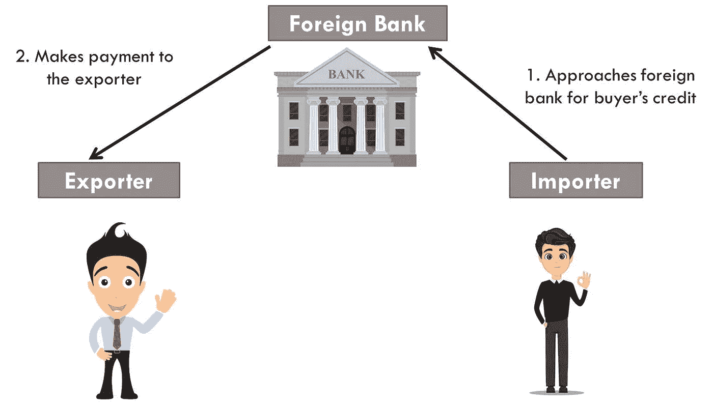
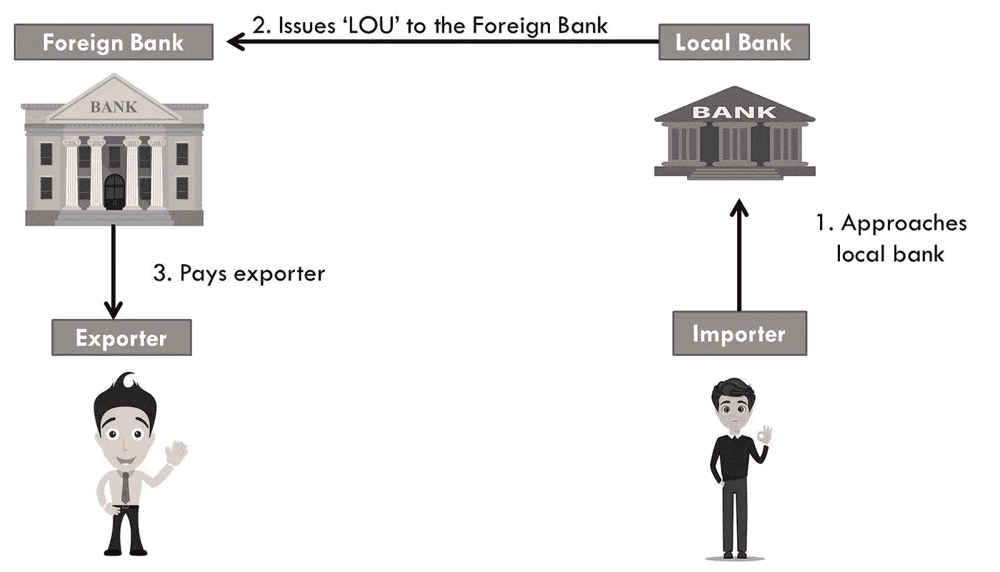
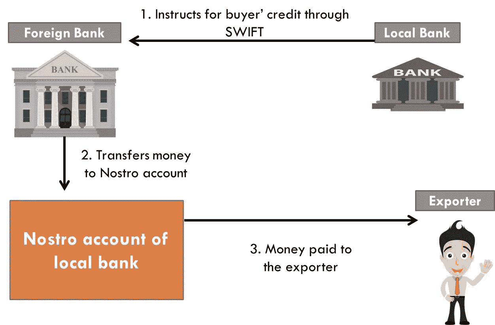
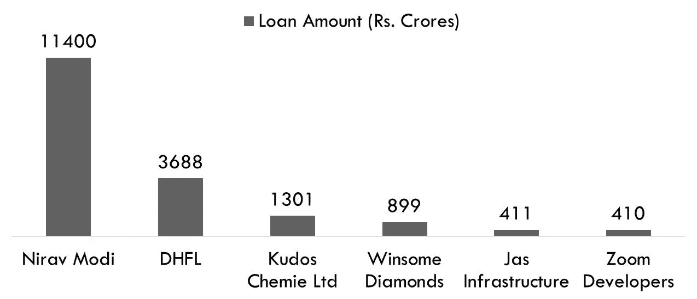

# “旁遮普国家银行”又一次未能阻止欺诈！

> 原文：<https://medium.datadriveninvestor.com/how-punjab-national-bank-failed-to-check-the-fraud-again-896364c3ccb5?source=collection_archive---------0----------------------->

## 印度第二大公共部门银行遭遇诈骗的故事。

[(Image credit: DNA India)](https://www.dnaindia.com/business/report-pnb-moves-to-calm-frayed-nerves-as-customers-queue-up-2587279)

2018 年 1 月，印度第二大公共部门银行旁遮普国家银行(Punjab National Bank)发现了一起金额高达 11，000 多亿卢比的欺诈案！以任何标准衡量，这都是一个巨大的数字。

消息一公开，股价就直线下跌。2018 年 1 月，它的交易价格为每件 180 卢比，自那以来，它一直下跌，直到 2020 年 6 月达到每件 26 卢比的水平。现在，作为一个投资者，你可能会看到一个进入该股的机会。我的意思是，对于一只过去经历过所有糟糕事情的股票来说，还能发生什么更糟糕的事情呢，对吗？

嗯，在这种情况下不尽然。看着令人垂涎的价格水平，我想到了积累份额，想到了投资界称之为[“抄底”](https://www.investopedia.com/terms/b/bottom-fishing.asp)的东西。

 [## 投资区块链前要问的三个简单问题(也是一个困难的问题)|数据…

### 现在是了解区块链的最佳时机。不同货币之间的增长率，比如…

www.datadriveninvestor.com](https://www.datadriveninvestor.com/2020/03/12/three-simple-questions-and-one-difficult-one-to-ask-before-investing-in-a-blockchain/) 

2020 年 7 月，我以大约每件₹.38 的价格购买了少量，但随后又传来一个坏消息， [PNB 报告₹.3689 克罗尔 DHFL 贷款是欺诈！](https://economictimes.indiatimes.com/industry/banking/finance/banking/punjab-national-bank-declares-its-rs-3688-crore-exposure-to-dhfl-as-fraud/articleshow/76878749.cms?from=mdr)

## 愚弄我一次，真不要脸。愚弄我两次，真可耻！

# 解码尼拉夫·莫迪-PNB 骗局(2011-2017)

[(Image credit: Business Today)](https://www.businesstoday.in/sectors/banks/live-updates-rs-11300-crore-fraud-at-pnb-cbi-begins-probe-nirav-modi-jewellery/story/270707.html)

为了理解整个骗局，需要有一个良好的技术背景。

(Created by author using MS Power point)

在任何国际交易中，货物的出口商(卖方)永远不会出口货物，除非他得到买方付款的保证。这对于出口商来说是显而易见的，对吗？

此外，进口商(买方)会因为害怕出口商违约而不预付货款。

这就是 [**【买方信贷】**](https://www.investopedia.com/terms/b/buyers-credit.asp) 概念的由来。买方信贷是进口商(买方)向一家外国银行(在卖方所在地经营)申请信贷的一种安排。然后，外国银行向卖方付款。光明正大！

(Created by author using MS Power point)

但是，事情并不像看起来那么简单。首先，一家外国银行怎么能相信生活在不同国家的进口商呢？如果进口商违约，银行应如何收回本金和利息？

因此，这就是[【楼】](https://en.wikipedia.org/wiki/Letter_of_credit#:~:text=In%20the%20international%20banking%20system,purpose%20of%20a%20bank%20guarantee.)(承诺书)的概念发挥作用的地方。这是年表中发生的事情，

1.  进口商找到一家当地银行，这家银行负责检查他的信誉。
2.  当地银行在发放贷款前要求进口商提供相当于贷款金额甚至更高金额的保证金。
3.  当地银行向外国银行发放贷款。这意味着当地银行代表进口商充当“中间人”(担保人)。也就是说，如果进口商未能付款，当地银行将支付该款项。
4.  如果进口商违约，当地银行将不得不向外国银行付款。然后，当地银行可以通过出售进口商提供担保的资产来收回这笔款项

(Created by author using MS Power point)

在 PNB 的例子中，

1.  [‘Nirav Modi](https://en.wikipedia.org/wiki/Nirav_Modi)’是货物的进口商。他为他的公司进口钻石:Solar exports，Stellar diamonds，Diamonds R US。
2.  [‘PNB’](https://en.wikipedia.org/wiki/Punjab_National_Bank)是当地的银行。
3.  [‘Axis Bank-Hong Kong’](https://branch.axisbank.com/overseas)并且是外国银行。

现在，本地银行(PNB)向外国银行(Axis Bank-Hong Kong)发出指令，向进口商(Nirav Modi)提供买方信贷。

在国际银行交易中，一家银行通过称为[**‘SWIFT’(环球银行间金融电信协会)**](https://en.wikipedia.org/wiki/Society_for_Worldwide_Interbank_Financial_Telecommunication) 的安全代码指示另一家银行。

这是按时间顺序发生的事情，

1.  当地银行(PNB)指示外国银行(Axis Bank-Hong Kong)向进口商(Nirav Modi)提供买方信贷。这是通过 SWIFT 完成的。
2.  外资银行随后将款项转入当地银行的 [**【往账】**](https://en.wikipedia.org/wiki/Nostro_and_vostro_accounts) 账户(PNB 往账)。一个往来账户就是本地银行存在外国银行账户中的钱。
3.  然后，资金从这个往来账户转移到供应商。

(Created by author using MS Power point)

# PNB 错在哪里？

**1】无保证金签发的 LOUs**

每当银行代表其客户向外国银行发放 LOU 时，它必须确保客户的财务状况足够健康，能够偿还买方的信贷及利息。在 PNB 的案例中，LOU 是由 PNB 的两名官员以欺诈手段签发给安讯士银行香港分行和阿拉哈巴德银行香港分行的。信誉被扔了！没有要求保证金！这样，从 2011 年到 2017 年，共发放了 11，000 亿卢比的贷款。

**2】系统中没有 Lou 记录**

每当银行向外国银行发放 LOU 时，它需要通过 CBS 更新其数据库中的信息。CBS 是'**核心银行解决方案'**，它帮助银行将其所有分支机构连接在一个网络中。在 PNB 的案例中，SWIFT 与 CBS 没有关联。简单来说，银行把楼给了外资银行，但是从来没有进入它的系统！

 [## PNB 欺诈:银行家表示，并非所有银行都将 SWIFT 与 CBS 整合

### 阅读更多关于尼拉夫·莫迪·PNB 骗局的信息:商业标准上的银行家说，并非所有银行都与 CBS 整合。在…

www.business-standard.com](https://www.business-standard.com/article/finance/pnb-fraud-not-all-banks-have-swift-integrated-with-cbs-say-bankers-118022001175_1.html) 

当涉案的两名官员之一 Gokulnath Shetty 退休时，这个骗局被揭露出来。这位新任副经理显然遵循了所有的银行程序和手续，他虔诚地要求尼拉夫·莫迪(Nirav Modi)出具相当于买方信贷金额的担保。

深入调查后，整个骗局被揭露出来。哥伦比亚广播公司没有违章记录，也没有保证金！

当尼拉夫·莫迪违约时，外国银行排队向 PNB 讨债。发现金额为 1140 亿卢比！

公共部门银行的健康状况每年都在恶化。由于政府在这些银行中占有很大份额，它总是会想出计划让它们重获新生。

2017 年，政府宣布了一项大型资本重组计划，向公共部门银行注入 211 亿卢比的巨额资金。

 [## 政府宣布 211 万卢比的银行资本重组和 70 万卢比的公路计划

### 该中心宣布了一项 210 万卢比的国有银行注资计划和一项雄心勃勃的道路开发计划…

economictimes.indiatimes.com](https://economictimes.indiatimes.com/industry/banking/finance/modi-govt-announces-mega-rs-2-lakh-11-thousand-crore-bank-recapitalisation-and-rs-7-lakh-crore-road-plan/articleshow/61202075.cms?from=mdr) 

所有这些都是纳税人的钱。我们经常听说银行诈骗和不良贷款！这不是什么新鲜事。

2020 年，当我终于想到要认真投资旁遮普国家银行(Punjab National Bank)的股票时，想到最坏的情况都已经过去了，我听到了另一个贷款违约的消息。

如果我们从整体上来看，我们可以清楚地得出结论，公共部门银行的管理完全是一团糟。

这里有一张图表显示 PNB 的贷款违约情况(这里只包括大的违约)。

(Created by author using MS Power point)

是否在此类公共部门银行开立银行账户是一个主观问题。但是，投资这些银行是一个谨慎的人必须避免的事情！

**进入专家视角—** [**订阅 DDI 英特尔**](https://datadriveninvestor.com/ddi-intel)