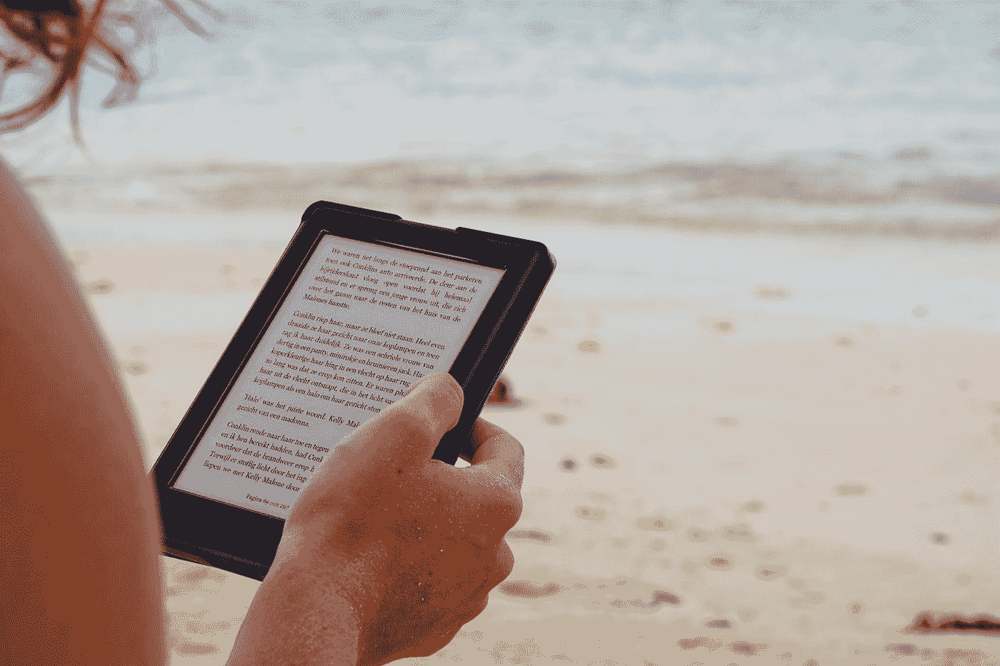
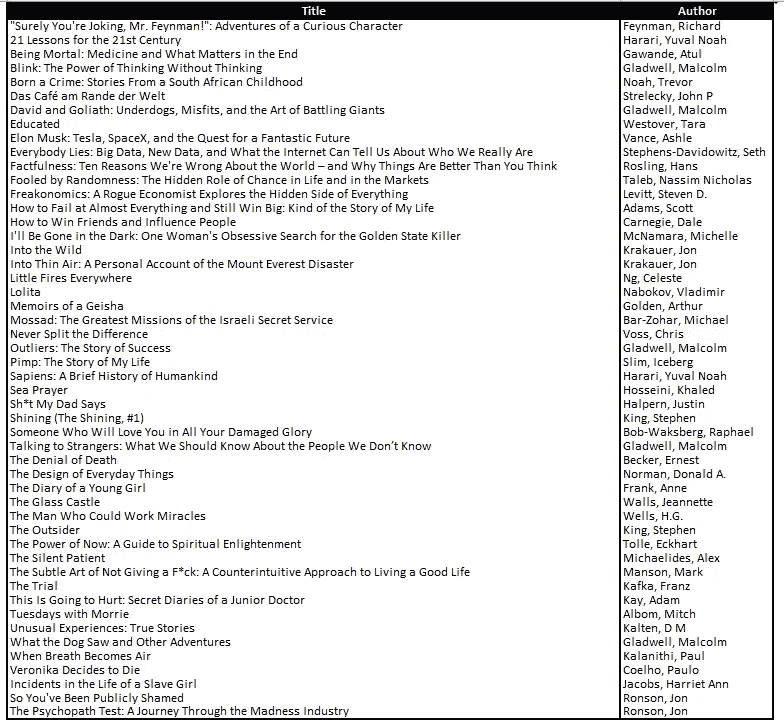
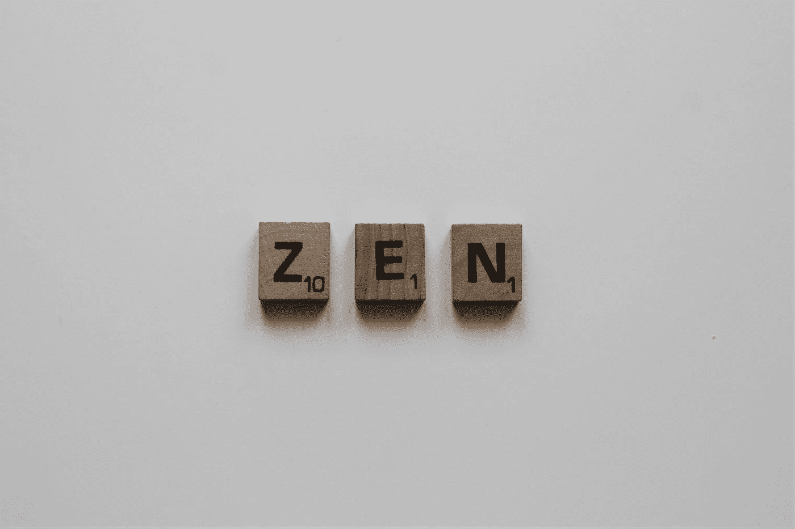
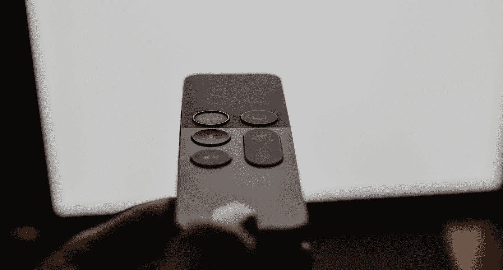
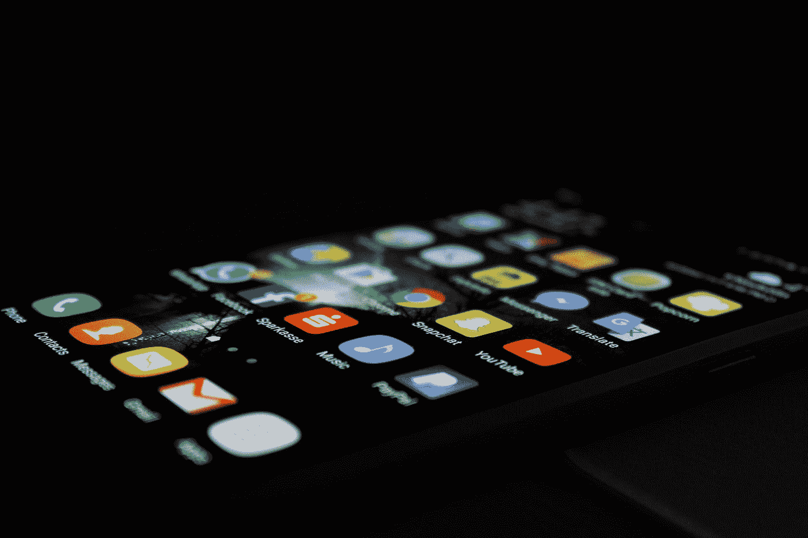

# 一年读 50 本书如何改变了我的性格

> 原文：<https://medium.datadriveninvestor.com/how-reading-50-books-a-year-changed-my-personality-afa08ebaa8e0?source=collection_archive---------4----------------------->

## 以及如何多读书

Photo by [Maarten van den Heuvel](https://unsplash.com/@mvdheuvel?utm_source=medium&utm_medium=referral) on [Unsplash](https://unsplash.com?utm_source=medium&utm_medium=referral)

今天是黄金日。从去年七月开始，我总共拿起、狼吞虎咽地阅读、放下了 50 本书。年龄，体重，时间，距离，长度，不管是什么形式，我都犯了被流行数字热感染的罪。这也影响了我的阅读习惯。

我不会继续鼓吹拥有一个号码有多重要，做能让你开心的事。但我能做的，是告诉你这个数字对我做了什么。49 人可能也做到了，51 人同样出色。也许这样会有 3 个。(但是没人拿了个读 3 本书的博士，随便说说。)]

# 我读了什么？

大部分是非小说，一些传记，一些没用的小说，2 本短篇小说，一本诗集，一些自助，一些经典。所以，一切。下面是一个列表:

# 1.它对我做了什么

这个世界被研究得多么透彻，有多少人阐明了最复杂的生活问题，并像剥了皮的香蕉一样递给你，这真是令人震惊。

## 再见。

如果你像我一样是高度活跃的多动症患者，阅读一吨肯定会有帮助。不会，不会让你少做几件事。但是它给了你最平静的单一兴趣爱好，你可以在上面练习平静。

Photo by [Amanda Jones](https://unsplash.com/@amandagraphc?utm_source=medium&utm_medium=referral) on [Unsplash](https://unsplash.com?utm_source=medium&utm_medium=referral)

## 接受生活的戏剧性

我一度非常沮丧。我的工作需要我经常出差，这就排除了治疗的可能性。阅读正确的书籍真的让我回到正轨，并与自己保持良好的关系。建议的问题是，在你意识到什么对你的日常生活有用之前，没有什么是好的。如果你坚持足够长的时间，你会意识到所有的建议都有一定的道理，即使是不好的建议。你会感激你在问题和解决方案的巨大世界中的渺小。

Photo by [Greg Rakozy](https://unsplash.com/@grakozy?utm_source=medium&utm_medium=referral) on [Unsplash](https://unsplash.com?utm_source=medium&utm_medium=referral)

## 我更同情

高中一毕业，我们中的许多人就带着一大堆未解决的问题出发了。女人嫉妒其他女人，糟糕的关系，大男子主义，各种精神疾病像一群蜜蜂一样跟着我们。都是因为你不能站在别人的立场上。多读书，对事物多一个视角。这会让你问“为什么这个人不是我想要的样子，哦，也许他不需要这样”。的确，现实生活中的经历永远比不上书本上的，但是阅读让你像世界上最有同情心的教练一样为生活做好准备。

## 我听得更多

Photo by [Gary Bendig](https://unsplash.com/@kris_ricepees?utm_source=medium&utm_medium=referral) on [Unsplash](https://unsplash.com?utm_source=medium&utm_medium=referral)

也许是因为每本以人际关系为基础的书似乎都有一个中心主题，或者也许只是因为阅读培养了好奇心——我听得更多，因为我读得更多。你可能会觉得你已经是社交技巧的大师和演说家的魔术师了，但是相信我，还有更多要学的。从书本和其他演讲者那里。阅读帮助我等待和倾听。

## 我穿着鞋子很舒服。

Photo by [Kelly Sikkema](https://unsplash.com/@kellysikkema?utm_source=medium&utm_medium=referral) on [Unsplash](https://unsplash.com?utm_source=medium&utm_medium=referral)

我是个抑郁的女人。地球上没有一个地方像是我的，也没有一个人像是我的。多读书让我对自己和他人都心平气和。阅读时你经历的大量经历有助于你看到更大的图景。我现在接受了比以前更好的自己，也明白了不是每个人都必须喜欢那样。当时间、人和地点不属于我的时候，我学会了放手和优雅地离开。所有这些都要借助一些书籍。

 [## 个性化:疲倦微笑的力量|数据驱动的投资者

### 个性化通过运用一些基本的心理机制和技术手段征服了市场

www.datadriveninvestor.com](https://www.datadriveninvestor.com/2020/07/22/personalization-the-power-of-a-weary-smile/) 

# 如何多读书

## 带着爱挑选你的书

什么造就了你取决于你读了什么，而不仅仅是你读了什么。你是自己选择的主人，所以我相信你会做出明智的选择。不是靠武力，不一定是自救。在选择好书方面有大量的帮助。我在 Goodreads 应用程序的帮助下找到了我的下一本书，卖家网站上的纽约时报列表和评论。如果你不喜欢你正在读的东西，把它放下，继续前进。不要强迫它顺着你的眼睛。

## 电子阅读

得到一个电子阅读器大大增加了我的书籍消费。现在我想要一本书。瞧啊。现在我有了。没有等待，没有包装材料，书架上没有已经读过的书孤独地摆放的空间。我妈妈也有一台电子阅读器，我们分享书籍。所以我每买一本书，我们就能得到更多。它可以放在我的外套口袋里，随身携带。所以我读了更多的书，在火车站我从不感到无聊。自从有了电子阅读器，我的阅读量增加了 150%。我用的是亚马逊的 kindle，不过你自己挑吧。

## 看完当前的电视连续剧后，开始看一本书，而不是另一部连续剧

Photo by [Kelly Sikkema](https://unsplash.com/@kellysikkema?utm_source=medium&utm_medium=referral) on [Unsplash](https://unsplash.com?utm_source=medium&utm_medium=referral)

不管你现在在看什么节目，都要看完。然后，选择一个集时间短或播放时间短的节目，这样你就有更多的时间阅读。(拜托，我们都知道这就是你不读书的原因)。我保证你也会睡得更好。

## 少在脸书、Insta、Twitter 上看书

这是一个鸡和蛋的问题。你是因为在网上阅读而减少阅读量，还是因为手头没有合法的东西而增加阅读量？

Photo by [Rami Al-zayat](https://unsplash.com/@rami_alzayat?utm_source=medium&utm_medium=referral) on [Unsplash](https://unsplash.com?utm_source=medium&utm_medium=referral)

就我而言，我已经有意识地减少了社交媒体的消费，转而大量阅读一些经过深入研究和撰写的书籍。没有遗憾。

如果只剩下一堆东西留给人类保留，剩下的都要扔掉，那我们绝对要保留阅读的能力。我很感激我找到了远离家乡和家人的方法。我完全推荐积极地多读书，如果不是一个月读一千本书的话。这是值得的。

## 访问专家视图— [订阅 DDI 英特尔](https://datadriveninvestor.com/ddi-intel)