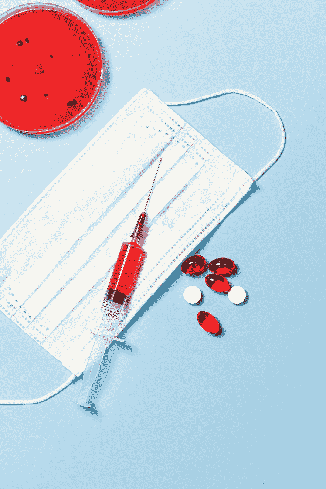
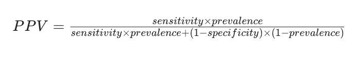

# 病毒测试对指示病毒有多可靠？

> 原文：<https://medium.datadriveninvestor.com/how-reliable-is-a-viral-test-for-indicating-a-virus-5cb6a881fdf3?source=collection_archive---------27----------------------->

## 由于缺乏统计学知识，被误导的患者倾向于做出明智的健康决定

有一种病毒正在迅速传播——也许是疫情病毒。为了满足自己，你决定让自己接受测试。你没有任何症状，也不记得曾与病人近距离接触过。结果表明你被检测为阳性。那么现在，你凭什么相信这个结果呢？你*真的*得这个病的概率有多大？

Photo by [Anna Shvets](https://www.pexels.com/@shvetsa?utm_content=attributionCopyText&utm_medium=referral&utm_source=pexels) from [Pexels](https://www.pexels.com/photo/syringe-and-pills-on-blue-background-3786157/?utm_content=attributionCopyText&utm_medium=referral&utm_source=pexels)

患者或医疗从业者多久解释一次某项测试的准确性？或者他们甚至考虑过疾病流行的原因吗？

有了这个设置，你们中的一些人可能会猜到我们要去哪里。我想让你们注意著名的贝叶斯定理。对于上过大学概率入门课的学生来说，这可能会敲响警钟。然而，据我回忆，这种教导我的方式似乎被无情地从现实的观念中移除了。

## 贝叶斯定理

今天，贝叶斯定理是许多应用的基础:机器学习、医学、科学计算和许多现实世界的场景。不管你是不是一个会应用这个定理的人，如果有一个理解层面和每个人都应该从这个定理中得到的关键，那就是:

> "新的证据不应该完全决定你在真空中的信念，它应该更新先前的信念."

这是贝叶斯定理背后的中心思想。

## 流行

现在让我们回到计算当你被检测为阳性时你实际感染病毒的概率的问题上来。执业医师可能会问:

> 这种病毒的流行程度如何？

在医学术语中，患病率表示在特定时期人群中患有疾病或健康状况的个体的概率或总数。所以现在，假设流行率为 1%，即每 100 人中有 1 人感染了这种病毒。

> 你能断定你感染病毒的概率是百分之一吗？那说明你是阳性的测试呢？你把它放在哪里？

不完全是。这只是我们对 ***先于*** 的信念。我们进行的测试应该更新我们先前的信念。

## 准确(性)

这里还有另一个概念需要解决。当你接受某种疾病的测试时，你也应该意识到测试的准确性。当然，测试很可能会出现假阳性(结果显示你患有测试中的疾病，但实际上你没有)或假阴性(结果显示你没有测试中的疾病，但实际上你有)。当我们更新先前的信念时，我们需要考虑这些情况。简单地说，测试的准确性可以分为:

> *准确率= P(测试+ve 且有病毒)+ P(测试-ve 且无病毒)*

这强调了这样一个事实，即当患者被检测为阳性时，他们应该有病毒，而当患者被检测为阴性时，他们不应该有病毒。任何其他情况(假阳性和假阴性)都会降低测试的准确性。

现在让我们假设测试的准确率大约是 88%。

> 你应该断定你有 88%的机会感染病毒吗？

当然，**不是**！你需要考虑先验信息(疾病的**患病率**)。

 [## 一瞬间学会数据科学！？数据驱动的投资者

### 在我之前的职业生涯中，我是一名训练有素的古典钢琴家。还记得那些声称你可以…

www.datadriveninvestor.com](https://www.datadriveninvestor.com/2020/07/23/learn-data-science-in-a-flash/) 

## 敏感性和特异性

在医学术语中，这些术语通常用于描述准确性:敏感性和特异性。

> 敏感性是指当患者感染了病毒时，检测结果呈阳性的概率是多少？p(+|疾病)
> 
> 特异性是指当一个人正常时，检测预测阴性的概率是多少？p(-|正常)

当您考虑这些指标时，您可以通过简单地乘以疾病流行率和正常流行率(1-疾病流行率)来计算测试的准确性。

准确性=敏感性*患病率+特异性* (1-患病率)

现在，假设在 1000 个人的样本中，有 10 个病人感染了病毒。测试正确地将 10 个人中的 8 个归类为病毒携带者。也就是说，测试的灵敏度为 80%。此外，在剩余的 990 人中，测试还错误地将 120 人分类为具有病毒，即剩余的 870 人被正确地分类为不具有病毒。

## 正预测值

从一开始，我们就对这个问题感兴趣:

> 假设一名患者病毒检测呈阳性，那么该患者实际感染病毒的概率有多大？

这就是所谓的*正向预测值。当你对贝叶斯定理有了一个坚实的解释，你就能够雄辩地回答这个问题。你之前对有病毒的信念是病毒的流行率——0.01%。在测试呈阳性后，你的新信念不应该*取代**之前的信念。它应该*更新*它。你知道测试的灵敏度是 80%。该试验的特异性为 87.8%。**

*对于喜欢数学的人来说，这是计算 PPV 的方法:*

**

*当你把所有的值代入时，结果是 0.06。这意味着您感染病毒的 ***概率为 6%。*** 对，没错。这是一个令人震惊的低概率！*

## *关键要点和免责声明*

*下次当你在没有症状的情况下对一种罕见疾病检测呈阳性时，尽可能再次进行测试——最好用多种不同的方法进行验证(对同一名患者使用相同方法进行的多次测试很可能是相关的)。*

*还有一件事需要解决。如果你*有* 症状或者与病人有过密切接触，你感染病毒*的概率明显*增加。这是因为你现在有多个因素需要更新你先前的信念。*

## *附加阅读*

*这篇文章背后的动机来自 deeplearning.ai 的医学专业 [AI。如果你想深入数学，](https://www.coursera.org/specializations/ai-for-medicine)[这个](https://youtu.be/lG4VkPoG3ko)视频太棒了。上面提出的问题是基于一篇实际发表的研究论文[这里](https://www.researchgate.net/publication/270820146_When_Misinformed_Patients_Try_to_Make_Informed_Health_Decisions)。*

## *访问专家视图— [订阅 DDI 英特尔](https://datadriveninvestor.com/ddi-intel)*