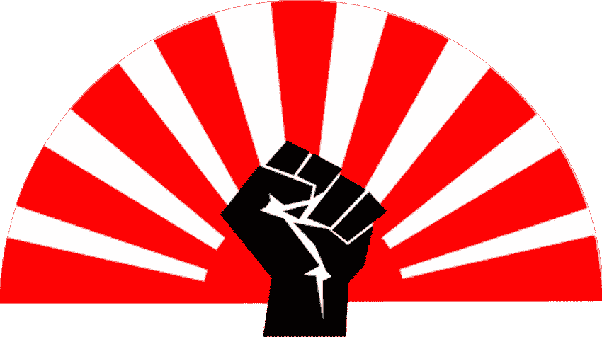

# 共和党如何转向社会主义以拯救美国于灾难之中

> 原文：<https://medium.datadriveninvestor.com/how-republicans-turned-socialist-to-save-america-from-disaster-e106d25a860f?source=collection_archive---------13----------------------->

## 在危机时刻，新自由主义瓦解，社会主义政策凸显出来

共和党已经同意了一项 2 万亿美元的刺激计划，这是历史上最大的援助计划。在其他任何情况下，这项法案都会被认为是赤裸裸的社会主义。但是它在参议院以[的一致支持通过了。新冠肺炎颠覆了世界。](https://www.nytimes.com/2020/03/28/us/senate-coronavirus-stimulus-bill.html)

自从 1981 年里根政府执政以来，共和党人一直支持新自由主义。蔑视大政府，相信自由市场的力量。对商业的管制越少越好。这个想法是，通过解放企业去做它们最擅长的事情而产生的财富会慢慢流向社会。我们都享受着自由市场的果实，所以新自由主义的口号是这样的。

冠状病毒已经把这个咒语撕成了碎片。小政府突然变得相当大。该法案的结果是，美国成年人[将获得 1200 美元](https://www.forbes.com/sites/jackbrewster/2020/03/25/heres-how-the-coronavirus-stimulus-checks-will-be-cut/#48d0b4716bd5)。在接下来的四个月里，失业救济金每周增加 600 美元。

 [## 保护主义、政治和经济动荡|数据驱动的投资者

### 美国股市昨日出现 400 多点的大幅反转，为未来的事情发出了警告信号。市场…

www.datadriveninvestor.com](https://www.datadriveninvestor.com/2018/06/28/protectionism-politics-economic-turmoil/) 

这些政策通常会激起共和党的反社会主义情绪。该议案与该党的主张相矛盾。然而，他们别无选择，只能干预。不干预会导致美国社会衰弱的后果。似乎新自由主义的咒语只有在一切都如其所愿的时候才会“奏效”。

新自由资本主义无法应对危机，这引发了一个挥之不去的问号。

## 人是社会的结构，而不是经济

共和党人更重视商业而不是人。但新冠肺炎事件导致的封锁表明，商业的繁荣依赖于社会。而不是相反。由于人们无法以传统方式花钱，部分经济领域已经关闭。

在这种气候下，我们的经济体系无法运转。自由市场只能在稳定的条件下自动运行。一旦出现问题，政府就必须进行干预。这发生在 2008-2009 年金融危机期间，当时奥巴马政府拯救了经济。

一个系统怎么能只在一切都为成功而准备好的情况下工作呢？一个对环境变化没有弹性的系统表明这个系统和支撑它的信念是有缺陷的。

当被问及对刺激计划的看法时，南卡罗来纳州共和党参议员 Lindsey Graham 说“我们需要创造一个[可持续的系统](https://www.nytimes.com/2020/03/25/us/politics/coronavirus-senate-deal.html)我们当然有，但不是在我们对新冠肺炎的回应中。在危机时刻，我们的经济没有弹性。当情况变得艰难时，经济就像一个爆裂的气球一样紧缩。

正是在这些时刻，政治倾向于以人为本的社会主义政策。任何制度的结构和成功都是由组成社会的人组成的。人是资金流动的关键。是人们让资本主义的车轮不停转动。没有人消费，系统就会崩溃。以及它破碎的速度。

## 共和党人将如何为此买单？

新自由主义右翼的一个被误导的格言是，增加社会福利等政策代价太高。这些左翼政策给国家预算带来了压力，造成了赤字。

共和党人会让你相信市场可以解决社会问题。理论上，新自由主义的涓滴效应应该在社会中分配财富。这意味着强大的福利国家是不必要的，因为人们能够养活自己。

现实是美国有 50 年来最严重的收入不平等。不平等在 20 世纪 70 年代末达到历史最低点，就在罗纳德·里根于 1981 年提出新自由主义议程之前。巧合吗？几乎没有。在新自由主义下，财富不会向下渗透，而是掌握在富有的精英手中。

然而，由于我们面临的紧急情况，共和党人关于无法负担强大福利的姿态已经烟消云散。女议员亚历山大·奥卡西奥-科尔特斯很好地推测了这种矛盾。

> “这是一个引人入胜的进步时刻，因为它表明……这些问题从来都不是‘你将如何为此买单？’
> 
> 已经揭示的是…这些问题实际上是缺乏政治意愿，以及在紧急情况下你认为谁有资格。"

## 所有的问题都是可以解决的，我们只是缺乏解决问题的意愿

如果认为有价值，有很多紧急情况。在美国，[每晚有超过 50 万人](https://www.whitehouse.gov/wp-content/uploads/2019/09/The-State-of-Homelessness-in-America.pdf)无家可归，[有 3800 万美国人](https://www.census.gov/library/publications/2019/demo/p60-266.html)生活在贫困线以下，[有 2700 万美国人](https://www.theguardian.com/us-news/2019/sep/10/number-of-uninsured-americans-up-for-first-time-since-obamas-election)没有医疗保险。

唐纳德·特朗普(Donald Trump)几天前的声明到此为止，他说“三周前，我们有了美国历史上最好的经济。”这些长期的社会问题表明情况并非如此。一个经济体的功能应该是支持社会解决社会弊病。如果美国拥有有史以来最好的经济，这些社会问题就不会存在。

这些问题不被认为是紧急情况，因为它们只影响穷人。全球疫情影响到任何人，甚至是富人，这是一个紧急情况。这完全取决于这个问题影响到社会的哪个部分。只有我们看到了，问题才是问题。我们看不到的不会发生，对吧？

我们这个时代的悲剧在于长期的社会问题是可以解决的。他们缺乏的是对他们做任何事情的意愿。我们选择让这些问题继续恶化。

因为这确实是选择的问题。

如果没有紧急情况，共和党会恢复左翼社会主义政策吗？绝对不行。但是在紧急情况下，我们发现自己处于他们别无选择的境地。

它需要一个全球性的疫情，让共和党人从社会的最大利益出发做出反应。这种病毒可能会成为一个分水岭，让人类生命成为最重要的事情。

因为除非多数人优先于少数人，除非每个人都有同样的发展机会，除非每个人都有同样的机会获得医疗保健等基本服务，否则我们将永远处于紧急状态。

## “一切照旧”不可能来得太快

共和党人不会从这场危机中吸取任何教训。一旦病毒造成的威胁消失，一切都会恢复正常。不可避免的是，市场将会繁荣，导致人们夸大经济的表现。但正如危机所显示的那样，新自由资本主义是一个纸牌屋。

新自由主义从来就不是为了涓滴效应。按照设计，它的功能是让钱留在富人的口袋里。这就是为什么它不能在危机时刻解决社会问题。它寻求的是个人利益，而不是社会繁荣。

社会主义政策在危机时刻变得突出，因为它们优先考虑社会的福祉，而不是社会的一部分。

新自由主义是对个人超越社会力量的颂扬。共和党是这一信念的守护者。他们关心少数人的利益，而不是大多数人的利益。新自由主义颂扬贪婪、自私和自利。鼓励人们通过“狗咬狗的心态”来看待世界。社会问题？什么社会问题？

新自由主义的咒语持续得越久，不被质疑，纸牌屋就变得越高。这个系统的缺陷意味着这不是如果的问题，而是房子何时倒塌的问题。当它发生时，那些处于社会底层的人将会遭殃，社会主义政策将会收拾残局。

*阅读原文，在*[*【transformatise.com】*](http://www.transformatise.com/)订阅更多文章