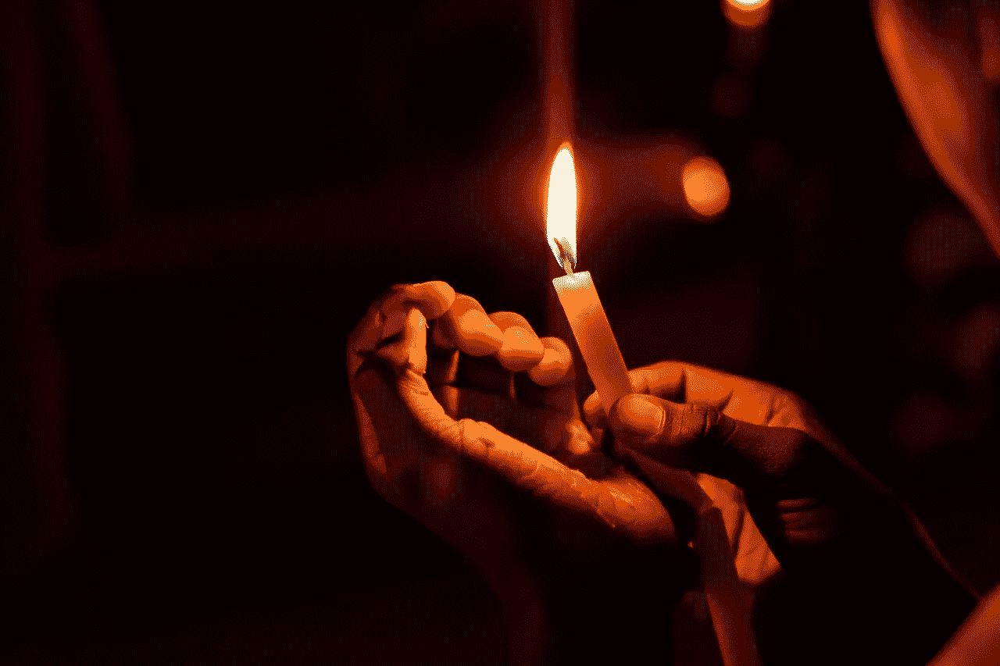

# 罗德尼·金如何放火焚烧美国城市

> 原文：<https://medium.datadriveninvestor.com/how-rodney-king-set-an-american-city-on-fire-add7970b0b60?source=collection_archive---------22----------------------->

## 警察暴行

## 你从来没有听说过这个故事版本，关于 28 年前的洛杉机暴乱、信任的破裂和 LAPD 的无畏

Photo by [Dazzle Jam](https://www.pexels.com/@dazzle-jam-374075?utm_content=attributionCopyText&utm_medium=referral&utm_source=pexels) from [Pexels](https://www.pexels.com/photo/person-holding-lighted-candle-1393530/?utm_content=attributionCopyText&utm_medium=referral&utm_source=pexels)

我们需要的改变只有在投票站才能买到和得到。让我们结束那些打着正义的幌子犯下谋杀和盲目伤害行为的人的厚颜无耻。

*这个故事是对我家附近发生的事件的个人描述，这些事件发生在罗德尼·金审判判决宣读之后。洛杉矶警察局与黑人社区决定了他们的命运，人民奋起反抗。*

*判决、年轻人和穿蓝衣服的人:洛杉矶像火柴一样点燃了。*

1992 年 4 月 29 日，法官宣读了对罗德尼·金野蛮逮捕的判决——无罪。我当时十四岁。

# 未来的每一天

一种怪异的感觉在空气中生根。法官大声宣读判决后，出现了令人不安的沉默。

我记得当我母亲看着我父亲冲向门口时，她脸上的表情，睁大眼睛，紧锁双眉，既担忧又失落。当我看着她专注于他的时候，我们客厅的大屏幕电视继续播放着背景音乐。

罗德尼·金正在为他的生命而战。*哐当一声，噼啪一声，…砰的一声*。

金属警棍和拳头的每一击都在黑人社区引起共鸣。就像新的、旧的皮带拍打在汗湿的皮肤上。

几英里外，安全的在我的客厅里，我感觉到了它。我妈妈觉得。我爸爸，感觉到了。

***我们都做了*** 。

# 鬼魂徘徊不去

不需要言语，不需要解释。在那一刻，洛杉矶的黑人社区正生活在我们都本能地知道的痛苦之中。

我们知道它就像我们知道老奴隶主鞭打奴隶，他的血滴在最黑的土壤纤维。

我们知道，就像，我们知道，那个 14 岁的密西西比男孩，埃米特·蒂尔，他被殴打直到毁容，躺在一个敞开的棺材里安息。那是 1955 年。

我们知道，就像，我们知道，15 岁的洛杉矶女孩拉塔莎·哈林斯被韩国街角小店店主残忍地枪杀了。那是 1991 年。

每个人在电视上看罗德尼·金挨打的时候就知道了，因为那不是什么新鲜事。

 [## 辉瑞和 Valneva 联手研发莱姆病疫苗

### 简要概述:工程蛋白疫苗 VLA15 在 II 期试验中诱导多种抗体，并具有免疫抑制作用。

www.datadriveninvestor.com](https://www.datadriveninvestor.com/2020/08/21/pfizer-and-valneva-join-forces-on-lyme-disease-vaccine/) 

# 骚乱是一种症状

人们天真地认为洛杉矶骚乱只是突然发生的。他们不知道的是，这种压力已经持续了多年。罗德尼·金事件只是最后一根稻草，人们爆发了。

我当时 14 岁，但我知道那个时刻，以及其他，许多绝望和死亡的时刻，在它成为现实之前。这是我所在的世界，这是*我的世界*。

这一天，罗德尼·金和其他人一样，必须付出代价。像所有其他人一样，黑人社区只能站在那里。哭泣。和愤怒。

一直以来…看着吧。

我爸爸不再看电视了。他突然动了，疯狂地冲出了房子。我妈妈抓住我的胳膊，我们跟在后面。他已经爬进了那辆旧的白色福特皮卡车，里面的电视还在播放着音乐。

当我在离卡车几英尺远的地方停下来，再也动弹不得的时候，我看到了花园里的水管。他们无处不在。每个邻居都不顾一切地拯救自己的家园，正在他们的屋顶上洒水。

当我看到水滴在街上弧形上下，覆盖在黑色的屋顶上时，我记得我邻居的脸。我认识他们。我去过他们的家，在他们的餐桌上吃过 100 次，分享笑声，交流话题。他们是我的大家庭。

即使水溅到屋顶，也不足以消除我们所有人越来越强烈的恐惧。我妈妈眼中的恐惧和让我爸爸迅速搬出房子的紧迫感，在我每个邻居的眼神和肢体语言中都有。

我抬头看着街道，看着地平线，看着滚滚的黑烟。它蜷缩在空中，窒息了周围明亮的蓝天。还有一个。另一个。

我转向我邻居的家，我的家，在我能看到的任何地方，都有滚滚黑烟掠过我们城市的天空。

我妈妈叫我上车。当我转身爬进去的时候，我注意到我父亲的标志详细地刻在侧板上——*波特的管道*。

这是一件小事，不像水管、烟雾或电视上警察殴打的循环播放那样相关。但是，它仍然击中了我，我绊倒了。我母亲的声音变得更大，更愤怒，更疯狂:“我们走，谢伊！上车！我们得走了。系上安全带。”

# 警笛和烟柱

整座城市到处都是火舌。我们看到成群结队的抢劫者挤满了洛杉矶街头的商店。我爸爸打开收音机，RnB 歌手,[萨姆·库克](https://youtu.be/wEBlaMOmKV4)唱道，“改变即将到来”

当我们骑到我的街道上，然后转到曼彻斯特和范内斯大道时，我们沉默了。到处都是人，在街上跑，穿过破裂的窗户跳进商店，韩国店主和家人哭着，喊着，尖叫着。

到处都是火警警报器。

就像声音从四面八方传来，围绕着我，从我体内传来。我们着火了。

到处都是。

大火照亮了离我父亲办公楼几个街区远的几排建筑。救护车和消防车似乎正沿着道路向火焰疾驰而去，但它们也在我们身后，而且似乎没有哪个方向比另一个方向更好。

当我们到达办公楼时，爸爸把卡车开进车道，踩下刹车，让我们所有人都往前走。我父母都对我吼道，“呆在车里。不要出去！”

他们跑了进去。

# 破碎的窗户和关系

就在街对面，有一个街角的酒类商店，我经常去那里买糖果、薯片、汽水和其他各种小吃。像许多商店一样，这家商店是韩国人开的。

每次我去拜访，这位年长的韩国妇女总是微笑着问我爸爸怎么样了。他们仍然很好。他们总是从街对面我爸爸的办公室认出我，并会打招呼。

我贴着窗户看着他们——我经常光顾的商店的韩国家庭。这一天，没有笑声，没有友好，也没有挥手打招呼。

这一天，这个女人和她的家人、孩子站在一起，看着他们的生意被烧成灰烬。在停车场，当人群从他们身边跑过时，她在尖叫。

当他们站着的时候，人们围着他们转，叫喊着，尖叫着，哭泣着。有一声巨响。我跳起来看了看，我的注意力从这家人身上移开了。另一家公司的窗户被打破了。

然后，我的父母跑了出来，带着一箱箱的文件，活页夹，从顶部飞来的文件，他们试图抓住它们向我跑来。他们把箱子扔进驾驶室，爬了进去，一边系安全带，一边气喘吁吁地检查我，一切都很快，而且是一蹴而就。

当我们离开时，我知道这可能是我最后一次看到我爸爸的办公楼。我盯着一块 5 英尺见方、10 英尺见方的大牌子，上面写着——波特的管道系统。

我父亲白手起家创建了这家企业。

# 洛杉矶燃烧

我们已经失去控制了。罗德尼·金是我们所有人。在宣判无罪的那一刻，我们的情绪爆发了。

我家附近到处都是悲痛欲绝的人群。像韩国女人看着自己的生意着火一样的哭喊声。

像埃米特·蒂尔一样被巨大的痛苦拖着走在密西西比的路上。

惊涛骇浪——就像拉塔莎·哈林摔倒在地板上，打碎了她口袋里的牛奶盒。

这座城市在燃烧。

对或错，好或坏，这座城市在燃烧，因为很长时间以来，我们是唯一被烧伤的人。愤怒、恐惧和*对生存的绝望*在我们胸中翻腾。从我们的嘴里和手里，当我们呼出一口气时，城市燃烧了。

# 后遗症

一整天，我都沉浸在感情的海洋中。恐慌、敬畏、困惑、肾上腺素，所有这些都在我体内迅速蔓延，如此饱和，以至于我无法将它们区分开来。感觉就像在看一部围绕着我的电影。我知道发生了什么，但我太年轻了，不明白什么是危险。

尽管如此，我知道我的城市受到了伤害。

它被忽视和滥用。

洛杉矶警察局在洛杉矶警察局长达里尔·盖茨(Daryl Gates)和警探马克·富尔曼(Mark Fuhrman)的领导下，令人窒息。太累人了。

我想当你一遍又一遍地鞭打时，你会累的。

你到达了这样一个点，你只是在内心酝酿着所有的失望和沉重。

看到罗德尼·金在黑色的人行道上，被人踢，被人用警棍打，乞求停止……看到每一个绝望的请求都遭到更大的头部或脊椎打击……看到人性被剥夺。疼痛变得难以忍受。

令人窒息。静止——就像罗德尼·金一样，一动不动地躺着。

# 呼吁和平

第二天早上，街道被清理了。烟雾仍然爬向天空，我们的街道上布满了带电的建筑、破碎的玻璃，以及笼罩着我们所有人的疲惫的空虚感——在我们的灵魂里。

即使在 14 岁，我也明白了。我明白这些年来压力越来越大——这一天，我们爆发了。我们公布了我们社区和他们社区之间的每一次冲突和经验交流。我知道它比罗德尼·金更深远。

事关我们在这座城市的生存。这个状态。这个国家。

我们只是想要和平，但更重要的是，我们想要被更大的洛杉矶社区所包容和接受。

见鬼，美国，就这一点而言！

*感谢阅读！*

这首曲子最初是*在一个即将到来的故事播客中编写、表演、掌握的，* [*破解这个 ShXt 打开*](https://ctso.buzzsprout.com) *！节选自第二集，题为《向下的螺旋》。由谢伊·d·波特执笔并叙述。*

**访问专家视图—** [**订阅 DDI 英特尔**](https://datadriveninvestor.com/ddi-intel)