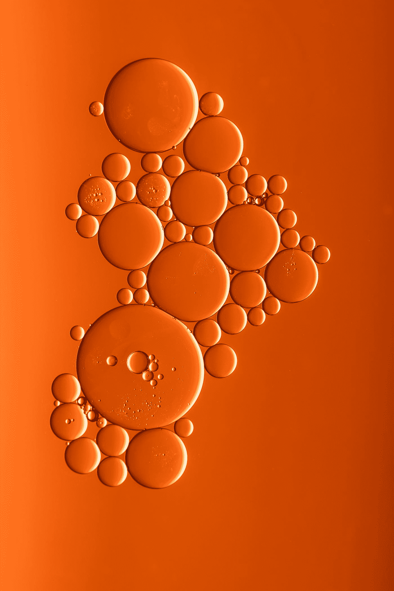

# 科学有时会有局限性和危险性

> 原文：<https://medium.datadriveninvestor.com/how-science-can-be-limiting-and-dangerous-sometimes-c137b91c8bc2?source=collection_archive---------18----------------------->

## 科学是伟大的，但它没有极限

Photo by [Sharon Pittaway](https://unsplash.com/@sharonp?utm_source=medium&utm_medium=referral) on [Unsplash](https://unsplash.com?utm_source=medium&utm_medium=referral)

来自 [NASA 的科学家说，可观测的宇宙只有大约 5%](https://science.nasa.gov/astrophysics/focus-areas/what-is-dark-energy) 。这是地球上的一切，也是美国宇航局和所有天文台用他们的仪器观测到的一切。他们进一步说，68%是暗能量，27%是暗物质，这两者是科学家们仍在试图观察和理解的完全未解之谜。

在 5%的可观测宇宙中，研究人员仍在学习和发现关于可观测物质的新事物，这意味着他们也不能 100%地了解那 5%的宇宙。鉴于原子的大部分是由空间组成的，而其中只有不到 1%是物质，我们可以说科学仍然不知道组成原子的 1%物质的全部，这意味着科学正在研究宇宙中实际存在的不到 1%的物质。

这些几率现在真的让我不那么害怕了，但当我第一次了解到它们时，情况要糟糕得多。

想象一下，如果你的飞行员只知道驾驶飞机所需的不到 5%的信息，而其余的 95%对他或她来说是个谜，那会是什么样子。你坐那架飞机会舒服吗？

现在，我并不是想在这里抛弃科学，我只是想解释为什么我们应该与科学家一起寻找答案，而不是让他们找到所有的解决方案，而其他人却袖手旁观，盲目地相信他们的话。

我从小就认为科学有所有的答案。我的极限总是在科学所说的地方。我总是把自己看做一个有科学依据的极限的人。

结果，我从早年生活中得不到什么。我总是依赖别人来弥补我认为自己的局限性。当然，这些人和我一样也有局限性。

例如，我曾经认为我不擅长数学或任何科学科目。我在学校的最高分一直是 40 分。有趣的是，我实际上在艺术科目上表现更差，总是得到 30%或更少。

我去求助的人是我的老师，我永远不会忘记其中一位老师告诉我，我的智商不够高，不适合理科，但我可以在文科方面做得更好。

他是一位我尊敬并非常钦佩的科学家。这个人给了我科学证据，告诉我为什么我的智商如此之低以至于不能处理科学。但对我来说，科学是好的，我甚至比艺术表现得更好。

然而，他给我的这个科学证据一直困扰着我，结果，我因为糟糕的成绩被学校开除了。我家从来没有人被学校开除过，甚至没有人因为成绩不好而受到惩罚。

我的兄弟姐妹在期末考试中名列全国前茅，而我却在这里，他们的哥哥因为表现不好被学校开除了。

那一年是 2011 年，那时我决定开始质疑科学和我自己的思维的极限，如果有的话。我开始学习科学没有涉及的东西。

我发现有 95%的其他因素影响着我的生活，但科学并没有提及，因为它们仍然是一个谜。我深入挖掘自己，几乎立刻就看到了结果。

2011 年，当我发现并开始使用科学书籍中没有的关于人类存在的其他理论时，我被开除了，我不仅进入了我国的一所顶尖学校完成了高中学业，而且后来我还离开了我的国家，带着部分奖学金出国学习土木工程。

我现在是一名土木工程师，以 3.2 的平均绩点毕业，明年我将在美国最好的大学之一攻读结构工程硕士学位。

我不是在吹牛，但这表明我不是唯一一个有这种经历的人。我知道有些人已经放弃了生活，仅仅是因为他们把自己放在了某个基于科学证据支持的研究的统计数据中。

最令人痛心的是，有时科学家出来说****哦，我们所想的是不正确的，这就是它实际上是*** *。这句话让我非常生气，因为每当我听到人们这样说话时，我的脑海里很快就会想到那些基于科学现在称之为垃圾的想法做出人生决定的人。**

*科学有极其惊人的好处。它帮助我们开发出卓越的技术，极大地改善了我们的生活。科学发现让生活变得激动人心，值得一过。我总是寻求发现，为人类的进步而欢呼。*

*但是他们就是这样。它们是发现。*

*甚至是发明。我在神学院学过拉丁语，发明这个词来自拉丁语动词 invenire，从 in- ' *变成* ' + venire ' *come* '。简单来说，就是让 ***进入*** 换句话说就是让 ***意识到*** 。*

*因此，我们看到所有这些发现和发明已经存在，有人把两者结合起来，意识到它们并把它们带到我们的现实中。*

*问题就在这里。*

*想象你在黑暗中走在一座桥上，桥的某一部分有一个巨大的洞。如果你一直走，你不知道这个洞的存在，如果你走进去，你仍然会受伤或死亡。有人告诉你它存在与否并不重要。*

*这类似于科学。我们都尊重它的发现，但所有那些神秘地发生在我们生活中的 95%的变量，即使对我们最伟大的头脑来说，仍然会影响我们，不管我们是否意识到它们。*

*如果科学告诉你世界是这样运转的，但事实上并不是这样，这也没关系。科学家总是可以说他们错了，而基于“新的发现”，它实际上是不同的。*

*难道我们就应该袖手旁观，任由新发现摆布吗？*

*我试过了，这几乎毁了我的生活，但我该怪谁呢？提出那份愚蠢的智商研究论文的科学家，用那份伪造的论文或发表论文的董事会向我证明我愚蠢的科学家。没有人。我不能责怪任何人。他们只是边做边做，并在实验中检验它们是否成立。一旦理论失败，他们会像扔烫手山芋和落叶松一样扔在别的东西上，而不顾他们对其他人的生活造成了什么损害。*

*你能想象如果经济学家做同样的事情会发生什么吗？当然，经济学家要谨慎得多，因为如果他们的实验失败，那就意味着战争、萧条以及整个国家和人口的不稳定。经济学家的失败是对人们生活的直接打击。经济学家因此对他们进行检查，因为他们失败的实验的效果可以很快看到。*

*我们的科学家呢。谁在检查他们实验的效果，或者谁在质疑这些理论而不是盲目地追随它们？*

*本该是一个简单的手术却让我妈妈付出了生命的代价，因为一些科学家不得不检查她应该接受的血液的完整性。如果血液是从血库取得的，这又意味着什么呢？*

*我的两个兄弟呢？他们在出生时因为被用作实验品而失去了生命。*

*我绝不是说科学不好，我只是说它有极限，我们需要知道这些极限的存在，并尊重它们，因为我们试图进一步推动它们，而不是通过盲目信任它们来违反它们。*

*作为科学界的一员，我试图和每个人交谈，包括我的科学家和工程师同事。*

*关于科学，有些事情我们并不了解，但是我们中有多少人被科学的局限性蒙蔽了双眼，我们在生活中仅仅依赖于科学。*

*上周，我告诉我妹妹，长时间的愤怒、压力和怨恨可能会导致她严重的健康问题，她看着我，就像我刚刚拉了一坨屎一样。但是这些聪明的人曾经被告知思想和健康之间没有关系。*

*现在，这些人很难接受新的观点，问题是，当损害已经造成时，科学有时会赶上来。*

*我知道这一点，因为物理学已经证明了观察者在实验或我们的情况中的重要性，思想在我们生活中的重要性。*

*我的姐姐也在学习内科和外科，她对此一无所知，但她能解释所有的身体功能。这些功能的原因似乎与她无关，因为那是她在学校里所学的。*

*有趣的是，当谈到像运动员和商业领袖这样的顶级表现者时，他们都有科学停止的地方，而像正念、冥想、想象这样的东西取而代之，但如果你试图和一个普通的科学家谈论这些，他们只会嘲笑你。*

*到底是怎么回事？*

*经典和古代文明都讲到宇宙的规律比如。但是我在那里找不到更多的研究。*

*但是像美国政府这样的顶级组织已经用这些想法做了一些工作，这些想法还没有被科学家们理解，像[这个由中央情报局做的关于远程观看的](https://www.cia.gov/library/readingroom/docs/CIA-RDP96-00791R000200180005-5.pdf)或者[这个由中央情报局做的关于现实本质的](https://www.cia.gov/library/readingroom/docs/CIA-RDP96-00788R001700210016-5.pdf)。但是为什么它们仍然被归入科学的垃圾堆呢？*

*我和许多人，事实上我看到的所有人都在违反或滥用这些法律，看到他们为滥用法律付出代价，却不知道他们违反的是什么法律，这总是令人难过的。*

*我观察过世界上任何领域的所有成功人士，他们以正确的方式使用这些法律，尽管他们中很少有人意识到他们在正确地使用它们。*

*看到有人今天如此富有，明天又如此破产，我并不感到惊讶，这不是因为一笔糟糕的交易，而是因为他滥用了自然法则，使他得到了一笔糟糕的交易，导致了他的损失。对大多数人来说，这听起来完全是荒谬的，但是在科学能够支持这些理论之前，谁应该受到责备，有多少人将不得不遭受这种痛苦。*

*科学不谈论这个，但是人们仍然把他们所有的希望放在它上面，仅仅因为科学家发现了一些东西。*

# *对此我们能做些什么*

*科学的目的是帮助我们理解生活的某些方面，我们可以在逻辑推理中非常有效地使用它来提出将改变世界的惊人想法。*

1.  ***然而，我们应该使用更多非逻辑/直觉的想法和科学来帮助我们探索未知。***

*在理解了宇宙的法则之后，应该使用直觉推理，你可以在一本名为《Kybalion》的书中读到。*

*我花了 7 个月的时间每天阅读这本书，开始理解它的内容，因为我以前从未听说过类似的东西，但它在无数方面改变了我的生活，其中之一你已经在上面读过了，这是迄今为止世界上对我来说最好的两本书之一。*

*在理解了这些法律之后，你会开始看到它们在任何地方被有意无意地使用。*

***2。我建议你多读一些精神方面的书。我是一名天主教徒，但我必须去阅读古兰经、巴哈瓦吉塔、托拉和我们所有宗教中的其他精神教义...***

*他们传达了同样的信息，那就是关于宇宙法则以及如何使用它们。是的，一些像《圣经》这样的书没有用俗人的语言解释它，这也导致了宗教中如此多的愚蠢教导，但是你必须自己再读一遍，你就会知道它们的意思。*

*如果你没有时间再读一遍，去找那些为你做过这类研究的人。它们存在于精神领域、个人发展领域和科学领域。*

***3。如果你想先接触科学，就订阅盖亚的*******【非附属链接】*，你将学习宇宙法则如何运作，以及如何在精神层面和科学层面应用它们。*****

***不要依赖愚蠢的研究论文，这些论文会告诉你你有什么限制或者没有什么限制。他们可能 99.9999999%的时候都不是真的。***

***请记住，你在一个 100%的宇宙中运作，而科学只解释了这 1%中的一小部分。你还有 99%以上的东西需要学习。***

***你可能不会得到所有的 99%,但即使是对 2%的理解也会比你知道的更多地改变你的生活。想象一下，不到 1%的人已经完成了多么伟大的科学...***

*****4。科学仍在探索，你应该和它一起探索。*****

***你不需要成为一名科学家，也不需要等待科学家提出经过验证的研究，这样你就可以允许自己改善生活条件。***

***这是你的思想，科学仍在试图找出它的极限，如果它有任何极限的话。你也可以利用这一点，找出你能为这个世界做出的最好贡献，或者至少拥有更好的生活。***

***当你听到人们谈论心态时，大多数人只是使用它，但有些人也试图限制心态。多么可笑。***

***好的一面是，如果你用对了，就会得到结果。***

***在我被开除后，我的老师向我证明了我在科学上是愚蠢的，其中一句引语让我开始提问，那是亨利·福特的一句引语。***

> ***不管你认为你能还是认为你不能，你都是对的***

***当你重新阅读灵性书籍，没有那些无孔不入或扭曲的教导和老师时，你会发现在如此多的经文中引用的真理，不管你读的是什么灵性书籍。***

***我不知道亨利·福特是否有灵性，但我知道他的这句话没有研究论文支持。***

***特斯拉谈到了他的大脑的工作方式，对他来说，这是关于把这些想法带到世界上。他在商业上很糟糕，但他的专利仍然是推动世界前进的工具。***

***泰斯拉不会等着一篇研究论文来帮他找到自己想法的基础，你也不应该。***

*****5。不要听任何人告诉你科学证明你是愚蠢的。没有这回事。*****

***有人告诉我，科学地说，我的智商很差，并因此被学校开除。九年后，同样的智商让我成为了一名工程师、二维和三维视觉艺术家、设计师、音乐家、作家、程序员和动画师等等。***

***科学有它的位置，但我们必须与它并肩而行，而不是试图领导它或跟随它。当我们证明自己的潜力超越了我们目前的思维极限，科学就会迎头赶上，反之亦然。没有领导者，也没有追随者。***