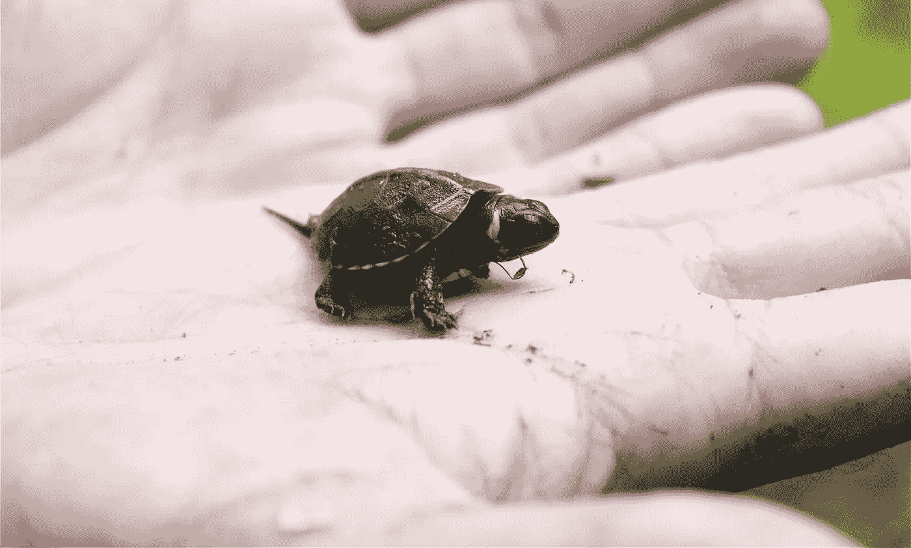
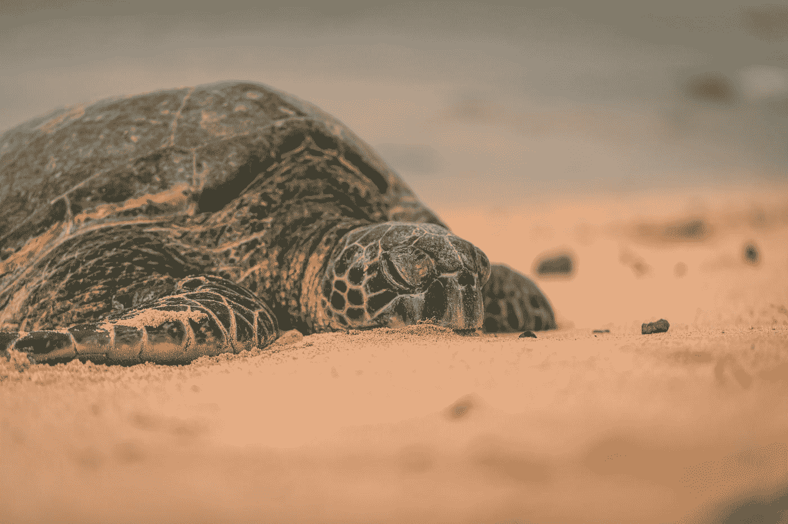

# 科学如何利用技术拯救濒危海龟幼龟

> 原文：<https://medium.datadriveninvestor.com/how-science-uses-technology-to-save-endangered-sea-turtle-hatchlings-e7045c5113b?source=collection_archive---------12----------------------->

## **追踪海龟蛋交易者**

Photo by: (Endangered sea turtle) [https://www.sciencedaily.com/](https://www.sciencedaily.com/)

*科学*正在努力打击中美洲濒危海龟蛋的非法交易。

通过在海滩上的巢中放置带有 GPS 功能的 3D 打印诱饵的海龟蛋，有可能收集到揭露非法蛋交易所需的关键证据。

这是发表在《当代生物学》杂志上的一项新研究的发现。根据来自[细胞出版社](https://www.cell.com/current-biology/fulltext/S0960-9822(20)31255-0)的一份声明，研究人员专门测试了诱饵蛋的效果以及它们对濒危海龟的安全性。

“我们的研究表明，在龟巢中放置诱饵不会伤害孵化的胚胎，而且诱饵有效，”肯特大学的主要作者海伦·菲西说。*“我们证明了追踪从海滩上非法获取的鸡蛋到最终消费者是可能的，正如我们最长的追踪记录所示，它确定了覆盖 137 公里的整个商业链。”*

这种鱼卵诱饵被称为“投资者”( InvestEggator )( T11 ),是由帕索太平洋保护组织开发的，用来对付中美洲濒危海龟的非法交易。在那里，鱼卵被从海滩走私到餐馆和酒吧作为美味出售

# 这个想法是从哪里来的？

Photo by: (Breaking Bad) [IMDb.com](https://www.imdb.com/title/tt0903747/?ref_=tt_mv_close)

隶属于帕索·帕西菲科的科学家金·威廉姆斯-吉伦构想并设计了这种诱饵，以响应美国国际开发署的提案征集。

他们在寻找利用先进技术打击偷猎野生动物的项目。

Williams-Guillen 说:“这个想法是一个‘啊哈’时刻。”。

这立刻让我想起了她最喜欢的两部电视剧，分别是《绝命毒师》(T18)、《火线》(T19)和《T21》(T20)，这两部电视剧碰巧都与非法贩毒有关。

他说:“在《绝命毒师》中，美国药品管理局在一个装有化学品的罐子里放置了一个全球定位系统跟踪装置，以观察谁得到了这些化学品。”。*“在《火线》(The Wire)的一集中，两名警察在一个网球上安装了一个音频设备，以秘密记录一名涉嫌贩毒者。*

> “海龟蛋基本上看起来像乒乓球，我们想知道它们要去哪里；把这两个想法放在一起，你就有了投资者。”

# 初步结果

Photo by [Joris Visser](https://unsplash.com/@jorisv?utm_source=medium&utm_medium=referral) on [Unsplash](https://unsplash.com?utm_source=medium&utm_medium=referral)

为了观察它们在实践中的效果，Pheasey 和她的同事们将 3D 打印的诱饵放置在哥斯达黎加四个海滩的 101 个海龟巢中。

四分之一的假蛋是非法从巢穴中取出的，这使得研究人员可以跟踪五个巢穴中的蛋，包括两个绿海龟巢穴和三个橄榄 ridley 巢穴。

 [## 新的健康技术如何让我们活过 100 岁？数据驱动的投资者

### 不久前，我们都在看一台黑色电视，不得不带着天线跑遍整个公寓，以确保…

www.datadriveninvestor.com](https://www.datadriveninvestor.com/2020/08/12/how-new-health-technology-makes-us-live-past-100-years/) 

其中一个诱饵在消失前接近了一个住宅区。另一个去了两公里外的酒吧。走得最远的一个人在内陆走了 137 公里，花了两天时间从海滩到超市装货区，然后到一个住宅区。

> 调查人员认为鸡蛋不是在市场上出售的，而是从一个经销商那里运送到一个卖家那里的。

他们还收到了一些关于有人发现了诱饵的轶事报告。他们写道:“一个诱饵在 Cariari 附近的一个居民区离线，CARI ari 是一个离部署海滩 43 公里的城镇，”。*“11 天后，我们收到了卡里亚发来的卵子切片照片。”*

除了这些照片，他们还得到了关于鸡蛋购买地点和交易数量的信息。

他们指出，这些发现表明，除了跟踪数据之外，诱饵蛋已经从当地社区获得了情报。

*Pheasey* 表示，初步证据显示，大多数被盗鸡蛋并没有离开当地。

这一发现证实了他们的怀疑，以及一些当地报道称，大部分交易发生在筑巢海滩附近。Pheasey 说:“知道当地有很高比例的蛋，有助于我们集中精力保护这些蛋。

> “现在，我们可以集中精力提高当地社区的意识，并指导执法部门解决这一当地问题。这也意味着我们知道消费者在哪里，这有助于我们专注于减少需求的活动。”

Pheasey 说关键不在于找到从海滩上拿走鸡蛋的人。在很大程度上，这是众所周知的。从执法的角度来看，关键是要识别那些贩运和出售卵子的人，通常是挨家挨户。

# 仅仅是开始

Photo by [Travis Colbert](https://unsplash.com/@traviscolbert?utm_source=medium&utm_medium=referral) on [Unsplash](https://unsplash.com?utm_source=medium&utm_medium=referral)

Pheasey 说:“由于贩卖人口是一种更严重的犯罪，从执法的角度来看，这些非法侵入点比抓住一个正在筑巢的人更有价值。”。

据 Williams-Guillen 称，这就是 InvestEGGator 如此重要的原因。“但是，”他补充道，*“它真的应该用在多管齐下的保护方法中，利用教育、创造更好的经济机会和执法来帮助打击偷猎海龟蛋的行为。”*

> 研究人员说，他们希望看到更多的海龟项目在它们筑巢的海滩上使用诱饵。
> 
> 这种努力可以揭示不同国家龟蛋贸易的差异。

除了继续改进技术及其实施，他们还对将技术扩展到其他物种感兴趣；例如，Paso Pacífico 计划与哥斯达黎加科学家合作，改造发射机，用于跟踪鱼翅运输。

他们也在考虑用它来追踪鹦鹉巢蛋的失窃。

## 通过这种方式，我们看到了科学是如何集中所有的力量来减少濒临灭绝的不同物种的非法贸易的。

*参考文献:*

*1。*[*https://www . cell . com/current-biology/full text/s 0960-9822(20)31255-0*](https://www.cell.com/current-biology/fulltext/S0960-9822(20)31255-0)

2.[https://www . science daily . com/releases/2020/10/2010 05 112129 . htm](https://www.sciencedaily.com/releases/2020/10/201005112129.htm)

## 感谢您的阅读！📖

## 访问专家视图— [订阅 DDI 英特尔](https://datadriveninvestor.com/ddi-intel)