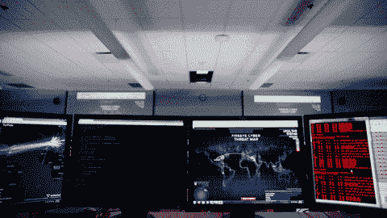

# 安全团队如何保护您的数据并在家工作

> 原文：<https://medium.datadriveninvestor.com/how-security-teams-are-protecting-your-data-and-working-from-home-caa843b8f9b5?source=collection_archive---------17----------------------->

在这个冠状病毒肆虐的时代，让我感到震惊的是，可能还会发生其他事情。然而，值得注意的是，基本上，全国各地大大小小的企业都在继续运营。健身工作室正在发展数字会员，这样人们就可以在家锻炼了。根据我的 Instagram，字谜正在以前所未有的数量被购买和邮寄。网飞肯定还在运行，Quibi 正在推出，对于我需要打电话或发电子邮件的少数业务，客户支持仍然存在。

这是第一次，很多工作都是在家里完成的。这就引出了一个问题:家庭安全是什么样的？在每个人都远程登录的情况下，团队如何继续运营和保护消费者数据？这个客户支持电话是在你的沙发上打的吗？当你看我的账户时，还有谁在看你的屏幕？

Hey new coworker! Where ya sending that data dump?

在过去的几周里，我与无数的首席信息官和安全负责人谈论了他们领导和促成向 WFH 转移的经历。他们面临的挑战各不相同，但目标是一致的:在不影响安全性的情况下在家工作。

 [## 2020 年最佳短期投资选择精选资源|数据驱动型投资者

### 投资是增加你净财富的一个好方法。如果你通过遵循一个严格的…

www.datadriveninvestor.com](https://www.datadriveninvestor.com/2020/03/28/handpicked-resources-for-the-best-short-term-investment-options-of-2020/) 

以下是它们如何继续呈现给消费者及其数据的:

**大型传统企业正专注于根本性转变**

如果团队不能在家工作，事情可能是安全的，但他们肯定不会有成效。对于一些大型企业来说，在家工作的第一大挑战是为人们提供登录和工作所需的设备和连接。从配备一个能处理 200 个连接的 VPN 到一个能处理 2000 个连接的 VPN。

我们听说过一些不寻常的故事，安全领导者四处寻找足够的笔记本电脑、usb-c 转换器和耳机，供他们新的远程工作人员使用。这与消费者对卫生纸和洗手液的需求进行了对比。有一些安全领导人的孩子现在拥有的游戏耳机比开始时少了。

I will take this home office set up, please.

对于跨国企业来说，这是一个特别大的挑战，因为当政府通过禁用非必要服务来应对新冠肺炎危机时，一些国家将快递归为非必要服务。这使得公司甚至无法向员工提供他们所拥有的设备。

**好的，所以他们在家工作。现在怎么办？**

当团队动员起来实现在家工作时，他们同时也在努力实现在家工作。

这意味着审查供应商的许可，因为你的供应商都在家工作。让供应商通过电话处理信用卡付款？你不再是了。这是 PCI 不可行的，因此团队必须想出替代的、合规的方法来实现同样的目标。

这也意味着要明白，您将会有许多不同类别的设备和连接来访问您的公司网络和数据。一些员工可能使用公司发放的安全笔记本电脑。其他人可能使用个人手机和平板电脑。一些员工可能通过安全的 VPN 进行连接。其他人只是通过他们家的 WiFi 路由器。

一个 CISO 提供了一个有 10 个不同入口的迷宫的有用可视化——如果你想实现任何类型的生产力，你需要让所有的门都开着。但是迷宫中心的东西是敏感和安全的，所以把大门放在离中心更近的地方。它需要更少的门，让人们去他们想去的地方。

**有些人在家工作。**

对于许多云本地公司来说，公司文化是这样的，在家工作是一个不成文的要求。这些公司中的许多已经只发行笔记本电脑，所以当避难所订单来袭时，没有争夺最后一个单位。

我们与这些领导的谈话不太围绕在家工作的 0 到 1 转变，而是更多地讨论如何进行渐进式改进，以更好地在家工作。我们听到了很多关于“在家管理”以及如何在所有人都不在的情况下帮助保持高昂的士气和工作效率。

从安全角度来看，这些公司中的许多公司长期以来一直信奉这样的理念，即从办公室连接不会增加信任。然而，不能忽视每个人都在一个物理空间中的人的因素。当人们知道其他人在看的时候，他们不太可能做坏事——截图，访问他们不应该访问的数据。首席信息安全官们正变得更加谨慎，以适应这种新的社会压力的缺乏，尤其是在授权第三方承包商访问数据方面。

总的来说，我们从这些首席投资官那里听说，WFH 降低了他们的风险偏好。有些人告诉我们，他们在过去的几周里说“不”的次数比他们整个职业生涯中说的都多。他们觉得允许 WFH 加入已经冒了很大的风险，因此任何超出这个范围的事情都太过分了。促成业务与接受风险的计算方式已经改变。

**策划作品。**

许多首席信息官告诉我们，他们对自己公司的准备工作感到惊喜。由于环境灾难——火灾、飓风等，一些人最近被迫在家工作几天。这让他们比其他情况下准备得更充分。

其他人告诉我们他们在灾难恢复计划或业务连续性计划中发现的价值。我最喜欢的一个时刻是，当我们向一家金融服务公司的 CISO 表达惊喜时，我们仍然能够在需要时与他们的客户支持团队进行沟通。他们告诉我们几个月前他们为支持整个客户支持团队的软电话进行了大量投资。这不是支持团队要求的，但这是安全部门认为对其业务连续性计划至关重要的。今天，这个决定意味着他们的客户(包括我自己！)可以继续联系他们，并且没有发现任何故障。

下一步是什么？

随着冠状病毒在我们的社区传播，我们的生活越来越多地被迫在室内和网上进行。能够在家工作是一种特权，而我们社区中的许多人却没有这种特权。但是，我们的数字生活已经被那些将员工转移到远程的公司所触及。在过去几周与安全领导者的交谈中，我发现了一些小小的安慰，因为我知道他们是多么认真地对待他们的使命，在这个前所未有的时代继续保护我们的数字生活。我希望你也是。在外面注意安全！

还有[使用密码管理器](https://medium.com/swlh/six-things-i-love-about-working-in-cyber-security-d8cdeb16a09c)！