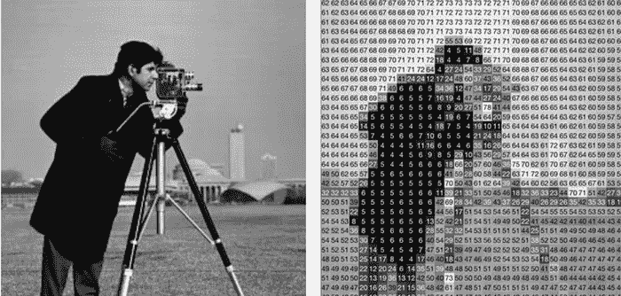
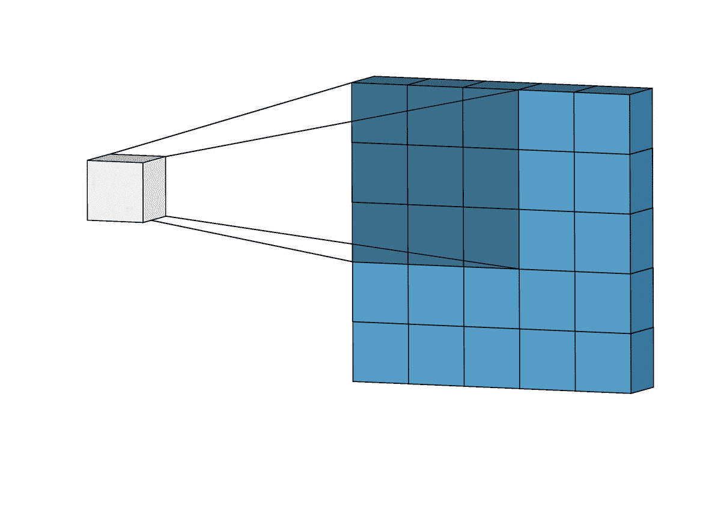
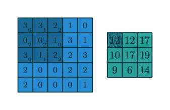
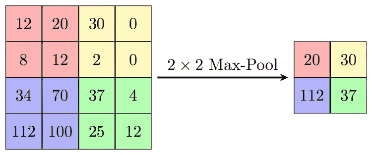
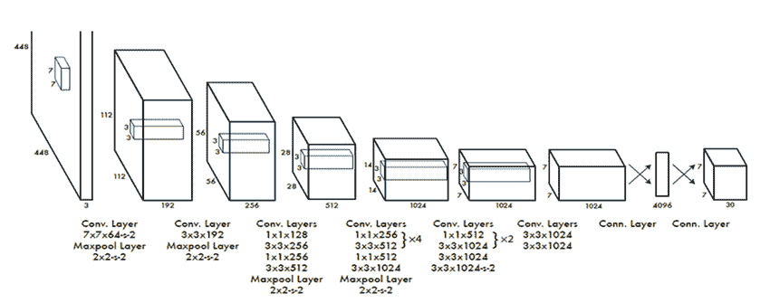
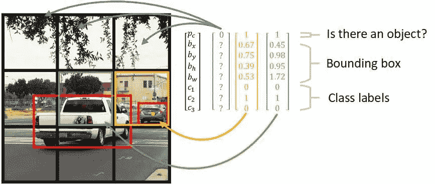
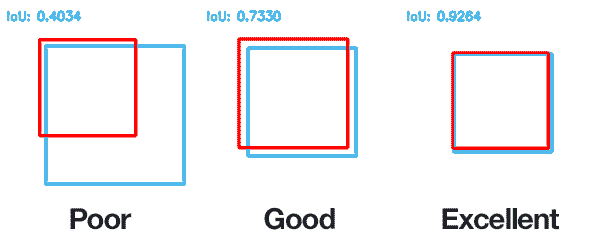
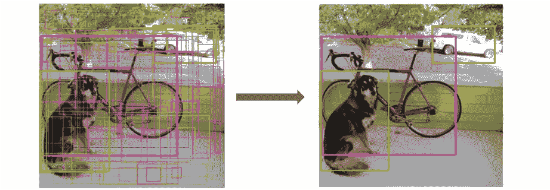
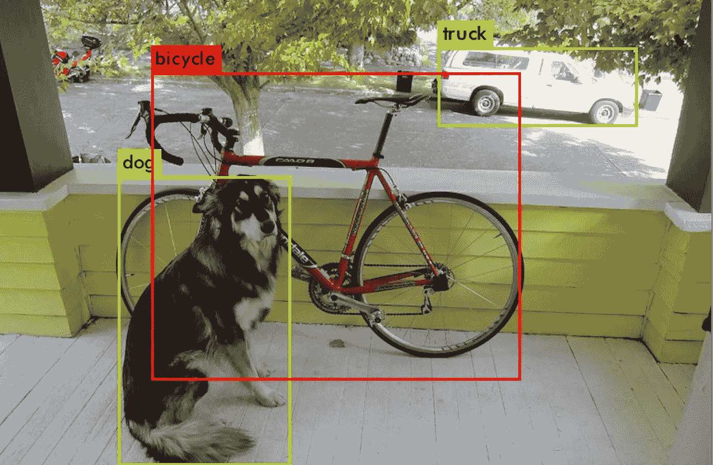
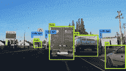

# 自动驾驶汽车如何看待

> 原文：<https://medium.datadriveninvestor.com/how-self-driving-cars-see-deeb87cac531?source=collection_archive---------2----------------------->

## 你只看一次| YOLO 物体探测算法

人眼是人体中最快的肌肉，经过数百年的进化而完善。当与大脑的处理能力相结合时，我们可以在几分之一秒内对物体进行分析和分类。

但是我们如何为计算机重现这个过程呢？将摄像头贴在自动驾驶汽车上，祈祷它不会撞到人，这不是一个安全的赌注。自动驾驶汽车不仅仅需要看到图像，它们需要极其快速地检测图像中**种类型的物体**及其**位置****。**

自 60 年代以来，我们已经能够使用算法检测物体。但我们只能通过扫描图像的一部分来检测特定配置中的特定对象，像快速 RCNN 这样的网络必须进行多次预测，这意味着更多的时间。

 [## 修复摄影|数据驱动的投资者

### 汤姆·津伯洛夫在转向摄影之前曾在南加州大学学习音乐。作为一个…

www.datadriveninvestor.com](https://www.datadriveninvestor.com/2019/03/22/fixing-photography/) 

但是通过一种叫做 [YOLO](http://paper in 2015) 的物体检测算法，我们能够检测**多个物体，并以高达每秒 155 帧的速度确定它们的位置！YOLO 通过捕捉整个图像并只通过它的网络传递一次来做到这一点。与大多数逐段扫描图像的对象检测算法不同， **Yolo 一次扫描整幅图像，**因此得名“你只看一次”。**

Yolo 将对象限制在边界框中，同时对对象进行分类，并测量某个对象在边界框中的可信度。

神经网络模拟了大脑中神经元如何相互作用。一个节点输出作为另一个节点的输入，依此类推。

Yolo 使用**卷积神经网络，因为它们非常适合理解空间信息。他们能够提取边缘、线条和纹理等特征。这对图像特别有用。**

我们可以使用预先存在的 CNN，它已经在 [Pascal 数据集](http://host.robots.ox.ac.uk:8080/pascal/VOC/)上进行了数千次测试，可以对 20 类物体进行分类。

它使用一种称为卷积层的特殊层，从图像中提取特征。它扫描图像寻找特征。YOLO 有 24 个这样的卷积层。更密集的层将所有东西放在一起，获取空间信息和特征，以便能够检测一个对象在图像中的位置。

## 但是首先快速看一下 CNN 是如何工作的

计算机把一幅图像分解成一个数字矩阵。

What we see vs what computers see

**卷积层**就像扫描一幅图像的滤镜；这些较小的矩阵被称为卷积核。内核在图像周围移动。每个矩阵负责扫描更大矩阵的一部分。

内核矩阵中的数字会乘以它们正在扫描的更大矩阵的权重。这些数字加在一起就形成了一幅地图。

convolutional kernel scanning

我们将应用一个激活函数来压缩我们的数字。 **ReLu** 是 CNN 常用的激活功能。

拥有太多的特征地图会给我们带来很多维度需要处理，我们可以使用一个**最大池层**，它像一个卷积核，但没有权重。它扫描地图的各个部分。它会从正在扫描的区域中选择最大的数字，创建一个维数更少的更小的新矩阵。

The biggest number out of the section is used for the new matrix

## YOLO 是如何运作的

在 YOLO 的建筑中，我们将重复这些层次:

首先，YOLO 将图像划分成一个 100×100 的网格.

它根据相邻的纹理、颜色或亮度来创建边界框，以找到一个对象。在每个网格单元内，YOLO 检查是否可能有一个对象创建五个边界框和一个类别概率图，告诉我们如果一个对象位于该区域，它可能是一个特定的对象。

For example, if there’s an object in the blue area, it is likely a dog

每个边界框预测五个元素:(x，y，w，h，置信度)。框的 x，y 坐标，宽度和高度及其置信度得分。如果一个单元格有一个对象，YOLO 记录该对象中心的 x，y 坐标。它负责在对象周围创建一个边界框，它将找到该框的高度和宽度，并使用置信度得分来测量对象在该边界框中的可能性。

使用类别概率和联合上的**交集来测量置信度得分。它将实际的包围盒与预测的包围盒进行比较，我们通过将重叠面积除以并集面积来获得并集上的交集(IoU)。**

到目前为止，我们将有一吨的边界框，我们；我将确保只显示满足某个置信度阈值的边界框。通过运行非最大值抑制，我们去掉了低概率预测，只剩下相关的预测。

然后，通过使用预训练的 CNN 从图像中提取特征，它将对对象进行分类。

## 大局

能够检测视频中的物体具有重大意义，看看它在自动驾驶汽车中的潜力:

当他们的激光雷达传感器与 YOLO 配对时，他们能够在密集的交通中导航，能够识别多个对象及其相互之间的空间关系。

YOLO 速度很快。当生命危在旦夕的时候，autonomous 没有多余的时间来做决定。计算机视觉和其他物体检测算法完成了这项工作。在某些情况下甚至比 YOLO 更准确，但它们要慢得多。这使得人们对使用人工智能进行自主任务犹豫不决。现在算法可以实时做出决定。

人眼可以在 13 毫秒内检测和处理物体，但有了 YOLO，我们可以检测得更快，可能有助于减少 100 多万例车祸死亡。

我希望你学到了新的东西！当我更深入地研究机器学习、指数技术和世界时，请随时联系 LinkedIn，查看我的 T2 网站或订阅我的 T4 时事通讯😊