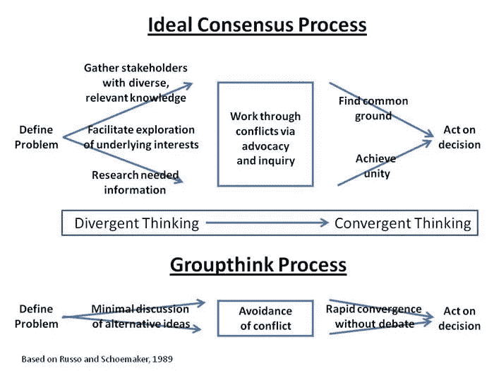
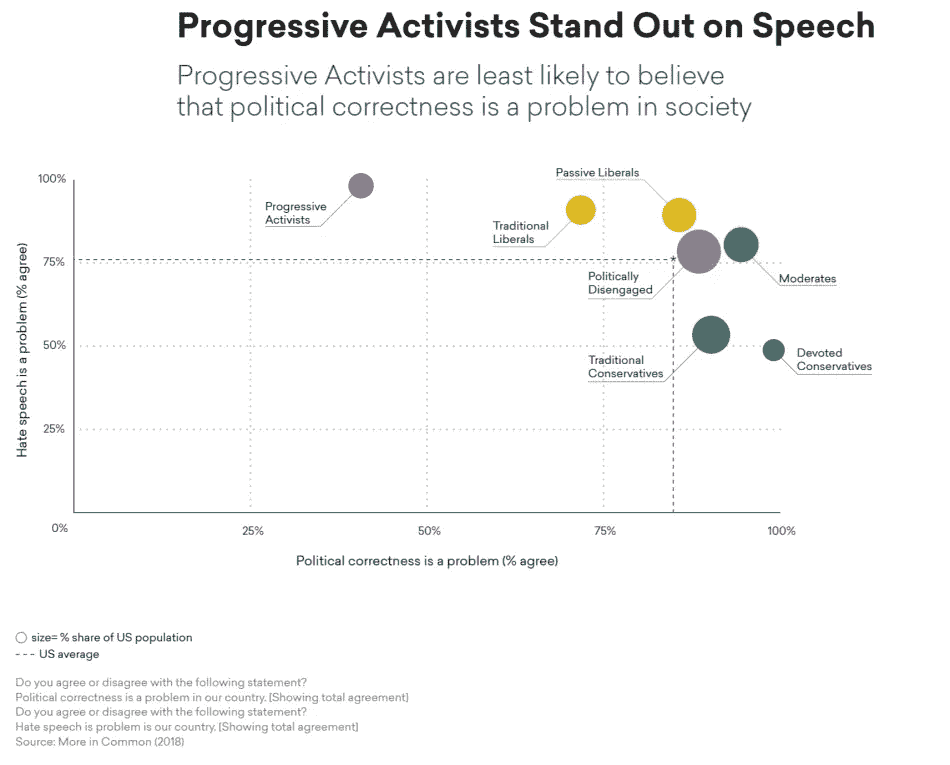

# 发出共识信号如何产生无脑决策:权威意见的问题

> 原文：<https://medium.datadriveninvestor.com/how-signalling-consensus-produces-brainless-decision-making-the-problem-with-prestige-opinions-77fa8ee28aa7?source=collection_archive---------17----------------------->

[*来源*](http://www.michaelseitchik.com/documents/Newsletter/newsletter_july2010_1.htm)

澳大利亚在应对新冠肺炎方面做得相对较好。在这篇文章发表的时候，我们的死亡率是百万分之三十五，在世界计量网站列出的[201 个国家和地区中排名第 111 位。这远远低于 138/100 万的世界平均水平。](https://www.worldometers.info/coronavirus/)

澳大利亚有一些明显的优势。我们是一个岛国，有着严格检疫制度的悠久历史。我们关注亚洲。我们有极好的[状态容量](https://en.wikipedia.org/wiki/State-building#State_capacity)。因此，我们在应对新冠肺炎方面表现异常出色并不令人惊讶。

更令人吃惊的是，在新冠肺炎的 897 例死亡病例中，809 例发生在维多利亚州。按人口计算，维多利亚州是澳大利亚第二大州，在澳大利亚 2570 万人口中有 670 万。

为什么维多利亚(或者更确切地说，墨尔本，一个拥有 500 万人口的大都市)表现如此糟糕并不神秘。各旅馆对回国旅客的隔离被搞砸了。非常糟糕。私人保安被雇来实施隔离。他们没有得到足够的培训或监督，导致了隔离失败和病毒的传播。

自那以后，对酒店检疫失败展开了公开调查。调查法官还没有公布她的调查结果，但各种公务员的公开证词是引人注目的。一个简短的总结就是:[没人](https://www.theaustralian.com.au/commentary/memory-fails-at-hotel-quarantine-inquiry-an-insult-to-coronavirus-victims/news-story/0148b442f4643427d0917dfa52a36bec)记得[任何事情](https://www.abc.net.au/news/2020-09-19/victoria-coronavirus-hotel-quarantine-a-quagmire-no-answers/12678624)。使用私人保安的决定就这么发生了。

作为一名前公务员，这一连串的“非我”和“我不记得”*证词令人吃惊。但在当前的社会背景下，这或许并不那么令人惊讶。*

特别是在英语圈，人们生活在一个社交环境中，社交媒体被动员起来制裁那些表达被诅咒观点的人。对表达意见的紧张已经变得普遍:最近的一项民意调查发现，62%的美国居民有他们害怕公开表达的意见，除了“坚定的自由主义者”之外，所有政治团体中的大多数都有这样的意见。这与 [2018 隐藏部落](https://hiddentribes.us/pdf/hidden_tribes_report.pdf)报告一致，该报告发现绝大多数美国居民(80%)认为政治正确是一个问题，进步活动家(8%的人口)是唯一一个大多数人不同意 PC 是一个问题的群体。进步激进分子通常受过高等教育，拥有较高的社会经济地位和远高于平均水平的收入。这类人通常会进入大学行政部门、非营利倡导组织、人力资源部门和政府机构。

[*来源*](https://hiddentribes.us/pdf/hidden_tribes_report.pdf)

在不同的意见得到社会认可的情况下，社会安全就在于遵从偏好的意见。有一种隐性和显性社会信号的混合，继续建立和维持一个新兴的，不断发展的，一套认可的意见。

这不是传统意义上的审议过程。虽然未来认可的观点是在社会环境中形成的，但在更广泛的社会中，它更多的是一个反馈和回应的网络过程。想要驾驭这些社会风险(和机会)的人需要对相关的社会线索有所认识，但不一定是有意识的。

现在，把这个社会信号和一致性的过程应用到官僚环境中。不难看出，决策最终可能是通过相互暗示而非明确做出的。作为一个紧急的过程，而不是明确的决定。

这种隐性决策的问题在于，这种隐性决策不会被询问。事实上，大部分的重点是*而不是*询问职位，因为问“错误”的问题可能是一个不利的社会信号。所以对含义和需求的思考要少得多。

这就是一个人如何结束这样一种情况，即参与酒店隔离的人接受多元化培训，因为这是一种公认的仪式，[，但没有专门针对管理隔离的培训。](https://www.abc.net.au/news/2020-08-21/returned-travellers-describe-dehumanising-hotel-quarantine/12581884)

这是一个无脑的决策，但在一个系统地制裁被诅咒的观点，甚至*问*错误的问题都充满社会问题的情况下，这是一个完美的社会动态意义。

特别是考虑到(1)被认可的观点的主要知识来源和(2)拥有一套被认可的观点对官僚机构是多么有用。

 [## 决策的艰难工作|数据驱动的投资者

### 你最近做了多少重要的决定？很难，不是吗？我们大多数人可能会低估这一点…

www.datadriveninvestor.com](https://www.datadriveninvestor.com/2020/05/21/the-difficult-job-of-making-decisions/) 

**官僚式的方便衔接**

拥有一套被认可的意见对官僚机构是有用的，因为它简化了选择程序，简化了协调，并产生了道德项目。一个有用的、额外的和清晰的分类方法被建立起来用于选择人——他们是“我们中的一员”吗？此外，如果每个人都按照相同的观点行事，那么在官僚机构内部协调行动和期望就会变得容易得多。第三个好处是，鉴于占主导地位(有人敢说霸权吗？)一套观点是高度道德化的，都是关于社会行动和变革的，它产生了与官僚机构相处的道德项目。

也有很多社会科学认为这种认知一致性对决策不利，甚至是灾难性的。但这只有在决策失误给相关人员带来直接后果的情况下才有意义。否则，官僚主义的便利将胜出。尤其是如果把地位贿赂也算进去的话。

**无脑对无形**

占主导地位的认可意见的知识来源也强化了这些突发的、未经询问的决策模式。霸权主义的观点来自于*批判社会理论*([批判理论](https://en.wikipedia.org/wiki/Critical_theory)在美国的演变)及其相关的思想星座([批判种族理论](https://en.wikipedia.org/wiki/Critical_race_theory)、[反种族主义](https://en.wikipedia.org/wiki/Anti-racism)、[交叉性](https://en.wikipedia.org/wiki/Intersectionality)、[酷儿理论](https://en.wikipedia.org/wiki/Queer_theory)、[第三波女权主义](https://en.wikipedia.org/wiki/Third-wave_feminism)、[第四波女权主义](https://en.wikipedia.org/wiki/Fourth-wave_feminism))。

这些观点适应了法国各种理论家的观点(特别是米歇尔·福柯、【雅克·德里达】和【让·波德里亚】在政治马克思主义失败的背景下，他们自己对哲学家【马丁·海德格尔】对西方哲学的批判做出了反应。批判社会理论星座的三个关键改编是:

1.  话语是自我指称的(它只连接到自身)，
2.  社会主要被理解为一套权力关系
3.  我们生活在社会泡沫中，可能无法逃脱。

第一部改编自德里达，第二部改编自福柯，第三部改编自鲍德里亚。

如果我们认识到[有四种](https://youtu.be/3p8o3-7mvQc)知识模式:*命题式、程序式、透视式*和*参与式*，那么这些适应的意义就很明显了。知识，知识如何，知识和知识在。每一个都有自己的现实标记:分别是真理、力量、存在和(类似的)调谐。

如果语言，如果话语，只连接到它自己，那么真理就不被认为是现实的标志。命题知识不再是除其他命题以外的任何知识。权力于是成为我们最有效的现实标记。因此，把社会想象成一个权力关系的结构是有意义的，言论是权力的行为，正如批判的社会理论及其相关的思想通常所做的那样。我们的观点和经验被认为是自我验证的，只服从于权力方面的社会验证。

海德格尔、福柯、德里达和鲍德里亚都是启蒙思想的批判者，也是后启蒙思想发展的领军人物。启蒙思维如此专注于命题知识( [*Cogito，ergo sum*](https://en.wikipedia.org/wiki/Cogito,_ergo_sum)*——‘我思故我在’——是经典的启蒙思维)，以至于它最终形成了一个单薄而无形的知识概念。一个完全抛弃智慧传统的人。(在认知科学背景下对智慧传统的有益讨论是[这里](https://www.researchgate.net/profile/John_Vervaeke/publication/286508333_Relevance_Meaning_and_the_Cognitive_Science_of_Wisdom/links/58f529df458515ff23b56743/Relevance-Meaning-and-the-Cognitive-Science-of-Wisdom.pdf?_sg%5B0%5D=nLOHKK834RthLZIkzFQXWGQ-5txS42ndmyaxbkbWNOZYSGtxcE0Mmt9dTcie06nxq9KoTwFWMN-u5IHKwYXMAw.1925Nztmy5pRbmzsh5J3IaYE1zPWZ9pGMrNZlQbJMRyKSsBHQHqKJead2N2kD-sgryZsAMpSME7WMywpMHdiSw&_sg%5B1%5D=b8M_8lqeYSFDrmKfG442Hmp9ixj0H8suSgOeO_88updwa-Psw4XfRA0_mZFFvvE3naee3x8Vb5dn1utCvJOmFJ5sMTWUNVH0LQTIvwL0Eoy0.1925Nztmy5pRbmzsh5J3IaYE1zPWZ9pGMrNZlQbJMRyKSsBHQHqKJead2N2kD-sgryZsAMpSME7WMywpMHdiSw&_iepl=)和[这里](https://www.openbookpublishers.com/product/602)。)*

启蒙运动后，由于命题知识完全是自我指涉的，人们的言论和行为只能从权力关系、个人视角和个人经验的角度来分析。如果有人想变得残酷，他会说启蒙运动和后启蒙运动的冲突变成了无躯体和无脑之间的争论。

启蒙运动的无形认识论可能没有给智慧传统留下任何位置，但后启蒙运动的无头认识论，剥夺了对真理的现实检验，极大地扩大了自我欺骗的可能性。通过接受与生俱来的显著特征来自欺欺人，比如被社会接受或其他便利，而不是现实，这一直是人类反复出现的弱点。因此，智慧传统一直强调自我意识，寻求消除自我欺骗。通过将话语视为一个封闭的结构来否认对现实情况的询问是一种现实标记，这极大地增加了自我欺骗的可能性，例如通过自我欺骗地操纵道德显著性。当我们从启蒙转向后启蒙思想时，从智慧的撤退变得更加彻底。

**斩首能力**

认为只能从权力关系的角度来质疑决策的观点，不利于从决策的实际有效性来质疑决策。实际效果，也就是能力，是关于陈述与现实的联系。在后启蒙时代批判性社会理论的无头认识论中，关心压倒了能力。嗯，通过按照认可的边缘化的权力关系来关心。

回到维多利亚酒店检疫调查的证词，“不记得”和“不是我”的决定过程只是碰巧作出，但没有被审问，显然被揭露，正好符合。(特别是因为保安人员大多来自“边缘化群体”。)

一个非常强大的社会支配战略，基于声望观点，而不是更传统的声望商品或声望技能的模式，已经在当代社会发展起来。地位战略有两种版本，一种是自信的——看着我，我很有道德(T1)——另一种是防御的——我同意，不要制裁我(T3)。声望观点是基于一套系统地削弱决策能力的观点。酒店检疫失败调查中的证词提供了一个初步的案例研究，研究这种声望-意见地位策略对决策的影响。*有*压制另类观点和担忧的策略。首先，因为社会支配战略所基于的道德声望要求宣称任何矛盾的观点都是不道德的(在这些霸权观点的情况下，是种族主义、仇外等观点)。)，因此任何支持者都必须受到制裁。第二，因为否则战略的追随者将会被明确的、被询问的、基于事实的、胜任的决策所击败。

如果你想知道权力对错误思想的认可会带来什么，社会信号的一致性，及其无头的认识论，在整个社会及其官僚机构中传播，维多利亚酒店检疫调查的证词所暴露的“刚刚出现”的未经审问的决定，以及社会信号一致性导致的数百起本可避免的死亡，是未来事情的先兆。(来到你附近的企业、非营利或政府机构。)

## 访问专家视图— [订阅 DDI 英特尔](https://datadriveninvestor.com/ddi-intel)