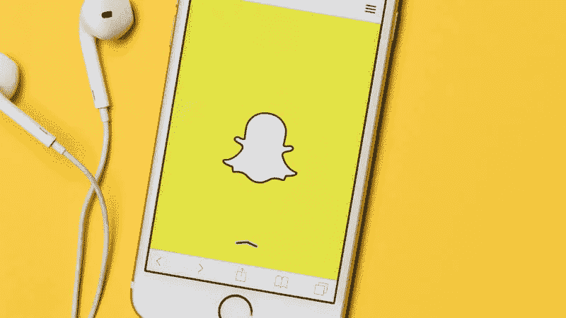
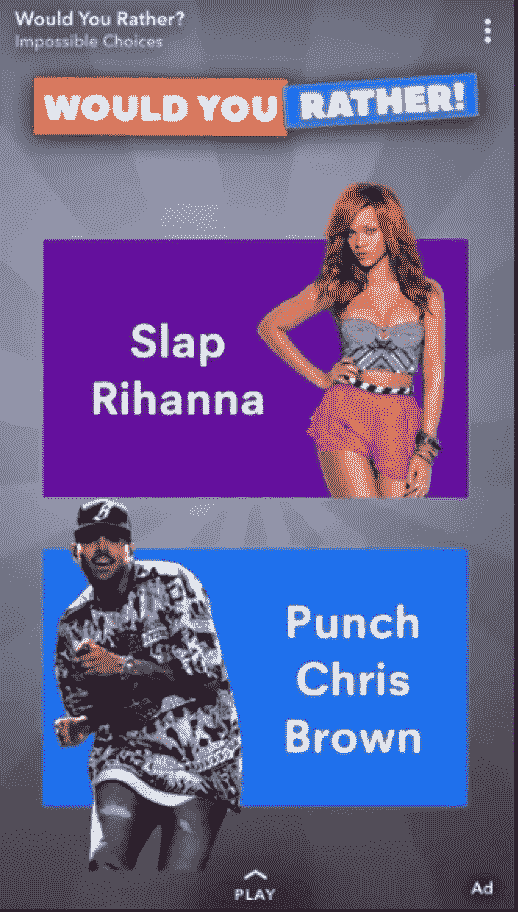
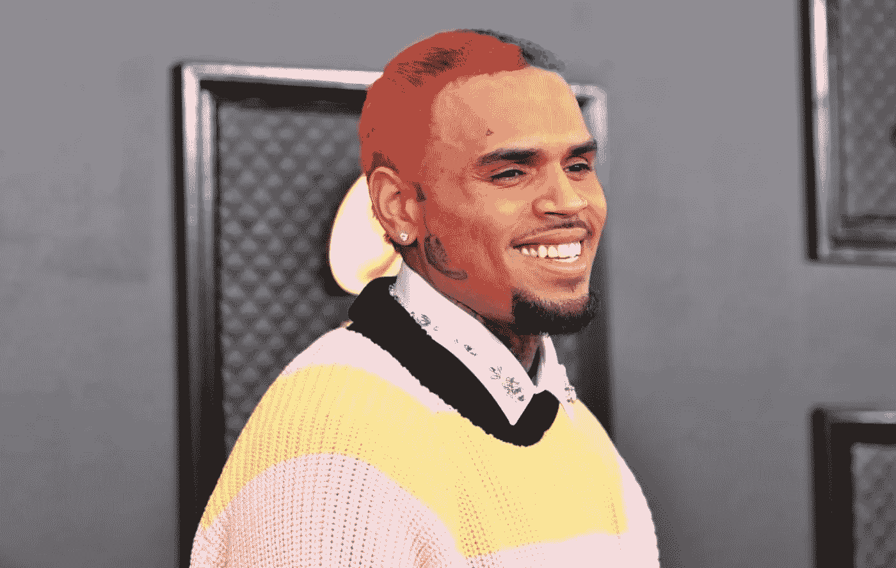
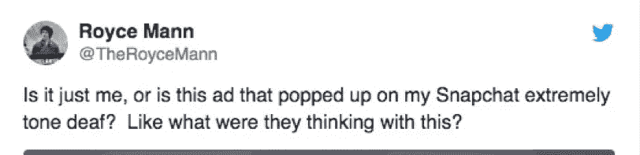
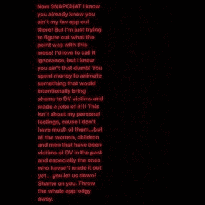
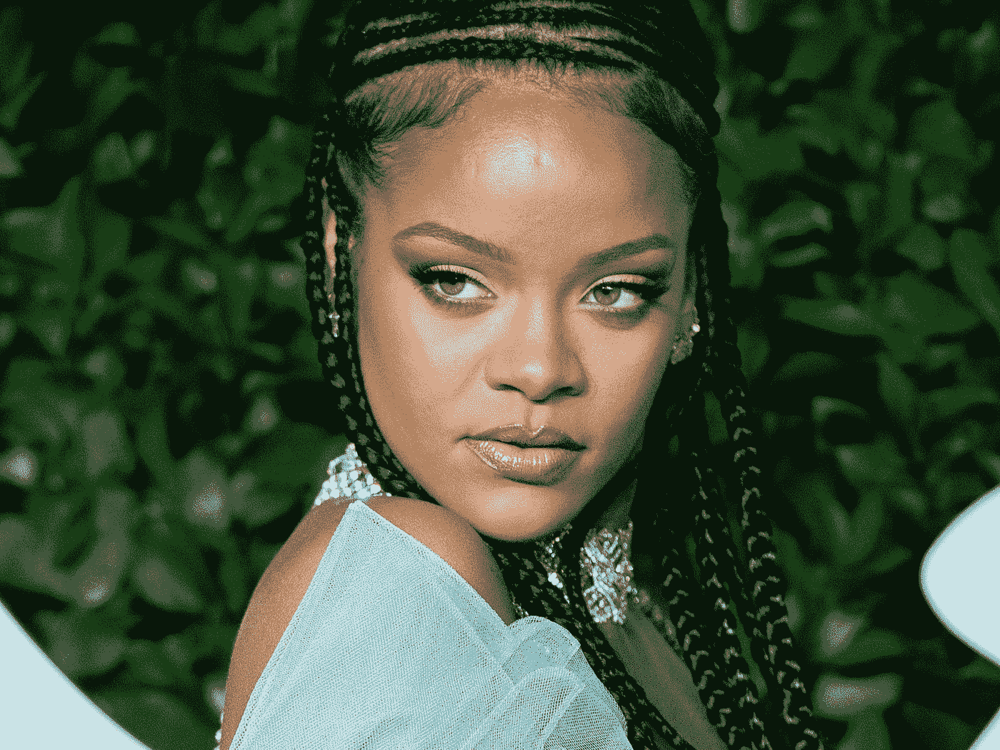

# Snapchat 如何招致蕾哈娜的愤怒，并一举损失 8 亿美元

> 原文：<https://medium.datadriveninvestor.com/how-snapchat-incurred-the-wrath-of-rihanna-and-lost-800-million-at-one-go-c03020d6ce22?source=collection_archive---------8----------------------->

## 一个简单的营销疏忽导致了 2018 年最昂贵的失败之一。

Photo from [MarketingLand](https://marketingland.com/snapchat-will-let-advertisers-animate-sponsored-filters-230683).

如果说我在社交媒体上呆了 15 年学到了什么的话，那就是——在你发布任何东西之前，一定要非常、非常仔细地思考。

我并没有做任何让自己入罪的事情，但我看到过许多有影响力的人在发布了一些乍一看似乎没问题的东西后，他们的追随者受到了巨大的打击，却发现他们的内容实际上冒犯了特定的人群。

许多媒体的愤怒和社交媒体的野火后来-这些有影响的人失去了多年来努力工作建立起来的一切。我相信你也见过很多这样的例子。

对大品牌来说，后果甚至更可怕。一个小小的营销失误——可能会招致数百万人的反对。更糟糕的是；你可能会失去一些最忠实的客户和辛苦赚来的收入。

这正是发生在 Snapchat 身上的事情——在一个特定的品牌事件中，仅仅一个小小的广告疏忽就让他们损失了[高达 8 亿美元的](https://www.vanityfair.com/style/2018/03/rihanna-chris-brown-snapchat-ad)。更不用说惹怒超级巨星流行偶像蕾哈娜和她的亿万粉丝了。

让我们仔细看看到底发生了什么——看看我们能从中学到什么。

# “你宁愿”的不幸

2018 年，为了使其平台多样化，并使其对用户更具吸引力，Snapchat 的营销团队决定，将开始在[的平台](https://www.vanityfair.com/style/2018/03/rihanna-chris-brown-snapchat-ad)上托管第三方应用。

为了推广这些第三方应用程序，它发布了一系列广告来激起用户群的兴趣。一切都很好，直到一个不幸的广告，这是仿照著名的“你宁愿？‘游戏，出来的样子是这样的:

简而言之，其中一个“你会喜欢的人”让用户选择他们更喜欢“扇蕾哈娜一巴掌”还是“打克瑞丝·布朗一拳”。糟糕的主意 Snapchat。

现在，你可能不知道为什么这是如此令人难以置信的冒犯——这里有一些背景:这是指 2009 年的家庭暴力案件[在激烈的争吵后，当时的男友兼 R & b 歌手克瑞丝·布朗据报道袭击了蕾哈娜，给她留下了严重的面部伤害和多年的精神创伤。](https://en.wikipedia.org/wiki/Chris_Brown#Domestic_violence_case)

Chris Brown was involved in a [high-profile domestic violence case](https://en.wikipedia.org/wiki/Chris_Brown#Domestic_violence_case) with Rihanna.

不用说，这则五音不全的广告在其用户中引发了巨大而广泛的争议。许多人普遍厌恶这个广告，因为它对家庭暴力轻描淡写，并迅速在社交媒体上表达他们对这个制作拙劣的广告的厌恶。

一个人[甚至写了](https://www.teenvogue.com/story/snapchat-apologizes-deletes-rihanna-chris-brown-ad-domestic-abuse):“糟透了。糟糕的是，有人认为这很有趣。糟糕的是，有人认为这是合适的。糟糕的是，任何公司都会同意这一点。”

在正常情况下，这种营销疏忽可能会遭到媒体的强烈反对——一堆措辞愤怒的企业文章谴责 Snapchat，少数有影响力的人公开谈论家庭暴力，或许还会在 Twitter 上引发一个热门话题。

迅速发布真诚的道歉并撤下广告可能会扑灭大部分社交媒体大火。但这不是普通的错误。

首先蕾哈娜参与了。

# 蕾哈娜的回应——以及 Snapchat 为此付出的代价

蕾哈娜在发现这则致命广告后，立即在社交媒体上做出了回应。在 [Instagram Stories](http://“All the women, children, and men that have been victims of [domestic violence] in the past and especially the ones who haven’t made it out yet… you let us down!” she said in an Instagram story.) 上一篇言辞激烈的帖子中，她说:

> “所有在过去成为(家庭暴力)受害者的妇女、儿童和男人，尤其是那些还没有走出家庭暴力的人……你们让我们失望了！”

这是完整的帖子:

蕾哈娜和她拥有 8700 万粉丝的[军团](https://www.instagram.com/badgalriri/)显然对 Snapchat 产生了巨大的影响——据 [*【华尔街日报】*](https://blogs.wsj.com/moneybeat/2018/03/15/rihanna-tells-fans-to-throw-the-snapchat-app-away-shares-fall/)*Snapchat 的股票在几天内暴跌了 4%，让该应用损失了近 10 亿美元。*

*这显然是由于蕾哈娜的粉丝的反应，他们在看到他们的偶像在平台上的愤怒和[因此取消了她在 2018 年格莱美奖上的表演](https://www.teenvogue.com/story/snapchat-apologizes-deletes-rihanna-chris-brown-ad-domestic-abuse)后，决定从他们的智能手机上彻底删除它。*

**

*Rihanna- pop icon, R&B superstar, and leader of almost 90 million followers- dealt irreparable damage to Snapchat when she responded.*

*据报道，在整个喧嚣之后，Snapchat 删除了广告，并且[通过 BBC 发布了道歉](http://F):*

> *“该广告被错误地审核和批准，因为它违反了我们的广告准则。上周末，我们意识到这一点后，立即撤下了广告。发生这样的事情，我们很抱歉。”*

*然而，损害已经造成了，营销策略中的这一疏忽让 Snapchat 损失了 8 亿美元。但是我们能从这些中学到什么呢？*

# *关键要点*

*现在，这可能看起来是一个相当直接的营销失误，但它无疑提醒了品牌在试图推广其产品/服务时应该遵守的规则:*

1.  ***始终注意你的内容中可能包含的任何种族、宗教和社会含义。**在我们今天生活的这个高度互联的世界里，理解他人可能存在的差异尤为重要，这样才不会无意中冒犯他人。*
2.  ***检查，检查，再检查。在发布之前检查所有的东西总是值得的。如果你的品牌需要的话，请一个校对者至少浏览一遍所有的材料，看看你是否错过了任何重要的东西。***
3.  *不要为了引起轰动而放弃你的品牌价值。品牌有责任在他们所做的每一件事情中坚持高道德和伦理标准——毕竟，他们在影响他们的顾客方面有巨大的力量。显然，这则有争议的广告原本是为了引发话题，但它最终告诉人们 Snapchat 是一个欠考虑和麻木不仁的品牌。*

*我希望这篇文章对你有所启发！如果你有兴趣看到更多的营销失误，看看这里的链接。*