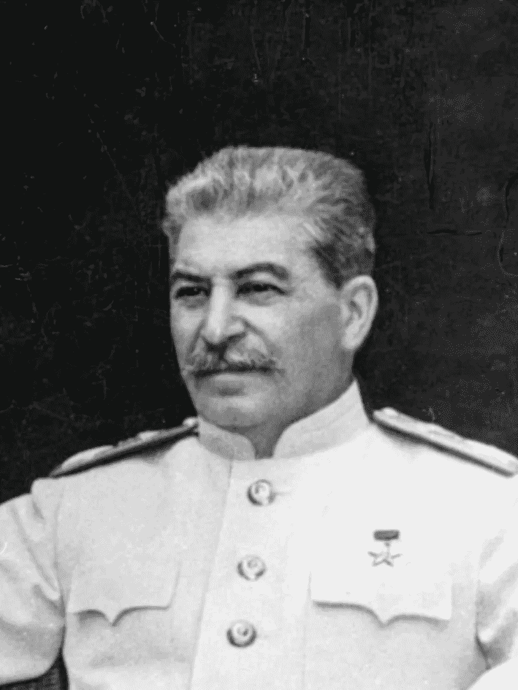
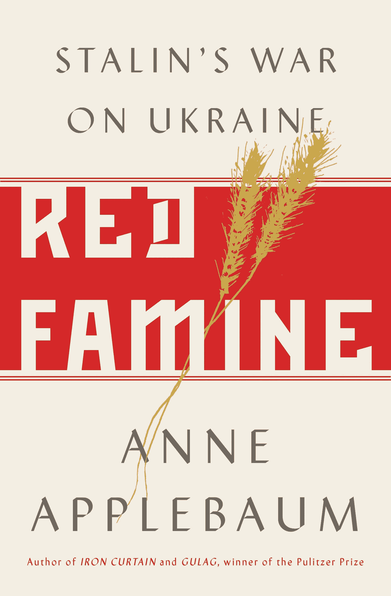

# 斯大林是如何饿死 450 万乌克兰人的

> 原文：<https://medium.datadriveninvestor.com/how-stalin-starved-4-5-million-ukrainians-to-death-2bbfdd323d4f?source=collection_archive---------9----------------------->

US Army Signal Corps [Public domain]

Credit: Doubleday

1917 年共产主义革命一百多年后，我们多么快地忘记了过去的恐怖。

一个恰当的例子是，根据哈佛大学的一项调查，三分之一的千禧一代支持社会主义。这些年轻人可能没有忘记这样一个中央计划社会有多糟糕，可能是因为他们从来不知道。

不过没关系，因为安妮·阿普尔鲍姆的 [*红色饥荒:斯大林对乌克兰的战争*](https://www.penguinrandomhouse.com/books/236713/red-famine-by-anne-applebaum/) 书应该有助于启发他们。

# 野蛮的苏维埃制度

它以令人毛骨悚然的细节描述了 1917 年开始的苏维埃制度下乌克兰人的困境。然后她带我们穿越 20 世纪 20 年代到 1933 年的饥荒，当时估计有 450 万人，或者超过乌克兰人口的十分之一，直接或间接地死于这场灾难。根据书中引用的研究，1933 年饥荒中的大多数死亡发生在上半年。

一些死去的人就是这样做的，他们从地里抓起麦穗，然后试图滋养自己，结果却因为身体太虚弱而死去。

如果没有社会主义的影响，这场饥荒可能永远不会发生。乌克兰长期以来以其惊人的肥沃土壤而闻名，甚至现在对全球粮食市场也有着巨大的影响，出口小麦、玉米和向日葵产品等等。它是世界上最大的谷物出口国之一。

 [## 保护主义、政治和经济动荡|数据驱动的投资者

### 美国股市昨日出现 400 多点的大幅反转，为未来的事情发出了警告信号。市场…

www.datadriveninvestor.com](https://www.datadriveninvestor.com/2018/06/28/protectionism-politics-economic-turmoil/) 

事情的经过很简单:苏联接管了农业，不仅种植粮食的努力失败了，而且使事情变得更糟。首先，他们把粮食价格定得太低，农民不愿播种。第二，他们出口所有的谷物以获得急需的外汇。

结果是数百万人挨饿。

# 坟墓上堆积的谎言

社会主义者不满足于杀人，于是他们对此撒了谎。事实上，共产主义作为一种经济体系未能养活其人民的想法是绝对不能说的，否则会被判长期监禁。

这本书没有细说，但是乌克兰在几年后遭受了德国人的入侵。

对我来说，阿普勒鲍姆的书还表明，撒谎、欺骗和腐败(无论你如何定义)是共产主义或集体主义的通病，因为它是任何一个偏爱人们而不是他们工作能力的系统的通病。

这本书是任何不了解中央计划的可怕历史的人的必读之作。

对于那些觉得阅读太难的人来说，也许黑色喜剧电影《斯大林之死》会让他们明白这一点。任何记得斯大林政权有多邪恶的人，可能不会觉得这有多好笑，但是每个人在看完这部电影后都能理解这个制度的邪恶。

*这是 2017 年 11 月 10 日在 Forbes.com 上首次发布的* *故事* [*的编辑版本。*](https://www.forbes.com/sites/simonconstable/2017/11/10/ukraines-famine-shows-deadly-socialism-at-its-core/#4ed193b21187)