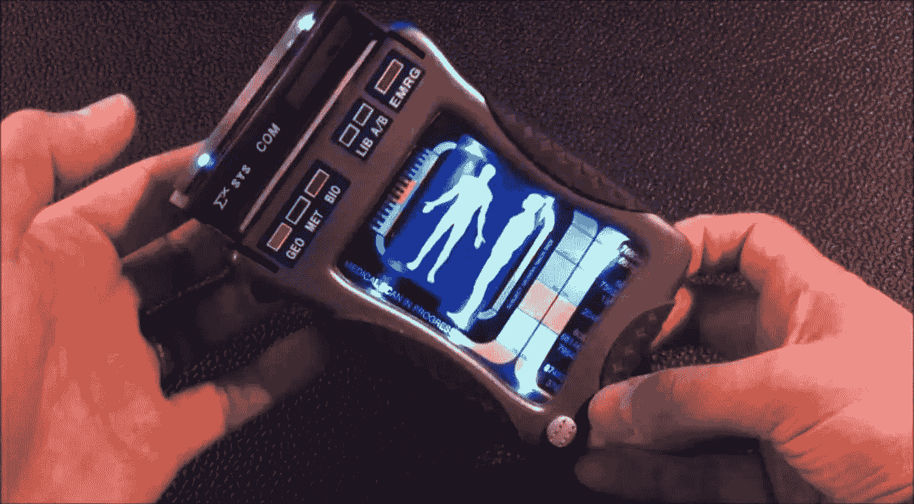
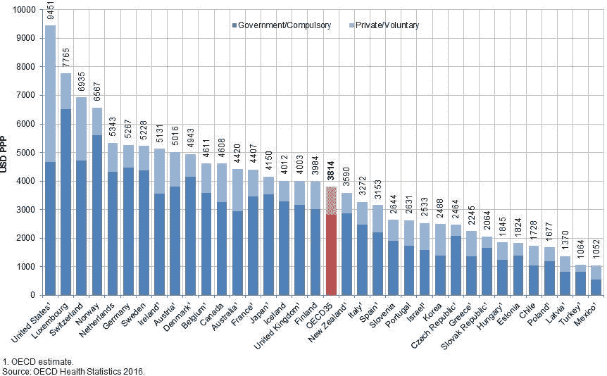
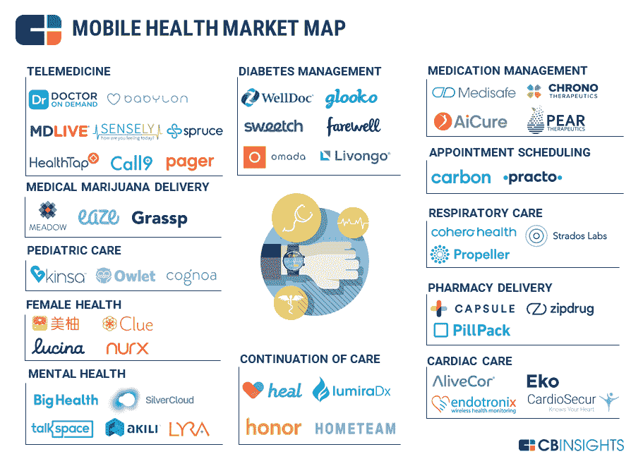

# 创业公司如何帮助修复我们破损的医疗基础设施——医院的分拆

> 原文：<https://medium.datadriveninvestor.com/how-startups-can-help-fix-our-broken-healthcare-infrastructure-the-unbundling-of-the-hospital-3a3e10b223ae?source=collection_archive---------29----------------------->

疫情揭露了我们社会的缺陷，医疗保健也不例外。虽然有意义的改善需要所有的 5p——支付者、提供者、患者、制药商、决策者——创业公司可以提供帮助。大时代。根据定义，企业家是那些打破模式、把方钉插在圆孔中的人，他们提出传统拒绝和抵制的想法，直到它最终接受并最终奉承。许多人都在削弱医院分拆的宏观主题，这在一个 pos-covid 的世界里肯定会加速。

警告:医疗保健的挑战远远超过一千本书，更不用说一篇短文能描述的了。一个国家的现实必须以高度谨慎的态度对待其他国家。事实上，即使在一个国家内，这项任务也是艰巨的，美国不同的地区有着截然不同的需求，因此需要不同的解决方案。但是为了避免我们陷入分析瘫痪，这篇文章是在讨论为什么对医院进行分拆是一个压倒性的好主意。

 [## 睁大眼睛冲破多样性壁垒|数据驱动的投资者

### “科技女性”是蒂芙尼·霍兰的激情之一，最初她在 Twitter 上主持“科技女性”聊天。她也是一个…

www.datadriveninvestor.com](https://www.datadriveninvestor.com/2019/03/20/hurtle-diversity-barriers-with-eyes-wide-open/) 

美国的成本不仅高，而且高得离谱。正如经合组织的下图所示，我们几乎是美国平均水平的三倍。顺便提一下，他们的报告为那些希望更深入探索这一主题的人提供了丰富的信息，从美国人均医生数量到护士收入增长率都明显较低。

添加替代文本

医院的分拆从根本上说是利用技术，这样我们可以更好地跟踪我们的健康状况，无论在哪里。可以检测血压的手表、可以检测跌倒倾向的追踪器、可以测量心电图的手机附件都是朝着这个方向迈出的步伐。事实上，这里有很多，下面的市场地图本身只是冰山一角。

事实上，自从十年前“数字健康”本身成为一个主题以来，远程管理就一直是数字健康的一个主题。它始于大型慢性病。例如，包括 Livongo、Glooko、Omada、Vida 和 Virta 在内的一批创业公司已经攻克了糖尿病；想想那些受影响和处于危险中的人，我们说的是三分之一的美国人。

但是现在我们在患者手中的设备达到了临界质量，我们正在经历一个根本性的突破。这不仅仅是关于收集数据，而是实际上给予诊断和从根本上指导护理。这是关于优化一首奏鸣曲，而不是整场音乐会:更经常地与医生沟通，在嘈杂的数据中检测信号，减少总的医院就诊次数，在需要时获得药物治疗，等等。这不仅仅是关于帮助管理一种慢性疾病，实际上是关于你健康的一切。

Healthy.io 允许女性跟踪自己的怀孕情况——在棍子上撒尿，用相机拍照，获得一系列诊断结果。Spect 允许初级保健医师(PCP)在年度体检期间进行眼部检查。您可以更早地发现潜在问题，并更有针对性地向专家转诊。RubiconMD 提供了类似的价值，它帮助 PCP 在转诊前咨询专家网络，甚至是他们自己卫生系统之外的专家。第二种意见，如果可以的话，知情的众包，可以提高效率，带来更好的结果，让病人和医生更开心。

医院的分拆不会解决我们所有的问题，但在降低成本、提高效率和拯救生命方面迈出了巨大的一步。对企业家来说，好消息是:还有很多事情要做。我邀请每个人对最新的创新发表评论，这些创新可以让我们更接近真正的口袋里的所有东西的医生。

我通过三星 NEXT 投资了 Glooko 和 Healthy.io，目前通过 Tau Ventures 投资了 RubiconMD。原载于 [*数据驱动投资人*](https://www.datadriveninvestor.com/2020/04/19/how-startups-can-help-fix-our-broken-healthcare-infrastructure-the-unbundling-of-the-hospital/) *，《我很乐意在其他平台上辛迪加。我是*[*Tau Ventures*](https://www.linkedin.com/pulse/announcing-tau-ventures-amit-garg/)*的管理合伙人和联合创始人，在硅谷工作了 20 年，涉足企业、创业公司和风险投资基金。这些都是专注于实践见解的有目的的短文(我称之为 GL；dr —良好的长度；确实读过)。我的许多文章都在*[*https://www . LinkedIn . com/in/am garg/detail/recent-activity/posts*](https://www.linkedin.com/in/amgarg/detail/recent-activity/posts/)*上，如果它们能让人们对某个话题产生足够的兴趣，从而进行更深入的探讨，我会感到非常兴奋。如果这篇文章有对你有用的见解，请评论和/或给文章和* [*Tau Ventures 的 LinkedIn 页面*](https://www.linkedin.com/company/tauventures) *点赞，感谢你对我们工作的支持。这里表达的所有观点都是我自己的。*