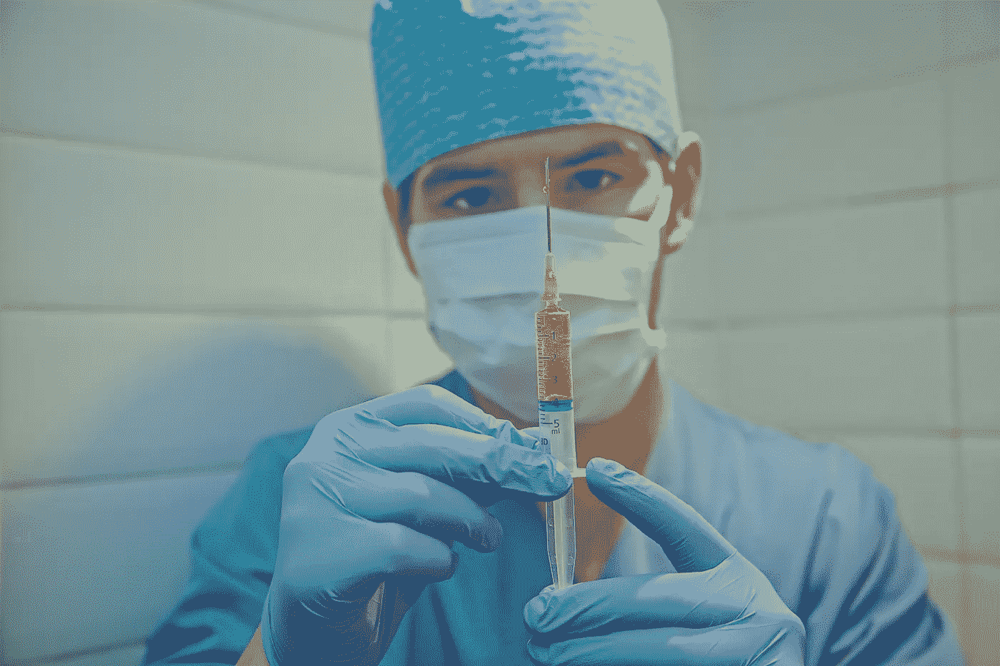

# 疫苗炒作如何影响股票市场

> 原文：<https://medium.datadriveninvestor.com/how-talks-of-a-vaccine-affect-the-stock-market-c6e070e20779?source=collection_archive---------14----------------------->

## 以及投资者应该如何应对这一消息

Photo by [Dimitri Houtteman](https://unsplash.com/@dimhou?utm_source=unsplash&utm_medium=referral&utm_content=creditCopyText) on [Unsplash](https://unsplash.com/s/photos/vaccine?utm_source=unsplash&utm_medium=referral&utm_content=creditCopyText)

在过去的几个月里，由于新冠肺炎的影响，我们看到了股票市场的剧烈波动。一部分是因为投资者害怕失去他们投入的一切。

另一部分是当前的失业经济形势和未来的工作。

没有多少人考虑到的一个难题是疫苗的时间表。

以下是它影响股市和推动各地价格的几种方式:

# 接近疫苗推动股票上涨

当你给人们一个乐观的前景时，很可能会有更多的人愿意将他们辛苦赚来的钱投资到能为他们赚钱的东西上。

Moderna 是开发 COVID 疫苗的领先者，这也是最近帮助道琼斯指数上涨的原因。

我仍然非常怀疑疫苗可能不会成功，他们可能要从头开始。每个人对疫苗的时间表都有不同的判断，但任何类型的乐观都会推动股票上涨。

# 现在称之为成功还为时过早

如果我们都坚定地认为某家公司已经找到了减缓或消除 COVID 的疫苗，那么市场就不会如此波动。但事实并非如此。

有些人过于乐观，认为疫苗一生产出来，事情就会得到解决。

但是在极少数情况下，疫苗被证明无效，将会有另一个长时间的等待。

 [## 轻松投资颠覆性技术|数据驱动型投资者

### 研究并做好你的尽职调查，找出 10 个可能主宰未来行业的装袋者可能会很难。的…

www.datadriveninvestor.com](https://www.datadriveninvestor.com/2020/07/13/investing-in-disruptive-technology-made-easy/) 

根据我在网上从世卫组织和其他可靠的新闻来源读到的，一个正常工作的疫苗需要大约 18 个月。从我们第一次开始工作到现在只有大约五个月的时间。

如果一种疫苗在不到一年的时间里成功问世，那将是一个奇迹。我知道我们正在比以往任何时候都更加努力地研制疫苗，并为此分配所有可能的资源，看看会发生什么将会很有趣。

# 最后的想法

虽然我会继续购买、持有股票，并在股票市场上谨慎行事，但我会继续关注疫苗。

现在还不知道什么时候可以发放给大众，但是我们所能做的就是耐心地坐着等待。

当一个关于疫苗的小消息出来时，没有什么理由对市场持乐观态度。在我看来，当我们可以无所畏惧地走出去，工作时，一切都会迎刃而解，一切都带着积极的态度。

**进入专家视角—** [**订阅 DDI 英特尔**](https://datadriveninvestor.com/ddi-intel)