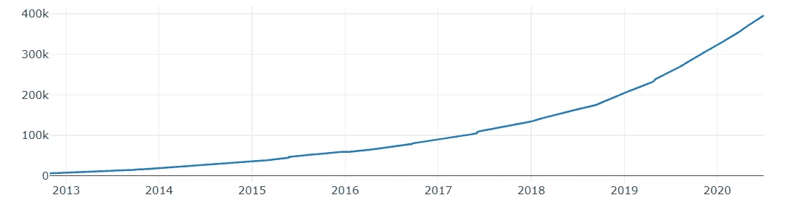

# 团队失明是如何流行起来的

> 原文：<https://medium.datadriveninvestor.com/how-teamblind-got-popular-67edf146c7ef?source=collection_archive---------1----------------------->

## 一家韩国初创公司创造性地在跨平台广告中使用数据可视化来获得美国用户。

TeamBlind 是一款面向专业人士的匿名社交网络应用，我在科技公司工作后就开始使用。它提供了一个平台，人们可以在老板的视野之外讨论与职业相关的问题。要加入该应用程序，您需要使用您的工作电子邮件地址或 LinkedIn 进行注册，以验证您的职业身份。

Photo by [Jaroslav Devia](https://unsplash.com/@jarosphoto?utm_source=medium&utm_medium=referral) on [Unsplash](https://unsplash.com?utm_source=medium&utm_medium=referral)

在浏览这款应用的时候，我看到了一些关于职业转换、晋升以及最近在家工作习惯的帖子。它的内容与许多科技工作者有关，但它面临着担心信息泄露的公司的强烈反对。

虽然本文不是技术教程，但它是一个平台如何使用数据和数据可视化来成功营销自己的例子。我认为这个案例研究也揭示了 TeamBlind 方法的潜在缺陷。现在，介绍一些背景知识！

## 增长轨迹

自 2014 年在韩国推出以来，该公司已经获得了来自 7 万多家公司的 350 万名全球用户。它在 2016 年集中努力进入美国市场，现在[拥有超过 100 万](https://digital.hbs.edu/platform-digit/submission/blind-building-and-scaling-anonymous-community/)美国用户。它还从软银亚洲风险投资公司等风险投资公司获得了[2400 万美元](https://www.crunchbase.com/organization/teamblind#section-funding-rounds)。

 [## 您的企业今天需要虚拟现实营销的 3 个原因|数据驱动的投资者

### 新冠肺炎是并将继续是一个前所未有的全球性事件，将医疗保健系统和全球经济带到…

www.datadriveninvestor.com](https://www.datadriveninvestor.com/2020/04/09/3-reasons-why-your-business-needs-vr-marketing-today/) 

该应用在招募广告客户时吹嘘其平台的实力，透露其来自特定公司的会员数量及其用户的参与度。它向广告商吹嘘的用户群的一些事实如下:

*   "工资中位数**163，000 美元"**
*   **“平均每天花费 32 分钟**
*   **“每月 360 万+** 次”
*   **“63%**的用户在**科技**，其次是**金融**，**创业**，**电信** &更多……”

## **比赛**

TeamBlind 在饱和的市场中表现良好。它与 r/cscareerquestions 和 Quora 等论坛竞争，人们可以在这些论坛上提出关于科技行业的问题，并与专业人士建立联系。但是这些平台没有像 TeamBlind 一样的增长。在 TeamBlind 获得 100 万美国用户的同时，r/cscareerquestions 获得了三分之一的全球用户。

r/cscareerquestions subscriber growth from 2013–2020\. (Produced on subredditstats.com with plotly)

[《纽约时报》报道](https://www.nytimes.com/2015/04/30/technology/a-founder-of-secret-the-anonymous-social-app-shuts-it-down-as-use-declines.html)在同一时期，其他匿名社交应用也未能获得关注。他们特别提到了高德纳(Gartner)的分析师布莱恩·布劳(Brian Blau)，他提出了一个问题:“当一个社区是匿名的时候，你如何实现病毒式增长？”

## 广告技术

一个匿名社区不得不通过口口相传或在其他地方推销自己来招募成员。TeamBlind 在美国的成功可以部分归功于后一种方法。

它使用*跨平台广告*来吸引最有可能使用该应用的用户。在 Instagram 上，它发布简单的信息图表，以令人信服的方式汇总调查结果。

Sample survey results from TeamBlind’s Instagram.

图像的颜色引人注目，文字为仔细看的人提供了更多的细节。

TeamBlind 甚至有自己的公司博客、媒体页面和 Twitter，所有这些都以某种形式显示调查结果。每篇帖子的详细程度会随着使用的沟通渠道而变化，因此他们的个人博客通常比他们的 Instagram 或 Twitter 提供更多的分析。

我个人第一次遇到 TeamBlind 是在我阅读的一篇文章依赖其调查作为来源时(类似于这篇讨论湾区房地产的 [SFGate 文章](https://www.sfgate.com/realestate/article/Google-facebook-can-t-afford-Silicon-Valley-13132157.php))。

这些类型的广告立即激起了我的兴趣，因为它们回答了我好奇的问题。与一般的广告牌不同，这些信息的内容旨在招募盲人的目标用户群。毕竟，该应用是为有问题并愿意回答问题的专业人士制作的。

我相信做跨平台广告有一个错误的方法。如果该公司只是在第三方网站上展示其标志，我根本不会参与该广告。

TeamBlind 的信息图对我来说不像广告。它们足够有用和可靠，值得在文章中特别提及。他们用数据增加价值。

## 数据陷阱

能够说“34%的工人认为他们在隔离期间工作更多”是很有说服力的，但如果没有额外的背景，几乎不可能做出这样的声明。当被调查的工人不能代表所有工人时，总会出现抽样误差。

TeamBlind 可以接触到一个自我选择的、高成就的白领员工样本。这个群体很可能与全体员工存在差异，因此不要将他们的调查结果视为每个人行为的指示，这一点很重要。

在他们的公司博客帖子中，TeamBlind 试图通过告诉我们有多少人回应以及他们支持哪些公司来细分调查参与者的人口统计数据。但是，这种背景经常在其他帖子中消失。

结果是，“简短而甜蜜”的标题可能会产生误导，并随着时间的推移失去平台可信度。虽然我不认为 TeamBlind 正在失去可信度，但它可能会因为没有提供足够的细节而失去用户对这些跨平台帖子的参与。

## 结论

作为 TeamBlind 的用户，我现在定期填写一些调查。它们无损于我的经历。我可以选择查看我不想回答的民意调查结果，而不用自己回答。我没有参与调查的动机，但我仍然会回答对我来说很重要的问题。

TeamBlind 找到了一种方法，在不损害其用户基础的情况下，在其他平台上显示先前存在的数据。他们的客户成为产品的有效营销者，不仅仅是通过向朋友推荐应用程序，而是通过简单的互动。

## 访问专家视图— [订阅 DDI 英特尔](https://datadriveninvestor.com/ddi-intel)