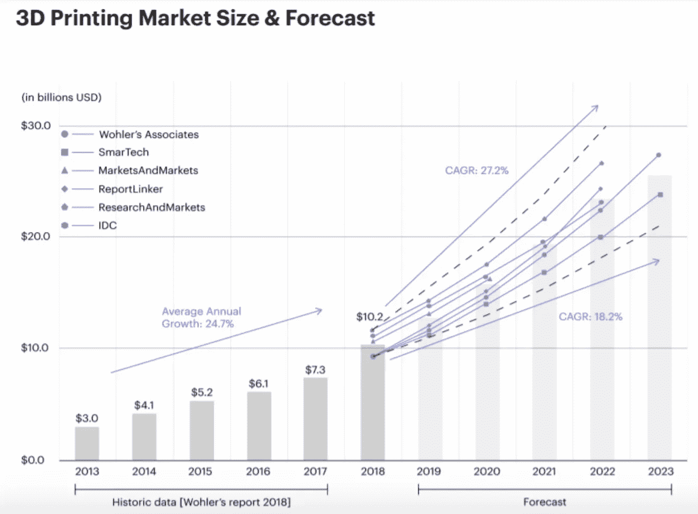
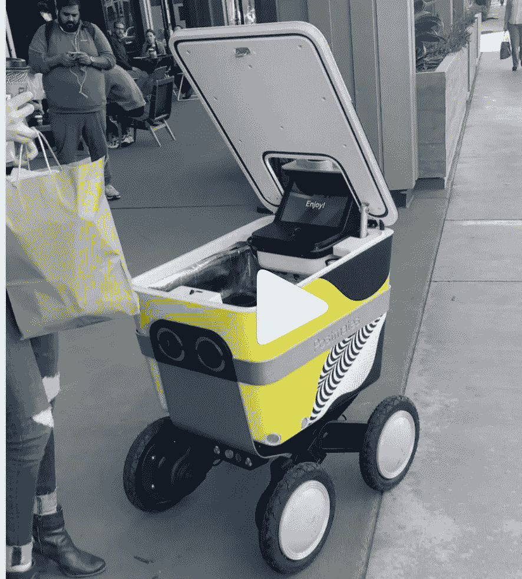
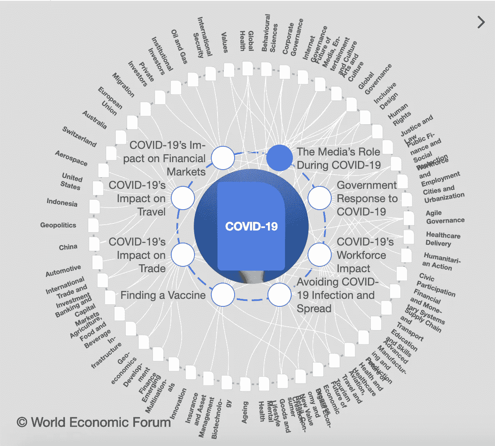

# 科技和创新如何拥抱新冠肺炎&从中涌现出了什么？

> 原文：<https://medium.datadriveninvestor.com/how-tech-and-innovations-embrace-covid-19-what-has-emerged-from-it-5dc308f9c0d6?source=collection_archive---------12----------------------->

有很多关于当前形势的话要说，这大多不是一件好事，但看到这么多旨在帮助对抗新冠肺炎的倡议和技术进步很有趣。具有讽刺意味的是，它加快了创新过程，我们匆忙地把一切都放在一边，想出如何支持人们，保住工作，将他们转移到 WFH 模式，让每个人都安全，并尽可能缩短封锁期。人们想要过正常的生活，见见朋友和家人。企业希望提供一个安全的工作环境，并继续发展他们的业务。它确实让很多人更加努力地寻找最佳解决方案，并创造性地使用技术来实现这一切。这里有一些创新的例子，这些创新是由于封锁而诞生的，解决了疫情问题，并使我们的生活方式变得不同，但在今天却是可能的。许多技术都取得了重大进展，并发现了新的用例，因为我们不再有时间去适应，我们必须立即行动，让自己沉浸在“新”中。

 [## 基于人工智能的聊天机器人如何帮助你形成更好的长期习惯

### 当我们思考我们的日常行为时，我们经常没有意识到，我们所做的行为占了多大的比例…

www.datadriveninvestor.com](https://www.datadriveninvestor.com/2020/02/03/how-an-ai-based-chatbot-can-help-you-form-better-long-term-habits/) 

**电子商务**

[亚马逊](https://techcrunch.com/2020/02/25/amazon-opens-its-first-cashierless-grocery-store/)、[标准认知](http://:https://www.sfchronicle.com/business/article/Coronavirus-Standard-Cognition-reopens-its-15286920.php)在全美不同城市开设无收银员杂货店。只有摄像头的结账工作非常准确，这看起来像是购物行业的一大突破。

**无人机技术**

无人机技术变得前所未有的有用。几周前，我在单独的[帖子](https://investinginpassion.com/2020/04/30/drones-development-in-times-of-pandemic/)中描述了开发和用例。

**虚拟和增强现实(VR & AR)**

当每一双医疗之手比以往任何时候都更需要的时候，年轻的学生和年长的专业人员都非常受欢迎，他们可以拯救生命。免费的虚拟现实医疗培训帮助退休的医疗工作者重返工作岗位。医务工作者可以使用虚拟现实来对抗冠状病毒。Oxford Medical Simulation 向美国、加拿大和英国的机构免费提供医疗培训平台。 [VYVID XR](https://vyvidxr.com/surgical-training/) 是另一项新举措，这是一家年轻的初创公司，提供外科培训和评估平台，使研究员、外科医生和医疗设备团队能够使用混合现实进行培训和评估。

牛津医学模拟虚拟现实医学培训:【https://www.youtube.com/watch?v=yj1tGuuM8Ro 

虚拟现实还被用来在封锁期间从家里检查车辆。
另一方面，福特利用虚拟现实技术将虚拟工作室中的设计师联系起来，使他们能够远程合作进行汽车设计。
VR 也被老年人使用，并使他们熟悉这项技术(例如 [Rendever](https://www.rendever.com/?gclid=CjwKCAjwnIr1BRAWEiwA6GpwNVKraE9oWcYXorOCjkOw588NeKQj_TRF6wxcL6qeX4g9jBcUVQBf0RoC3vIQAvD_BwE) )。 [MyndVR](https://vrscout.com/news/myndvr-vr-donations-seniors-social-isolation/?utm_source=VRScout+Scouting+Report&utm_campaign=2731dd0ea3-VRScoutReport_041020&utm_medium=email&utm_term=0_f3642cd298-2731dd0ea3-162017849) 向美国老年人捐赠 VR，让社会隔离不那么有冲击力。我喜欢这个！学习和让自己忙于新事物永远不会太晚:)

学长第一次尝试 VR—HTC Vive:[https://www.youtube.com/watch?v=QvUkcw63bAs](https://www.youtube.com/watch?v=QvUkcw63bAs)

如果你仍然是更多的“纸和笔”爱好者，你可以通过 [Craftopolis 工艺俱乐部](https://www.craftopoliscraftclub.com/)与你爱的人联系。我爱[卡尔顿老年生活](https://www.carltonseniorliving.com/location/pleasant-hill-downtown/)倡议用信件和手工卡片！

**远程医疗**

医疗保健站在第一线，直接不断地与缺乏资源和适当的技术作斗争，为没有身体接触的人服务。它引发了在线咨询、远程医疗、在线患者平台和其他与医生远程交流形式的蓬勃发展。最近，一些远程医疗服务的增长超过了 1000 %，并且建立了许多新的服务(例如 [Tembo Health](https://tembo.health/) 、 [Precavida](http://www.precavida.com/) )。

**三维打印**

3d 打印技术多年来一直在稳步发展，但最近它加速帮助解决了[通风机](https://www.nbcnews.com/tech/innovation/worldwide-hackathon-hospitals-turn-crowdsourcing-3d-printing-amid-equipment-shortages-n1165026)和[面罩](https://www.cnn.com/2020/03/23/us/coronavirus-3d-printed-medical-supplies-trnd/index.html)的短缺。

[*AMFG:AI*](https://amfg.ai/2020/01/14/40-3d-printing-industry-stats-you-should-know-2020/?cn-reloaded=1)

**视频会议和 F2F 通信平台**

呆在家里，在家工作，过着封闭的生活使得社会联系几乎不可能，人们渴望见到他们的亲戚并与同事保持联系。视频会议成了模拟聚会和与他人交流的唯一方式。全球视频会议市场[在 2018 年](https://www.softwareone.com/en/blog/all-articles/2020/03/09/next-big-things-to-expect-in-video-conferencing-2020)达到 30.2 亿美元，预计到 2026 年将翻一番。为了让工作空间为未来做好准备，或者现在已经为当前现实做好准备，技术需要在会议期间专注于视频质量、视觉和听觉。我们可以看到，Zoom 无疑受益于 WFH 政策，但许多其他新的创业公司聚集在一起，开始在新的平台上工作。GoogleMeet、微软团队、Skype、ezTalks Meetings、StarLeaf、Cisco WebEx、GoToMeeting、蓝战士、Slack、Google Hangouts、CrowdCast **、T3**仅仅是在最近的疫情中开发了他们的服务并调整了功能(很多时候提供免费使用的系统)的几个例子。

**网络安全**

自从远程工作在全球范围内实施以来，组织和个人面临的各种网络威胁急剧增加。专家们努力工作以确保数据和公司人员的安全，而他们却呆在家里。已经发布了许多出版物和安全建议，并鼓励在家庭工作环境中实施(例如 Crowdstrike 的电子书，“[保护当今分散的劳动力](https://www.crowdstrike.com/resources/white-papers/securing-todays-distributed-workforce-ebook/)”)。)

**聊天机器人**

微软表示，美国疾病控制和预防中心正在使用 Azure 运行的医疗聊天机器人服务来快速评估症状，并为潜在患者建议下一步措施，如看医生或呆在家里。[微软](https://www.zdnet.com/article/microsofts-healthcare-bot-service-helps-power-cdcs-covid-19-assessment-bot/)于 2019 年 2 月推出了其[医疗保健机器人，但直到今年，它们的使用才变得至关重要，并为更严重的病例和医院的进一步诊断释放了大量人力。
两周内大约有 100 万个客户服务电话注册，公司发现处理双倍数量的查询(取消旅行、健身房会员纠纷、订单延迟等)极其困难。).聊天机器人(例如](https://www.zdnet.com/article/microsoft-rolls-out-healthcare-bot-service-new-health-record-integration-feature/) [Orbita.ai](https://orbita.ai/) )和其他具有[语音识别](https://www.enterpriseai.news/2020/05/27/deep-learning-boosts-call-center-speech-recognition-during-the-covid-19-crisis/)功能的技术在这种情况下帮助很大。

**人工智能**

人工智能专家专注于发现哪些药物有助于对抗病毒的过程。随着大数据和数以千计的潜在治疗方法的出现，任何一种方法都可能奏效，时间来测试它并取消进一步处理的资格是至关重要的。

HBR [谈论](https://hbr.org/2020/04/leveraging-ai-to-battle-this-pandemic-and-the-next-one)利用人工智能对抗疫情，建议[个性化预测技术](https://store.hbr.org/product/prediction-machines-the-simple-economics-of-artificial-intelligence/10195?sku=10195-HBK-ENG)。使用不同的数据，可以训练 ML 模型来测量个体遭受严重后果(如果感染 Covid)的[临床风险](https://www.thelancet.com/lancet/article/s0140-6736(20)30566-3)。

**机器人**

在过去的几个月里，送货机器人蓬勃发展，并在世界各地的许多城市接管了食品配送(无接触送货模式)。

[By](https://www.instagram.com/p/B5tJXUxlN6b/?utm_source=ig_embed) [filmreilly](https://www.instagram.com/filmreilly/)

[Starship Robots](https://thespoon.tech/starship-robots-making-food-deliveries-in-tempe-az/)

**教育**

当你不能去学校和参加常规课程时，教育平台成了第一个要去的地方。我在另一篇文章中写了关于教育平台的内容，所以你可以在这里看到细节。

**国家和国际支持**

最后但同样重要的一点是，人们付出了额外的努力，在很多情况下把不可能变成了可能。重要的是要强调**人的心态、领导力、同情心和同理心的发展**。

[**Spotify**](https://creandum.us6.list-manage.com/track/click?u=5bd2d3e0e530a9b1c55bbc6de&id=3d34746141&e=13e4bcd659)**新增[筹款功能](https://creandum.us6.list-manage.com/track/click?u=5bd2d3e0e530a9b1c55bbc6de&id=7f627f435a&e=13e4bcd659)支持创意音乐社区度过危机。**

**[**VOI**](https://creandum.us6.list-manage.com/track/click?u=5bd2d3e0e530a9b1c55bbc6de&id=99e8f8e2f5&e=13e4bcd659)**提供其由 25000 辆小型摩托车组成的北欧车队来帮助支持当地社区，比如帮助医生进行按需出诊。****

********KRY 将其平台免费提供给世界各地的医生，在疫情冠状病毒期间进行视频会诊。********

******教育科技公司[**卡豪特！**](https://creandum.us6.list-manage.com/track/click?u=5bd2d3e0e530a9b1c55bbc6de&id=c6705fc6d8&e=13e4bcd659) 调整了他们的服务，[免费提供所有高级功能](https://creandum.us6.list-manage.com/track/click?u=5bd2d3e0e530a9b1c55bbc6de&id=eba7d19787&e=13e4bcd659)，并开发了新功能，不仅可以让孩子们保持一致，还可以让远程团队保持联系并实现电子学习。******

****FirstVet 为英国的宠物主人提供免费的视频兽医服务，服务时间为每周 7 天，每天下午 12 点到 5 点。****

******麻省理工学院**研发[可穿戴传感器](https://apparelresources.com/technology-news/manufacturing-tech/mit-develops-wearable-sensors-monitor-vital-health-signs/)监测重要健康体征。****

****阿里巴巴联合创始人[马云](https://www.cnn.com/2020/03/14/tech/jack-ma-face-masks-us-donation/index.html)表示，将向美国捐赠 50 万套冠状病毒检测工具和 100 万个口罩。****

****[**埃隆马斯克**](https://www.businessinsider.com/elon-musk-tesla-ventilator-controversy-explained-2020-4) 生产呼吸机支援医院。****

****[**Factorial**](https://creandum.us6.list-manage.com/track/click?u=5bd2d3e0e530a9b1c55bbc6de&id=546724261e&e=13e4bcd659) 宣布只要危机持续，数字人力资源套件的无限免费试用和免费咨询。****

****印度年轻的工程师们正赶着开发一种可以拯救成千上万人生命的低成本呼吸机。****

******风险投资者和其他商业领袖准备并分享手册、建议、网络研讨会、办公时间，以支持创业公司和中小企业。******

******Village Capital** 的联合创始人 Ross Baird 给[写了一本小企业和企业家指南](https://iv.t.hubspotemail.net/e2t/c/*VmWtFw3XP-m4N525GSbg_8Zy0/*W7BSySh7_rGMPW7sXLmS1TsBPL0/5/f18dQhb0S65N6XLRKpN11M6-_kNJNMVl17d61c83PzW8C1Wbj5vLQWgW1BLk5Z5ZblctW7v5bl24nvRRXW7x3TG-6NDXW0W3DvTs86xBt76W4QH-jx3K2sJxVyX3rL62P7wVW8j38hQ6ZlfFdW2PrZkL5yxCk_W4l-BwM811nP7W3k-7lZ1C1jx5W83tplY6nwHf0W8jgM3j3gfTxSW4fx-527JSynDW1WD52Y5q1lR1W2Gb37l1Q4MS4VnSq-x1gCC7mW5hwl0f3TJBczN8VCCrb884ndW8L1M6n3h-63CW1zj2d73HyKxPW2nyyHx1Qtd00W4ZnTYb9cgTBTW8zz89P5HJ2NNW3k2yd07sPsvKW5qT_JQ33W9kSW6sXCMY72N1hkW6KLDGp20NLsqW7GM0t523WmDpW3z3SQh1RCpgKW6V89bl7TqbpSN4lrfkMwHktfW5yp0fg9h8fFVW1Lkl3d5-Y_gpW8Z7S3x7TsCgvW1vDG9l24lhYcW8r6nrL4780RKW3z8G_K3TWNLhW8gwJ4L4_qYt7W1rWLdG2NjCC5VVrWK98lFr4xW6-5vgm5G6N1ZW8kqKww8BN0D1W3sHRMB5PKs8pW10_RkX4GQVfLW976vh78ZdJwkW4m8RVS58n54PW2NLtV047hLP_111)，帮助他们在新冠肺炎危机期间获得贷款和救济。****

******SOCAP** 准备了一个[综合资源页面](https://iv.t.hubspotemail.net/e2t/c/*VmWtFw3XP-m4N525GSbg_8Zy0/*W92TtqQ6kj1L4W521hTv7vMTgq0/5/f18dQhb0S1Wd2WJLfhW11M6-p2lDKhrW2wqC-44Px5jFW2b4Hxv3_R0fyVzk7vn1lJGfsW3RnqHg6Qbc_xW3MsWWS5SqML1W1sfXzl8b1J9jW8637pZ1chX8RVQnNT28QjmtnVq9lyy5SjYZfW8pwLr14lC8wXW4BpyST1-zRMWW9hp9yk4twgv0N7NDhc_c5_hcW1F6Jkl7g-cryW3Xllxw1cdB2jW4lZY1Q1sZ2f3W76pbBP2qqBnmW3ksCDy82p4nPW22G2bV2JgZJ_W13vb778hyT5TN6S_S-Z9HmjrN5r345SMjWZ6N77-t7Yr_mfGN6qx7TbXYx1YW49x3lS6ZzN45W5WbLtd6-f98sW20RJnH4flz5mVkC5V32vbt7mW8YJ6Fr1VxznDW6kW0bw7S5jZVW3WFmw12x6q0_N4C1rhY13r1tN2GYqTF9zT9FW1GVVFV6yGrtsW7xs3kl1XqVl9W7vs2fX8tVcw5W2_g3_z5CP9sfW6vcd5V7qGsnVW1tp2FD2pWYp3W5CM8Cf9fw2kLW76kwsd2Vq6jZW96RP2g371PBQW39xTWQ8-XX7mVqfdS05KzxWyW5zc5g57LZmfsVFv05x49Sn8bN76tssLxqDwMW5bjcvP7zCZVNW44LsHt9jTc76W97bqzr8DmcwpW6H6-gp9ffhZ_f79svtG02)，涵盖政府、慈善和非营利部门。****

****阿斯彭发展企业家网络整理了一份关注新兴市场的名单。****

****Cathy Clark(杜克案例中心)推出了一个关于 1450 亿美元新资本的可搜索数据库 [#COVID19CapitalRelief](https://iv.t.hubspotemail.net/e2t/c/*VmWtFw3XP-m4N525GSbg_8Zy0/*W5qH9Zr2gdGZxW4S044y5FCkYY0/5/f18dQhb0S65P2k6_h3N12hgc3kNJNMVl17d62pgMJVW4mZ_fs54Z6y6W2y_3dD1X2jSWW6PJyws7hTkvyW4mBG6c8DbjrsW38bm553wJ5JRN1-QH1t29YntW1L-k4P5wHK0jW6-Lr5b8Ns724W9dymdV8V7119W4Brk5k74ww78W6w3K0H83sVTtW7RVdfJ39jW2kN7x-VcwKkWcdW5whSp81zTR8NW2Fbr2J4LT9cPN3pQ_k9llnShW7NrsSt5gpWJ0W1J4Hyl1dpVqSN3FTBS1c6q72W6NY2Mz7cMtzvVHHh8m3dhd4fW6D935M4R6NCpW8_9gJL4hnZGXW7Mm9tj94QgFdW6sWC_k2kyhcvVpRKWZ18ZqrDN7WV5LVmNxvXW118zrK1xpc08W4gQtNz69dFB-VdHftd7N_dndW7ZfmZR6STS55W31D40P7ynsbkW1MS5l623KMtyW8vDVxC4k2CbVW1vLbJb18VNjKW4QwRDf8-XcHZW4l7jXk59jC6MVw5Tfk14f-BDW8dZKNv8kW813MHMBvKL43RNW3FTY2973RXzmN6gzl3hSK3jJW4NQkKX1XCjjrW3qKKB83_gc30W6j5fkr8_lL2DN8GltghKVh6pW7Z_6vV21_QjbW1Yf_MG959PnyW9bz41S6rTnsxVcK-c49dDSQF103) 。****

******Gusto** 创建了一堆有用的资料:一个[新冠肺炎小企业资源中心](https://iv.t.hubspotemail.net/e2t/c/*VmWtFw3XP-m4N525GSbg_8Zy0/*W4Hj-Xz5JdQS7W4pSFVG400nR00/5/f18dQhb0Sq5M8XJ9qWN8mPgPsGX865W1yM6yY5FyFnDMVygVLXf8D7W5r8vwP3mm42mN8sZcVMMLFp9N5x5KNkSd583VRBdSp1nPLDMW81gM8-7d-tJnVQJ99n8tsDsFN8lFsVjZv_1wW5v7WNq5w5R8TVPMT3v45HXXTW3Lqnm_8q5FTlW67Tp-x8m7Y9zN5wM1SsphC7_W8sYvvl5tGC9sW4Fpt_L1NmqjBW1txG9N6GsfdKW8XNh8_7JMpctW1Y-B3p2VtZn8W1RdYj82NnkNgW2FtWFc6fNtpyW2F8qpF20DdkgW7jJ-wX6FHkq6N4bRT2Mrz1cnW6d--fD7t4vqRW1N6q0n7jKQC_W6yf81p8Prxz3W5fPJJg8_h3d9W4mmW9s91-5SbN2QSW8syb6yrW8X04B48QBhlWW8Y-zB67y0YWDW19zKPF4jlVTjW3wCBs_22TNxnV9Mb774dsx3lW5wLSxY1mjpYpW1m9wLL38ZY2bN29HK6W5_QPkVd8y6q1QN-6GW8qqFqy4nB5SVW56fL912XS6LGW97_GZJ2B9qZSW90cCwl66_qjXw3xWwfqpwMf8Pc5j502)，一个[新冠肺炎联邦、州中小企业救济资源追踪](https://iv.t.hubspotemail.net/e2t/c/*VmWtFw3XP-m4N525GSbg_8Zy0/*W4DywQP56ByQFW1984FW5b7XDc0/5/f18dQhb0S65P2WK2bdW12h5r75r1fHmN1wxGDYQypyhN1qXpl2jbXHKW1DGMml7NcfbVW3KtJ4l2HrmprW4m591d87hXdxW2dx47p4HLVVQN5J3GMpTLGWcW2lqrxd2_rVL9W4-gZhq8NcDf5W2CX4G-9fL5lFW6VzWjg5TmdlpW2Fvh4L7gstm3W5qLkJg3k4T8tW5dlN3m7MQZLyW4NCyr91f5dfRW55G9T33xfnfTVWN95L1D4-b-W822mhS8lfs1sW5NB2-k4qf5tJW9ftylj2-FCb0W7mpx-_5nz8BNVDlYcf1R4h4gN30twp2p0b92W1n4QpW1YJWnMN4Z5NQHjdc_VVwcFR255ZXlLW2qNfLb3TVFXXN2-BG4Rk1d97Vwlsj93P31CpW6TNp9T4tjN5XW81thNf2tBhQnW7FZsmy27gkjZW24YzMN7p-kD3W7hY6Jp12RxwBW8LSZnQ3kGs-GN3tdwMl3PhPtW8fz3s64tkq27VPwGKK8QXxKDW7gLQjG8k_mHTW1L1PJJ9dkRSVW2mvTPb1BP_SjMvrgQBNrpcFW3P5y_N4NNk3_W2LnlF93NmwMLW48Cx973jd5HkW3vWsyY8rKRkSW96ZTgw8sCKv7W7-5RXf4mhpdNW2Z0Gr79l_DFvW9hGCY08v4nszV2fWtt5ps3tz103)，一个[税收减免指南](https://iv.t.hubspotemail.net/e2t/c/*VmWtFw3XP-m4N525GSbg_8Zy0/*W7rLLLb8DLzLfVzNS9Y5PKwP90/5/f18dQhb0S66-6_rVWdW11hNzn1wZ324W5ll73n1tbgJGW5nKn7q1X2BTDW7SG3YZ6R7CCfW80wJzF51NFhDW6T1rPz5Y3SW9W84NNHJ2R2RwLW6M6nr92KVFZFW4hLmRH4YjncLW4HmB_b4DydKLW6kpDm-2lVWXqW36nYWk2pKzfpW4dM9zS3h0nw-W6XdjN66NwQQJW8r5BFx7fpFjtN7gr-8zDCtMLW2_ZNbc634lTVW4rRxsh24VK0dW7JMb3w5Whr3zW23xT0m8yM9xwW346kJ35v0WVhW8msV6s27ryWWV7R4Pc7pGnX7W8s3tL165pBj2VLHtCq63FKN_W7HRn3w65WYDcW6LM6vF3yV35XW7-SHGr7MsQKJW6WCVR57M7ZmYW5t7QvP3KWNN8W5g-h5m7t-PLtW1mNkLX1W85d2W7ZQ-KC4wvcsTW1rB_Fs6QRTHtW59K2bB8CS3LhW1kCXL36MscfKW1GXHl091rqh-VD_QMM4hcF6dN5t_M1bBr6dqN5d5JGYx8BNjW79XpJ31fLPdHW875XLG3z7xJ6W45Xw4T9c196fW7S9PLS78Cl8pW5S2lHV5-d0YKN9f49RGDNppxVbpSLB3tvg58f34RBj403)。****

****创始人健身房的首席执行官 Mandela Schumacher-Hodge Dixon 创建了一个文章和资源列表:[“我的企业如何在冠状病毒中生存？”业内专家称之为](https://iv.t.hubspotemail.net/e2t/c/*VmWtFw3XP-m4N525GSbg_8Zy0/*W99gxyC6y3MSWVLmZBK6JR1jd0/5/f18dQhb0S3j42p44bJVWp49L2qy7trW1fL-nP3wyH-bN7wkVcJQBv10W7Czw6d4NlGyfW1NWk2Y29bT5WW85dylF6P4b0LW30pPWD18Wh00W4vSl418ycVz0W9h9fFj8ThNB1W4-gZkP7B_5LhN7jccfDTgSsHW5MKkQV4mx4KlW1HzZ4S4G30QCW5tzhbY5swqw3N88g1Gtx0ZdTW1v2Th57L8rWxVRsTXv5S-S-4W1n7hg07KJLlpM4cp0pld8DVW5w0Pcg2MFC5bW63-spR5XKC5qW2fVC221XFBkVW8sKqbL87FXF7VmxLMP50nhD-N1tFrxN26PbdW1wcqKY499J4NMBFc6NgW_CLN7jCv5WT-WDvW2PgbGW3fz11zW39BZ-B9fSpGFW2p5wSw7ht3lxMrVNYT7fmvLW2CMBTz6H2ZhQW7fjWw08fhC0yN8KFx88Wmkp0W8JsGtB3QDL89VXPCkK2KZjB5W4XhrBc3lxxZTN6_0ky_zcSJFW2y4TGR1gyrGSW5mzV2C8xRGhfW4-P5hd5RMH9pVK1MZM5JSQdmVVkjpG6K8KCQW1TlqYb8KYcz-N3d1ncqQr9VmW25y8fg5nnGcVW294HjQ5yC38CW6-RgCF3S8XQlW77V1VZ9j3tjwW8p1PcS4DQk95W2l16Wf6v7K_PW41KW7n9cg3hDf3h0gGr02)。****

******全国风险投资协会**为风投和初创公司分享[冠状病毒信息和资源。](https://iv.t.hubspotemail.net/e2t/c/*VmWtFw3XP-m4N525GSbg_8Zy0/*N526kbrP-nKKW7RFZss5mWt_80/5/f18dQhb0SfHq9dsQYMN8mPgPsGX865W1yM6yY5FyFnDMVygVLWJh2bW1td_cl6HLbf1W1BqS8W7qWC07W1VxmZ-54lXxrW52Y78V8Tp8lVN7qXTfKv0dvDW2MznrN5nbq6BVGXpVf3ZkggzN1Sj045tyq95W557YPh2KFPqTW7PN1xK8W2c9WW32CQ2l8jxMNSW1Vx27W6Pkt_VN62_rVl2wNCyW9dH8_66V4mfxN8JKr66Rr-3rVYSX-57m_B1RW5c8d-S377W4NW6bdSV07f-CYJW1pxfp-3MzjLrVG5gqF3JrYqDVdWpMF96kTWzVbQfvX69DSFKW2pSj9C4qMS57W2nW_7Z4LcWFSMFRC8tchYGLN4CPcdyRF0D3W8f3Brc6ZTj7QW8KbVmr8rNvQmW5DbhLM7f9BFTW3SpZ9d1md-0pW5bq8Lr7m1TWCVhzVNs6wR6ssV23Bj15n12C-W5KslDl6qbyB5W8Tzc6m6hz0s8W2bzNQY5_jXMCVmV4bV1Txv4ZW8XkwRh6fLb3jW319lTg2nvlwDW7z2LRR5hfR42W8k3HPJ9jrgGpW3Nt11F1tPP81W8l-rN988qc7hW5qszKH7BtbvTMmRw0WdXyXbV1czTH7Vmv2n103)****

******Indie.vc** 创建[导航新冠肺炎救济& SBA 贷款](https://intro.indie.vc/sba)资源。****

****[**阿什利·洛斯**](mailto:ashley@jetblueventures.com) 和 [**莎拉·玛蒂娜**](mailto:sarah@jetblueventures.com) 副策划[新冠肺炎:创业资源&见解](https://docs.google.com/document/d/1Ph_v-xT_mtUO6ALsvlOSRtqyJC6BEyMY_WB9SrF5XPI/edit)。****

****这里有一份[名单，上面列有 **190 名投资者**](https://iv.t.hubspotemail.net/e2t/c/*VmWtFw3XP-m4N525GSbg_8Zy0/*W8CZGp-8d7CchW6vJwmS8FDBfS0/5/f18dQhb0S1Wd6XvPVTV1x1d91b7KTfW60GpLk1tb9tMW4y3Stj58j-RSW1YXW725xR3ZDW8ZfWZM6X_pnNW7bjx5m7cZqQCW1bzhrS5H4brWN476W3JMl7NFW4CbRJj7stH_yW7xJvXr6-mh2DW7dYSWl62VC90W8x-Rxf2Js5b5N7dJ5LJk69PsW4Rq6CK8LFHDDW4-lLxT5Y7hYfW302C_Q49gqHbVClWQm5mg7dMW4V_Fz-70XtXCW513nGF8cp1glW3dWPQs7qZFFRN4dKrWhx1DxjTtCdj5_Zy6XVGC5bG5TDgH9VlNGjp5kD-bpW5Z9prn3JmzGkV91bR13GddqtW4Zz4XQ1dJS5sW2yP4Tg7xXhPYW5S_n8y5gg_QFW5F2P4y14wW_0W4915Qw8FyjbGW7hSBRX21MmTZW1b_GJZ57sCY-W5xxkB53Yz6XjW3fn4_T2M78T9W2sdqhb257ttSW3djV5d4vjgBgW8HmKz971lWHRW8G1qV31D_fHsW7zhZMv8DVrZbN4-tnH0C3N5SW8ZyF2883vh96N8SSJpGxyBfJW3rtjp622dW-rW8sMcFQ6M-mj9W9l5Mbk7hmZhXW15yJXn6LD2c2V7MMgW2BzQsN111) ，尽管新冠肺炎，他们仍在积极投资。****

******其他资源和指南******

*   ****[小型企业管理局贷款指南](https://docs.google.com/document/d/1Ph_v-xT_mtUO6ALsvlOSRtqyJC6BEyMY_WB9SrF5XPI/edit#bookmark=id.puqihc9pq6xf)****
*   ****[裁员和人才资源](https://docs.google.com/document/d/1Ph_v-xT_mtUO6ALsvlOSRtqyJC6BEyMY_WB9SrF5XPI/edit#bookmark=id.fldvuol49tsb)****
*   ****[来自风险投资行业的见解](https://docs.google.com/document/d/1Ph_v-xT_mtUO6ALsvlOSRtqyJC6BEyMY_WB9SrF5XPI/edit#bookmark=id.8e34em3bhkpv)****
*   ****[来自创业社区的见解](https://docs.google.com/document/d/1Ph_v-xT_mtUO6ALsvlOSRtqyJC6BEyMY_WB9SrF5XPI/edit#bookmark=kix.36xr5fblct34)****
*   ****[远程工作的技巧和工具](https://docs.google.com/document/d/1Ph_v-xT_mtUO6ALsvlOSRtqyJC6BEyMY_WB9SrF5XPI/edit#bookmark=id.evrs0yxrsuah)****
*   ****[救助资源和项目](https://docs.google.com/document/d/1Ph_v-xT_mtUO6ALsvlOSRtqyJC6BEyMY_WB9SrF5XPI/edit#bookmark=id.1ujhj7er4rs2)****
*   ****[新冠肺炎旅游指南](https://justworks.com/lp/covid-19?utm_campaign=Startup%20Watching&utm_medium=email&utm_source=Revue%20newsletter):****
*   ****[如何在非常时期生存](https://stackingthebricks.com/extraordinary-times/?utm_campaign=Startup%20Watching&utm_medium=email&utm_source=Revue%20newsletter)****
*   ****如何让你的公司生存下去****
*   ****[如何在冠状病毒肆虐的时代运营一家初创公司(新冠肺炎)](https://www.venturelab.ch/coronavirus?utm_source=IFJ+Newsletter&utm_campaign=7296c7d64e-EMAIL_CAMPAIGN_2020_04_01&utm_medium=email&utm_term=0_539ad8da87-7296c7d64e-82780397)****
*   ****[新冠肺炎](https://www.venturelab.ch/Wulf-Glatz-CEO-of-greenTeg-Gives-Advice-to-Entrepreneurs-During-COVID19?utm_source=IFJ+Newsletter&utm_campaign=7296c7d64e-EMAIL_CAMPAIGN_2020_04_01&utm_medium=email&utm_term=0_539ad8da87-7296c7d64e-82780397)期间，格林泰格公司首席执行官伍尔夫·格拉茨给企业家们提建议****
*   ****[创业公司冠状病毒之痛的投资者智慧](https://sifted.eu/articles/investor-coronavirus-advice/)****
*   ****[新冠肺炎危机中的创业管理-GS Capital](https://zoom.us/rec/play/7J0ocrz8_T43HNXD5gSDC_d7W47uJ6ishiQY-qBeyhvhUiELNVDwMOFGZ-GRTyMeo0wSUC5qtkJpUcFV?startTime=1585155663000&_x_zm_rtaid=Dx8cq2MWT1qvDXF20PHd_g.1585161204544.a72f884192a7fad3e079434e2ac9c498&_x_zm_rhtaid=176&fbclid=IwAR2fgHQ4J0CUUdxBCgOnaVgJmmpNIlt5Huy4beXHWAU26vLE-EEWGmqtnX4&utm_source=Golomb.net&utm_campaign=06659dd102-EMAIL_CAMPAIGN_2020_03_26_05_51&utm_medium=email&utm_term=0_d154128d51-06659dd102-565948941&mc_cid=06659dd102&mc_eid=9a9ef54186) + [幻灯片](https://www.slideshare.net/vitalyg/startup-management-through-the-covid19-crisis-live-webcast-for-founders-executives-and-investors?fbclid=IwAR3c9WIVJVSRVXeOIYrgam_HV2jJM8kwn1j16hluqTcFReVUAVlrsPAsC_c&utm_source=Golomb.net&utm_campaign=06659dd102-EMAIL_CAMPAIGN_2020_03_26_05_51&utm_medium=email&utm_term=0_d154128d51-06659dd102-565948941&mc_cid=06659dd102&mc_eid=9a9ef54186)****
*   ****"[冠状病毒时代的融资](https://www.startengine.com/blog/raising-capital-in-time-of-coronavirus-webinar/?utm_campaign=startupwatching&utm_medium=email&utm_source=paid_newsletter)"****
*   ****[小型企业管理局贷款&金融救助指导](https://docs.google.com/document/d/1Ph_v-xT_mtUO6ALsvlOSRtqyJC6BEyMY_WB9SrF5XPI/edit#bookmark=id.puqihc9pq6xf)****
*   ****[裁员和人才资源](https://docs.google.com/document/d/1Ph_v-xT_mtUO6ALsvlOSRtqyJC6BEyMY_WB9SrF5XPI/edit#bookmark=id.fldvuol49tsb)****
*   ****[风险投资行业洞察](https://docs.google.com/document/d/1Ph_v-xT_mtUO6ALsvlOSRtqyJC6BEyMY_WB9SrF5XPI/edit#bookmark=id.1jidvcepxjmr)****
*   ****[创业社区洞察](https://docs.google.com/document/d/1Ph_v-xT_mtUO6ALsvlOSRtqyJC6BEyMY_WB9SrF5XPI/edit#bookmark=id.606w0ygma4ft)****
*   ****[远程工作的技巧和工具](https://docs.google.com/document/d/1Ph_v-xT_mtUO6ALsvlOSRtqyJC6BEyMY_WB9SrF5XPI/edit#bookmark=id.evrs0yxrsuah)****
*   ****[救助资源和项目](https://docs.google.com/document/d/1Ph_v-xT_mtUO6ALsvlOSRtqyJC6BEyMY_WB9SrF5XPI/edit#bookmark=id.1ujhj7er4rs2)****
*   ****a16z 为不确定时期的领导者提供的阅读清单****
*   ****a16z 精心策划的冠状病毒资源总清单****
*   ****【COVID 后的工作前景****
*   ****[危机如何让创业变得更好](https://www.nfx.com/post/psychology-winning-founders-downturns/?utm_source=sg_email&utm_medium=email&utm_content=8-mind-shifts)NFX****

******在家工作资源******

****[由**筛选**创建的在家工作指南](https://sifted.eu/articles/working-from-home-guide/)。****

****[**Favro**](https://creandum.us6.list-manage.com/track/click?u=5bd2d3e0e530a9b1c55bbc6de&id=f32854cd0c&e=13e4bcd659) 整理出一份非常有用的指南，让你的团队保持高效率和高生产率，[看这里的指南](https://creandum.us6.list-manage.com/track/click?u=5bd2d3e0e530a9b1c55bbc6de&id=96271aef1f&e=13e4bcd659)。****

****在家工作[建议来自**懈怠**。](https://builtin.com/remote-work/slack-remote-work-coronavirus?utm_medium=email&utm_source=transactional&utm_campaign=Content-Newsletter)****

****[HBR 的](https://hbr.org/2020/03/a-guide-to-managing-your-newly-remote-workers)管理你的(新)远程员工指南。****

******来自 WEF 的互动平台******

********

****[WEF](https://intelligence.weforum.org/topics/a1G0X000006O6EHUA0?tab=publications)****

****最初发表于[https://investinginpassion.com/](https://investinginpassion.com/)****