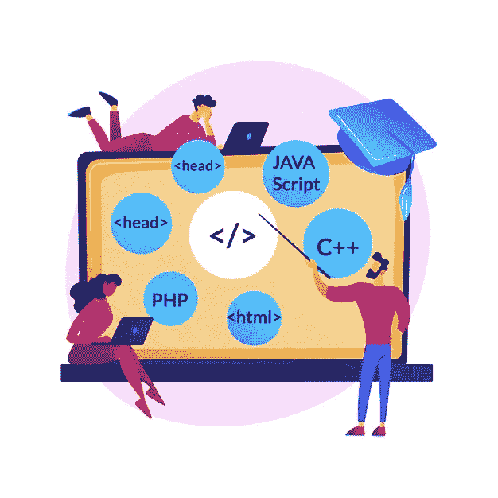
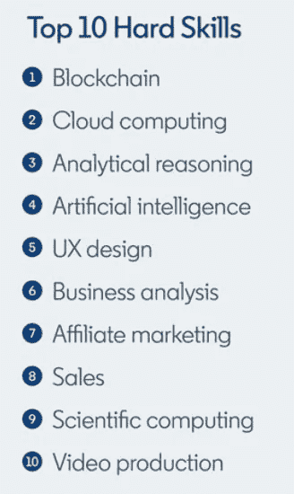

# 科技训练营如何支持企业世界

> 原文：<https://medium.datadriveninvestor.com/how-tech-bootcamps-are-supporting-the-enterprise-world-cb5fa076442?source=collection_archive---------12----------------------->

## **技术学校可能是迫切需要更新劳动力技术技能的关键成功因素**

Image by [vectorjuice](https://www.freepik.com/vectors/technology) available in [freepik](http://www.freepik.com)

2020 年，科技训练营不再是一个新话题。 [**他们至少从 2012 年就开始了，提供不同科目的课程**](https://www.coursereport.com/2020-guide-to-coding-bootcamps-by-course-report.pdf) (通常是网页开发、移动开发、UX/用户界面设计、数据科学和项目管理) [**，每年都有新的毕业生涌入这个数字饥渴的市场**](https://www.coursereport.com/2020-guide-to-coding-bootcamps-by-course-report.pdf) 。

去年，事情发生了变化。企业培训训练营的毕业生人数已经超过了经典训练营的毕业生人数。这揭示了一个新趋势，不仅是在训练营市场本身，也在企业运营中。公司正在认识到强化、加速学习计划的好处，以使他们的员工能够胜任数字角色。

# 企业训练营的优势

## 劳动力再技能

> **:*学习新技能以适应*不同的工作职能**

*[数字化转型](https://www.salesforce.com/products/platform/what-is-digital-transformation/)正在塑造一个又一个行业。公司正依靠技术来改善他们的业务运营，推出新产品和服务，并跟上他们的竞争对手。这种情况导致对专业技术人员的高需求，预计在未来几年还会继续增长。*

**

*[The most in-demand hard skills in 2020](https://business.linkedin.com/talent-solutions/blog/trends-and-research/2020/most-in-demand-hard-and-soft-skills#:~:text=Bruce%20Anderson,January%209%2C%202020&text=Last%20year%2C%20cloud%20computing%2C%20artificial,most%20in%2Ddemand%20hard%20skills.)*

*目前，即使是非技术类的角色也需要每天使用手机、电脑和互联网。因此，公司面临着大量的长期专业人员，他们的角色已经(或即将)过时，同时他们对技术专家有很高的需求，而在竞争激烈的市场中很难找到和留住这些技术专家。*

> *近三分之一的商业决策者(32%)表示，他们很难在所在城市找到人才，超过三分之一的人(38%)表示，他们很难吸引和留住人才。*

*由于解雇长工和雇佣技术人员都是昂贵的过程，一些公司开始转向一种新的解决方案:**为员工提供承担新角色所需的知识。***

## *劳动力*技能提升**

> ****技能提升*** *:* 在*相同工作功能内学习新技能**

*科技行业的员工流动率为 13.2%，是所有行业中最高的。这意味着企业不仅面临雇佣新技术工人的挑战，还面临留住他们的困难。*

*尽管高需求和不断上涨的薪酬似乎是技术人员流动的主要原因，但 94%的员工表示，如果公司愿意在他们的学习和发展上投资，他们会呆得更久。*

*培训项目将初级到中级团队成员转变为特定技术的专家，这在咨询公司尤其常见，因为这些公司专注于为客户交付特定项目。*

* [## 各种类型的分布式分类帐技术|数据驱动的投资者

### 随着比特币和加密货币在全球的采用、使用和魅力增长，它们已经成为常见的流行语。这个新的…

www.datadriveninvestor.com](https://www.datadriveninvestor.com/2020/12/04/various-types-of-distributed-ledger-technology/) 

## 新员工

科技行业需要具备快速变化的特殊技能的劳动力。大学课程很难跟上如此快节奏的市场需求。学生毕业时通常只具备一般知识，很少具备技术岗位所需的特定技能和专业水平。另一方面，入门级开发人员比专家更便宜。因此，许多公司最终雇佣了专业水平低的专业人士，并让他们参加培训项目，在这些项目中，他们获得了必要的技能、知识和行为，从而迅速成为组织的有效贡献者。

Image by [startup-stock-photos](https://www.pexels.com/photo/working-woman-technology-computer-7374/) on [Pexels](https://www.pexels.com/@startup-stock-photos)

# 训练营与旧的训练模式

培训项目有几种形式:在线课程、在职培训、学费报销等。所有这些培训形式都有利弊。训练营似乎是一个有效的替代方案，具有以下优势:

*   大量员工同时接受同样的培训。训练营确保团队将获得有凝聚力的知识，也可以作为团队建设活动。
*   与自定进度的在线课程不同，训练营有计划的课程，因此公司知道他们员工的一天是如何安排的。此外，我们必须注意到，如果某一点没有得到令员工满意的解释，没有与讲师实时交流的在线课程可能会给员工造成一些困惑。
*   训练营有一个教学团队，专门致力于帮助学生克服他们可能遇到的任何困难。—许多学习编码的过程包括试错和花时间修复错误—你可能会在问题上停留很长时间，这可能会令人沮丧，并阻止人们自主学习
*   训练营的一个缺点是它需要现场课程，无论是在训练营还是在公司，但在 2020 年疫情之后，许多训练营组织者已经采用了提供远程课程的方法，并将继续存在。

# 训练营准备好迎接挑战了吗？

训练营的组织者已经认识到公司需要为他们的员工提供专门的培训。一段时间以来，许多技术学校提供可定制的企业培训项目和[许多企业已经信任它们。](https://www.coursereport.com/reports/coding-bootcamp-market-size-research-2019)

**截至 2020 年 12 月，** [**课程报告维护着一份已经在全球范围内提供企业 B2B 训练营**](https://www.coursereport.com/enterprise) **的 50 余所理工院校名单。**

# 公司愿意接受训练营作为一种解决方案吗？

公司已经认识到商业和技术进步的快速步伐是他们必须面对的问题。他们致力于了解未来几年最需要什么技能。重新培训员工需要投资。然而，除了解雇长期员工和寻找有需求技能的新员工之外，另一种选择可能不会更便宜或更容易。因此，再培训是一个很有吸引力的选择，许多商业领袖正在利用培训计划来填补关键职位。

我们知道训练营已经被认为是旧的培训形式:[去年，超过 22，000 名员工通过企业训练营获得了数字技能。](https://www.coursereport.com/reports/coding-bootcamp-market-size-research-2019)

# 未来有什么期待？

训练营不可能取代大学学位提供的长期教育。然而，**的大学已经认识到加速教育项目的优势，并且已经** [**开始启动他们自己的训练营**](https://www.coursereport.com/blog/university-coding-bootcamps)**【s】**在某些情况下，这些项目是通过与已建立的训练营学校合作创建的，但是适应学院的教育目的和学生需求。通过参与，学生可以开发项目以增加他们的作品集，并在课程中获得额外的学习体验。

**公司也主动创建自己的项目。例如，谷歌提供了自己的[数字营销训练营](https://sites.google.com/view/digitalbootcamp)，并且[与总装学校合作创建了一个安卓强化课程](https://generalassemb.ly/education/android-development-immersive)。通过建立课程和内容，公司确保这些课程的毕业生已经获得了他们正在寻找的知识。**

综上所述， **bootcamp 的快速强化教育方法通过企业对消费者的模式赢得了早期的声誉，但在最近几年，它通过企业对企业的解决方案获得了相关的关注。**公司，甚至大学，已经开始相信这种类型的教育，为当前和下一代劳动力做好准备，迎接快节奏的数字世界挑战。

*感谢里卡多·席尔瓦*

## 相关文章:

 [## 初级开发人员不加入编码训练营的五个理由。以及我对每一个问题的回应。

### "为什么你需要一个网络开发训练营？"，一个大学的老同学问我。我刚刚告诉他我…

medium.com](https://medium.com/swlh/five-reasons-for-a-junior-developer-not-to-join-a-coding-bootcamp-and-my-response-to-each-of-them-ddc0e68fea30) 

[**Mariana Vargas**](https://medium.com/@marianamv112) is a UX Engineer based in Lisbon, Portugal. In 2019, she was part of the teaching team in the first Ironhack’s B2B Bootcamp: a training program for MediaMarkt in Ingolstadt, Germany. This Bootcamp re-skilled more than 20 white-collar workers to assume developer positions.

## 获得专家观点— [订阅 DDI 英特尔](https://datadriveninvestor.com/ddi-intel)*