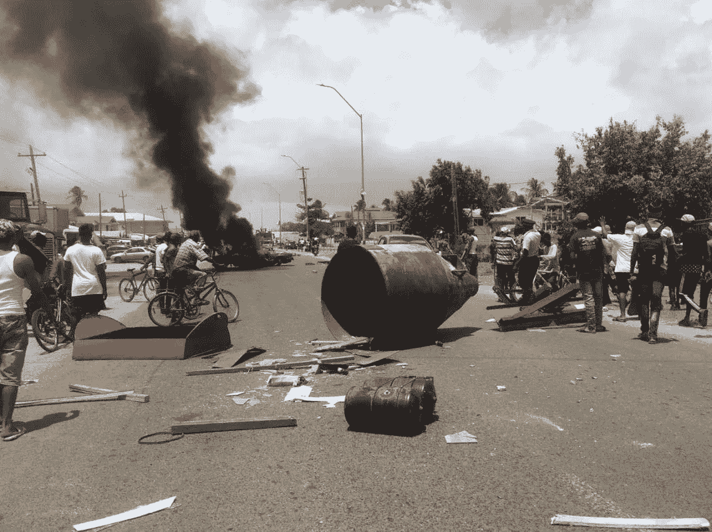

# 技术如何有助于防止社会动乱。

> 原文：<https://medium.datadriveninvestor.com/how-technology-can-help-to-prevent-civil-disorder-32bc12871f7?source=collection_archive---------29----------------------->

## 政治

## 圭亚那选举有更好的计票方式…

Photo by [Arnaud Jaegers](https://unsplash.com/@ajaegers?utm_source=unsplash&utm_medium=referral&utm_content=creditCopyText) on [Unsplash](https://unsplash.com/s/photos/election?utm_source=unsplash&utm_medium=referral&utm_content=creditCopyText)

观察 2020 年大选和地方选举是一件痛苦的事情，尤其是对那些有朋友和家人住在那里的人来说。这主要是由于对选举结果有异议，选举后出现了民众骚乱。

写这篇文章时，距离 2020 年 3 月 2 日举行的大选和地方选举已经过去了 8 天，仍然没有任何清晰的结果。主要原因是对核实结果的过程有争议。

## 你为什么要在乎？

[圭亚那即将成为世界下一个石油中心，因为这是近代史上最大的石油发现。这对全世界的股票、投资和经济都有很大的影响。这个人口不足 70 万的南美小国正受到越来越多的关注。](https://www.forbes.com/sites/dylanbaddour/2020/01/27/massive-guyana-oil-find-continues-to-grow-with-fresh-exxon-discovery/#6ec1ba712781)

随着像 T4、沙特阿拉伯和其他中东国家发动石油战争和美国股市即将崩溃，像圭亚那这样的国家有很多机会站出来，成为这些国家化石燃料的替代生产国和来源。

这就是这次选举如此重要的原因，也是它获得如此国际关注的原因。

## **种族分裂**

圭亚那的投票一直以来都是按种族划分的。东印度人后裔和非洲人后裔占圭亚那人口的大多数，投票结果总是有利于以种族划线的政党。在过去的几年里，许多更为中间派的小团体已经崛起，但没有一个能够得到主流的关注。

## 社会化媒体

加里·维(Gary Vee)有一句名言，社交媒体不是问题，它只是我们真实身份的放大器(或类似的东西，不要引用我的话)。

圭亚那人民的种族主义思想和诽谤的放大，类似于美国和唐纳德·特朗普的竞选活动，已经显示出它丑陋的头。许多人，尤其是非圭亚那人，看到他们交往多年的人如何表现出如此强烈的种族偏见，感到非常震惊。

## 结果紧张

3 月 2 日，星期一，投票结束后，整个国家以及海外侨民都将注意力转向了圭亚那。整个加勒比和所有其他有关方面也开始观察这一进程。

## 过时的系统

圭亚那有一套过时的选举计票系统。在各个投票站人工计算选票，然后进行总计，然后将结果摘要分发给各个当局进行核实。这是一个由圭亚那选举委员会(GECOM)进行的过程，该委员会应该是一个独立的机构，但一些人可能会认为他们有政治偏见。

 [## 保护主义、政治和经济动荡|数据驱动的投资者

### 美国股市昨日出现 400 多点的大幅反转，为未来的事情发出了警告信号。市场…

www.datadriveninvestor.com](https://www.datadriveninvestor.com/2018/06/28/protectionism-politics-economic-turmoil/) 

## 根本问题。

对当前形势的简要概述。圭亚那分为 10 个分区。每个地区都提交了各自的选民计票摘要。除了首都乔治敦所在的第 4 区之外，所有地区都已得到核实和接受。

这个区域被留到最后验证，一直是所有问题的中心。这个地区的选举结果将决定选举的走向。几天前，负责这一地区的 GECOM 官员宣布了有利于前执政党 APNU+亚足联的结果，但反对党 PPP/C 表示反对，并已向高等法院(类似于最高法院)提出质疑，以宣布结果，并恢复或召回可能导致选举偏向反对派的核查程序。

## 腐败

圭亚那从来没有因为腐败而排名靠前,一个有根据的猜测是，为什么政党之间争夺权力的斗争如此激烈，是因为对石油资源和销售的获取。拥有这种控制权当然意味着政客们会寻求从这些资源中为自己谋利。

# 解决

所有这些问题都可以通过一件事来解决——改进技术！这个世界已经进步了很多，有了一个可以用现代技术解决(或者已经解决)的巨大问题。

区块链有许多应用，对于最终结果的制表和验证来说，将是一个很好的解决方案。使用区块链网络将是解决投票过程中出现的问责制和透明度漏洞的一个好方法。

我并不提倡一个完整的端到端解决方案，因为我们知道仍有漏洞和缺陷需要解决，但这无疑是朝着正确方向迈出的一步。

# 如果你喜欢这个故事，请点击👏按钮并分享出来，帮助别人找到！欢迎在下方留言评论。