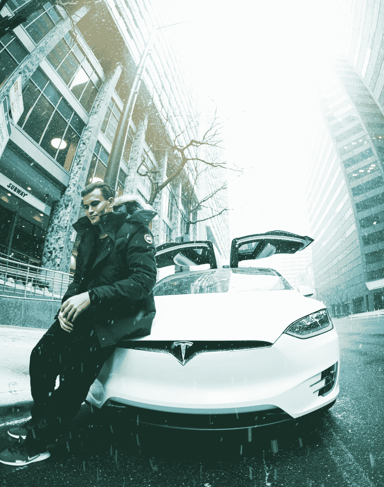
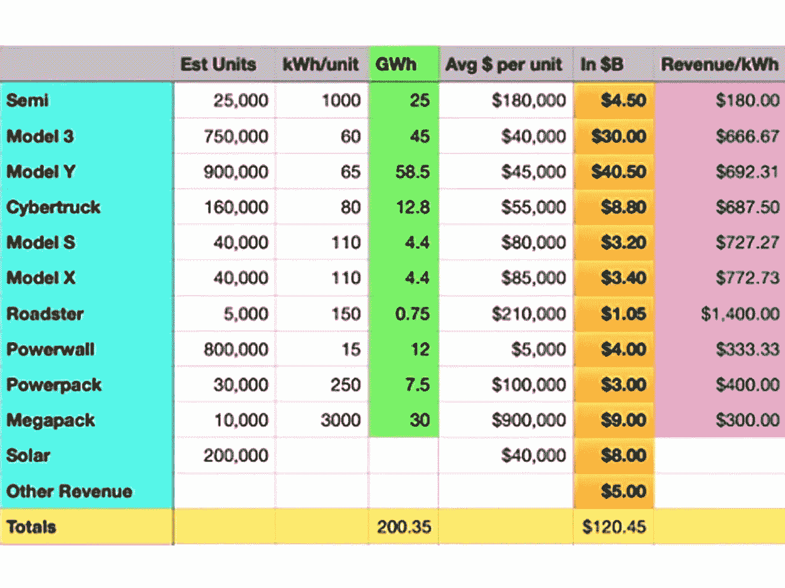
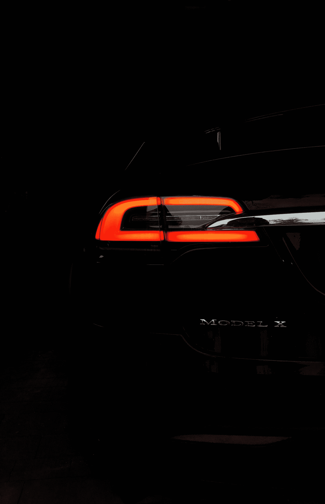

# 在你看来，科技将如何改变你的世界

> 原文：<https://medium.datadriveninvestor.com/how-techs-gonna-transform-your-world-as-you-see-it-350bb994278d?source=collection_archive---------2----------------------->

## 特斯拉的故事:从进化到革命。

Photo by @dilan-sauerwein on [Unsplash](https://medium.com/u/2053395ac335?source=post_page-----350bb994278d--------------------------------)

> 少点错误。

如果你想改变世界，你必须遵循少犯错的哲学。因为你会错很多次，如果你不遵循这个座右铭，你会在第一个拐角处就放弃。

甚至这篇关于我们未来的文章，关于[特斯拉](https://bit.ly/3gvAi1t)，关于埃隆马斯克，都将成为*少犯错误*的未来学作品。

不可能不这样。你无法预测未来。但是你可以设计它。

哦，天哪，埃隆正在设计我们的未来，这是肯定的。我将要与你们分享的一些突出的消息，至少会使你们反思我们是谁设法取得了这样的成就。

然而，我必须对我的读者说实话，我会尽量在我的预测中少犯错误。

Photo by [Thomas Kelley](https://unsplash.com/@thkelley?utm_source=medium&utm_medium=referral) on [Unsplash](https://unsplash.com?utm_source=medium&utm_medium=referral)

# 电池是最引人注目的物体

> 其他东西要么停止工作，要么坏掉。但是电池…它们会死。迪米特利·马丁

Testa 面临的最大挑战一直是电池的限制。他们无法为他们制造和销售的所有产品制造足够的电池。

正如埃隆·马斯克在《电池日》中所说:

> 我们确实认为最基本的限制是总细胞产量。这就是为什么我们在制造细胞上下了这么大的功夫。因为这是最基本的限制。因为这是增长受限的根本因素。

虽然特斯拉做的每件事都很难，但扩大电池产量一直是最难的事情。

他们知道如何制造汽车。他们知道如何制造电网存储设备，建造电力墙，电力包，太阳能电池板。

电池至关重要，也是电池阻碍了它们的发展。

特斯拉仍在改进他们制造汽车和工厂的方式。

他们在汽车方面的改进是惊人的，因为特斯拉已经在生产最好的汽车。尤其是 Y 型和 s 型。

特斯拉电网存储已经具有成本竞争力。它们可能是所在细分市场的最佳解决方案。

然而，他们没有足够的电池来满足他们的生产。

Photo by [Antoine Dautry](https://unsplash.com/@antoine1003?utm_source=medium&utm_medium=referral) on [Unsplash](https://unsplash.com?utm_source=medium&utm_medium=referral)

# 数字。给我看看数字。

特斯拉正在学习建立成本更低的工厂，以更快的速度生产更多的汽车。

如果你建造一个 20 亿美元的工厂，10 年内每年生产 50 万辆汽车，考虑到利息成本，每辆汽车的资本支出成本将是 400 美元。

现在假设你从中吸取教训，降低成本，建造一个 10 亿美元的工厂，在 10 年内每年生产 200 万辆汽车。每辆车的资本支出降低到 50 美元。

你每辆车可以节省 350 美元，这样你就可以降低车价，增加利润。

特斯拉正在将工厂建在离供应商和客户更近的地方，这进一步降低了成本。送车成本更少。从供应商到工厂的运输成本更低。时机更好。

所有这些垂直整合降低了价格，提高了效率，增加了利润。

数字开始出现。

# 2022

Elon Musk 和 Drew Baglino 表示，他们将在 2022 年生产 100 千兆瓦/小时的高镍电池。

一些估计称，其他公司如松下、LG 化学和 CATL 将生产另外 100 千兆瓦/小时的电池。

松下目前在内华达州的千兆工厂生产大约 35 千兆瓦/小时。他们推测很快就会达到 54 千兆瓦/小时的范围。

至少这三家公司有可能在短时间内达到 100 千兆瓦/小时的产量。

然而，200 千兆瓦/小时很有可能是对 2022 年的低预测。

然而，从一个较低的角度来看，随着所有电源墙、电源组、太阳能电池板和电瓶车的 200 千兆瓦/小时的电池产量，特斯拉的收入有可能达到 1200 亿美元。

Image from [Warren Redlich](https://medium.com/u/73e5200da91e?source=post_page-----350bb994278d--------------------------------)

为什么这种增长，在两年内，一点也不疯狂？

特斯拉目前的交易价格约为其年收入的 10 倍。其实还不止这些。

但让我们假设它的交易量是其收入的 10 倍。

如果特斯拉的收入增长到 1200 亿美元，而你增长了 10 倍，那么它的市值将达到 1.3 万亿美元。每股 1200 美元。

从温和的角度来看，这些是数字。

因为我们预计特斯拉商业模式的规模经济、盈利能力和利润将会增加。

因此，当我们预测股价在 1，200 美元到 1，500 美元之间时，我们就是保护者。2022 年，我们可以看到 2000 美元的价格份额。这种可能性很大。

Photo by [Szymon Kita](https://unsplash.com/@szymkita?utm_source=medium&utm_medium=referral) on [Unsplash](https://unsplash.com?utm_source=medium&utm_medium=referral)

# 继续前进，继续成长

谁能让特斯拉发展得这么快？

如果特斯拉在 2022 年从 350 亿美元涨到 1250 亿美元，甚至 1450 亿美元，这似乎很疯狂。

让我们从 2020 年这不寻常的一年说起。

特斯拉只有 1.5%的工厂生产汽车。一个在弗里蒙特。一半在上海。在上海，他们正处于那个工厂制造力量的早期阶段。

因此，特斯拉 2020 年可能生产的 50 万辆汽车是人为压低的。不要忘记新冠肺炎带来的所有限制，这些限制影响着全球所有的生产线。

尽管如此，一个半工厂，他们做到了。他们达到了 50 万辆汽车的目标。或者至少他们太接近目标了。

现在，在 2022 年，特斯拉将有 4 个完整的千兆工厂高效生产。

弗里蒙特将变得前所未有的高效和高产。

上海有两个工厂。生产模型 3 和模型 y。

柏林有一个生产 Model 3 和 Model Y 的大型工厂。

奥斯汀生产 Y 型车，赛博卡车，可能还有 3 型车。

较新的工厂将会以一种更加一体化和高效的方式进行生产。更快更便宜。

尤其是柏林和奥斯汀的工厂将会使用先进的技术。更少的零件，更少的工序。

弗里蒙特将能够每年生产 60 万辆汽车，包括 Cyber-truck。

柏林和奥斯汀每年各有 2，000，000 辆汽车的生产能力。

如果把上海包括在内，我们谈论的是在 2022 年生产超过 500 万辆汽车。

这甚至没有假设埃隆·马斯克(Elon Musk)正在考虑从明年开始在全球范围内启动更多工厂的生产。

Photo by [American Public Power Association](https://unsplash.com/@publicpowerorg?utm_source=medium&utm_medium=referral) on [Unsplash](https://unsplash.com?utm_source=medium&utm_medium=referral)

# 正能量可以治愈宇宙

埃隆·马斯克一直在谈论 50%的年增长率。

从 2022 年到 2030 年，从 100 千兆瓦/小时到 3 太瓦/小时，相当于 53%的年增长率。因此，埃隆非常积极地追求快速增长。

2023 年，随着可能生产 300 千兆瓦/小时，Elon，Drew Baglino 和他的团队，他们正在设想紧凑型汽车。他们宣布的价值 25，000 美元的汽车将上路，以自动驾驶模式首次亮相。

这是一个巨大的能量增长。

沃伦·雷德里奇在他对特斯拉 2020 年至 2030 年的潜在增长场景的全面分析中，预计到 2030 年特斯拉的收入将达到 1950 亿美元。

尽管如此，机器人出租车商业模式的一小部分被整合到整体宏观规划中。如果你把收入和市值的 10 倍进行比较，我们会看到股价从 1600 美元到 2000 美元不等。

2023 年，我们可能会看到机器人出租车的利润开始上升。这部分的利润是巨大的。

预计到 2030 年，年增长率将达到 50%，这个数字是惊人的。

10 年后，按照相当保守的方法，特斯拉将成为一家价值 2 万亿美元的公司，市值 20 万亿美元，每股价格约为 2 万美元。

这还不是最乐观的估计。

我们正在讨论特斯拉成为世界上最大公司的可能性。

# 结论

记住，这只是一个投影。这是在玩数字游戏，看看他们会把我们带到哪里。

这也是*被少错*的投影。

我在特斯拉上使用了[沃伦·雷德里奇](https://bit.ly/36h6T8t)的出色工作和研究。他是我关注的最热情的看涨者之一。他有经验和知识。他是一个理智的人。

这些投影不包括机器人出租车全投影。

作为特斯拉的股东，当我开始玩数字游戏时，我有时会感到紧张。

如果我把机器人出租车网络业务纳入预测，这个数字是惊人的。

我宁愿不做那件事。

我知道我的潜意识里这些预测是真实的。

但是让我少错一点。

不是少，是少，是少错！

谢谢

努诺