# Flink 上的 TensorFlow 如何工作:Flink 高级教程

> 原文：<https://medium.datadriveninvestor.com/how-tensorflow-on-flink-works-flink-advanced-tutorials-3bce16db047?source=collection_archive---------5----------------------->

*由陈·(中卓)，阿里巴巴技术专家*

[深度学习](https://www.alibabacloud.com/product/machine-learning)在当代社会越来越重要。目前，深度学习被广泛应用于多个领域，如个性化推荐、产品搜索、人脸识别、机器翻译、自动驾驶等。它也正在迅速渗透到社会的各个方面。

# 背景

随着深度学习应用的日益多样化，出现了许多优秀的计算框架。其中，TensorFlow、PyTorch 和 MXNeT 被广泛使用，并引起了极大的关注。数据处理的计算框架通常用于将深度学习应用于实际场景。例如，在模型训练之前，必须处理训练数据以创建训练样本。在模型预测期间，必须监控数据处理指标。需要不同的计算引擎来实现数据处理和模型训练，这增加了用户面临的困难。

本文解释了如何使用单个引擎来实现整个机器学习过程。下图显示了一个典型的机器学习工作流，它由特征工程、模型训练和离线或在线模型预测组成。

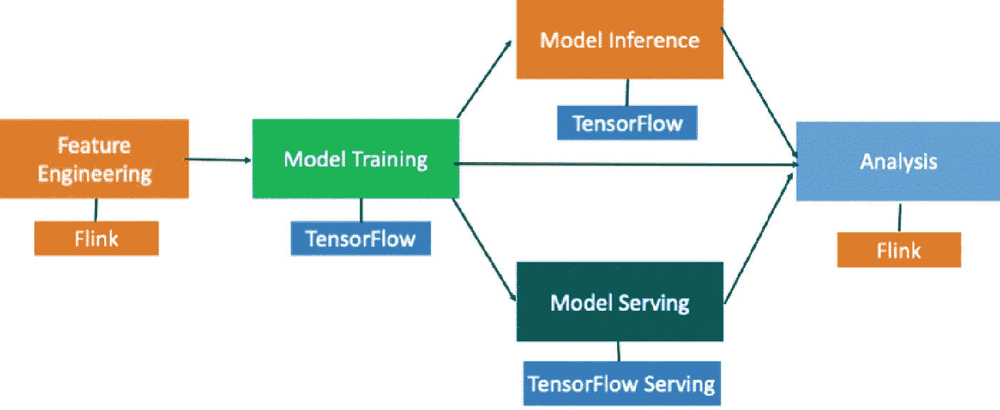

在机器学习过程的每个阶段都会生成日志。首先，我们需要使用一个数据处理引擎，比如 [Flink](https://flink.apache.org/) ，在进行特征工程之前分析这些日志。然后，我们使用深度学习的计算引擎 TensorFlow 来完成模型训练和预测。经过模型训练后，我们使用 TensorFlow Serving 进行在线评分。

这个过程是可行的，但它会导致一些问题:

1)在单个机器学习项目中，我们必须使用 Flink 和 TensorFlow 两个计算引擎来实现特征工程、模型训练和模型预测。很难部署这两个引擎。
2) TensorFlow 不便于在分布式环境中使用，因为它需要指定机器 IP 地址和端口号。然而，实际生产过程往往是在一个调度系统中实现的，例如 YARN，它需要动态分配 IP 地址和端口号。
3) TensorFlow 不支持分布式操作的自动故障转移。在 Flink 集群中运行 TensorFlow 来解决前面的问题。下图显示了在 Flink 上使用 TensorFlow 的系统示意图。

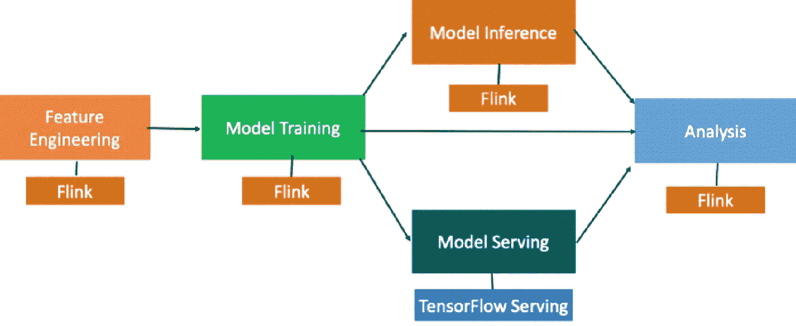

特征工程由 Flink 实施。模型训练和准实时模型预测由 TensorFlow 实现，tensor flow 在 Flink 集群中运行。模型训练和预测由 Flink 单独实现，简化了部署，节省了资源。

# Flink 计算简介

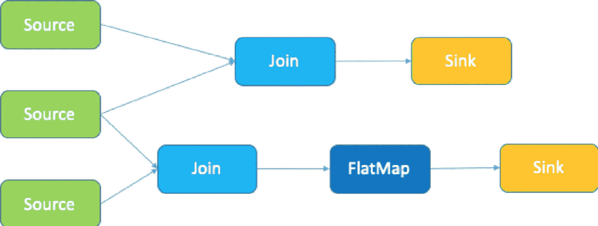

Flink 是一个开源的大数据分布式计算引擎。Flink 上的所有计算都被抽象成运算符，如上图所示。读取数据的节点称为源操作符，输出数据的节点称为汇操作符。各种 Flink 操作符实现了源操作符和接收操作符之间的进程。前面的计算拓扑包括三个源操作符和两个汇操作符。

# 机器学习的分布式拓扑

下图显示了机器学习的分布式拓扑结构。

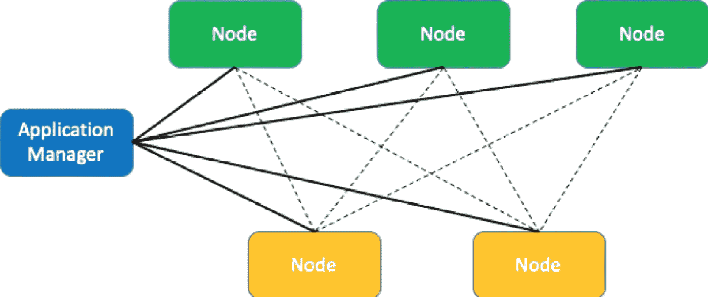

机器学习群集中的节点通常被分成不同的组，如上图所示。一组节点可能包含运行算法的工作器，或者包含更新参数设置的参数服务器(PSs)。

我们如何将 Flink 的算子结构与机器学习的节点和应用管理器结合起来？下一节详细解释 Flink-AI-Extended 的抽象。

 [## 什么是数据目录，它如何使机器学习取得成功？数据驱动的投资者

### 数据目录是机器学习和数据分析的燃料。没有它，你将不得不花费很多…

www.datadriveninvestor.com](https://www.datadriveninvestor.com/2020/08/27/what-is-a-data-catalog-and-how-does-it-enable-machine-learning-success/) 

# flink-AI-扩展抽象

机器学习集群被抽象到 ML 框架中，并且包括 ML 操作符。这两个模块结合了 Flink 和机器学习集群，为不同的计算引擎提供支持，如 TensorFlow。下图显示了这一点。

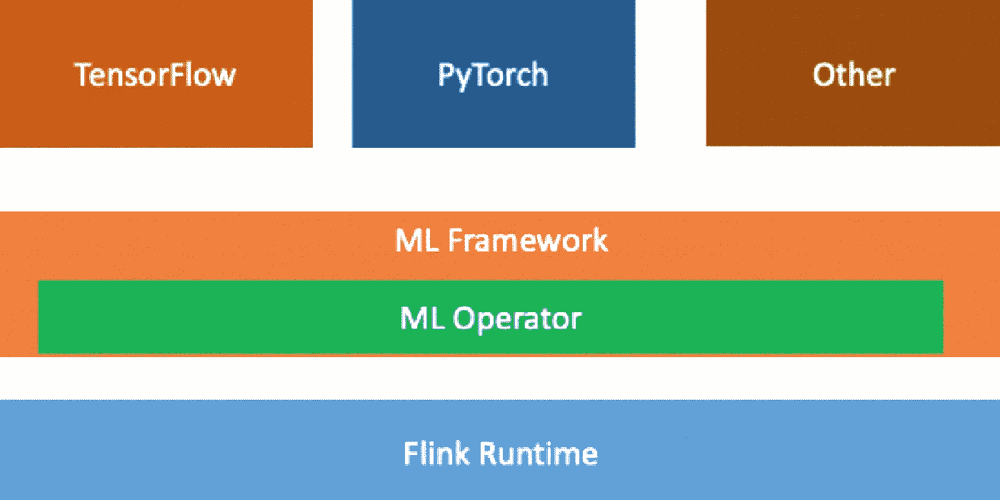

Flink 运行时环境被抽象为 ML 框架和 ML 操作符，它们将 Flink 连接到其他计算引擎。

# ML 框架

ML 框架有两个角色:应用程序管理器和节点。

1)应用程序管理器管理其所有节点的生命周期。
2)节点负责运行机器学习的算法程序。

应用程序管理器和节点被进一步抽象。应用程序管理器的状态机被扩展以支持不同类型的作业。

深度学习引擎支持状态机定制。将一个节点抽象成一个 runner 接口，基于不同的深度学习引擎创建自定义算法程序。

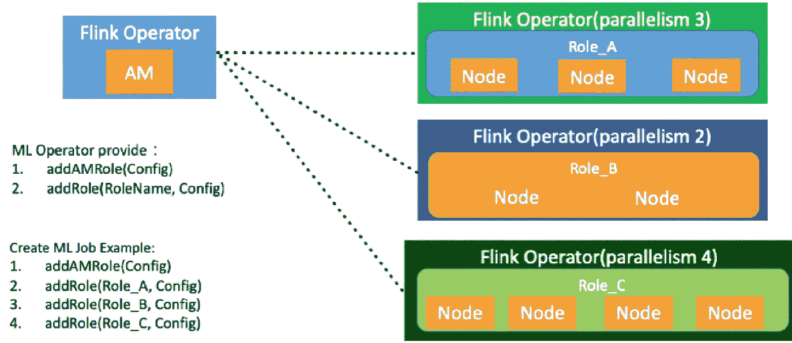

# ML 运算符

ML 运算符提供了以下两个接口:

addAMRole 接口用于将应用程序管理器添加到 Flink 作业中。如上图所示，应用程序管理器是机器学习集群的管理节点。
2)addRole 接口用于添加一组机器学习节点。

使用 ML 操作符的这两个接口来添加 Flink 操作符:一个应用程序管理器和三组节点，分别称为角色 A、角色 B 和角色 C。这三个节点组形成了一个机器学习集群。请参见上图中的代码。每个 Flink 操作符对应于机器学习作业的一个节点。

机器学习节点运行在 Flink 操作符上，它们需要相互交换数据，如下图所示。

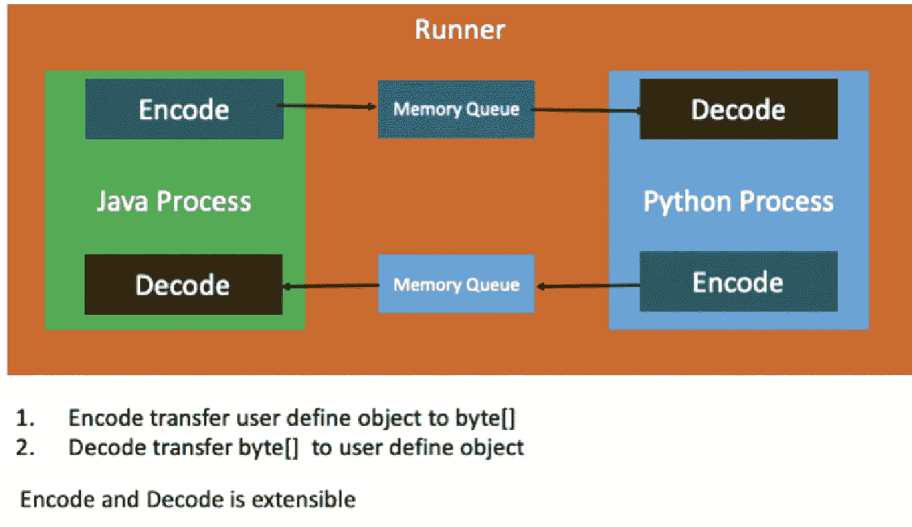

Flink 操作符是 Java 进程，机器学习节点是 Python 进程。这两个进程通过共享内存相互交换数据。

# Flink 上的张量流

## TensorFlow 分布式执行

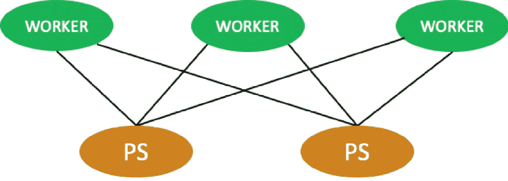

TensorFlow 分布式培训涉及两个角色:工人和 PS。工人实现机器学习和 PSs 更新参数设置的计算。以下部分描述 TensorFlow 如何在 Flink 集群中运行。

## TensorFlow 批量训练模式

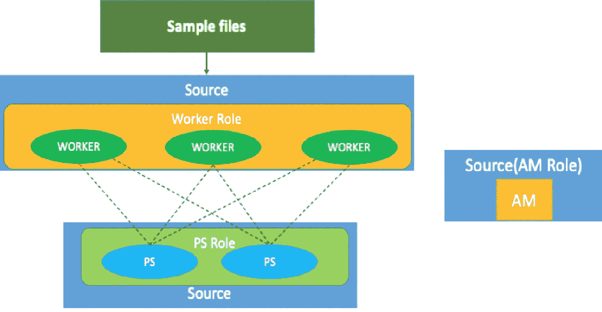

在批处理模式下，样本数据可以存储在 Hadoop 分布式文件系统(HDFS)中。Flink 作业启动一个源操作符，然后启动 TensorFlow 的 worker 角色。如上图所示，如果 worker 角色有三个节点，则其源并行度设置为 3。类似地，PS 角色有两个节点，因此其源并行度设置为 2。应用程序管理器不与其他角色交换数据，因此它是一个独立的节点，源并行度不变，为 1。Flink 作业启动三个 worker 节点和两个 PS 节点，它们通过 TensorFlow gRPC 而不是 Flink 的通信机制相互通信。

## 张量流训练模式

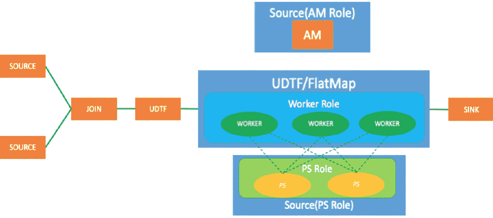

如上图所示，两个源操作符连接到连接操作符。两条数据合并成一条，样本数据由自定义处理节点生成。在流模式中，工作者角色由 UDTF 或平面图实现。

当存在三个 TensorFlow 工作节点时，平面图和 UDTF 的运算符并行度设置为 3。PS 角色不读取数据，因此 PSs 由 Flink 源操作符实现。

以下部分描述了如何使用训练好的模型实现实时预测。

## 基于 Python 的预测

下图显示了使用 Python 进行模型预测的过程。有些场景，比如推荐和搜索，可能会产生由 TensorFlow 以分布式模式训练的大型模型。这种类型的模型不能存储在一台机器上。实时预测的工作方式与实时训练相同，但包括额外的模型加载过程。

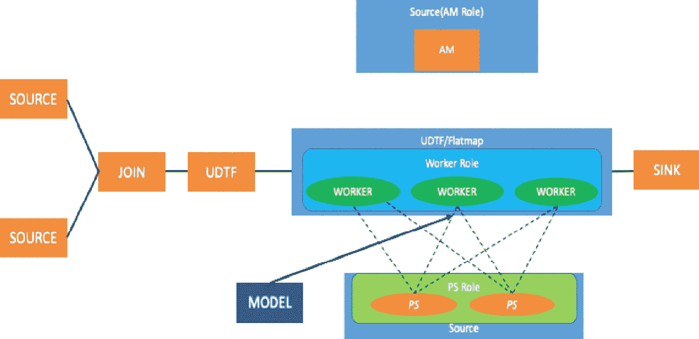

在模型预测期间，所有参数都通过模型读取加载到 PSs。上游数据的处理方式与模型训练过程中处理数据的方式相同。数据被传输到工作节点进行处理。预测分数被写入 Flink 操作符，然后发送给下游操作符。

## 基于 Java 的预测

如上图所示，当在单台计算机上进行预测时，PS 节点不会启动，因为单个工作节点足以存储用于预测的模型，尤其是当 TensorFlow 导出已保存的模型时。保存的模型包括预测的完整计算逻辑、输入和输出，因此无需运行 Python 代码即可执行预测。

还有另一种方法来实现模型预测。源运算符、联接运算符和 UDTF 用于以模型预测过程中可识别的格式处理数据。在 Java 进程中使用 TensorFlow Java API 将训练好的模型直接加载到内存中。在这种情况下，不需要 PS 角色，工作者角色由 Java 进程而不是 Python 进程承担。然后，模型预测可以直接在 Java 进程中实现，预测结果可以发送给下游的 Flink 操作符。

# 摘要

本文解释了 Flink-AI-Extended 的工作原理，以及如何在 Flink 上通过 TensorFlow 实现模型训练和预测。希望本文能帮助你有效使用 Flink-AI-Extended，通过一个 Flink 作业实现模型训练和预测。

# 原始来源:

 [## Flink 上的 TensorFlow 如何工作:Flink 高级教程

### Apache Flink 社区中国 2020 年 9 月 16 日 69 由陈(中卓)，阿里巴巴技术专家深度学习…

www.alibabacloud.com](https://www.alibabacloud.com/blog/how-tensorflow-on-flink-works-flink-advanced-tutorials_596627) 

## 访问专家视图— [订阅 DDI 英特尔](https://datadriveninvestor.com/ddi-intel)